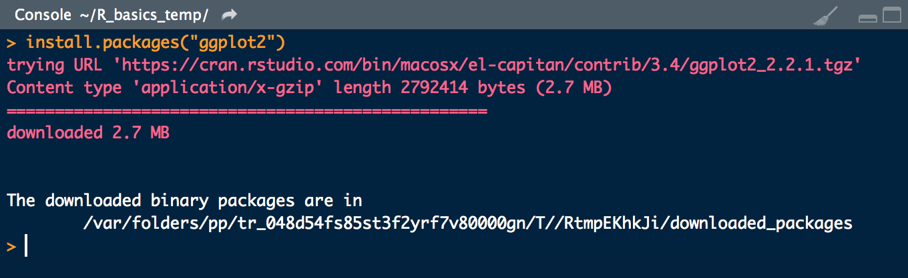
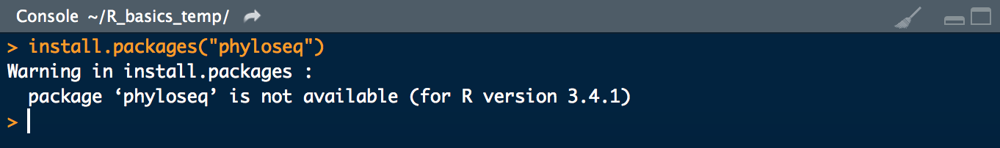
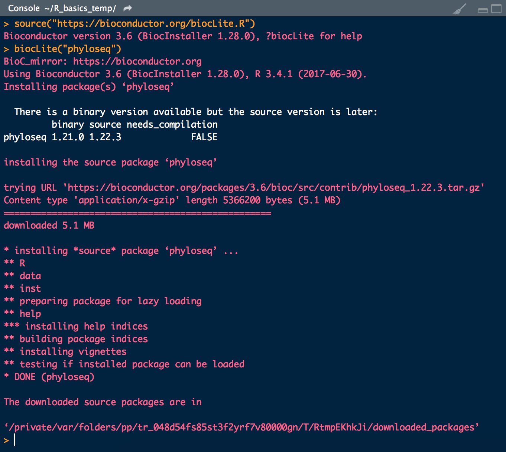





Part of what makes R so valuable is that there is an enormous community of people developing software packages for it. People share bundles of code that perform specific tasks through what are known as "packages". Packages are typically maintained at the [Comprehensive R Archive Network (CRAN)](https://cran.r-project.org/web/packages/){:target="_blank"} and/or at [Bioconductor](https://www.bioconductor.org/){:target="_blank"}. To use a package, you simply need to install it and then load it. Here we'll cover the 3 main ways for installing packages.
<br>
<br>

---
---
<br>

## install.packages()
Most often, you will be able to install packages with the `install.packages()` function. For example, if you want to install the [ggplot2 package](https://cran.r-project.org/web/packages/ggplot2/index.html){:target="_blank"}, you would simply enter:

```R
install.packages("ggplot2")
```

And you'll get some info printed to your screen such as this:

<center></center>
<br>
And all is well with the world and you are ready to load the package with `library("ggplot2")`, at which point you're ready to rock.

But occasionally when using `install.packages()` you will get a message like the following:

<center></center>
<br>
But do not despair! This is usually just a consequence of the package not having been updated to install this particular way, and you can almost always get around it by installing from bioconductor. When you do run into this, you should head right on over to google and search with terms for the package name and bioconductor, and you'll most likely find a way to install with `biocLite()`.  
<br>

---
<br>

## biocLite()
For example, searching for ["phyloseq bioconductor"](https://www.google.com/search?q=bioconductor+phyloseq+R&oq=bioconductor+phyloseq+R&aqs=chrome..69i57j69i60.5566j0j7&sourceid=chrome&ie=UTF-8) returns the [bioconductor homepage of the *phyloseq* package](http://bioconductor.org/packages/release/bioc/html/phyloseq.html){:target="_blank"} as the top hit. And when you head over there, there are directions to install via bioconductor:

```R
source("https://bioconductor.org/biocLite.R")
biocLite("phyloseq")
```

And sure enough that seems to work just swell:

<center></center>
<br>

And again, after installing, you'd need to load the library in order to access the functions it contains: `library("phyloseq")`.  
<br>

---
<br>

## install_github()
Occasionally bioconductor may also not workout. At that point I usually turn to searching for the package on github as it may be hosted there, and if so it usually contains instructions for how to install it via devtools and the `install_github()` function. 

For example, a little googlation for ["tidyr github"](https://www.google.com/search?ei=6BwBWqfgLca6jwOwsIXACg&q=tidyr+github&oq=tidyr+github&gs_l=psy-ab.3..0.1251.3680.0.3814.18.15.3.0.0.0.141.1174.11j3.14.0....0...1.1.64.psy-ab..1.17.1182...0i67k1j0i131k1j0i10k1j0i22i10i30k1.0.Xit6NDyEZS0) returns as the top hit the [tidyr package github page](https://github.com/tidyverse/tidyr){:target="_blank"}, and if you scroll down a little bit there are installation instructions that include how to install.

```R
install.packages("devtools")
devtools::install_github("tidyverse/tidyr") 

  # and after that finishes up, you'd just need to load the library for use
library("tidyr")
```
