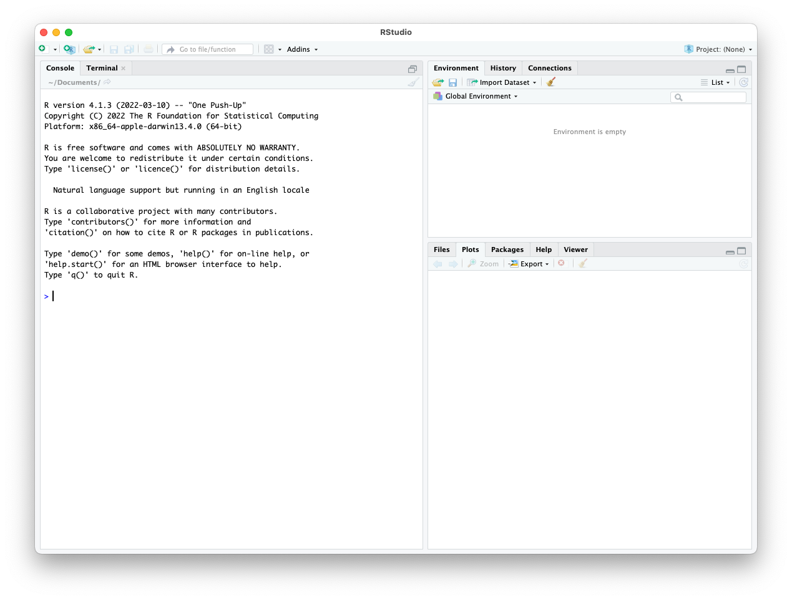





I like to have a system-wide R installation, setting it up following steps like those linked in this [R Intro section](/R/basics#on-your-computer){:target="_blank"}. But it's also convenient/necessary to have contained environments of R, either for holding different versions or for helping with reproducibility. 

[Conda](https://conda.io/docs/){:target="_blank"} can help us with this, though sometimes it can lead to issues I've hit with some packages in R, it is always improving and wonderful people are hard at work packaging lots of common libraries into conda-installable packages. 

> If you aren't yet already familiar with `conda`, I recommend running through the [intro to conda page](/unix/conda-intro){:target="_blank"} first, and having it installed as demonstrated there is required to follow below 🙂

---
<br>

# Setting up a conda environment with R and RStudio

We can check which version of R are currently available to be installed through conda (using `mamba` here as also described on the [conda intro page here](/unix/conda-intro#bonus-mamba-no-5){:target="_blank"}) with the following: 

```bash
mamba search -c conda-forge r-base
```

Which at the time of putting this page together, 4.1.3 was the latest available for my system, so I'm going to specify that one.

And I usually let it figure out whichever RStudio version it wants to use. And I always install the tidyverse package too, because it's awesome. And for that I let it select whichever version it wants also, unless it matters to me. So I would typically create a new environment with R and Rstudio like so:


```bash
mamba create -n R-4.1.3 -y -c conda-forge r-base=4.1.3 rstudio r-tidyverse
```

> **Breakdown**
> * `mamba create` – our base command
> * `-n` – here is where we provide the name we want the environment to have, in this case naming it R with the version following
> * `-y` – says not to ask us for any confirmation
> * `-c conda-forge` – here is where we are specifying the one channel we need for the particular packages we are trying to install
> * positional arguments - the trailing positional arguments of what packages/versions
>   * `r-base=4.1.3` – tells is we want the r-base package and which version
>   * `r-rstudio` and `r-tidyverse` - the remaining packages I wanted to install while creating the environment, with no versions specified because I wasn't worried about them in this case

<hr style="height:10px; visibility:hidden;" />

# Opening RStudio in our conda environment

Once we've created the above, we just need to activate that conda environment:

```bash
conda activate R-4.1.3
```

Then once in the environment, we can execute `rstudio` to open an RStudio window within that conda environment (see notes below if this doesn't successfully open RStudio):

```bash
rstudio
```

<center></center>

> **Windows NOTE**  
> If running conda on a Windows computer, I believe we might also need to run the following commands before rstudio will open properly:
> ```bash
> sudo apt-get update
> sudo apt-get install libgl1-mesa-glx libegl1-mesa libxrandr2 libxrandr2 libxss1 libxcursor1 libxcomposite1 libasound2 libxi6 libxtst6
> ```
> So if the above failed to work I would try that. I don't have a Windows computer to test on unfortunately, but I found this when looking around thanks to this [page](https://nbisweden.github.io/workshop-scRNAseq/conda_instructions.html){:target="_blank"}.

> **Mac NOTE**  
> You made need to install xcode command line tools for RStudio to open properly. To prompt to begin that, from the terminal, execute this:
> ```bash
> xcode-select --install
> ```
> And an installation window should pop up. After that is installed, try running the `rstudio` command again.


<hr style="height:10px; visibility:hidden;" />

# Finding a conda installation for a specific R library we want
To find the specific package names needed for conda, I'll typically go to [anaconda.org](https://anaconda.org/){:target="_blank"} and do a search for the package I'm looking for. 

For example, searching for ["tidyverse" there](https://anaconda.org/search?q=tidyverse){:target="_blank"} brings up many hits of packages called "r-tidyverse" available from different channels. I then look at the number of downlaods from each, and typically have a preference for the conda-forge channel as I know that's generally well-used and well-curated. So that's why in the command above, I left solely the conda-forge channel as the only one specified. 

<hr style="height:10px; visibility:hidden;" />

# Installing more R libraries
Libraries can be installed in the R conda environment the way we normally would (meaning no conda involved), but I occasionally have run into problems when doing things that way. Because of this I generally try to find whatever R libraries I want as conda-installable packages and install them that way when I'm working in a conda-created R environment. So that would be my first recommendation. For instance, searching for [dada2 on the anaconda page](https://anaconda.org/search?q=dada2){:target="_blank"} reveals it is installable through the bioconda channel. 

So in the terminal, not in R, I would install this package with conda, while in the active R-4.1.3 environment we created above:

```bash
mamba install -y -c conda-forge -c bioconda -c defaults bioconductor-dada2
```

> **NOTE**  
> Notice we provide all 3 of these channels in that order to install something from bioconda. [The section on channels](/unix/conda-intro#a-note-on-channels){:target="_blank"} in the [conda intro page](/unix/conda-intro){:target="_blank"} covers this. 

Then in the R environment within this conda environment, we are able to laod that library as usual with:

```r
library(dada2)
```

If there isn't a conda-prepared package for a specific R library I want, then I'd move onto trying to do the installation the recommended way for that library inside R. 

<hr style="height:10px; visibility:hidden;" />

---
<br>

# BONUS: Creating a conda environment with Jupyter Lab and an R kernel

Here is one way we can create a conda environment that has an R kernel in Jupyter Lab:

```bash
mamba create -n jupyter-lab -y -c conda-forge r-base=4.1.3 rstudio r-tidyverse jupyterlab r-irkernel
```

Then when we activate that environment, we can launch jupyter lab with be executing `jupyter lab` at our command line. And we'll see we can select an R kernel for notebooks there 👍


---
---
