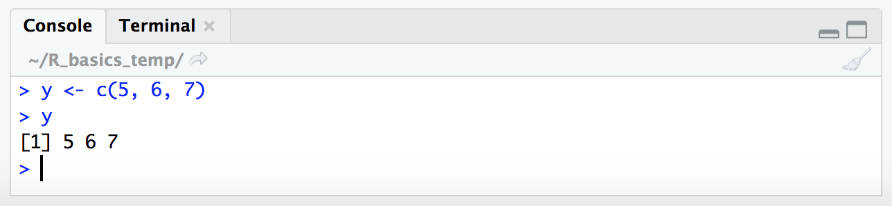
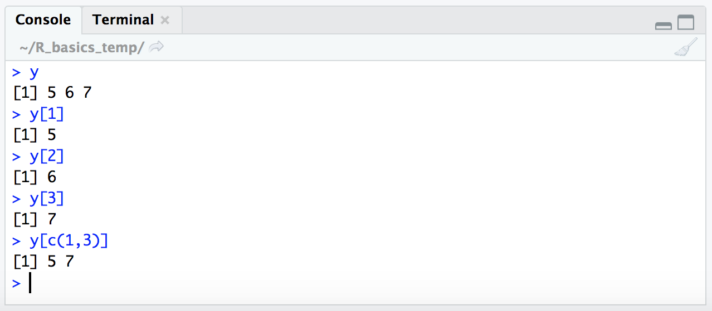
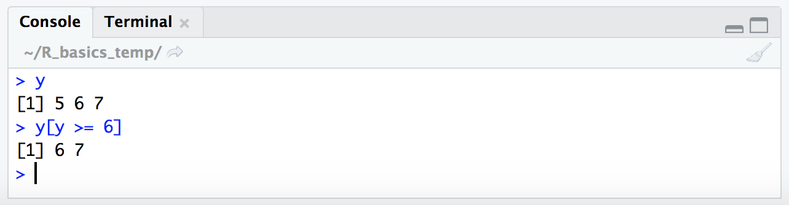
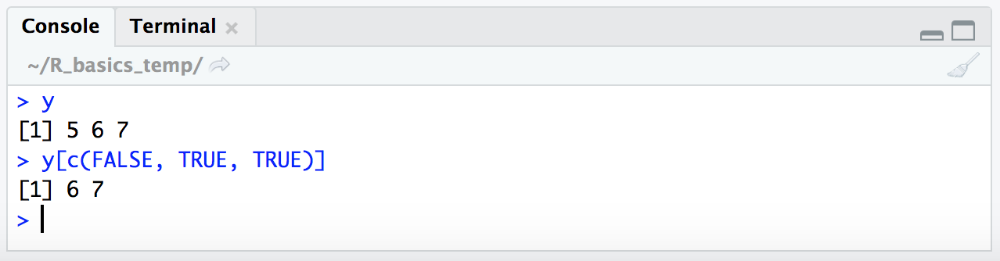
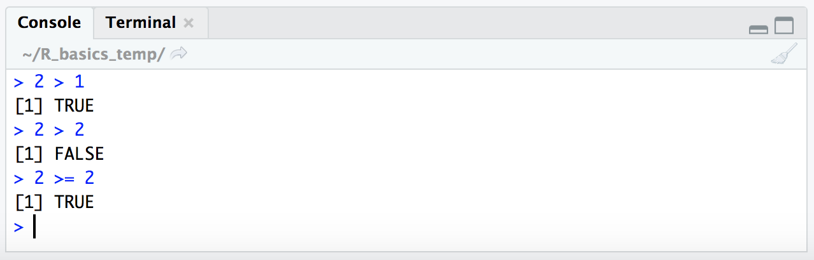
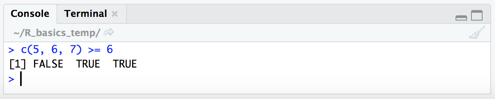
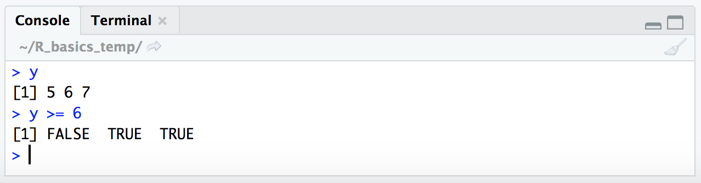
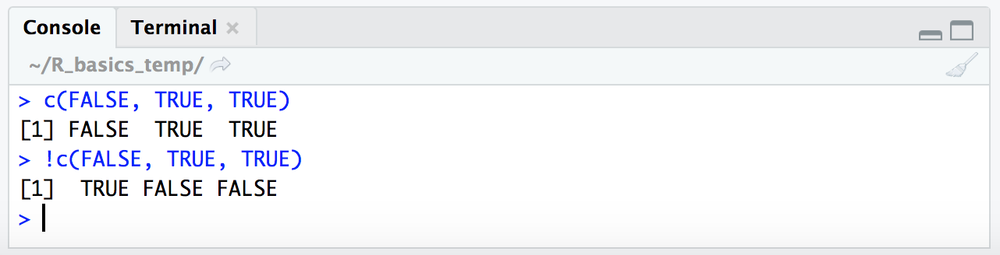
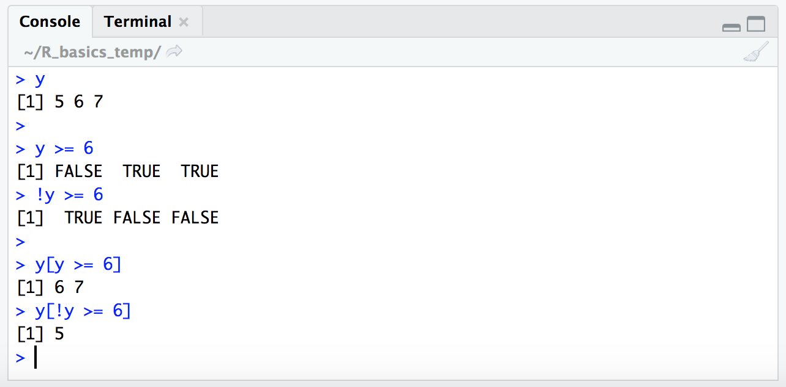





Okay, so some of the awesome utility of R is how easy it makes it to subset things down to whatever we want. The fundamentals of this were covered [here](/R/basics#the-wonderful-world-of-indexing){:target="_blank"} (and if you're completely new to R be sure to run through the [basics](/R/basics){:target="_blank"} before this), but now we're going to go a bit deeper into the weeds of how exactly subsetting by [conditional statements](/R/basics#subsetting-by-conditional-statements){:target="_blank"} works. Having a better grasp of what R's doing under the hood will greatly improve our abilities to write and make use of more complicated subsetting expressions.
<br>
<br>

---
---
<br>

# Accessing our R environment
Before we get started, we need an R environment to work in. You can work on your own computer if you'd like, or you can work in a [Binder](https://mybinder.org/){:target="_blank"} (a self-contained web-accessible environment) that's been created for this page and the [Intro to R page](/R/basics){:target="_blank"}. Both avenues are discussed [here](/R/basics#accessing-our-r-environment){:target="_blank"} if you'd like more info. If you'd like to work in the Binder here, just click this badge to open it: [](https://mybinder.org/v2/gh/AstrobioMike/binder-R-basics/master?urlpath=rstudio){:target="_blank"} 🙂

# Subsetting by position

Subsetting by index number (the actual sequential position of a value) is pretty straightforward as we covered [here](/R/basics#subsetting-by-position){:target="_blank"}. Let's make a simple vector to work with and then look at that again for a second: 

```R
y <- c(5, 6, 7)
y
```

<br>
<center></center> 
<br>

And now let's subset it by index values (remember these are just the numerical positions, the order, of the values stored in the variable):

```R
y
y[1]
y[2]
y[3]
y[c(1,3)]
```

<br>
<center></center> 
<br>

Ok. So each value in a vector has an index number which is just the order of things, and we can use that index number to pull out the value that is held at that position. And we saw how this worked for 2-dimensional structures like tables [here](/R/basics#subsetting-tables){:target="_blank"}.  
<br>

---
<br>
# Subsetting by conditional statements

We also saw how to subset using a conditional statement [here](https://astrobiomike.github.io/R/basics#subsetting-by-conditional-statements){:target="_blank"}, like so:

```R
y
y[y >= 6]
```

<br>
<center></center> 
<br>

Now we're going to break down exactly what is going on here, and it involves the use of **`TRUE`** and **`FALSE`**. **`TRUE`** and **`FALSE`** are special terms in R that are of type "logical". You can see this if you run **`class(TRUE)`**.  

### Conditional statements resolve to TRUE/FALSE

When subsetting by a conditional statement like this, **`y[y >= 6]`**, R is evaluating what's in the subsetting brackets to make a *logical* vector of **`TRUE`** and **`FALSE`** values, and then only returning the values corresponding to index positions where our **`TRUE/FALSE`** vector holds **`TRUE`**.  

This is definitely confusing at first (or was for me at least), but spending some time thinking about it can really help with building more complicated subsetting expressions in R 🙂 So let's look at this in practice. Here, we're going to give R a **`TRUE/FALSE`** vector in our subsetting brackets:

```R
y
y[c(FALSE, TRUE, TRUE)]
```

<br>
<center></center> 
<br> 

We can see here R only returned the last two values of the vector stored in variable **`y`** – the places where the **`TRUE/FALSE`** vector we provided within the subsetting brackets contained the values **`TRUE`**.  

Of course in this case we still specified exactly what we wanted by making those positions **`TRUE`** in our subsetting logical vector, and so at this point this isn't any more useful than giving the exact index positions like above. But we actually don't need to explicity provide the **`TRUE/FALSE`** vector. **Instead, we can provide a *conditional expression* that will resolve to a `TRUE/FALSE` vector.** Conditional expressions involve things like greater than **`>`**, less than **`<`**, equal to **`==`**, greater than or equal to **`>=`**, and less than or equal to **`<=`**. To see what this means in practice, let's look at how R handles some conditional expressions:

```R
2 > 1
2 > 2
2 >= 2
```

<br>
<center></center> 
<br> 

R returns "logical" values (i.e. **`TRUE/FALSE`** values) when presented with conditional expressions like this. As such **`2 > 1`** resolves to **`TRUE`**, **`2 > 2`** resolves to **`FALSE`**, and **`2 >= 2`** resolves to **`TRUE`**. Ok, great, let's walk this just a few more steps forward 🙂  

If we provide a vector for the left side of the conditional statement instead of a single digit like we just did, R will check the conditional expression on each item of the vector. Let's see this in action (remember the **`c()`** function used above to create a vector):

```R
c(5, 6, 7) >= 6
```

<br>
<center></center> 
<br>

Here, R checked if each of the values within the vector (5, 6, and 7) resolved to **`TRUE`** or **`FALSE`** based on the conditional statement **`>= 6`**, and returned a *logical* vector of `FALSE`, **`TRUE`**, and **`TRUE`**. We can also provide a vector stored in a variable (like our **`y`** variable from above) and R acts upon it the same way:

```R
y
y >= 6
```

<br>
<center></center> 
<br>

Now, also remember from above that we directly provided a **`TRUE/FALSE`** vector for our first example of how to subset using a "logical" vector:  

```R
y
y[c(FALSE, TRUE, TRUE)]
```

<br>
<center></center> 
<br>

So when we put the conditional statement **`y >= 6`** within our subsetting brackets, R will resolve it to a vector of **`TRUE/FALSE`** values and then return only the values for positions where the condition resolves to **`TRUE`**:

```R
y 
y[y >= 6]
```

<br>
<center></center> 
<br>

The way I read the expression **`y[y >= 6]`** in my head is: "Give me all the values of vector 'y', where 'y' is greater than or equal to 6." This fundamental concept is key to what makes indexing in R so powerful!  

Lastly, let's quickly revist the **`!`** operator we saw in the [Intro to R here](/R/basics#subsetting-by-conditional-statements){:target="_blank"}. We saw that this inverted the interpretation of the conditional expression provided. Now that we are looking at this at a more fundamental level, we can say that it is actually inverting the **`TRUE/FALSE`** vector, e.g.:

```R
c(FALSE, TRUE, TRUE)
!c(FALSE, TRUE, TRUE)
```

<br>
<center></center> 
<br>

This is why putting this in front of our expression like follows will actually give us the opposite result (the places where the conditional expression we're providing are *not* true):

```R
y

y >= 6
!y >= 6

y[y >= 6]
y[!y >= 6]
```

<br>
<center></center> 
<br>

Beautiful 🙂

The use of the **`!`** character in this case may seem a little unnecessary when we could just switch around our relational operator expression, but it's very handy for other types of conditional statements like the one we ran through [here](/R/basics#cond_example){:target="_blank"}, where inverting the **`TRUE/FALSE`** vector was the only way we could pull out what we wanted. 

<br>

---
---
<br>
If you're still reading this then kudos to you for getting through that! This concept of indexing with logical vectors underlies so many of the ways that we parse down data in R 🙂
