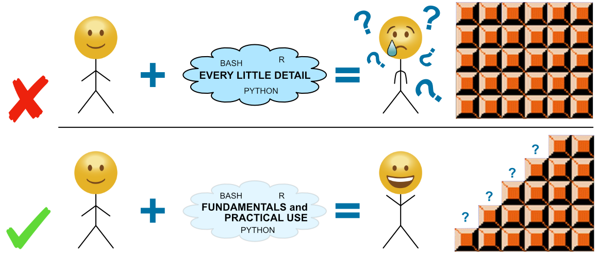
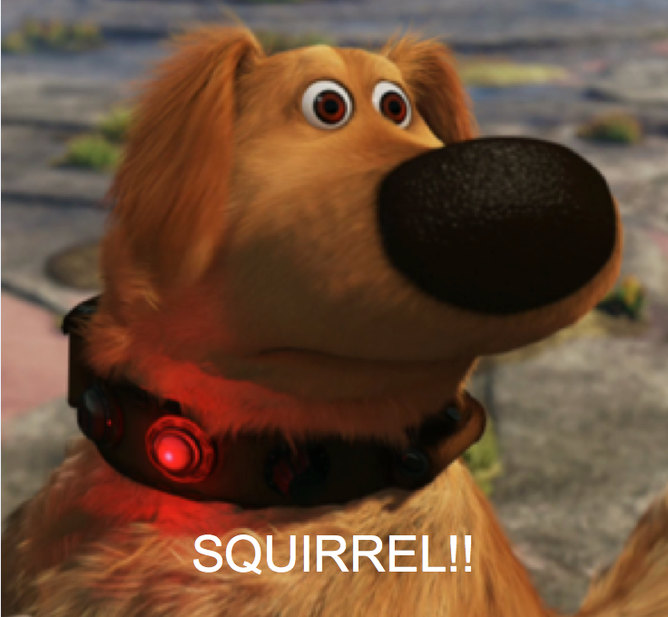

---

> **See some kind words that have been shared about Happy Belly Bioinformatics[here](/about/kind-words){:target="_blank"}**❤️ 

Hi there 🙂 My name's [Mike](https://twitter.com/AstrobioMike){:target="_blank"}. I'm a bioinformatician who gets to explore microbial ecology and evolution in all kinds of different environments. 

I am 100% the biology-to-bioinformatics type of person. Like so many of us these days, I found myself in a biology lab with lots of bioinformatics work to be done, but little to no guidance or expertise in bioinformatics available. This isn't anyone's fault of course, it's just that **our society as a whole is generating data much faster than it is developing the skills to work with it**. And it takes time for our educational infrastructure to catch up to what is needed. In the meantime, many of us are stuck fighting our way up a pretty steep learning curve trying to develop skills that are rapidly becoming essential for biologists. At some undefined point in gradschool, I made it through the toughest parts of that learning curve, things started getting easier for a change, and I started realizing how glorious and empowering it was on the other side 🙂 

The purpose of this site is to try to provide the sort of help that would have helped me when I was starting out. Along with the tutorials linked in the dropdown menus above, that also includes some things I wish someone had explicitly told me. So I'll throw them out here 🙂

# Five things I wish I knew when I started getting into bioinformatics

### 1) Fundamentals and concepts are important, not details
* Don’t feel like you need to master everything you come across.
	* This can be very hard for a lot of us! But we are not computer scientists, we are biologists using computers.
	* Meaning, for example, we don’t need to be able to program perfectly in Python in order to use it effectively in our research. Just having a basic foundation is much more attainable alongside the rest of our research and other obligations. And if we need more at some point, we can learn what we need, when we need it. 
* **Think of it like Excel. Many of us use Excel effectively without knowing how to do everything it can do (which is a lot).** 

<b>High-resolution timelapse of my ongoing journey:</b>

 

### 2) Don’t let yourself become paralyzed by options
* There is not always a “correct” choice about how something should be done. 
* It is okay sometimes to just choose a path, *document it*, and move forward.
* This does not mean all options are always equal of course, but it can be very hard at first to know which things need to be explored exhaustively (by us) and which don’t.
* If you feel yourself going in circles on making a decision, try contacting someone who is more experienced in whatever you are trying to do (even if you've never met them or spoken to them before). Many are happy to offer their experience, and/or point you towards others that may be able to help 😊

### 3) Try to find a bioinformatics community to be a part of

<b>We are not alone!</b>

* Many of us have little or no bioinformatics guidance in our labs/departments/institutions.
* It is super-helpful to have a community of people we can connect with that are working on similar things or have already struggled with what we are currently struggling with. 
	* It's also very valuable just knowing that what we are experiencing **is the norm**!
* If feasible, in-person workshops are usually filled with people who are excited to help and learn from each other, which makes them a great place to connect.
* Joining or helping to build a new community (via twitter, slack, or wherever) is another avenue - this is one of the ways social media can be used for good 😊

### 4) Good documentation is for science, you, and the community

* Why for science is pretty straightforward:
	* Reproducibility, assessment/interpretation of results, etc.
* Why for you:
	* Excellent documentation keeps future-you from being angry with past-you.
	* Helps in those times when you need to just “make a decision and move on”.
		* Bioinformatics is filled with decisions that you as the researcher need to make as you go, and they’re usually not simply “right” or “wrong” choices.
		* Clearly documenting everything can make it feel a lot easier to make these decisions because the transparency means anyone can see it, understand the implications if there are any, and try other ways if they’d like.

* Why for the community:
	* Aside from just being necessary for science, it can also be a great resource for people with less experience to learn from!
		* It's easy for us to perpetually feel like we don't know anything because naturally we are almost always focusing on whatever thing we happen to currently be stuck on. But whether we realize it or not, we usually have scads of things in our wake that we already did figure out 😊
		* So even if we feel like we don't know anything, or that our code is ugly (I'm embarassed of *lots* of code I have on this very site 😬), it can still be helpful to others that happen to be at a different stage in this progression than we currently are. 
			* Not to mention virtually everyone has tips and tricks that others just haven't come across yet.

### 5) Be aware that you will often need to let some things go 😕

* There are many more squirrels to chase than there is time for us to chase them.
	* This is true about many things to an extent of course, but it seems to be operating on a whole other level in bioinformatics (and I suspect everywhere in the relatively new world of "big data").
* There are no easy guidelines to this, as it ultimately up to you, the researcher.
* The important takeaway is don't feel bad when you make a decision to let something go. Instead, know ahead of time that you are going to have to, and that's ok!

