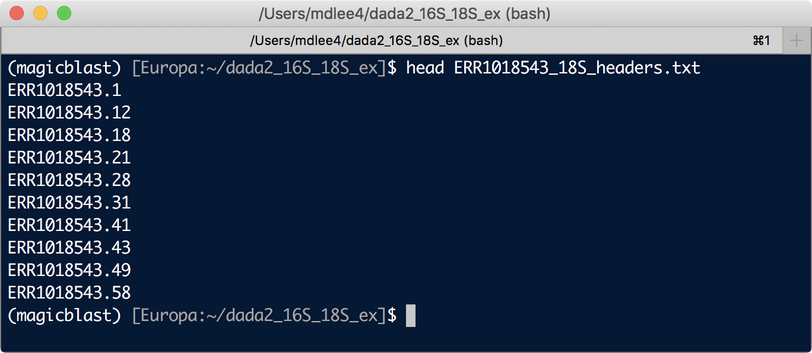
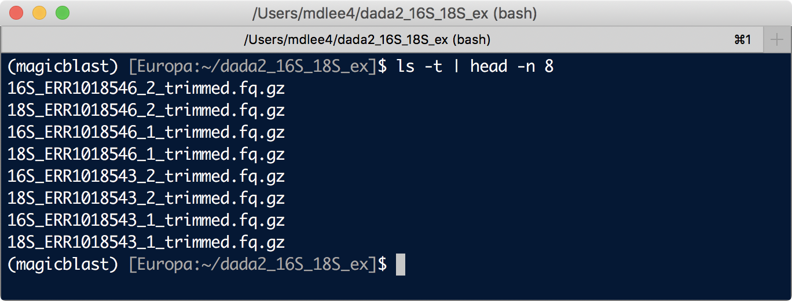
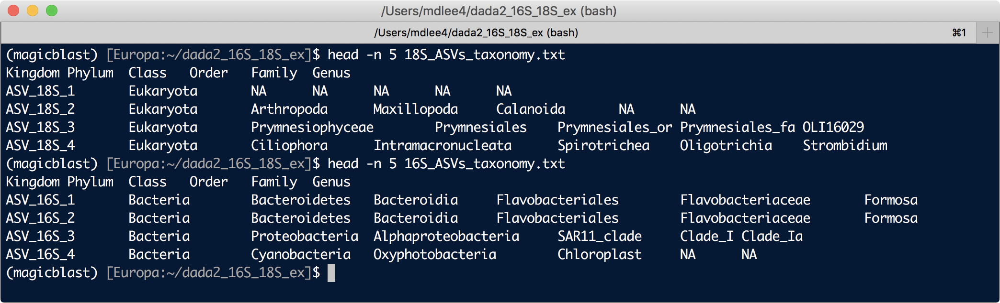
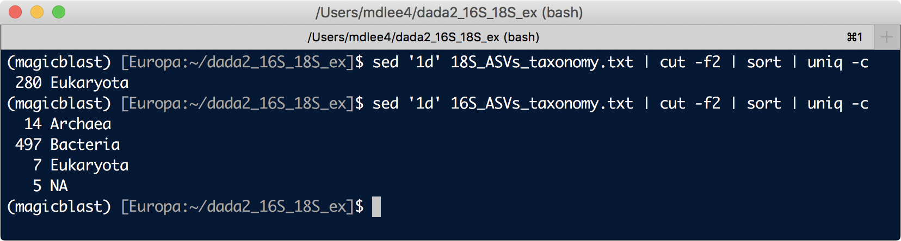





# 16S and 18S mixed together?
So if you're using primers [like these that capture 16S and 18S pretty well](https://onlinelibrary.wiley.com/doi/abs/10.1111/1462-2920.13023){:target="_blank"} and then writing cool papers [like this one](https://www.nature.com/articles/nmicrobiol20165){:target="_blank"}, then you might be wondering if/how you can do this while taking advantage of all the awesomeness that is DADA2. The 18S amplified fragments are typically too long to have any overlap occur with the 2x250bp sequencing that is often performed with these "V4V5" primers, so [one method that has been employed](https://www.nature.com/articles/nmicrobiol20165){:target="_blank"} was to process the reads that didn't successfully merge as the 18S reads. So starting from within DADA2, I considered playing with the `mergePairs()` step and messing with the "justConcatenate" flag. The problem is that you also need to account for those that fail the merge just because of poor quality. So my good buddy [Josh](https://twitter.com/KlingJoshua){:target="_blank"} and I spent a few hours trying to figure out how we could filter the merged objects to separate out which failed-to-merge sequences failed because they were likely not overlapping (and therefore anticipated to be 18S which we wanted to keep) from those that just failed to merge because of sequencing error or other black magic failures (reads we wanted to still throw away). And, not surprisingly, you can end up in quite the rabbit hole about this looking at nmismatches and nmatches and such in the `mergePairs()` resulting objects. But ultimately it seemed like even if we found optimal parameters for one dataset, it would likely be very different for the next one. 

So I decided to bail on that approach and wanted to see if there was an efficient way (i.e. could run in a reasonable amount of time even on my laptop) to parse the reads into 16S and 18S before putting them into DADA2. Here's what I came up with that so far has worked well:

||Step|What we're doing|
|:--:|:--------:|----------|
|1|`Magic-BLAST`|blast all reads to the [PR2 database](https://figshare.com/articles/PR2_rRNA_gene_database/3803709){:target="_blank"}|
|2|`Filtering Magic-BLAST output`|based on % ID and % of query sequence aligned (of both reads)|
|3|`Splitting 16S/18S reads`|based on the Magic-BLAST filtering|
|4|`Processing both in DADA2`|processing independently and merging at the end|

>**NOTE:** Big thanks to Soluna Sales ([@Yo_mis_mamente](https://twitter.com/Yo_mis_mamente){:taret="_blank"}) for writing in and helping to improve this page 🙂

## 16S/18S example data
For an example of this process, we're going to work with a couple of samples from [the paper](https://www.nature.com/articles/nmicrobiol20165){:target="_blank"} I mentioned above by [David Needham](https://twitter.com/animalkewls){:target="_blank"} and [Jed Fuhrman](https://twitter.com/JedFuhrman){:target="_blank"}. If you'd like to follow along, you can download a small directory containing the data, the [PR2](https://figshare.com/articles/PR2_rRNA_gene_database/3803709){:target="_blank"} database tsv file initially downloaded, and the code that follows (including custom scripts for formatting the PR2 database and splitting the fastq files) with these commands:

```bash
cd ~
curl -L -o dada2_16S_18S_ex.tar.gz https://ndownloader.figshare.com/files/21179628
tar -xzvf dada2_16S_18S_ex.tar.gz
rm dada2_16S_18S_ex.tar.gz
cd dada2_16S_18S_ex
```

The "16S_18S_processing.sh" script contains all the commands run at the command line below, and the "16S_18S_processing.R" script contains all the R code. 

The two samples in this working directory are [ERR1018543](https://www.ncbi.nlm.nih.gov/sra/ERR1018543){:target="_blank"} and [ERR10185469](https://www.ncbi.nlm.nih.gov/sra/ERR1018546){:target="_blank"} which were both filtered marine water, size fraction 1µm–80µm, sequenced 2x250 with primers targeting the V4V5 region of the 16S rRNA gene which also capture 18S (515f: 5'-GTGCCAGCMGCCGCGGTAA-3' to 926r: 5'CCGYCAATTYMTTTRAGTTT-3'; [Parada et al. 2015](https://onlinelibrary.wiley.com/doi/abs/10.1111/1462-2920.13023){:target="_blank"}). 

## Magic-BLAST
[NCBI's Magic-BLAST](https://ncbi.github.io/magicblast/){:target="_blank"} is a tool based on general [BLAST](https://blast.ncbi.nlm.nih.gov/Blast.cgi){:target="_blank"} principles but built to deal with high-throughput data, like Illumina reads, consider paired-reads, and can work with fastq files. So yeah, I hadn't heard of this before looking for this particular problem, but it's perfect for it 🙂

It has binaries available for mac, linux, and windows, and I left up an example install that way on the [unix installing tools page](/unix/installing_tools#magic-blast){:target="_blank"}. But it is [conda](https://conda.io/docs/){:target="_blank"} installable now, which is almost always the better way to go, so here's creating a new environment for it and installing it with conda:

```
conda create -y -n magicblast -c conda-forge -c bioconda -c defaults magicblast
conda activate magicblast
```

This was MagicBlast version 1.5.0 at the time of putting this page together.

I used the [PR2](https://figshare.com/articles/PR2_rRNA_gene_database/3803709){:target="_blank"} database to generate our blast database. I initially downloaded the "65.2 MB pr2_version_4.10.0_merged.tsv.gz" available [here](https://github.com/vaulot/pr2_database/releases){:target="_blank"} to start with, and formatted it into a fasta with the headers of each sequence containing the "pr2_main_id" and full taxonomy with the bash script in our directory called "formatting_pr2_fasta.sh".

```bash
gunzip pr2_version_4.10.0_merged.tsv.gz
bash formatting_pr2_fasta.sh
```

I found cutting off the primers before blasting made it easier to distinguish between 16S and 18S, which makes sense as the primer regions hit both because they are so well conserved. So here using [bbduk](https://jgi.doe.gov/data-and-tools/bbtools/bb-tools-user-guide/bbduk-guide/){:target="_blank"} to trim the primers. This can also be installed with [conda](https://conda.io/docs/){:target="_blank"} as done here first (version 38.75 used here):

```bash
  # installing bbduk (which is within the bbmap package)
conda install -y -c conda-forge -c bioconda -c defaults bbmap

  # first making a "samples" file with sample names to iterate through
for sample in $(ls *_1.fastq.gz | cut -f1 -d "_")
do 

  echo $sample

done > samples

  # now trimming primers and filtering if less than 250 bps afterwards:
for sample in $(cat samples)
do

  bbduk.sh in="$sample"_1.fastq.gz in2="$sample"_2.fastq.gz \
           out="$sample"_1_trimmed.fq.gz out2="$sample"_2_trimmed.fq.gz \
           literal=GTGCCAGCMGCCGCGGTAA,CCGYCAATTYMTTTRAGTTT k=10 ordered=t \
           mink=2 ktrim=l rcomp=t minlength=250

done
``` 

Now making the blast database and Magic-BLASTING:

```bash
makeblastdb -in pr2_seqs_with_tax_headers.fa -dbtype nucl -parse_seqids \
            -out pr2_magicblast_db

  # blasting each sample individually:
for sample in $(cat samples)
do

  echo "$sample"
  
  magicblast -db pr2_magicblast_db -query "$sample"_1_trimmed.fq.gz \
             -query_mate "$sample"_2_trimmed.fq.gz -infmt fastq \
             -out "$sample"_mblast_out.txt -outfmt tabular \
             -num_threads 2 -splice F -no_unaligned
             
done
```

On these 2 samples on my laptop (2013 MacBook Pro), these finished in about 1 minute each. 


## Filtering Magic-BLAST output
In messing with how to filter this output to be most useful, I ended on requiring (for both forward and reverse reads) greater than 35% of the query to be aligned at greater than 90% ID. If only one read passed these criteria, the fragment they originated from was considered not to be a successful hit to the [PR2 database](https://figshare.com/articles/PR2_rRNA_gene_database/3803709){:target="_blank"}. This seemed to work really well on these samples, but if you're trying this on your own data, I encourage you to mess with the filtering parameters. 

Here I am trimming down the MagicBLAST out tables and adding a new column that has the percent of the query that aligned, then 


```bash
  # here we are trimming down the MagicBLAST out tables and adding a new column 
  # that has the percent of the query that aligned, this would be a 
  # good table for playing with the filtering parameters:

for sample in $(cat samples)
do 

  echo $sample
  
  cut -f1,2,3,7,8,16 "$sample"_mblast_out.txt | sed '1d' | sed '1d' | \
      sed 's/# Fields: //' | tr " " "_" | \
      awk -v OFS='\t' 'NR==1 {$7="%_query_aln"; print $0} NR>1 { print $0, ($5-$4)/$6*100 }' \
      > "$sample"_mblast_out_mod.txt
      
done

  # here is running the filtering mentioned above, >35% query alignment 
  # and >90% ID, then spitting out only the read names for which both 
  # forward and reverse passed the thresholds:
  
for sample in $(cat samples)
do 

  echo "$sample"
  
  awk '$3 > 90 && $7 > 35' "$sample"_mblast_out_mod.txt | \
      cut -f1 | uniq -d > "$sample"_18S_headers.txt
      
done
```

Now for each sample we have a file of headers for the reads that we believe are of 18S origin:

<center></center>
<br>

## Splitting fastq files into 16S/18S
Next I wrote a little python script to parse the primer-removed fastq files for each sample into 2, those with 16S and those with 18S (this is in the downloaded working directory). It takes as input the forward and reverse fastq files (gzipped only for the moment) and the file of 18S-read headers we just made, and it returns 4 fastq files: 16S and 18S forward reads, and 16S and 18S reverse reads. The help menu can be seen with `python split_16S_18S_reads.py -h`, but here is how I ran it looped for all samples:

```bash
for sample in $(cat samples)
do

  echo $sample
  
  python split_16S_18S_reads.py -f "$sample"_1_trimmed.fq.gz \
         -r "$sample"_2_trimmed.fq.gz -w "$sample"_18S_headers.txt
         
done
```

Now we can see the four output files for each sample and how they're labeled:

<center></center>
<br>

## Processing both in DADA2 and merging at the end
This part won't be heavily annotated, as these steps are already annotated and laid out in the [full DADA2 example workflow](/amplicon/dada2_workflow_ex) and this doing the same except for 16S and 18S separately now. But here is the R code (also in the working directory as "16S_18S_processing.R", and at the end a look at the taxonomy files of each and merged DADA2 object. As will be seen here, this seemed to work well for this dataset (i.e. no Euks in the 16S table and only Euks in the 18S table), but if you try this and come across a scenario where different blast filtering values worked better for you, please do let me know so we can improve this for all 🙂

```R
setwd("~/dada2_16S_18S_ex/")

library(dada2)
packageVersion("dada2") # 1.12.1

list.files()

samples <- scan("samples", what="character")

#### 18S ####
forward_18S_reads <- sort(list.files(pattern="18S.*1_trimmed.fq.gz"))
reverse_18S_reads <- sort(list.files(pattern="18S.*_2_trimmed.fq.gz"))

filtered_forward_18S_reads <- paste0("18S_",samples, "_1_filtered.fq.gz")
filtered_reverse_18S_reads <- paste0("18S_",samples, "_2_filtered.fq.gz")

plotQualityProfile(forward_18S_reads) # median (green line) seems to cross Q30 around 230 bases
plotQualityProfile(reverse_18S_reads) # median crosses Q30 around 200

filtered_out_18S <- filterAndTrim(forward_18S_reads, filtered_forward_18S_reads,
                                  reverse_18S_reads, filtered_reverse_18S_reads,
                                  maxEE=c(2,2), rm.phix=TRUE, multithread=TRUE,
                                  truncLen=c(230,200))

plotQualityProfile(filtered_forward_18S_reads)
plotQualityProfile(filtered_reverse_18S_reads)

err_forward_18S_reads <- learnErrors(filtered_forward_18S_reads, multithread=TRUE)
err_reverse_18S_reads <- learnErrors(filtered_reverse_18S_reads, multithread=TRUE)

plotErrors(err_forward_18S_reads, nominalQ=TRUE)
plotErrors(err_reverse_18S_reads, nominalQ=TRUE)

derep_forward_18S <- derepFastq(filtered_forward_18S_reads, verbose=TRUE)
names(derep_forward_18S) <- samples
derep_reverse_18S <- derepFastq(filtered_reverse_18S_reads, verbose=TRUE)
names(derep_reverse_18S) <- samples

dada_forward_18S <- dada(derep_forward_18S, err=err_forward_18S_reads, multithread=TRUE)
dada_reverse_18S <- dada(derep_reverse_18S, err=err_reverse_18S_reads, multithread=TRUE)

  # justConcatenate=TRUE
merged_18S <- mergePairs(dada_forward_18S, derep_forward_18S, dada_reverse_18S,
                         derep_reverse_18S, justConcatenate=TRUE)


seqtab_18S <- makeSequenceTable(merged_18S)
dim(seqtab_18S)[2] # 461
sum(seqtab_18S) # 4961

seqtab.nochim_18S <- removeBimeraDenovo(seqtab_18S, method="consensus",
                                        multithread=T, verbose=T)

dim(seqtab.nochim_18S)[2] # 280

sum(seqtab.nochim_18S)/sum(seqtab_18S) # 0.88

taxa_18S <- assignTaxonomy(seqtab.nochim_18S, "silva_nr_v132_train_set.fa.gz",
                           multithread=T, tryRC=T)

getN <- function(x) sum(getUniques(x))

track_18S <- data.frame(row.names=samples, dada2_input=filtered_out_18S[,1],
                        filtered=filtered_out_18S[,2],
                        denoised=sapply(dada_forward_18S, getN),
                        merged=sapply(merged_18S, getN), table=rowSums(seqtab_18S),
                        no_chimeras=rowSums(seqtab.nochim_18S),
                        "perc_reads_survived"=round(rowSums(seqtab.nochim_18S)/filtered_out_18S[,1]*100, 1))

track_18S

#            dada2_input filtered denoised merged table no_chimeras perc_reads_survived
# ERR1018543        6674     4147     3765   3644  3644        3135                47.0
# ERR1018546        2588     1610     1346   1317  1317        1244                48.1

## making and writing out standard output files:
# giving our seq headers more manageable names (ASV_1, ASV_2...)
asv_seqs_18S <- colnames(seqtab.nochim_18S)
asv_headers_18S <- vector(dim(seqtab.nochim_18S)[2], mode="character")

for (i in 1:dim(seqtab.nochim_18S)[2]) {
  asv_headers_18S[i] <- paste(">ASV_18S", i, sep="_")
}

# fasta:
asv_fasta_18S <- c(rbind(asv_headers_18S, asv_seqs_18S))
write(asv_fasta_18S, "18S_ASVs.fa")

# count table:
asv_tab_18S <- t(seqtab.nochim_18S)
row.names(asv_tab_18S) <- sub(">", "", asv_headers_18S)
write.table(asv_tab_18S, "18S_ASVs_counts.txt", sep="\t", quote=F)

# tax table:
asv_tax_18S <- taxa_18S
row.names(asv_tax_18S) <- sub(">", "", asv_headers_18S)
write.table(asv_tax_18S, "18S_ASVs_taxonomy.txt", sep="\t", quote=F)


#### 16S ####

forward_16S_reads <- sort(list.files(pattern="16S.*1_trimmed.fq.gz"))
reverse_16S_reads <- sort(list.files(pattern="16S.*_2_trimmed.fq.gz"))

filtered_forward_16S_reads <- paste0("16S_",samples, "_1_filtered.fq.gz")
filtered_reverse_16S_reads <- paste0("16S_",samples, "_2_filtered.fq.gz")

plotQualityProfile(forward_16S_reads) # median drops below Q30 around 260
  # the primers span 515-926, we cut off about 40 bps when removing the primers, so
  # our target amplicon now is about 370
  # with 260 from forward, the reverse would need to be 110 minimum to reach 
plotQualityProfile(reverse_16S_reads) # median drops below Q30 around 200

  # when doing the trimming step, it's important to make sure we aren't trimming them 
  # so short that they cannot overlap, which would cause problems when we try to merge later
  # trimming the forward to 260 and reverse to 200 would leave us with around 90 bps overlap

filtered_out_16S <- filterAndTrim(forward_16S_reads, filtered_forward_16S_reads,
                                  reverse_16S_reads, filtered_reverse_16S_reads,
                                  maxEE=c(2,2), rm.phix=TRUE, multithread=TRUE,
                                  truncLen=c(260,200))

plotQualityProfile(filtered_forward_16S_reads)
plotQualityProfile(filtered_reverse_16S_reads)

err_forward_16S_reads <- learnErrors(filtered_forward_16S_reads, multithread=TRUE)
err_reverse_16S_reads <- learnErrors(filtered_reverse_16S_reads, multithread=TRUE)

plotErrors(err_forward_16S_reads, nominalQ=TRUE)
plotErrors(err_reverse_16S_reads, nominalQ=TRUE)

derep_forward_16S <- derepFastq(filtered_forward_16S_reads, verbose=TRUE)
names(derep_forward_16S) <- samples
derep_reverse_16S <- derepFastq(filtered_reverse_16S_reads, verbose=TRUE)
names(derep_reverse_16S) <- samples

dada_forward_16S <- dada(derep_forward_16S, err=err_forward_16S_reads, multithread=TRUE)
dada_reverse_16S <- dada(derep_reverse_16S, err=err_reverse_16S_reads, multithread=TRUE)

  # doing a temp merge without changing the minimum overlap to get a look
  # at the distribution of overlap values
temp_merged_16S <- mergePairs(dada_forward_16S, derep_forward_16S,
                              dada_reverse_16S, derep_reverse_16S)
                              
quantile(temp_merged_16S[[1]]$nmatch, probs=seq(0,1,0.05)) 

# 0%    5%    10%   15%   20%   25%   30%   35%   40%   45%   50%   55%   60%   65%   70%   75%   80%   85%   90%   95%   100% 
# 16.0  47.0  60.4  64.0  66.0  66.0  66.0  66.0  66.0  67.0  69.0  70.0  71.0  71.0  71.0  71.0  71.0  71.0  71.6  73.0  87.0

    # okay, going to use 45 as min overlap, as that captures >95% of the sequences in there
rm(temp_merged_16S)
merged_16S <- mergePairs(dada_forward_16S, derep_forward_16S, dada_reverse_16S,
                         derep_reverse_16S, minOverlap=45)

seqtab_16S <- makeSequenceTable(merged_16S)
dim(seqtab_16S)[2] # 1,157
sum(seqtab_16S) # 36,149

seqtab.nochim_16S <- removeBimeraDenovo(seqtab_16S, method="consensus", multithread=T,
                                        verbose=T)

dim(seqtab.nochim_16S)[2] # 523

sum(seqtab.nochim_16S)/sum(seqtab_16S) # 0.70

taxa_16S <- assignTaxonomy(seqtab.nochim_16S, "silva_nr_v132_train_set.fa.gz",
                           multithread=T, tryRC=T)


getN <- function(x) sum(getUniques(x))

track_16S <- data.frame(row.names=samples, dada2_input=filtered_out_16S[,1],
                        filtered=filtered_out_16S[,2],
                        denoised=sapply(dada_forward_16S, getN),
                        merged=sapply(merged_16S, getN), table=rowSums(seqtab_16S),
                        no_chimeras=rowSums(seqtab.nochim_16S),
                        "perc_reads_survived"=round(rowSums(seqtab.nochim_16S)/filtered_out_16S[,1]*100, 1))

track_16S

#            dada2_input filtered denoised merged table no_chimeras perc_reads_survived
# ERR1018543       30058    21882    21030  15685 15685       11500                38.3
# ERR1018546       33284    25467    24634  20464 20464       13898                41.8

## making and writing out standard output files:
# giving our seq headers more manageable names (ASV_1, ASV_2...)
asv_seqs_16S <- colnames(seqtab.nochim_16S)
asv_headers_16S <- vector(dim(seqtab.nochim_16S)[2], mode="character")

for (i in 1:dim(seqtab.nochim_16S)[2]) {
  asv_headers_16S[i] <- paste(">ASV_16S", i, sep="_")
}

# fasta:
asv_fasta_16S <- c(rbind(asv_headers_16S, asv_seqs_16S))
write(asv_fasta_16S, "16S_ASVs.fa")

# count table:
asv_tab_16S <- t(seqtab.nochim_16S)
row.names(asv_tab_16S) <- sub(">", "", asv_headers_16S)
write.table(asv_tab_16S, "16S_ASVs_counts.txt", sep="\t", quote=F)

# tax table:
asv_tax_16S <- taxa_16S
row.names(asv_tax_16S) <- sub(">", "", asv_headers_16S)
write.table(asv_tax_16S, "16S_ASVs_taxonomy.txt", sep="\t", quote=F)


#### combining the 16S and 18S tables ####
class(seqtab.nochim_16S) 
class(seqtab.nochim_18S)
dim(seqtab.nochim_16S)[2] # 523
dim(seqtab.nochim_18S)[2] # 280

head(colnames(seqtab.nochim_18S)) # the sequences are column names in these tables (matrices)
head(rownames(seqtab.nochim_18S)) # and the samples are the rows

  # so we can combind them with cbind:
seqtab.nochim <- cbind(seqtab.nochim_16S, seqtab.nochim_18S)
dim(seqtab.nochim) # 2 803
  # now this seqtab.nochime is still compatible with dada2, for instance
  # we can run the taxanomy call on the whole thing together:
taxa <- assignTaxonomy(seqtab.nochim, "silva_nr_v132_train_set.fa.gz", multithread=T, tryRC=T)

  # and we can also write out a combined fasta, count table, and taxonomy table, like we did for them individually above

all_asv_seqs <- c(asv_seqs_16S, asv_seqs_18S)
all_asv_headers <- c(asv_headers_16S, asv_headers_18S)

# all fasta:
all_asvs_fasta <- c(rbind(all_asv_headers, all_asv_seqs))
write(all_asvs_fasta, "All_ASVs.fa")

# all count table
all_asv_tab <- t(seqtab.nochim)
row.names(all_asv_tab) <- sub(">", "", all_asv_headers)
write.table(all_asv_tab, "All_ASVs_counts.txt", sep="\t", quote=F)

# all tax table 
all_tax <- taxa
row.names(all_tax) <- sub(">", "", all_asv_headers)
write.table(all_tax, "All_ASVs_taxonomy.txt", sep="\t", quote=F)
```

## Evaluating the outcome
As with most of these types of things, we can't get everything right (because there is noise – biological and technical – at many of these steps), but we want to get as close as possible. Here, from the two incorporated samples, we ended up with 280 unique ASVs believed to be derived from 18S fragments, and 523 unique ASVs believed to be derived from 16S fragments. 

That whole process was based on MagicBLAST alignments of the reads to the [PR2 database](https://figshare.com/articles/PR2_rRNA_gene_database/3803709){:target="_blank"}, so a decent, quick evaluation of if this was all nonsense or not can be done by looking at the taxonomy assigned by RDP (which is kmer-based, not alignment) against the [silva database](https://www.arb-silva.de/){:target="_blank"} we used in DADA2. So let's look at those taxonomy outputs:

<center></center>
<br>
These are formatted such that the second column has the "Kingdom" (er, Domain), so let's see how many each has of Eukaryota, Bacteria, or Archaea in that column:

```bash
sed '1d' 18S_ASVs_taxonomy.txt | cut -f2 | sort | uniq -c
sed '1d' 16S_ASVs_taxonomy.txt | cut -f2 | sort | uniq -c
```

<center></center>
<br>
Not bad! All 280 ASVs that came through the 18S pipeline were classified as Eukaryota by RDP with the silva database, while only 7 out of the 523 ASVs that came through the 16S pipeline were classified as Eukaryota. Of course, we have to take closer look at them, so let's grab the seqs and [web blast](https://blast.ncbi.nlm.nih.gov/Blast.cgi?PAGE=MegaBlast&PROGRAM=blastn&PAGE_TYPE=BlastSearch&BLAST_SPEC=){:target="_blank"} them:

```bash
for i in $(awk '$2 == "Eukaryota"' 16S_ASVs_taxonomy.txt | cut -f 1)
do

  grep -A1 ">$i" 16S_ASVs.fa
  
done
```
Which spit out these, with the top-hit results of web blasting to nr/nt commented next to the headers:


```
>ASV_16S_277 # 100% aligned at 75% ID to a mitochondrion
TACCTTGACGGGGAAGCGTTACTGGCCTTTACTGAGCGTATAGTATGGCTAGACGGCTTAAAAACTTACAGAATAAACCTAAAAGTTGTTTAATTCATTAGTAAAAGTTTAATGCTAGAGAGTACAAGAGGTAAGAAATTGCTAACGTTTAGAGATGAAATATTAACAGACCTTAGTAATTATCAACAGCCTCGGCATCTTACCATTGTAGCTCTAACGTCGAACCATTTAAGTATAGTTATCGAATAGGATTGGAGACCCTAGTAGTCTATACCGTGAATTGATGGATATTATATTTTAAAAATATTTTAGAATATACGCTAACGCTTAAATATCTCGCTTGGGGAGTAAGGCTGCAAAGGTTAAACTTAAATAAATTGACGG
>ASV_16S_299 # 45% aligned at 79% ID to a 16S
TACGGGGGGTGCGAGCGTTATCCTAATGAACTCGGCGTAAAGGGAGCGTAGGTTGTTTTAAGTAATAGTTTAAGTATCATTTTAATGTATCCTTTTTCTATAAAAAAAAACTTGAGTTATTTATGAGGGTTATAGTATTTTTTGAGGAGAGATGAAATACGACAATACTTTAGAGAATACCAACGGTGAAGACAGTAACCTAGATATAACTGACACTGAGGCTCGAAAGTGTAGGTATCGACAGGGATTAGATACCCCTTTAGTCTACACCGTAAACTATACATACTTGTATGAAAATTAAGTACGTCGCTAATGCTTTAGTATGTCGCCTGAGGAGTACGATCGCAAGGTTGAAACTCAAAGAAATTGACGG
>ASV_16S_349 # 76% aligned at 78% ID to a plastid
AACAGAGGATGTTAGCGTTATCCGGATTGATAGGGCGTAAAGTGTCTATAGATGGGTTATAATGTCTTATATTAAATGTTGAATTTTAATATCAAATTAGATTAGAAACTTAAAACCTAGCGTATTGTAGGTGTACTGAGAATTCTTGGTGTAGAGGTAAAATTCGTAGAGTTCAAGAGGAATACTTGTAGCGGAGGCGAGGTATTGGGTAATACTAAGACATTGAAGGACGAAAGCTAAGGTAGCAAATGGGATTAGATACCCCAGTAGTCTTAACTGTAAATAATGAAGATTAAGTCTTTTTTGAAATTATAAACTTTTACTAGGATCAAAAGCTAACGCGATAAATCTTCCGCCTGGGGAGTATGTTCGCAAGGATTAAACTCAAAGAAATTGACGG
>ASV_16S_356 # 43% aligned at 77% ID to a 16S
TACGGGGGGTGCGAGCGTTATCCTAATGAACTCGGCGTAAAGGGAGCGTAGGTTGTTTTAAGTAATAGTTTAAGTATCATTTTAATGTATCCTTTTTCTATAAAAAAAAACTTGAGTTATTTATGAGGGTTATAGTATTTTTTGAGGAGAGATGAAATACGACAATACTTTAGAGAATACCAACGGTGAAGACAGTAACCTAGATATAACTGACACTGAGGCTCGAAAGTGTAGGTATCGACAGGGATTAGATACCCCTTTAGTCTACACCGTAAACTATACATACTTGTATGAAAATTAAGTACGTCGCTAATGCTTTAGTATGTCGCCTGAGGAGTACGATCGCAAGGTTGAAACTTAAATGAATTGGCGG
>ASV_16S_415 # 59% aligned at 75% ID to a 16S
TACGGAAGGTGCAAGCGTTGCTCTTATGAATTCGGCGTAAAGGGAGCGTAGGTGGCTTTCGGTAATAGATAATGTACCATCATAATGTATTCTTTATTTATATAAAAAAGCTAGAGTTATTTAAGCGGGTTGTGGTATTTTTTGAGGAGAGATGAAATGCTATGATACTTTAGAGAACACCAATGTTGAAGAAAGCAGCCTTAATATAACTGACGCTGAGGCTCGAAAGTGTAGGTATCGACAGGGATTAGATACCCCTTTAGTCTACACCCTAAACTATACACACTTGTATTTATAAATAAAAGATACGTCACTAACGTTTTAGTGTGTCGCCTGAGGAGTATCATCGCAAGGTTGAAACTCAAAGGAATTGGCGG
>ASV_16S_464 # no hits with megablast
TACGTTGACGGGGGAGCGTTACTGGTCATTACTAGGCGTAAAGTGTGGCTATGCGGTATAAGAAGTTACGTTTTAAATCAAAGGGCAATCTACGATTTTCGTAATACCTTATTACTAGAGGTGAGAGGAAGTTAGCAACACGTGTAACCTAGAGATGAAATTCTAAGAGGTTGCAAGGGTTCTCAAATGCCACGGCAGCTAGCTATTCTCAACCTGACGTTGAACCACTAAAGTACGAGTGTCGATTAGGATTGGAGACCCTAATAGTTCGTACCCTGAATCAATGGGCATTATATGTCAAAAATATATTTTTGGTGTATCAGCTAACGCGTAAATGCCTCGCCTGGGGAGTAAGGCTGCAAAGGCTAAACTCAAATGAATTGGCGG
>ASV_16S_500 # 99% aligned at 79% ID to a mitochondrion
GACGGAGGGGGCAAGTGTTCATCGGAATGACTGGGCGTGAAGGGTGTCTAGGCGGAAAAACACGCATGCATTGAAAGCCCTGCAGAATGTGGAGGAACTGGTGCATGGACGGTTTTTCATGAGTTATACAGAGGAAAACGGAAGGCGAAAGGAAGCGGTGCAATGCAGTGATCTTTCGTCGAAGGCCAGTTTGCGAAGGCTGTTTTCTGGGTATACACTGACGCTGAAGCACGAAAGCGTGGGGAGCAAGAAGGATTAGAGACCCTTTTAGTCCACGCCGATAACGTTGTGTTCTATCCGAGGGACCAGAATGTTTCTCGGGGATTAAGGTTTACGCCAAAGAACACCGCCTGGGGAGTACGGTGGCAGCACTGAAACTTAAATGAATTGGCGG
```

So it seems those that came through classified as "Eukaryota" were mitochondrial, plastid, or 16S sequences, so I think this worked pretty well. Please do write in and help improve this page for others if you can 🙂
