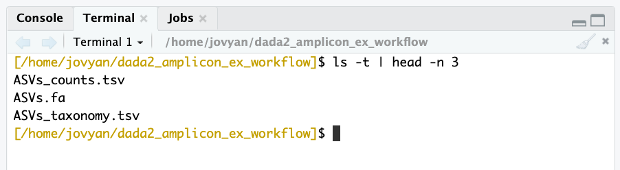
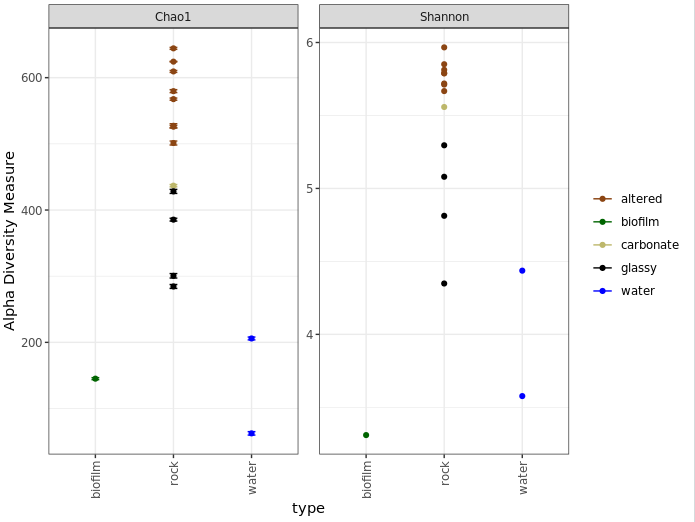
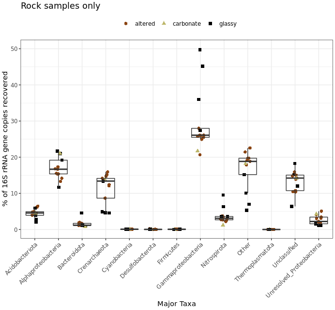
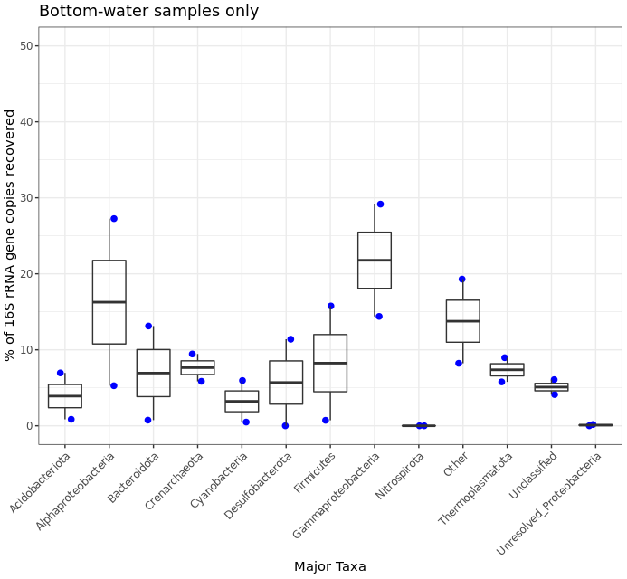
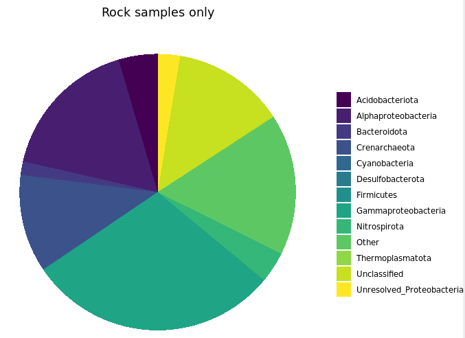
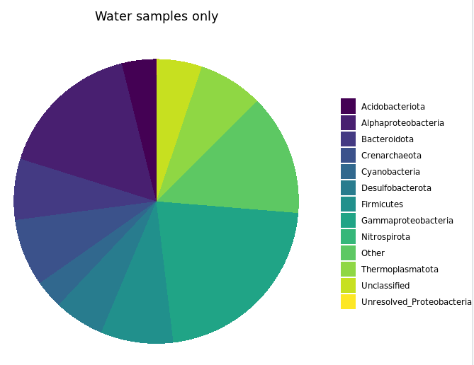





Here we're going to run through one way to process an amplicon dataset and then many of the standard, initial analyses. We'll be working a little at the command line, and then primarily in R. So it'd be best if you are already have some experience with both. If you're new to either or both, there is a [Unix crash course here](/unix/unix-intro){:target="_blank"} and an [intro to R here](/R/basics) you may want to check out first 🙂  

Before we get started here, an obligatory public service announcement:

<div class="warning">
<h2>ATTENTION!</h2>
Keep in mind here that as with everything on this site, none of this is meant to be authoritative. This is simply one example of one workflow. When working with your own data you should of course never follow any pipeline blindly, and pay attention to differences in your data vs the tutorial dataset you are using. These differences can often require changes to parameters that can be important. <b>Don't let anything here, or anywhere, constrain your science to doing only what others have done!</b></div>

Now that that's out of the way, let's get to it!  
<br>

---
---
<br>

# DADA2
We're going to be using [DADA2](https://benjjneb.github.io/dada2/index.html){:target="_blank"}, which is a relatively new processing workflow for recovering single-nucleotide resolved Amplicon Sequence Variants (ASVs) from amplicon data – if you're unfamiliar with ASVs, you can read more about ASVs vs OTUs on the [amplicon home page here](/amplicon/){:target="_blank"}, along with some other introductory information. Developed and maintained by [@bejcal](https://twitter.com/bejcal){:target="_blank"} et al., DADA2 leverages sequencing quality and abundance information to a greater extent than previously developed tools. It generates an error model based on your actual data, and then uses this error model to do its best to infer the original, true biological sequences that generated your data. The paper can be found [here](https://www.ncbi.nlm.nih.gov/pmc/articles/PMC4927377/){:target="_blank"}, and the DADA2 R package can be found here [here](https://benjjneb.github.io/dada2/index.html){:target="_blank"}. The DADA2 team has a great tutorial available [here](https://benjjneb.github.io/dada2/tutorial.html){:target="_blank"}, and I learned my way around DADA2 by following that and reading through the [manual](https://www.bioconductor.org/packages/3.3/bioc/manuals/dada2/man/dada2.pdf){:target="_blank"}. This page builds upon that with: 1) heavier annotations and explanations to, in the style of this site all around, hopefully help new-comers to bioinformatics of course 🙂 and 2) examples of common analyses to do in R after processing amplicon data. There is also a separate page demonstrating one way to deal with [16S and 18S data mixed together here](/amplicon/16S_and_18S_mixed){:target="_blank"}. 
<br>
<br>

---
<br>

# Binder available
You can work on your own system if you'd like, but I have also created a "Binder" in which you can run through the entire tutorial on this page without needing to worry about setting up the appropriate environment on your own system. [Binder](https://mybinder.org/){:target="_blank"} is an incredible project with incredible people behind hit. I'm still very new to it, but the general idea is it makes it easier to setup and share specific working environments in support of open science. What this means for us here is that we can just click this little badge – [](https://mybinder.org/v2/gh/AstrobioMike/binder-dada2-ex-workflow/v3?urlpath=rstudio){:target="_blank"} – and it'll open an RStudio environment with all our needed tools and packages installed and ready to rock... how awesome is that?!? Again, you can also work on your own system if you'd like, but this option is here in case it's helpful. If you'd like to use the Binder environment, click the badge above, and when that page finishes loading (it may take a couple of minutes), you will see a screen like this (minus the blue arrow):

<center></center>
<br>

RStudio has the added benefit of providing our command-line environment too. If we click the "Terminal" tab that the blue arrow points to in the above image, it will change the console to our command line and look like this: 

<a id="terminal"></a>
<center></center>
<br>
>**NOTE:** Don't worry if there is a conda error message at the top of your Terminal window, we can ignore that here.

We will be using the command line first, as detailed below, so you can leave it there for now. But keep these tabs in mind as they determine whether you're working in R (which is the "Console" tab here) or working at the command line (the "Terminal" tab here). If something isn't working, that's a good thing to double-check first 🙂
<br>
<br>

---
<br>

# Tools used here
If using the Binder environment, you don't need to worry about installing these tools, but if working on your own system, you will need to take care of some installations as noted while we go. In addition to [DADA2](https://benjjneb.github.io/dada2/index.html){:target="_blank"} as our main processing tool, we'll be using [cutadapt](https://cutadapt.readthedocs.io/en/stable/index.html){:target="_blank"} to remove our primers. DADA2 is available as an [R](https://www.r-project.org/){:target="_blank"} package, with installation instructions provided by the developers [here](https://benjjneb.github.io/dada2/dada-installation.html){:target="_blank"}. If your experience is like mine, it shouldn't give you any trouble if installing on your computer, but you may run into some issues when trying to install on a server where you don't have authorization to do whatever you'd like – a huge thanks to [@phantomBugs](https://twitter.com/phantomBugs){:target="_blank"} for all his help when I was bugging him about that! If you'd like to use [cutadapt](https://cutadapt.readthedocs.io/en/stable/index.html){:target="_blank"}, you can find installation instructions for it from the developers [here](https://cutadapt.readthedocs.io/en/stable/installation.html){:target="_blank"} (which includes the conda installation method `conda install -c bioconda cutadapt`, or to install the specific version used when putting this together `conda install -c bioconda cutadapt=2.3`). Considering checking out the [conda intro page](/unix/conda-intro) if you are unfamiliar with conda 🙂
 
And since DADA2 is an R package, you also of course need to have a working installation of R on your computer. If you'd like/need more info on this, check out the [R basics](/R/basics){:target="_blank"} page before moving forward. 
<br>
<br>

---
<br>


# The data
For a quick overview of the example data we'll be using and where it came from, we are going to work with a subset of the dataset [published here](https://www.frontiersin.org/articles/10.3389/fmicb.2015.01470/full){:target="_blank"}. We were exploring an underwater mountain ~3 km down at the bottom of the Pacific Ocean that serves as a low-temperature (~5-10°C) hydrothermal venting site. This amplicon dataset was generated from DNA extracted from crushed basalts collected from across the mountain with the goal being to begin characterizing the microbial communities of these deep-sea rocks. No one had ever been here before, so as is often the purpose of marker-gene sequencing, this was just a broad-level community survey. The sequencing was done on the Illumina MiSeq platform with 2x300 paired-end sequencing using primers targeting the V4 region of the 16S rRNA gene. There are 20 samples total: 4 extraction "blanks" (nothing added to DNA extraction kit), 2 bottom-water samples, 13 rocks, and one biofilm scraped off of a rock. None of these details are important for you to remember, it's just to give some overview if you care.  

In the following figure, overlain on the map are the rock sample collection locations, and the panes on the right show examples of the 3 distinct types of rocks collected: 1) basalts with highly altered, thick outer rinds (>1 cm); 2) basalts that were smooth, glassy, thin exteriors (~1-2 mm); and 3) one calcified carbonate.

<center></center>

<br>

## Getting the tutorial data
For speed purposes we're only going to work with about 10% of the full dataset. Altogether the uncompressed size of the working directory we are downloading here is ~300MB. To get started, **be sure you are in the "Terminal" window like [pictured above](/amplicon/dada2_workflow_ex#terminal){:target="_blank"} if using the Binder environment, or in your own command line if working on your own system.** We will be working here for the first step of removing the primers too, so don't switch over to R (the "Console" tab in the Binder/RStudio environment) until noted. You can download the required dataset and files by copying and pasting the following commands into your command-line terminal:

```
cd ~
curl -L -o dada2_amplicon_ex_workflow.tar.gz https://ndownloader.figshare.com/files/23066516
tar -xzvf dada2_amplicon_ex_workflow.tar.gz
rm dada2_amplicon_ex_workflow.tar.gz
cd dada2_amplicon_ex_workflow/
```

Now, let's get started!
<br>
<br>

---
<br>

# Processing overview

>**Note:** I have occassionally updated program versions (and changed the method and reference database used for taxonomic assignment) without necessarily re-generating all the figures included below or updating all spots in the text that reference specific things. There are also some different versions in the [binder](/amplicon/dada2_workflow_ex#binder-available) than were used when this page was put together (due to constraints on how I could build the binder when it was put together). So if your values differ slightly from the ones shown anywhere, this generally isn't a problem. If you are unsure and curious, feel free to [post an issue here](https://github.com/AstrobioMike/AstrobioMike.github.io/issues){:target="_blank"} or reach out to me through [email or twitter](/research/){:target="_blank"} 🙂

It's good to try to keep a bird's-eye view of what's going on. So here is an overview of the main processing steps we'll be performing with [cutadapt](https://cutadapt.readthedocs.io/en/stable/index.html){:target="_blank"} and [DADA2](https://benjjneb.github.io/dada2/index.html){:target="_blank"}. Don't worry if anything seems unclear right now, we will discuss each at each step.

>**NOTE:** This particular dataset is already demultiplexed – meaning each sample has its own file(s) already. Sometimes you will get your data all mixed together in one file, and you will need to separate them into individual files based on their barcodes. If your data are starting in that form, you can check out [a demultiplexing example on this page](/amplicon/demultiplexing){:target="_blank"} if you'd like. 

||Command|What we're doing|
|:--:|:--------:|----------|
|1|`cutadapt`/`filterAndTrim()`|remove primers and quality trim/filter|
|2|`learnErrors()`|generate an error model of our data|
|3|`derepFastq`|dereplicate sequences|
|4|`dada()`|infer ASVs on both forward and reverse reads independently|
|5|`mergePairs()`|merge forward and reverse reads to further refine ASVs|
|6|`makeSequenceTable()`|generate a count table|
|7|`removeBimeraDenovo()`|screen for and remove chimeras|
|8|`IdTaxa()`|assign taxonomy|

And at the end of this we'll do some R magic to generate regular [flat files](/unix/working-with-files-and-dirs#bonus-round-whats-a-plain-text-file){:target="_blank"} for the standard desired outputs of amplicon/marker-gene processing: 1) a fasta file of our ASVs; 2) a count table; and 3) a taxonomy table.  

In our working directory there are 20 samples with forward (R1) and reverse (R2) reads with per-base-call quality information, so 40 fastq files (.fq). I typically like to have a file with all the sample names to use for various things throughout, so here's making that file based on how these sample names are formatted (be sure you are in the "Terminal" window like pictured above if using the Binder environment):

```bash
ls *_R1.fq | cut -f1 -d "_" > samples
```

>**NOTE:** If you're not comfortable with that line, and would like to be able to better utilize the awesome power of Unix, consider running through the [Unix crash course](/unix/unix-intro){:target="_blank"} sometime 🙂  

# Removing primers
To start, we need to remove the primers from all of these (the primers used for this run are in the "primers.fa" file in our working directory), and here we're going to use [cutadapt](https://cutadapt.readthedocs.io/en/stable/index.html){:target="_blank"} to do that **at the command line ("Terminal" tab if in the binder environment**). Cutadapt operates on one sample at at time, so we're going to use a [wonderful little bash loop](/unix/for-loops){:target="_blank"} to run it on all of our samples.   

First, let's just run it on one individual sample and breakdown the command: 

```bash
cutadapt --version # 2.3
cutadapt -a ^GTGCCAGCMGCCGCGGTAA...ATTAGAWACCCBDGTAGTCC \
    -A ^GGACTACHVGGGTWTCTAAT...TTACCGCGGCKGCTGGCAC \
    -m 215 -M 285 --discard-untrimmed \
    -o B1_sub_R1_trimmed.fq -p B1_sub_R2_trimmed.fq \
    B1_sub_R1.fq B1_sub_R2.fq
```

Don't worry about the backslashes `\`, they are just there to ignore the return characters that come right after them (and are invisible here) that I've put in so this is organized a little more clearly, rather than as one long single line. Moving on to dissecting what the command is doing here, cutadapt does a lot of different things, and there is excellent documentation at their [site](https://cutadapt.readthedocs.io/en/stable/index.html){:target="_blank"}. I learned about what we're specifying here from their ["Trimming (amplicon-) primers from both ends of paired-end reads" page](https://cutadapt.readthedocs.io/en/stable/recipes.html#trimming-amplicon-primers-from-both-ends-of-paired-end-reads){:target="_blank"} (See? I told you they had awesome documentation). Because our paired reads in this case were sequenced longer than the span of the target amplicon (meaning, we did 2x300 bp sequencing, and the targeted V4 region is shorter than that), *we will typically have both primers in each forward and reverse read*. Cutadapt handles "linked" adapters perfectly for such a case. We are specifying the primers for the forward read with the `-a` flag, giving it the forward primer (in normal orientation), followed by three dots (required by cutadapt to know they are "linked", with bases in between them, rather than right next to each other), then the reverse complement of the reverse primer (I found this [excellent site](http://arep.med.harvard.edu/labgc/adnan/projects/Utilities/revcomp.html){:target="_blank"} for converting to reverse complement **while treating degenerate bases properly**). Then for the reverse reads, specified with the `-A` flag, we give it the reverse primer (in normal 5'-3' orientation), three dots, and then the reverse complement of the forward primer. Both of those have a `^` symbol in front at the 5' end indicating they should be found at the start of the reads (which is the case with this particular setup). The minimum read length (set with `-m`) and max (set with `-M`) were based roughly on 10% smaller and bigger than would be expected after trimming the primers. **These types of settings will be different for data generated with different sequencing, i.e. not 2x300, and different primers. `--discard-untrimmed` states to throw away reads that don't have these primers in them in the expected locations. Then `-o` specifies the output of the forwards reads, `-p` specifies the output of the reverse reads, and the input forward and reverse are provided as [positional arguments](/unix/getting-started#running-commands){:target="_blank"} in that order. 

Here's a before-and-after view of just that sample: 

```bash
### R1 BEFORE TRIMMING PRIMERS
head -n 2 B1_sub_R1.fq
# @M02542:42:000000000-ABVHU:1:1101:8823:2303 1:N:0:3
# GTGCCAGCAGCCGCGGTAATACGTAGGGTGCGAGCGTTAATCGGAATTACTGGGCGTAAAGCGTGCGCAGGCGGTCTTGT
# AAGACAGAGGTGAAATCCCTGGGCTCAACCTAGGAATGGCCTTTGTGACTGCAAGGCTGGAGTGCGGCAGAGGGGGATGG
# AATTCCGCGTGTAGCAGTGAAATGCGTAGATATGCGGAGGAACACCGATGGCGAAGGCAGTCCCCTGGGCCTGCACTGAC
# GCTCATGCACGAAAGCGTGGGGAGCAAACAGGATTAGATACCCGGGTAGTCC

### R1 AFTER TRIMMING PRIMERS
head -n 2 B1_sub_R1_trimmed.fq
# @M02542:42:000000000-ABVHU:1:1101:8823:2303 1:N:0:3
# TACGTAGGGTGCGAGCGTTAATCGGAATTACTGGGCGTAAAGCGTGCGCAGGCGGTCTTGTAAGACAGAGGTGAAATCCC
# TGGGCTCAACCTAGGAATGGCCTTTGTGACTGCAAGGCTGGAGTGCGGCAGAGGGGGATGGAATTCCGCGTGTAGCAGTG
# AAATGCGTAGATATGCGGAGGAACACCGATGGCGAAGGCAGTCCCCTGGGCCTGCACTGACGCTCATGCACGAAAGCGTG
# GGGAGCAAACAGG


### R2 BEFORE TRIMMING PRIMERS
head -n 2 B1_sub_R2.fq
# @M02542:42:000000000-ABVHU:1:1101:8823:2303 2:N:0:3
# GGACTACCCGGGTATCTAATCCTGTTTGCTCCCCACGCTTTCGTGCATGAGCGTCAGTGCAGGCCCAGGGGACTGCCTTC
# GCCATCGGTGTTCCTCCGCATATCTACGCATTTCACTGCTACACGCGGAATTCCATCCCCCTCTGCCGCACTCCAGCCTT
# GCAGTCACAAAGGCCATTCCTAGGTTGAGCCCAGGGATTTCACCTCTGTCTTACAAGACCGCCTGCGCACGCTTTACGCC
# CAGTAATTCCGATTAACGCTCGCACCCTACGTATTACCGCGGCTGCTGGCACTCACACTC


### R2 AFTER TRIMMING PRIMERS
head -n 2 B1_sub_R2_trimmed.fq
# @M02542:42:000000000-ABVHU:1:1101:8823:2303 2:N:0:3
# CCTGTTTGCTCCCCACGCTTTCGTGCATGAGCGTCAGTGCAGGCCCAGGGGACTGCCTTCGCCATCGGTGTTCCTCCGCA
# TATCTACGCATTTCACTGCTACACGCGGAATTCCATCCCCCTCTGCCGCACTCCAGCCTTGCAGTCACAAAGGCCATTCC
# TAGGTTGAGCCCAGGGATTTCACCTCTGTCTTACAAGACCGCCTGCGCACGCTTTACGCCCAGTAATTCCGATTAACGCT
# CGCACCCTACGTA
```

It's important to notice that not only is the forward primer (`GTGCCAGCAGCCGCGGTAA`) trimmed off of the forward read at the start of it, but also that the reverse complement of the reverse primer (`ATTAGATACCCGGGTAGTCC`) is trimmed off of the end of it. Same goes for the R2 reads. (Though again, if for your data the sequencing done doesn't span the entire target amplicon, then you will only have the forward primer on the forward reads, and the reverse primer on the reverse reads).

**A huge thanks to [@saerobe](https://twitter.com/saerobe) for catching a slip-up I had in here before where it was *not* trimming off the reverse primers properly!**


Now, on to doing them all with a loop, here is how we can run it on all our samples at once. Since we have a lot of samples here, I'm [redirecting](/unix/wild-redirectors){:target="_blank"} the "stdout" (what's printing the stats for each sample) to a file so we can more easily view and keep track of if we're losing a ton of sequences or not by having that information stored somewhere – instead of just plastered to the terminal window. We're also going to take advantage of another convenience of cutadapt – by adding the extension `.gz` to the output file names, it will compress them for us.  

>**NOTE:** We're not going to break down the loop here as we have other fish to fry, but if this looks confusing to you, then check out the last section in the [Unix crash course](/unix/unix-intro){:target="_blank"} that focuses on [for loops](/unix/for-loops){:target="_blank"}! While odd-looking at first, little command-line loops like this are **extremely** powerful, and trust me, you can learn to leverage that power more quickly than you'd think! 


```bash
for sample in $(cat samples)
do

    echo "On sample: $sample"
    
    cutadapt -a ^GTGCCAGCMGCCGCGGTAA...ATTAGAWACCCBDGTAGTCC \
    -A ^GGACTACHVGGGTWTCTAAT...TTACCGCGGCKGCTGGCAC \
    -m 215 -M 285 --discard-untrimmed \
    -o ${sample}_sub_R1_trimmed.fq.gz -p ${sample}_sub_R2_trimmed.fq.gz \
    ${sample}_sub_R1.fq ${sample}_sub_R2.fq \
    >> cutadapt_primer_trimming_stats.txt 2>&1

done
```

You can look through the output of the cutadapt stats file we made ("cutadapt_primer_trimming_stats.txt") to get an idea of how things went. Here's a little one-liner to look at what fraction of reads were retained in each sample (column 2) and what fraction of bps were retained in each sample (column 3):

```bash
paste samples <(grep "passing" cutadapt_primer_trimming_stats.txt | cut -f3 -d "(" | tr -d ")") <(grep "filtered" cutadapt_primer_trimming_stats.txt | cut -f3 -d "(" | tr -d ")")
```

```bash
# B1    96.5%   83.0%
# B2    96.6%   83.3%
# B3    95.4%   82.4%
# B4    96.8%   83.4%
# BW1   96.4%   83.0%
# BW2   94.6%   81.6%
# R10   92.4%   79.8%
# R11BF 90.6%   78.2%
# R11   93.3%   80.6%
# R12   94.3%   81.4%
# R1A   93.3%   80.5%
# R1B   94.0%   81.1%
# R2    94.0%   81.2%
# R3    93.8%   81.0%
# R4    95.5%   82.4%
# R5    93.7%   80.9%
# R6    92.7%   80.1%
# R7    94.4%   81.5%
# R8    93.2%   80.4%
# R9    92.4%   79.7%
```

We would expect to lose around 13-14% of bps just for cutting off the primers, and the remainder of lost bps would be from the relatively low percent of those reads totally removed (~92-97% across the samples), which could happen for reasons discussed above. 

With primers removed, we're now ready to switch R and start using DADA2! 

# Processing with DADA2 in R
As noted above, if you aren't familiar with R at all yet it's probably a good iea to run through the [R basics page](/R/basics){:target="_blank"} first. A full R script containing everything done here called "all_R_commands.R" is in our working directory. That file can be opened in RStudio if you prefer to follow along with that rather than copying and pasting commands from here. To open that document in the Binder environment, in the "Files" window at the bottom right, click on the "dada2_amplicon_ex_workflow" directory, then click on "all_R_commands.R". This will open an additional window at the top left (pushing your "Console"/"Terminal" window down halfway). This new window is a text editor within which you can also run code. To run code in there, on the line you'd like to run press `CMD + ENTER` on a Mac, or `CTRL + ENTER` on a Windows computer. If you'd like to open a new, blank document in this text editor window inside of RStudio (whether in the Binder or on your own system), you can click the icon at the top left that looks like a white square with a plus sign over it, and then click "R Script". **It's in that text editor window you'll want to paste in the commands below and then run them**, or be running them from the "all_R_commands.R" file if you'd rather, but mostly you won't be typing or pasting commands into the "Console". 

## Setting up our working environment
If you are in the Binder environment, be sure to click the "Console" tab on the left side to change from the command-line terminal to R, and in here all the required packages are already installed. If you're working on your own system, you'll need to install DADA2. To do that, visit the [installation page](https://benjjneb.github.io/dada2/dada-installation.html){:target="_blank"} provided by [@bejcal](https://twitter.com/bejcal){:target="_blank"}. This may require you needing to update your version of R and/or RStudio as well, which can be tricky sometimes. I've found [this page](https://www.linkedin.com/pulse/3-methods-update-r-rstudio-windows-mac-woratana-ngarmtrakulchol/){:target="_blank"} put together by Woratana Ngarmtrakulchol to be a lifesaver for me on more than one occasion 🙂

**From here on out, unless noted, we are working in R.** 

```R
# BiocManager::install('dada2')

library(dada2)
packageVersion("dada2") # 1.11.5 when this was initially put together, though now 1.15.2 in the binder

setwd("~/dada2_amplicon_ex_workflow")

list.files() # make sure what we think is here is actually here

## first we're setting a few variables we're going to use ##
  # one with all sample names, by scanning our "samples" file we made earlier
samples <- scan("samples", what="character")

  # one holding the file names of all the forward reads
forward_reads <- paste0(samples, "_sub_R1_trimmed.fq.gz")
  # and one with the reverse
reverse_reads <- paste0(samples, "_sub_R2_trimmed.fq.gz")

  # and variables holding file names for the forward and reverse
  # filtered reads we're going to generate below
filtered_forward_reads <- paste0(samples, "_sub_R1_filtered.fq.gz")
filtered_reverse_reads <- paste0(samples, "_sub_R2_filtered.fq.gz")
```

## Quality trimming/filtering
We did a filtering step above with cutadapt (where we eliminated reads that had imperfect or missing primers and those that were shorter than 215 bps or longer than 285), but in DADA2 we'll implement a trimming step as well (where we trim reads down based on some quality threshold rather than throwing the read away). Since we're potentially shortening reads further, we're again going to include another minimum-length filtering component. We can also take advantage of a handy quality plotting function that DADA2 provides to visualize how you're reads are doing, `plotQualityProfile()`. By running that on our variables that hold all of our forward and reverse read filenames, we can easily generate plots for all samples or for a subset of them. So let's take a peak at that to help decide our trimming lengths:

```R
plotQualityProfile(forward_reads)
plotQualityProfile(reverse_reads)
  # and just plotting the last 4 samples of the reverse reads
plotQualityProfile(reverse_reads[17:20])
```

All forwards look pretty similar to eachother, and all reverses look pretty similar to eachother, but worse than the forwards, which is common – chemistry gets tired 😞  

Here's the output of the last four samples' reverse reads: 

<center></center>
<br>
On these plots, the bases are along the x-axis, and the quality score on the y-axis. The black underlying heatmap shows the frequency of each score at each base position, the green line is the median quality score at that base position, and the orange lines show the quartiles.  

In [Phred](https://en.wikipedia.org/wiki/Phred_quality_score){:target="_blank"} talk the difference between a quality score of 40 and a quality score of 20 is an expected error rate of 1 in 10,000 vs 1 in 100. In this case, since we have full overlap with these primers and the sequencing performed (515f-806r, 2x300), we can be pretty conservative and trim these up a bit more. **But it's important to think about your primers and the overlap you're going to have.** Here, our primers span 515-806 (291 bases), and we cut off the primers which were 39 bps total, so we are expecting to span, nominally, 252 bases. **If we trimmed forward and reverse here down to 100 bps each, we would not span those 252 bases and this would cause problems later because we won't be able to merge our forward and reverse reads. Make sure you're considering this based on your data.** Here, I'm going to cut the forward reads at 250 and the reverse reads at 200 – roughly where both sets maintain a median quality of 30 or above – and then see how things look. But we also want to set a minimum length to filter out those that are too short to overlap (by default, this function truncates reads at the first instance of a quality score of 2, this is how we could end up with reads shorter than what we are explicitly trimming them down to). 

In DADA2, this quality-filtering step is done with the `filterAndTrim()` function:  

```R
filtered_out <- filterAndTrim(forward_reads, filtered_forward_reads,
                reverse_reads, filtered_reverse_reads, maxEE=c(2,2),
                rm.phix=TRUE, minLen=175, truncLen=c(250,200))
```

Here, the first and third arguments ("forward_reads" and "reverse_reads") are the variables holding our input files, which are our primer-trimmed output fastq files from cutadapt. The second and fourth are the variables holding the file names of the output forward and reverse seqs from this function. And then we have a few parameters explicitly specified. `maxEE` is the quality filtering threshold being applied based on the [expected errors](https://www.drive5.com/usearch/manual/exp_errs.html){:target="_blank"} and in this case we are saying we want to throw the read away if it is likely to have more than 2 erroneous base calls (we are specifying for both the forward and reverse reads separately). `rm.phix` removes any reads that match the PhiX bacteriophage genome, which is typically added to Illumina sequencing runs for quality monitoring. And `minLen` is setting the minimum length reads we want to keep after trimming. As mentioned above, the trimming occurring beyond what we set with `truncLen` is coming from a default setting, `truncQ`, which is set to 2 unless we specify otherwise, meaning it trims all bases after the first quality score of 2 it comes across in a read. There is also an additional filtering default parameter that is removing any sequences containing any Ns, `maxN`, set to 0 by default. Then we have our `truncLen` parameter setting the minimum size to trim the forward and reverse reads to in order to keep the quality scores roughly above 30 overall.  

As mentioned, the output read files were named in those variables we made above ("filtered_forward_reads" and "filtered_reverse_reads"), so those files were created when we ran the function – we can see them if we run `list.files()` in R, or by checking in our your working directory in the terminal (image from my computer, not the Binder environment):

<center></center>
<br>
But we also generated an object in R called filtered_out. And that's a matrix holding how many reads went in and how many reads made it out:

```R
class(filtered_out) # matrix
dim(filtered_out) # 20 2

filtered_out
#                            reads.in reads.out
# B1_sub_R1_trimmed.fq.gz        1613      1498
# B2_sub_R1_trimmed.fq.gz         591       529
# B3_sub_R1_trimmed.fq.gz         503       457
# B4_sub_R1_trimmed.fq.gz         507       475
# BW1_sub_R1_trimmed.fq.gz       2294      2109
# BW2_sub_R1_trimmed.fq.gz       6017      5527
# R10_sub_R1_trimmed.fq.gz      11258     10354
# R11BF_sub_R1_trimmed.fq.gz     8627      8028
# R11_sub_R1_trimmed.fq.gz       8927      8138
# R12_sub_R1_trimmed.fq.gz      15681     14423
# R1A_sub_R1_trimmed.fq.gz      12108     10906
# R1B_sub_R1_trimmed.fq.gz      16091     14672
# R2_sub_R1_trimmed.fq.gz       17196     15660
# R3_sub_R1_trimmed.fq.gz       17494     15950
# R4_sub_R1_trimmed.fq.gz       18967     17324
# R5_sub_R1_trimmed.fq.gz       18209     16728
# R6_sub_R1_trimmed.fq.gz       14600     13338
# R7_sub_R1_trimmed.fq.gz        8003      7331
# R8_sub_R1_trimmed.fq.gz       12211     11192
# R9_sub_R1_trimmed.fq.gz        8600      7853
```

Now let's take a look at our filtered reads:

```R
plotQualityProfile(filtered_forward_reads)
plotQualityProfile(filtered_reverse_reads)
plotQualityProfile(filtered_reverse_reads[17:20])
```

<center></center>
Now we're lookin' good.

## Generating an error model of our data
Next up is generating our error model by learning the specific error-signature of our dataset. Each sequencing run, even when all goes well, will have its own subtle variations to its error profile. This step tries to assess that for both the forward and reverse reads. It can be one of the more computationally intensive steps of the workflow, for this slimmed dataset on my laptop (2013 MacBook Pro) these *each* took about 10 minutes *without* `multithread=TRUE` (as exemplified and commented out below), and each took about 5 minutes with that option added. If you are working on your own system, you can feel free to run the two commands with the `multithread=TRUE` option set. I have way that commented out here because it seemed to be a problem when working in the Binder environment for this page. If you're working in the Binder, each will take about 15 minutes – so 30 minutes total.  And if you don't want to run them and wait, you can load all the R objects and skip whatever steps you'd like with `source("amplicon_dada2_ex.RData")`. 

```R
err_forward_reads <- learnErrors(filtered_forward_reads)
# err_forward_reads <- learnErrors(filtered_forward_reads, multithread=TRUE) # problem running this way if on Binder
err_reverse_reads <- learnErrors(filtered_reverse_reads)
# err_reverse_reads <- learnErrors(filtered_reverse_reads, multithread=TRUE) # problem running this way if on Binder
```

The developers have incorporated a plotting function to visualize how well the estimated error rates match up with the observed:

```R
plotErrors(err_forward_reads, nominalQ=TRUE)
plotErrors(err_reverse_reads, nominalQ=TRUE)
```

The forward and reverse didn't look too different, here's the output of the reverse:

<center></center>
<br>
[@bejcal](https://twitter.com/bejcal){:target="_blank"} goes into how to assess this a bit [here](https://benjjneb.github.io/dada2/tutorial.html#learn-the-error-rates){:target="_blank"}. The red line is what is expected based on the quality score, the black line represents the estimate, and the black dots represent the observed. This is one of those cases where this isn't a binary thing like "yes, things are good" or "no, they're not". I imagine over time and seeing outputs like this for multiple datasets you get a better feeling of what to expect and what should be more cause for alarm (as was the case for me with interpreting and making decisions based on quality-score plots like those [fastQC](https://www.bioinformatics.babraham.ac.uk/projects/fastqc/){:target="_blank"} produces). But generally speaking, you want the observed (black dots) to track well with the estimated (black line). [@bejcal](https://twitter.com/bejcal){:target="_blank"} notes [here](https://benjjneb.github.io/dada2/tutorial.html#learn-the-error-rates){:target="_blank"} that you can try to improve this by increasing the number of bases the function is using (default 100 million).

## Dereplication
Dereplication is a common step in many amplicon processing workflows. Instead of keeping 100 identical sequences and doing all downstream processing to all 100, you can keep/process one of them, and just attach the number 100 to it. When DADA2 dereplicates sequences, it also generates a new quality-score profile of each unique sequence based on the average quality scores of each base of all of the sequences that were replicates of it. 

```R
derep_forward <- derepFastq(filtered_forward_reads, verbose=TRUE)
names(derep_forward) <- samples # the sample names in these objects are initially the file names of the samples, this sets them to the sample names for the rest of the workflow
derep_reverse <- derepFastq(filtered_reverse_reads, verbose=TRUE)
names(derep_reverse) <- samples
```

## Inferring ASVs
Here's where DADA2 gets to do what it was born to do, that is to do its best to infer true biological sequences. It does this by incorporating the consensus quality profiles and abundances of each unique sequence, and then figuring out if each sequence is more likely to be of biological origin or more likely to be spurious. You can read more about the details of this in [the paper](https://www.nature.com/articles/nmeth.3869#methods){:target="_blank"} of course or looking through [the DADA2 site](https://benjjneb.github.io/dada2/index.html){:target="_blank"}.  

This step can be run on individual samples, which is the least computationally intensive manner, or on all samples together, which increases the function's ability to resolve low-abundance ASVs. Imagine Sample A has 10,000 copies of sequence Z, and Sample B has 1 copy of sequence Z. Sequence Z would likely be filtered out of Sample B even though it was a "true" singleton among perhaps thousands of spurious singletons we needed to remove. Because running all samples together on large datasets can become impractical computationally, the developers also added a way to try to combine the best of both worlds they refer to as pseudo-pooling, which is explained very nicely [here](https://benjjneb.github.io/dada2/pseudo.html#Pseudo-pooling){:target="_blank"}. This basically provides a way to tell Sample B from the above example that sequence Z is legit. But it's noted at the end of the [pseudo-pooling page](https://benjjneb.github.io/dada2/pseudo.html#Pseudo-pooling){:target="_blank"} that this is not always the best way to go, and it may depend on your experimental design which is likely more appropriate for your data – as usual. There are no one-size-fits-all solutions in bioinformatics! But that's exactly what makes it so damn fun 🙂

Here, we're going to use pseudo-pooling:

```R
dada_forward <- dada(derep_forward, err=err_forward_reads, pool="pseudo")
# dada_forward <- dada(derep_forward, err=err_forward_reads, pool="pseudo", multithread=TRUE) # problem running this way if on Binder
dada_reverse <- dada(derep_reverse, err=err_reverse_reads, pool="pseudo")
# dada_reverse <- dada(derep_reverse, err=err_reverse_reads, pool="pseudo", multithread=TRUE) # problem running this way if on Binder
```

## Merging forward and reverse reads
Now DADA2 merges the forward and reverse ASVs to reconstruct our full target amplicon requiring the overlapping region to be identical between the two. By default it requires that at least 12 bps overlap, but in our case the overlap should be much greater. If you remember above we trimmed the forward reads to 250 and the reverse to 200, and our primers were 515f–806r. After cutting off the primers we're expecting a typical amplicon size of around 260 bases, so our typical overlap should be up around 190. That's estimated based on *E. coli* 16S rRNA gene positions and very back-of-the-envelope-esque of course, so to allow for true biological variation and such I'm going ot set the minimum overlap for this dataset for 170. I'm also setting the trimOverhang option to `TRUE` in case any of our reads go passed their opposite primers (which I wouldn't expect based on our trimming, but is possible due to the region and sequencing method).

```R
merged_amplicons <- mergePairs(dada_forward, derep_forward, dada_reverse,
                    derep_reverse, trimOverhang=TRUE, minOverlap=170)

  # this object holds a lot of information that may be the first place you'd want to look if you want to start poking under the hood
class(merged_amplicons) # list
length(merged_amplicons) # 20 elements in this list, one for each of our samples
names(merged_amplicons) # the names() function gives us the name of each element of the list 

class(merged_amplicons$B1) # each element of the list is a dataframe that can be accessed and manipulated like any ordinary dataframe

names(merged_amplicons$B1) # the names() function on a dataframe gives you the column names
# "sequence"  "abundance" "forward"   "reverse"   "nmatch"    "nmismatch" "nindel"    "prefer"    "accept"
```

## Generating a count table
Now we can generate a count table with the `makeSequenceTable()` function. This is one of the main outputs from processing an amplicon dataset. You may have also heard this referred to as a biome table, or an OTU matrix. 

```R
seqtab <- makeSequenceTable(merged_amplicons)
class(seqtab) # matrix
dim(seqtab) # 20 2521
```

We can see from the dimensions of the "seqtab" matrix that we have 2,525 ASVs in this case. But it's not very friendly to look at in its current form because the actual sequences are our rownames - so we'll make a more traditional count table in a couple steps.

## Chimera identification
DADA2 identifies likely chimeras by aligning each sequence with those that were recovered in greater abundance and then seeing if there are any lower-abundance sequences that can be made exactly by mixing left and right portions of two of the more-abundant ones. These are then removed:

```R
seqtab.nochim <- removeBimeraDenovo(seqtab, verbose=T) # Identified 17 bimeras out of 2521 input sequences.

  # though we only lost 17 sequences, we don't know if they held a lot in terms of abundance, this is one quick way to look at that
sum(seqtab.nochim)/sum(seqtab) # 0.9931372 # good, we barely lost any in terms of abundance
```

## Overview of counts throughout
The developers' [DADA2 tutorial](https://benjjneb.github.io/dada2/tutorial.html){:target="_blank"} provides an example of a nice, quick way to pull out how many reads were dropped at various points of the pipeline. This can serve as a jumping off point if you're left with too few sequences at the end to help point you towards where you should start digging into where they are being dropped. Here's a slightly modified version: 

```R
  # set a little function
getN <- function(x) sum(getUniques(x))

  # making a little table
summary_tab <- data.frame(row.names=samples, dada2_input=filtered_out[,1],
               filtered=filtered_out[,2], dada_f=sapply(dada_forward, getN),
               dada_r=sapply(dada_reverse, getN), merged=sapply(merged_amplicons, getN),
               nonchim=rowSums(seqtab.nochim),
               final_perc_reads_retained=round(rowSums(seqtab.nochim)/filtered_out[,1]*100, 1))

summary_tab
#       dada2_input filtered dada_f dada_r merged nonchim final_perc_reads_retained
# B1           1613     1498   1458   1466   1457    1457                      90.3
# B2            591      529    523    524    523     523                      88.5
# B3            503      457    450    451    450     450                      89.5
# B4            507      475    440    447    439     439                      86.6
# BW1          2294     2109   2066   2082   2054    2054                      89.5
# BW2          6017     5527   5134   5229   4716    4716                      78.4
# R10         11258    10354   9658   9819   9009    8847                      78.6
# R11BF        8627     8028   7544   7640   7150    6960                      80.7
# R11          8927     8138   7279   7511   6694    6577                      73.7
# R12         15681    14423  12420  12932  10714   10649                      67.9
# R1A         12108    10906   9584   9897   8559    8535                      70.5
# R1B         16091    14672  12937  13389  11202   11158                      69.3
# R2          17196    15660  14039  14498  12494   12436                      72.3
# R3          17494    15950  14210  14662  12503   12444                      71.1
# R4          18967    17324  16241  16501  14816   14750                      77.8
# R5          18209    16728  14800  15332  12905   12818                      70.4
# R6          14600    13338  11934  12311  10459   10448                      71.6
# R7           8003     7331   6515   6726   5630    5618                      70.2
# R8          12211    11192  10286  10513   9530    9454                      77.4
# R9           8600     7853   7215   7390   6740    6695                      77.8
```

## Assigning taxonomy
To assign taxonomy, we are going to use the [DECIPHER package](https://bioconductor.org/packages/release/bioc/html/DECIPHER.html){:target="_blank"}. There are some DECIPHER-formatted databases available [here](http://www2.decipher.codes/Classification/TrainingSets/){:target="_blank"}, which is where the [SILVA](https://www.arb-silva.de/){:target="_blank"} v138 comes from that we will use below. 

Here we are downloading and loading that reference object **(if working in the binder environment, skip this and run the following codeblock)**:

```R
## downloading DECIPHER-formatted SILVA v138 reference
download.file(url="http://www2.decipher.codes/Classification/TrainingSets/SILVA_SSU_r138_2019.RData", destfile="SILVA_SSU_r138_2019.RData")

## loading reference taxonomy object
load("SILVA_SSU_r138_2019.RData")
```

**If in the binder environment and you skippped the previous codeblock**, or if working with a version of R between 1.4 and 3.5 (the binder is 3.4), then run the following to download and load a DECIPHER v138 reference object that can be read in properly:

```R
## downloading DECIPHER-formatted SILVA v138 reference (v2 R compression used for R versions 1.4-3.5)
download.file(url="https://ndownloader.figshare.com/files/23739737", destfile="SILVA_SSU_r138_2019.v2-R-compresssed.RData")

## loading reference taxonomy object
load("SILVA_SSU_r138_2019.v2-R-compresssed.RData")
```


Running the following taxonomy assignment step took ~30 minutes on a 2013 MacBook Pro. So feel free to load the stored R objects with `load("amplicon_dada2_ex.RData")` to skip this step if you'd like.

```R
## loading DECIPHER
# BiocManager::install("DECIPHER")
library(DECIPHER)
packageVersion("DECIPHER") # v2.6.0 when this was put together

## creating DNAStringSet object of our ASVs
dna <- DNAStringSet(getSequences(seqtab.nochim))

## and classifying
tax_info <- IdTaxa(test=dna, trainingSet=trainingSet, strand="both", processors=NULL)
```

# Extracting the standard goods from DADA2
The typical standard outputs from amplicon processing are a fasta file, a count table, and a taxonomy table. So here's one way we can generate those files from your DADA2 objects in R:

```R
  # giving our seq headers more manageable names (ASV_1, ASV_2...)
asv_seqs <- colnames(seqtab.nochim)
asv_headers <- vector(dim(seqtab.nochim)[2], mode="character")

for (i in 1:dim(seqtab.nochim)[2]) {
  asv_headers[i] <- paste(">ASV", i, sep="_")
}

  # making and writing out a fasta of our final ASV seqs:
asv_fasta <- c(rbind(asv_headers, asv_seqs))
write(asv_fasta, "ASVs.fa")

  # count table:
asv_tab <- t(seqtab.nochim)
row.names(asv_tab) <- sub(">", "", asv_headers)
write.table(asv_tab, "ASVs_counts.tsv", sep="\t", quote=F, col.names=NA)

  # tax table:
  # creating table of taxonomy and setting any that are unclassified as "NA"
ranks <- c("domain", "phylum", "class", "order", "family", "genus", "species")
asv_tax <- t(sapply(tax_info, function(x) {
  m <- match(ranks, x$rank)
  taxa <- x$taxon[m]
  taxa[startsWith(taxa, "unclassified_")] <- NA
  taxa
}))
colnames(asv_tax) <- ranks
rownames(asv_tax) <- gsub(pattern=">", replacement="", x=asv_headers)

write.table(asv_tax, "ASVs_taxonomy.tsv", sep = "\t", quote=F, col.names=NA)
```

And now if we look back at our terminal, we can see the fruits of our labor are no longer confined to the R universe:

<center></center>
<br>

> **NOTE**  
> This page was updated to use DECIPHER for taxonomy assignment and SILVA v138 as the reference in the code (when it initially used dada2's `assign_taxonomy()` function with SILVA v132), but the rest of the following document images and example outputs have not be updated yet. There were some big (much needed) changes in taxonomy due to SILVA switching to using the [GTDB](https://gtdb.ecogenomic.org/){:target="_blank"}. So if you are running through this and see any taxonomic discrepencies compared to what is below, that is why 🙂

# Removing likely contaminants 
In the now-more-outdated [USEARCH/VSEARCH example workflow](/amplicon/workflow_ex){:target="_blank"}, I demonstrated one way to [remove likely contaminant sequences](/amplicon/workflow_ex#treatment-of-blanks){:target="_blank"} using "blanks" (samples run through the entire extraction and sequencing process that never had any DNA added to them). Now, in addition to DADA2, [@bejcal](https://twitter.com/bejcal){:target="_blank"} et al. have also created a stellar program for removing contaminants based on incorporated blanks called [decontam](https://github.com/benjjneb/decontam){:target="_blank"} (Nicole Davis et al. [publication here](https://doi.org/10.1186/s40168-018-0605-2){:target="_blank"}). As usual, they also have provided excellent documentation and have a [vignette here](https://benjjneb.github.io/decontam/vignettes/decontam_intro.html){:target="_blank"} showing an example of doing this from a [phyloseq](https://joey711.github.io/phyloseq/){:target="_blank"} object and discussing the various ways their program can be implemented (such as incorporating DNA concentrations if available). Here, we will apply it without DNA concentrations – using prevalence of ASVs in the incorporated blanks – starting from our count table generated above without having a phyloseq object. There are instructions to install decontam [here](https://github.com/benjjneb/decontam#installation){:target="_blank"} if you are working on your own system rather than in the Binder for this page.  

```R
library(decontam)
packageVersion("decontam") # 1.1.2 when this was put together
```

For decontam to work on our data, we need to provide it with our count table, currently stored in the "asv_tab" variable, and we need to give it a logical vector that tells it which samples are "blanks". Here is making that vector and running the program:

```R
colnames(asv_tab) # our blanks are the first 4 of 20 samples in this case
vector_for_decontam <- c(rep(TRUE, 4), rep(FALSE, 16))

contam_df <- isContaminant(t(asv_tab), neg=vector_for_decontam)

table(contam_df$contaminant) # identified 6 as contaminants

  # getting vector holding the identified contaminant IDs
contam_asvs <- row.names(contam_df[contam_df$contaminant == TRUE, ])
```

Since there were only six here, I wanted to peek at them. And not surprisingly, they are all things that are commonly contaminants, but of course not exclusively (e.g. *Burkholderia*, *Escherichia*, *Pseudomonas*, *Corynebacterium*). We can see this by looking at their taxonomic designations in our tax table:

```R
asv_tax[row.names(asv_tax) %in% contam_asvs, ]

#         Kingdom    Phylum           Class                 Order                   Family               Genus                                       
# ASV_104 "Bacteria" "Proteobacteria" "Gammaproteobacteria" "Betaproteobacteriales" "Burkholderiaceae"   "Burkholderia-Caballeronia-Paraburkholderia"
# ASV_219 "Bacteria" "Proteobacteria" "Gammaproteobacteria" "Enterobacteriales"     "Enterobacteriaceae" "Escherichia/Shigella"                      
# ASV_230 "Bacteria" "Proteobacteria" "Gammaproteobacteria" "Pseudomonadales"       "Pseudomonadaceae"   "Pseudomonas"                               
# ASV_274 "Bacteria" "Proteobacteria" "Gammaproteobacteria" "Pseudomonadales"       "Pseudomonadaceae"   "Pseudomonas"                               
# ASV_285 "Bacteria" "Proteobacteria" "Gammaproteobacteria" "Betaproteobacteriales" "Burkholderiaceae"   "Tepidimonas"                               
# ASV_623 "Bacteria" "Actinobacteria" "Actinobacteria"      "Corynebacteriales"     "Corynebacteriaceae" "Corynebacterium_1"
```

And I also pulled out the sequences to [BLAST](https://blast.ncbi.nlm.nih.gov/Blast.cgi?PROGRAM=blastn&PAGE_TYPE=BlastSearch&LINK_LOC=blasthome){:target="_blank"} them, though all the taxonomic designations matched up perfectly. To pull the sequences I ran this at the command line ("Terminal" tab in RStudio if you're working in the Binder):

```bash
grep -w -A1 "^>ASV_104\|^>ASV_219\|^>ASV_230\|^>ASV_274\|^>ASV_285\|^>ASV_623" ASVs.fa

# >ASV_104
# TACGTAGGGTGCGAGCGTTAATCGGAATTACTGGGCGTAAAGCGTGCGCAGGCGGTTTGCTAAGACCGATGTGAAATCCCCGGGCTCAACCTGGGAACTGCATTGGTGACTGGCAGGCTAGAGTATGGCAGAGGGGGGTAGAATTCCACGTGTAGCAGTGAAATGCGTAGAGATGTGGAGGAATACCGATGGCGAAGGCAGCCCCCTGGGCCAATACTGACGCTCATGCACGAAAGCGTGGGGAGCAAACAGG
# --
# >ASV_219
# TACGGAGGGTGCAAGCGTTAATCGGAATTACTGGGCGTAAAGCGCACGCAGGCGGTTTGTTAAGTCAGATGTGAAATCCCCGGGCTCAACCTGGGAACTGCATCTGATACTGGCAAGCTTGAGTCTCGTAGAGGGGGGTAGAATTCCAGGTGTAGCGGTGAAATGCGTAGAGATCTGGAGGAATACCGGTGGCGAAGGCGGCCCCCTGGACGAAGACTGACGCTCAGGTGCGAAAGCGTGGGGAGCAAACAGG
# --
# >ASV_230
# TACGAAGGGTGCAAGCGTTAATCGGAATTACTGGGCGTAAAGCGCGCGTAGGTGGTTCAGTAAGTTAGGAGTGAAAGCCCCGGGCTTAACCTGGGAATTGCTTCTAAAACTGCTGAGCTAGAGTACGGTAGAGGGTGGTGGAATTTCCTGTGTAGCGGTGAAATGCGTAGATATAGGAAGGAACATCAGTGGCGAAGGCGACCACCTGGACTGATACTGACACTGAGGTGCGAAAGCGTGGGGAGCAAACAGG
# --
# >ASV_274
# TACAGAGGGTGCAAGCGTTAATCGGAATTACTGGGCGTAAAGCGCGCGTAGGTGGTTCGTTAAGTTGGATGTGAAATCCCCGGGCTCAACCTGGGAACTGCATTCAAAACTGACGAGCTAGAGTATGGTAGAGGGTGGTGGAATTTCCTGTGTAGCGGTGAAATGCGTAGATATAGGAAGGAACACCAGTGGCGAAGGCGACCACCTGGACTGATACTGACACTGAGGTGCGAAAGCGTGGGGAGCAAACAGG
# --
# >ASV_285
# TACGTAGGGTGCGAGCGTTAATCGGAATTACTGGGCGTAAAGCGTGCGCAGGCGGTCTTGTAAGACAGAGGTGAAATCCCTGGGCTCAACCTAGGAATGGCCTTTGTGACTGCAAGGCTGGAGTGCGGCAGAGGGGGATGGAATTCCGCGTGTAGCAGTGAAATGCGTAGATATGCGGAGGAACACCGATGGCGAAGGCAGTCCCCTGGGCCTGCACTGACGCTCATGCACGAAAGCGTGGGGAGCAAACAGG
# --
# >ASV_623
# TACGTAGGGTGCGAGCGTTGTCCGGAATTACTGGGCGTAAAGGGCTCGTAGGTGGTTTGTCGCGTCGTCTGTGAAATTCCGGGGCTTAACTCCGGGCGTGCAGGCGATACGGGCATAACTTGAGTACTGTAGGGGTAACTGGAATTCCTGGTGTAGCGGTGAAATGCGCAGATATCAGGAGGAACACCGATGGCGAAGGCAGGTTACTGGGCAGTTACTGACGCTGAGGAGCGAAAGCATGGGTAGCGAACAGG
```

And now, here is one way to remove them from our 3 primary outputs and create new files (back in R):  

```R
  # making new fasta file
contam_indices <- which(asv_fasta %in% paste0(">", contam_asvs))
dont_want <- sort(c(contam_indices, contam_indices + 1))
asv_fasta_no_contam <- asv_fasta[- dont_want]

  # making new count table
asv_tab_no_contam <- asv_tab[!row.names(asv_tab) %in% contam_asvs, ]

  # making new taxonomy table
asv_tax_no_contam <- asv_tax[!row.names(asv_tax) %in% contam_asvs, ]

  ## and now writing them out to files
write(asv_fasta_no_contam, "ASVs-no-contam.fa")
write.table(asv_tab_no_contam, "ASVs_counts-no-contam.tsv",
            sep="\t", quote=F, col.names=NA)
write.table(asv_tax_no_contam, "ASVs_taxonomy-no-contam.tsv",
            sep="\t", quote=F, col.names=NA)
```

---

<br>
And that would be the end of what I consider to be the processing portion. Now we're going to move on to some of the typical analyses done with amplicon data.  
<br>

# Analysis in R
This portion also assumes you already have some baseline experience with R, if you aren't familiar with R at all yet it's probably a good idea to run through the [R basics page](/R/basics){:target="_blank"}. But even if you have limited experince with R so far, you'll still be able to follow along here and run everything if you'd like. This part isn't really about the R code (right now), it's just about going through some examples of the typical analyses done with amplicon data. So don't worry if some of the code seems super-confusing, especially because my R coding is pretty poor these days 😕

## Setting up our working environment
We'll be using several more packages in R, so here's how you could install them if you're **not** working in the Binder environment – if you are, they are already installed. If you have trouble with any of these, there is more info to follow:

```R
  # if you're following/working with the tutorial data, make sure you're in the correct place still
setwd("~/dada2_amplicon_ex_workflow/")
list.files()

# install.packages("phyloseq") ## See following paragraph
# install.packages("vegan")
# install.packages("DESeq2")
# install.packages("ggplot2")
# install.packages("dendextend")
# install.packages("tidyr")
# install.packages("viridis")
# install.packages("reshape")
```

Occasionaly you will run into a case where packages don't successfully install via the `install.packages()` function, for instance if it says it's not availabe for your version of R. When this happens, you can often get around that by installing from bioconductor or using devtools like demonstrated below. If any of those above didn't succeed (or you run into that when working on other stuff), you could try googling with these terms added as well. For example, searching for ["phyloseq bioconductor"](https://www.google.com/search?q=phyloseq+bioconductor&oq=phyloseq+bioconductor&aqs=chrome.0.0j69i60j0.3441j0j7&sourceid=chrome&ie=UTF-8) will bring you to its [bioconductor page](http://bioconductor.org/packages/release/bioc/html/phyloseq.html){:target="_blank"} which has instructions showing how to install like shown here for *phyloseq* and *DESeq2* if they failed by the above method.  

```R
# source("https://bioconductor.org/biocLite.R")
# BiocManager::install("phyloseq")
# BiocManager::install("DESeq2")

	# and here is an example using devtools:
# install.packages("devtools")
# devtools::install_github("tidyverse/ggplot2")
```

After all have installed successfully, load them up:

```R
library("phyloseq")
library("vegan")
library("DESeq2")
library("ggplot2")
library("dendextend")
library("tidyr")
library("viridis")
library("reshape")
```

If you have a problem loading any of these libraries, close and then restart R and try loading the library again. If still no luck, try installing the package again and loading the library. 9 times out of 10, restarting R will solve the problem. Here are the versions used last time this page was updated:

```R
packageVersion("phyloseq") # 1.22.3
packageVersion("vegan") # 2.5.4
packageVersion("DESeq2") # 1.18.1
packageVersion("ggplot2") # 3.1.1
packageVersion("dendextend") # 1.10.0
packageVersion("tidyr") # 0.8.3
packageVersion("viridis") # 0.5.1
packageVersion("reshape") # 0.8.8
```
 
## (Re)-Reading in our data
We're primarily going to be working with our count table, our taxonomy table, and a new table with some information about our samples. To start from a clean slate, I'm going to clear out all R objects and then read the tables into new ones. 

```R
## NOTE ##
# if you loaded the saved R data above with `load("amplicon_dada2_ex.RData")` and
# didn't run all the steps, you may want to write out these files here before
# clearing the environment. It won't hurt if you did it already, so better to just
# run these here :)

write(asv_fasta_no_contam, "ASVs-no-contam.fa")
write.table(asv_tab_no_contam, "ASVs_counts-no-contam.tsv",
            sep="\t", quote=F, col.names=NA)
write.table(asv_tax_no_contam, "ASVs_taxonomy-no-contam.tsv",
            sep="\t", quote=F, col.names=NA)

# ok, now moving on

rm(list=ls())
  
count_tab <- read.table("ASVs_counts-no-contam.tsv", header=T, row.names=1,
             check.names=F, sep="\t")[ , -c(1:4)]
```

**NOTE:** Since we've already used [decontam](https://github.com/benjjneb/decontam){:target="_blank"} to remove likely contaminants, we're dropping the "blank" samples from our count table which in the table we're reading in are the first 4 columns. That's what's being done by the `[ , -c(1:4)]` part at the end there. If you are unsure of what this is, and would like to learn about "indexing" in R (which is awesome and powerful), then check out the [R Basics](/R/basics#the-wonderful-world-of-indexing){:target="_blank"} and [Going Deeper with Indexing](/R/more_indexing){:target="_blank"} pages sometime 🙂

```R
tax_tab <- as.matrix(read.table("ASVs_taxonomy-no-contam.tsv", header=T,
           row.names=1, check.names=F, sep="\t"))

sample_info_tab <- read.table("sample_info.tsv", header=T, row.names=1,
                   check.names=F, sep="\t")
  
  # and setting the color column to be of type "character", which helps later
sample_info_tab$color <- as.character(sample_info_tab$color)

sample_info_tab # to take a peek
```
 
Taking a look at the `sample_info_tab`, we see it has the 16 samples as rows, and four columns: 1) "temperature" for the temperature of the venting water was where collected; 2) "type" indicating if that sample is a blank, water sample, rock, or biofilm; 3) a characteristics column called "char" that just serves to distinguish between the main types of rocks (glassy, altered, or carbonate); and 4) "color", which has different R colors we can use later for plotting. This table can be made anywhere (e.g. in R, in excel, at the command line), you just need to make sure you read it into R properly (which you should always check just like we did here to make sure it came in correctly). 

## Beta diversity
Beta diversity involves calculating metrics such as distances or dissimilarities based on pairwise comparisons of samples – they don't exist for a single sample, but rather only as metrics that relate samples to each other. Typically the first thing I do when I get a new dataset into R (whether it's marker-gene data like this, gene expression data, methylation levels, whatever) is generate some exploratory visualizations like ordinations and hierarchical clusterings. These give you a quick overview of how your samples relate to each other and can be a way to check for problems like batch effects. 

We're going to use Euclidean distances to generate some exploratory visualizations of our samples. Since differences in sampling depths between samples can influence distance/dissimilarity metrics, we first need to somehow normalize across our samples. 

<h4><center><b>SIDE BAR:</b> Normalizing for sampling depth</center></h4>
Common ways to do this involve either subsampling each sample down the the lowest sample's depth, or turning counts into proportions of the total for each sample. However, both of these approaches are generally shunned by people I trust when it comes to such topics (i.e., statisticians). For example, in their 2014 PLOS Computational Biology paper, ["Waste not, want not: why rarefying microbiome data is inadmissible"](http://journals.plos.org/ploscompbiol/article?id=10.1371/journal.pcbi.1003531){:target="_blank"}, McMurdie and Holmes show that a better method of normalizing across samples is to use a variance stabilizing transformation – which fortunately we can do with the [DESeq2](https://bioconductor.org/packages/release/bioc/html/DESeq2.html){:target="_blank"} package that we already have loaded.

```R
  # first we need to make a DESeq2 object
deseq_counts <- DESeqDataSetFromMatrix(count_tab, colData = sample_info_tab, design = ~type) 
    # we have to include the "colData" and "design" arguments because they are 
    # required, as they are needed for further downstream processing by DESeq2, 
    # but for our purposes of simply transforming the data right now, they don't 
    # matter
  
deseq_counts_vst <- varianceStabilizingTransformation(deseq_counts)
    # NOTE: If you get this error here with your dataset: "Error in
    # estimateSizeFactorsForMatrix(counts(object), locfunc =locfunc, : every
    # gene contains at least one zero, cannot compute log geometric means", that
    # can be because the count table is sparse with many zeroes, which is common
    # with marker-gene surveys. In that case you'd need to use a specific
    # function first that is equipped to deal with that. You could run:
      # deseq_counts <- estimateSizeFactors(deseq_counts, type = "poscounts")
    # now followed by the transformation function:
      # deseq_counts_vst <- varianceStabilizingTransformation(deseq_counts)

  # and here is pulling out our transformed table
vst_trans_count_tab <- assay(deseq_counts_vst)

  # and calculating our Euclidean distance matrix
euc_dist <- dist(t(vst_trans_count_tab))
```

<h4><center>Hierarchical clustering</center></h4>
Now that we have our Euclidean distance matrix, let's make and plot a hierarchical clustering of our samples.

```R
euc_clust <- hclust(euc_dist, method="ward.D2")

  # hclust objects like this can be plotted with the generic plot() function
plot(euc_clust) 
    # but i like to change them to dendrograms for two reasons:
      # 1) it's easier to color the dendrogram plot by groups
      # 2) if wanted you can rotate clusters with the rotate() 
      #    function of the dendextend package

euc_dend <- as.dendrogram(euc_clust, hang=0.1)
dend_cols <- as.character(sample_info_tab$color[order.dendrogram(euc_dend)])
labels_colors(euc_dend) <- dend_cols

plot(euc_dend, ylab="VST Euc. dist.")
```

<center></center>

<br>
So from our first peek, the broadest clusters separate the biofilm, carbonate, and water samples from the basalt rocks, which are the black and brown labels. And those form two distinct clusters, with samples R8–R11 separate from the others (R1-R6, and R12). R8-R11 (black) were all of the glassier type of basalt with thin (~1-2 mm), smooth exteriors, while the rest (R1-R6, and R12; brown) had more highly altered, thick (>1 cm) outer rinds (excluding the oddball carbonate which isn't a basalt, R7). This is starting to suggest that level of alteration of the basalt may be correlated with community structure. If we look at the map figure again (below), we can also see that level of alteration also co-varies with whether samples were collected from the northern or southern end of the outcrop as all of the more highly altered basalts were collected from the northern end. 

<center></center>

<br>

<h4><center>Ordination</center></h4>
Generally speaking, ordinations provide visualizations of sample-relatedness based on dimension reduction – this is where the 'multidimensional scaling' term (MDS) fits in. The 'dimensions' could be, for instance, whatever you measured in each sample, in our case counts of ASVs. Principle coordinates analysis (PCoA) is a type of multidimensional scaling that operates on dissimilarities or distances. Here we're going to generate and plot our PCoA with [phyloseq](https://joey711.github.io/phyloseq/){:target="_blank"}, because it is very convenient for doing such things. But because we're still doing beta diversity here, we want to use our transformed table. So we're going to make a phyloseq object with our *DESeq2*-transformed table and generate the PCoA from that.

```R
  # making our phyloseq object with transformed table
vst_count_phy <- otu_table(vst_trans_count_tab, taxa_are_rows=T)
sample_info_tab_phy <- sample_data(sample_info_tab)
vst_physeq <- phyloseq(vst_count_phy, sample_info_tab_phy)

  # generating and visualizing the PCoA with phyloseq
vst_pcoa <- ordinate(vst_physeq, method="MDS", distance="euclidean")
eigen_vals <- vst_pcoa$values$Eigenvalues # allows us to scale the axes according to their magnitude of separating apart the samples

plot_ordination(vst_physeq, vst_pcoa, color="char") + 
  geom_point(size=1) + labs(col="type") + 
  geom_text(aes(label=rownames(sample_info_tab), hjust=0.3, vjust=-0.4)) + 
  coord_fixed(sqrt(eigen_vals[2]/eigen_vals[1])) + ggtitle("PCoA") + 
  scale_color_manual(values=unique(sample_info_tab$color[order(sample_info_tab$char)])) + 
  theme(legend.position="none")
```

<center></center>

<br>
This is just providing us with a different overview of how our samples relate to each other. Inferences that are consistent with the hierarchical clustering above can be considered a bit more robust if the same general trends emerge from both approaches. It's important to remember that these are **exploratory visualizations** and do not say anything statistically about our samples. But our initial exploration here shows us the rock microbial communities seem to be more similar to each other than they are to the water samples, and focusing on just the basalts (brown and black labels), these visualizations both suggest their communities may correlate with level of exterior alteration.

## Alpha diversity
Alpha diversity entails using summary metrics that describe individual samples, and it is a very tricky thing when working with amplicon data. There are a lot of tools from macro-ecology that have been co-opted into the microbial ecology world unchecked that unfortunately just simply do not work the same. If and when I use any alpha diversity metrics, I mostly consider them useful for relative comparisons of samples from the same experiment, and think of them as a just another summary metric (and **not** some sort of absolute truth about a sample). And particularly be cautious with estimators and extrapolations, as some experts on the subject – ahem, [@AmyDWillis](https://twitter.com/AmyDWillis){:target="_blank"} :) – try so kindly to convey to us biologists, these typically just don't work the same (i.e. are not statistically robust, and not biologically meaningful) in our current micro-world as they are when applied to the macro-world. 

<h4><center>Rarefaction curves</center></h4>
First thing's first, **it is not okay to use rarefaction curves to estimate total richness of a sample**, or to extrapolate anything from them really, but they can still be useful in filling out your mental landscape of your samples depending on the data. Let's generate the plot and then we'll see why with this example. We'll be using the `rarecurve()` function from the package [vegan](https://github.com/vegandevs/vegan){:target="_blank"} here. Note that vegan expects rows to be samples and observations (our ASVs here) to be columns, which is why we transpose the first table in the command with `t()`.

```R
rarecurve(t(count_tab), step=100, col=sample_info_tab$color, lwd=2, ylab="ASVs", label=F)

  # and adding a vertical line at the fewest seqs in any sample
abline(v=(min(rowSums(t(count_tab)))))
```

<center></center>
<br>

In this plot, samples are colored the same way as above, and the black vertical line represents the sampling depth of the sample with the least amount of sequences (a bottom water sample, BW1, in this case). This view suggests that the rock samples (all of them) are more diverse and have a greater richness than the water samples or the biofilm sample – based on where they all cross the vertical line of lowest sampling depth, which is not necessarily predictive of where they'd end up had they been sampled to greater depth. And again, just focusing on the brown and black lines for the two types of basalts we have, they seem to show similar trends within their respective groups that suggest the more highly altered basalts (brown lines) may host more diverse microbial communities than the glassier basalts (black lines). 

<h4><center>Richness and diversity estimates</center></h4>
Here we're going to plot Chao1 richness esimates and Shannon diversity values. Chao1 is a richness estimator, "richness" being the total number of distinct units in your sample, "distinct units" being whatever you happen to be measuring (ASVs in our case here). And Shannon's diversity index is a metric of diversity. The term diversity includes "richness" (the total number of your distinct units) and "evenness" (the relative proportions of all of your distinct units). **Again, these are really just metrics to help contrast your samples within an experiment, and should not be considered "true" values of anything or be compared across studies.**

We are going to go back to using the phyloseq package for this to use the function `plot_richness()` – which the developers kindly provide some examples of [here](https://joey711.github.io/phyloseq/plot_richness-examples.html){:target="_blank"}. 

```R
  # first we need to create a phyloseq object using our un-transformed count table
count_tab_phy <- otu_table(count_tab, taxa_are_rows=T)
tax_tab_phy <- tax_table(tax_tab)

ASV_physeq <- phyloseq(count_tab_phy, tax_tab_phy, sample_info_tab_phy)

  # and now we can call the plot_richness() function on our phyloseq object
plot_richness(ASV_physeq, color="char", measures=c("Chao1", "Shannon")) + 
  scale_color_manual(values=unique(sample_info_tab$color[order(sample_info_tab$char)])) +
  theme(legend.title = element_blank())
```

<center></center>

Before saying anything about this I'd like to stress again that these are *not* interpretable as "real" numbers of anything (due to the nature of amplicon data), but they can still be useful as relative metrics of comparison. For example, we again see from this that the more highly altered basalts seem to host communities that are more diverse and have a higher richness than the other rocks, and that the water and biofilm samples are less diverse than the rocks. 

And just for another quick example of why phyloseq is pretty awesome, let's look at how easy it is to plot by grouping sample types while still coloring by the characteristics column:

```R
plot_richness(ASV_physeq, x="type", color="char", measures=c("Chao1", "Shannon")) + 
  scale_color_manual(values=unique(sample_info_tab$color[order(sample_info_tab$char)])) +
  theme(legend.title = element_blank())
```

<center></center>
<br>

One last note on interpretation here, don't forget Chao1 is richness and Shannon is diversity, and what these mean as discussed above. Take for example the biofilm sample (green) above. It seems to have a higher estimated richness than the two water samples, but a lower Shannon diversity than both water samples. This suggests that the water samples likely have a greater "evenness"; or to put it another way, even though the biofilm may have more biological units (our ASVs here), it may be largely dominated by only a few of them. 

## Taxonomic summaries
Don't forget that the taxonomy called here was done rapidly and by default has to sacrifice some specificity for speed. For the sequences that become important in your story, you should absolutely pull them out and BLAST them, and possibly integrate them into phylogenetic trees to get a more robust idea of who they are most closely related to. 

Here we'll make some broad-level summarization figures. Phyloseq is also very useful for parsing things down by taxonomy now that we've got all that information in there. So I'll be using that where I'm familiar with it, but unfortunately I'm not that familiar with probably about 90% of its functionality. So here you'll see my ugly way of doing things, and then I'm counting on you to shoot me cleaner code so we can update this walkthrough for everyone's benefit 🙂

Let's make a summary of all major taxa proportions across all samples, then summaries for just the water samples and just the rock samples. To start, we need to parse our count matrix by taxonomy. How you want to break things down will depend on your data and your question, as usual. Here, we'll just generate a table of proportions of each phylum, and then breakdown the Proteobacteria to the class level.

```R
  # using phyloseq to make a count table that has summed all ASVs
    # that were in the same phylum
phyla_counts_tab <- otu_table(tax_glom(ASV_physeq, taxrank="phylum")) 

  # making a vector of phyla names to set as row names
phyla_tax_vec <- as.vector(tax_table(tax_glom(ASV_physeq, taxrank="phylum"))[,2]) 
rownames(phyla_counts_tab) <- as.vector(phyla_tax_vec)

  # we also have to account for sequences that weren't assigned any
    # taxonomy even at the phylum level 
    # these came into R as 'NAs' in the taxonomy table, but their counts are
    # still in the count table
    # so we can get that value for each sample by substracting the column sums
    # of this new table (that has everything that had a phylum assigned to it)
    # from the column sums of the starting count table (that has all
    # representative sequences)
unclassified_tax_counts <- colSums(count_tab) - colSums(phyla_counts_tab)
  # and we'll add this row to our phylum count table:
phyla_and_unidentified_counts_tab <- rbind(phyla_counts_tab, "Unclassified"=unclassified_tax_counts)

  # now we'll remove the Proteobacteria, so we can next add them back in
    # broken down by class
temp_major_taxa_counts_tab <- phyla_and_unidentified_counts_tab[!row.names(phyla_and_unidentified_counts_tab) %in% "Proteobacteria", ]

  # making count table broken down by class (contains classes beyond the
    # Proteobacteria too at this point)
class_counts_tab <- otu_table(tax_glom(ASV_physeq, taxrank="class")) 

  # making a table that holds the phylum and class level info
class_tax_phy_tab <- tax_table(tax_glom(ASV_physeq, taxrank="class")) 

phy_tmp_vec <- class_tax_phy_tab[,2]
class_tmp_vec <- class_tax_phy_tab[,3]
rows_tmp <- row.names(class_tax_phy_tab)
class_tax_tab <- data.frame("phylum"=phy_tmp_vec, "class"=class_tmp_vec, row.names = rows_tmp)

  # making a vector of just the Proteobacteria classes
proteo_classes_vec <- as.vector(class_tax_tab[class_tax_tab$phylum == "Proteobacteria", "class"])

  # changing the row names like above so that they correspond to the taxonomy,
    # rather than an ASV identifier
rownames(class_counts_tab) <- as.vector(class_tax_tab$class) 

  # making a table of the counts of the Proteobacterial classes
proteo_class_counts_tab <- class_counts_tab[row.names(class_counts_tab) %in% proteo_classes_vec, ] 

  # there are also possibly some some sequences that were resolved to the level
    # of Proteobacteria, but not any further, and therefore would be missing from
    # our class table
    # we can find the sum of them by subtracting the proteo class count table
    # from just the Proteobacteria row from the original phylum-level count table
proteo_no_class_annotated_counts <- phyla_and_unidentified_counts_tab[row.names(phyla_and_unidentified_counts_tab) %in% "Proteobacteria", ] - colSums(proteo_class_counts_tab)

  # now combining the tables:
major_taxa_counts_tab <- rbind(temp_major_taxa_counts_tab, proteo_class_counts_tab, "Unresolved_Proteobacteria"=proteo_no_class_annotated_counts)

  # and to check we didn't miss any other sequences, we can compare the column
    # sums to see if they are the same
    # if "TRUE", we know nothing fell through the cracks
identical(colSums(major_taxa_counts_tab), colSums(count_tab)) 

  # now we'll generate a proportions table for summarizing:
major_taxa_proportions_tab <- apply(major_taxa_counts_tab, 2, function(x) x/sum(x)*100)

  # if we check the dimensions of this table at this point
dim(major_taxa_proportions_tab)
  # we see there are currently 42 rows, which might be a little busy for a
    # summary figure
    # many of these taxa make up a very small percentage, so we're going to
    # filter some out
    # this is a completely arbitrary decision solely to ease visualization and
    # intepretation, entirely up to your data and you
    # here, we'll only keep rows (taxa) that make up greater than 5% in any
    # individual sample
temp_filt_major_taxa_proportions_tab <- data.frame(major_taxa_proportions_tab[apply(major_taxa_proportions_tab, 1, max) > 5, ])
  # checking how many we have that were above this threshold
dim(temp_filt_major_taxa_proportions_tab) 
    # now we have 12, much more manageable for an overview figure

  # though each of the filtered taxa made up less than 5% alone, together they
    # may add up and should still be included in the overall summary
    # so we're going to add a row called "Other" that keeps track of how much we
    # filtered out (which will also keep our totals at 100%)
filtered_proportions <- colSums(major_taxa_proportions_tab) - colSums(temp_filt_major_taxa_proportions_tab)
filt_major_taxa_proportions_tab <- rbind(temp_filt_major_taxa_proportions_tab, "Other"=filtered_proportions)
```

Now that we have a nice proportions table ready to go, we can make some figures with it. While not always all that informative, expecially at the level of resolution we're using here (phyla and proteo classes only), we'll make some stacked bar charts, boxplots, and some pie charts. We'll use ggplot2 to do this, and for these types of plots it seems to be easiest to work with tables in [narrow format](https://en.wikipedia.org/wiki/Wide_and_narrow_data#Narrow){:target="_blank"}. We'll see what that means, how to transform the table, and then add some information for the samples to help with plotting. 

```R
  # first let's make a copy of our table that's safe for manipulating
filt_major_taxa_proportions_tab_for_plot <- filt_major_taxa_proportions_tab

  # and add a column of the taxa names so that it is within the table, rather
  # than just as row names (this makes working with ggplot easier)
filt_major_taxa_proportions_tab_for_plot$Major_Taxa <- row.names(filt_major_taxa_proportions_tab_for_plot)

  # now we'll transform the table into narrow, or long, format (also makes
  # plotting easier)
filt_major_taxa_proportions_tab_for_plot.g <- gather(filt_major_taxa_proportions_tab_for_plot, Sample, Proportion, -Major_Taxa)

  # take a look at the new table and compare it with the old one
head(filt_major_taxa_proportions_tab_for_plot.g)
head(filt_major_taxa_proportions_tab_for_plot)
    # manipulating tables like this is something you may need to do frequently in R

  # now we want a table with "color" and "characteristics" of each sample to
    # merge into our plotting table so we can use that more easily in our plotting
    # function
    # here we're making a new table by pulling what we want from the sample
    # information table
sample_info_for_merge<-data.frame("Sample"=row.names(sample_info_tab), "char"=sample_info_tab$char, "color"=sample_info_tab$color, stringsAsFactors=F)

  # and here we are merging this table with the plotting table we just made
    # (this is an awesome function!)
filt_major_taxa_proportions_tab_for_plot.g2 <- merge(filt_major_taxa_proportions_tab_for_plot.g, sample_info_for_merge)

  # and now we're ready to make some summary figures with our wonderfully
    # constructed table

  ## a good color scheme can be hard to find, i included the viridis package
    ## here because it's color-blind friendly and sometimes it's been really
    ## helpful for me, though this is not demonstrated in all of the following :/ 

  # one common way to look at this is with stacked bar charts for each taxon per sample:
ggplot(filt_major_taxa_proportions_tab_for_plot.g2, aes(x=Sample, y=Proportion, fill=Major_Taxa)) +
  geom_bar(width=0.6, stat="identity") +
  theme_bw() +
  theme(axis.text.x=element_text(angle=90, vjust=0.4, hjust=1), legend.title=element_blank()) +
  labs(x="Sample", y="% of 16S rRNA gene copies recovered", title="All samples")
```

> **NOTE**  
> While the code on this page has been updated to include the change to using DECIPHER for taxonomy, I haven't had a chance to update the figures yet. So if running through this, the figures generated may look different based on the different taxonomy assignment. 

<center></center>
<br>

Ok, that's not helpful really at all in this case, but I kept it here for the code example. (Also, note that the biofilm sample has a large proportion of Alphaproteobacteria – possibly supporting what we saw above about it having the lowest Shannon diversity estimate, IF the majority of these are represented by the same ASV.) Another way to look would be using boxplots where each box is a major taxon, with each point being colored based on its sample type.

```R
ggplot(filt_major_taxa_proportions_tab_for_plot.g2, aes(Major_Taxa, Proportion)) +
  geom_jitter(aes(color=factor(char)), size=2, width=0.15, height=0) +
  scale_color_manual(values=unique(filt_major_taxa_proportions_tab_for_plot.g2$color[order(filt_major_taxa_proportions_tab_for_plot.g2$char)])) +
  geom_boxplot(fill=NA, outlier.color=NA) +
  theme(axis.text.x=element_text(angle=90, vjust=0.4, hjust=1), legend.title=element_blank()) +
  labs(x="Major Taxa", y="% of 16S rRNA gene copies recovered", title="All samples")
```

<center></center>
<br>

Meh, let's keep in mind again that this was a very coarse level of resolution as we are using taxonomic classifications at the phylum and class ranks. This is why things may look more similar between the rocks and water samples than you might expect, and why when looking at the ASV level – like we did with the exploratory visualizations above – we can see more clearly that these do in fact host distinct communities. But let's look at this for a second anyway. The biofilm sample (green) again clearly stands out as it is almost completely dominated by sequences derived from Alphaproteobacteria. Three of the four "glassy" basalts (black dots) seem to have the greatest proportion of Gammaproteobacteria-derived sequences. And Cyanos and Euryarchaeota for the most part only seem to show up in water samples. Another way to look at this would be to plot the water and rock samples separately, which might help tighten up some taxa boxplots if they have a different distribution between the two sample types. 

```R
  # let's set some helpful variables first:
bw_sample_IDs <- row.names(sample_info_tab)[sample_info_tab$type == "water"]
rock_sample_IDs <- row.names(sample_info_tab)[sample_info_tab$type == "rock"]

  # first we need to subset our plotting table to include just the rock samples to plot
filt_major_taxa_proportions_rocks_only_tab_for_plot.g <- filt_major_taxa_proportions_tab_for_plot.g2[filt_major_taxa_proportions_tab_for_plot.g2$Sample %in% rock_sample_IDs, ]
  # and then just the water samples
filt_major_taxa_proportions_water_samples_only_tab_for_plot.g <- filt_major_taxa_proportions_tab_for_plot.g2[filt_major_taxa_proportions_tab_for_plot.g2$Sample %in% bw_sample_IDs, ]

  # and now we can use the same code as above just with whatever minor alterations we want
  # rock samples
ggplot(filt_major_taxa_proportions_rocks_only_tab_for_plot.g, aes(Major_Taxa, Proportion)) +
  scale_y_continuous(limits=c(0,50)) + # adding a setting for the y axis range so the rock and water plots are on the same scale
  geom_jitter(aes(color=factor(char)), size=2, width=0.15, height=0) +
  scale_color_manual(values=unique(filt_major_taxa_proportions_rocks_only_tab_for_plot.g$color[order(filt_major_taxa_proportions_rocks_only_tab_for_plot.g$char)])) +
  geom_boxplot(fill=NA, outlier.color=NA) +
  theme(axis.text.x=element_text(angle=90, vjust=0.4, hjust=1), legend.position="top", legend.title=element_blank()) + # moved legend to top 
  labs(x="Major Taxa", y="% of 16S rRNA gene copies recovered", title="Rock samples only")

  # water samples
ggplot(filt_major_taxa_proportions_water_samples_only_tab_for_plot.g, aes(Major_Taxa, Proportion)) +
  scale_y_continuous(limits=c(0,50)) + # adding a setting for the y axis range so the rock and water plots are on the same scale
  geom_jitter(aes(color=factor(char)), size=2, width=0.15, height=0) +
  scale_color_manual(values=unique(filt_major_taxa_proportions_water_samples_only_tab_for_plot.g$color[order(filt_major_taxa_proportions_water_samples_only_tab_for_plot.g$char)])) +
  geom_boxplot(fill=NA, outlier.color=NA) +
  theme(axis.text.x=element_text(angle=90, vjust=0.4, hjust=1), legend.position="top", legend.title=element_blank()) + # moved legend to top 
  labs(x="Major Taxa", y="% of 16S rRNA gene copies recovered", title="Bottom water samples only")

```

<center></center>
<br>
<center></center>
<br>


This shows us more clearly for instance that one of the two water samples had ~30% of its recovered 16S sequences come from Firmicutes, while none of the 13 rock samples had more than 5%. It's good of course to break down your data and look at it in all the different ways you can, this was just to demonstrate one example. 

Last taxonomic summary we'll go through in will just be some pie charts. This is mostly because I think it's worth showing an example of using the `cast()` function to return your tables into "wide" format.

```R
  # notice we're leaving off the "char" and "color" columns, in the code, and be sure to peak at the tables after making them
rock_sample_major_taxa_proportion_tab <- cast(filt_major_taxa_proportions_rocks_only_tab_for_plot.g[, c(1:3)], Major_Taxa ~ Sample)
water_sample_major_taxa_proportion_tab <- cast(filt_major_taxa_proportions_water_samples_only_tab_for_plot.g[, c(1:3)], Major_Taxa ~ Sample)
  # summing each taxa across all samples for both groups 
rock_sample_summed_major_taxa_proportions_vec <- rowSums(rock_sample_major_taxa_proportion_tab)
water_sample_summed_major_taxa_proportions_vec <- rowSums(water_sample_major_taxa_proportion_tab)

rock_sample_major_taxa_summary_tab <- data.frame("Major_Taxa"=names(rock_sample_summed_major_taxa_proportions_vec), "Proportion"=rock_sample_summed_major_taxa_proportions_vec, row.names=NULL)
water_sample_major_taxa_summary_tab <- data.frame("Major_Taxa"=names(water_sample_summed_major_taxa_proportions_vec), "Proportion"=water_sample_summed_major_taxa_proportions_vec, row.names=NULL)

  # plotting just rocks
ggplot(data.frame(rock_sample_major_taxa_summary_tab), aes(x="Rock samples", y=Proportion, fill=Major_Taxa)) + 
  geom_bar(width=1, stat="identity") +
  coord_polar("y") +
  scale_fill_viridis(discrete=TRUE) +
  ggtitle("Rock samples only") +
  theme_void() +
  theme(plot.title = element_text(hjust=0.5), legend.title=element_blank())

  # and plotting just water samples
ggplot(data.frame(water_sample_major_taxa_summary_tab), aes(x="Bottom water samples", y=Proportion, fill=Major_Taxa)) + 
  geom_bar(width=1, stat="identity") +
  coord_polar("y") +
  scale_fill_viridis(discrete=TRUE) +
  ggtitle("Water samples only") +
  theme_void() +
  theme(plot.title = element_text(hjust=0.5), legend.title=element_blank())
```

<center></center>
<br>
<center></center>
<br>

Again, not very useful here. But here is how you might parse your dataset down by taxonomy to whatever level actually is useful and make some standard visualizations. 

## Betadisper and permutational ANOVA

As we saw earlier, we have some information about our samples in our sample info table. There are many ways to incorporate this information, but one of the first I typically go to is a permutational ANOVA test to see if any of the available information is indicative of community structure. Here we are going to test if there is a statistically signficant difference between our sample types. One way to do this is with the `betadisper` and `adonis` functions from the vegan package. `adonis` can tell us if there is a statistical difference between groups, but it has an assumption that must be met that we first need to check with `betadisper`, and that is that there is a sufficient level of homogeneity of dispersion within groups. If there is not, then `adonis` can be unreliable.

```R
anova(betadisper(euc_dist, sample_info_tab$type)) # 0.002
```

Checking by all sample types, we get a significant result (0.002) from the `betadisper` test. This tells us that there is a difference between group dispersions, which means that we can't trust the results of an adonis (permutational anova) test on this, because the assumption of homogenous within-group disperions is not met. This isn't all that surprising considering how different the water and biofilm samples are from the rocks.  

But a more interesting and specific question is "Do the rocks differ based on their level of exterior alteration?" So let's try this looking at just the basalt rocks, based on their characteristics of glassy and altered.

```R
  # first we'll need to go back to our transformed table, and generate a
    # distance matrix only incorporating the basalt samples
      # and to help with that I'm making a variable that holds all basalt rock
      # names (just removing the single calcium carbonate sample, R7)
basalt_sample_IDs <- rock_sample_IDs[!rock_sample_IDs %in% "R7"]

  # new distance matrix of only basalts
basalt_euc_dist <- dist(t(vst_trans_count_tab[ , colnames(vst_trans_count_tab) %in% basalt_sample_IDs]))

  # and now making a sample info table with just the basalts
basalt_sample_info_tab <- sample_info_tab[row.names(sample_info_tab) %in% basalt_sample_IDs, ]

  # running betadisper on just these based on level of alteration as shown in the images above:
anova(betadisper(basalt_euc_dist, basalt_sample_info_tab$char)) # 0.7
```

Looking at just the two basalt groups, glassy vs the more highly altered with thick outer rinds, we do not find a significant difference between their within-group dispersions (0.7). So we can now test if the groups host statistically different communities based on adonis, having met this assumption.

```R
adonis(basalt_euc_dist~basalt_sample_info_tab$char) # 0.003
```

And with a significance level of 0.003, this gives us our **first statistical evidence** that there is actually a difference in microbial communities hosted by the more highly altered basalts as compared to the glassier less altered basalts, pretty cool!  

It can be useful to incorporate this statistic into a visualization. So let's make a new PCoA of just the basalts, and slap our proud significance on there. 

```R
  # making our phyloseq object with transformed table
basalt_vst_count_phy <- otu_table(vst_trans_count_tab[, colnames(vst_trans_count_tab) %in% basalt_sample_IDs], taxa_are_rows=T)
basalt_sample_info_tab_phy <- sample_data(basalt_sample_info_tab)
basalt_vst_physeq <- phyloseq(basalt_vst_count_phy, basalt_sample_info_tab_phy)

  # generating and visualizing the PCoA with phyloseq
basalt_vst_pcoa <- ordinate(basalt_vst_physeq, method="MDS", distance="euclidean")
basalt_eigen_vals <- basalt_vst_pcoa$values$Eigenvalues # allows us to scale the axes according to their magnitude of separating apart the samples

  # and making our new ordination of just basalts with our adonis statistic
plot_ordination(basalt_vst_physeq, basalt_vst_pcoa, color="char") + 
  labs(col="type") + geom_point(size=1) + 
  geom_text(aes(label=rownames(basalt_sample_info_tab), hjust=0.3, vjust=-0.4)) + 
  annotate("text", x=25, y=73, label="Highly altered vs glassy") +
  annotate("text", x=25, y=67, label="Permutational ANOVA = 0.005") + 
  coord_fixed(sqrt(basalt_eigen_vals[2]/basalt_eigen_vals[1])) + ggtitle("PCoA - basalts only") + 
  scale_color_manual(values=unique(basalt_sample_info_tab$color[order(basalt_sample_info_tab$char)])) + 
  theme(legend.position="none")
```

<center></center>
<br>

## Differential abundance analysis with DESeq2
First, it's important to keep in mind that:

<center><b>Recovered 16S rRNA gene copy numbers do not equal organism abundance.</b></center>
<br>
That said, recovered 16S rRNA gene copy numbers do represent... well, numbers of recovered 16S rRNA gene copies. So long as you're interpreting them that way, and thinking of your system in the appropriate way, you can perform differential abundance testing to test for which representative sequences have significantly different copy-number counts between samples – which can be useful information and guide the generation of hypotheses. One tool that can be used for this is *DESeq2*, which we used above to transform our count table for beta diversity plots. 

Now that we've found a statistical difference between our two rock samples, this is one way we can try to find out which ASVs (and possibly which taxa) are contributing to that difference. If you are going to use *DESeq2*, be sure to carefully go over their thorough manual and other information you can find [here](https://bioconductor.org/packages/release/bioc/html/DESeq2.html){:target="_blank"}.

We are going to take advantage of another *phyloseq* convenience, and use the `phyloseq_to_deseq2` function to make our *DESeq2* object. 

```R
  # first making a basalt-only phyloseq object of non-transformed values (as that is what DESeq2 operates on
basalt_count_phy <- otu_table(count_tab[, colnames(count_tab) %in% basalt_sample_IDs], taxa_are_rows=T)
basalt_count_physeq <- phyloseq(basalt_count_phy, basalt_sample_info_tab_phy)
  
  # now converting our phyloseq object to a deseq object
basalt_deseq <- phyloseq_to_deseq2(basalt_count_physeq, ~char)

  # and running deseq standard analysis:
basalt_deseq <- DESeq(basalt_deseq)
```

The `DESeq()` function is doing a lot of things. Be sure you look into it and understand conceptually what is going on here, it is well detailed in their [manual](https://bioconductor.org/packages/release/bioc/manuals/DESeq2/man/DESeq2.pdf){:target="_blank"}.

We can now access the results. In our setup here, we only have 2 groups, so what is being contrasted is pretty straightforward. Normally, you will tell the `results` function which groups you would like to be contrasted (all were done at the `DESeq2` function call, but we parse it by specifying now). We will also provide the p-value we wish to use to filter the results with later, as recommended by the `?results` help page, with the "alpha" argument.

```R
  # pulling out our results table, we specify the object, the p-value we are going to use to filter our results, and what contrast we want to consider by first naming the column, then the two groups we care about
deseq_res_altered_vs_glassy <- results(basalt_deseq, alpha=0.01, contrast=c("char", "altered", "glassy"))

  # we can get a glimpse at what this table currently holds with the summary command
summary(deseq_res_altered_vs_glassy) 
    # this tells us out of ~1,800 ASVs, with adj-p < 0.01, there are 7 increased when comparing altered basalts to glassy basalts, and about 6 decreased
    # "decreased" in this case means at a lower count abundance in the altered basalts than in the glassy basalts, and "increased" means greater proportion in altered than in glassy
    # remember, this is done with a drastically reduced dataset, which is hindering the capabilities here quite a bit i'm sure

  # let's subset this table to only include these that pass our specified significance level
sigtab_res_deseq_altered_vs_glassy <- deseq_res_altered_vs_glassy[which(deseq_res_altered_vs_glassy$padj < 0.01), ]

  # now we can see this table only contains those we consider significantly differentially abundant
summary(sigtab_res_deseq_altered_vs_glassy) 

  # next let's stitch that together with these ASV's taxonomic annotations for a quick look at both together
sigtab_deseq_altered_vs_glassy_with_tax <- cbind(as(sigtab_res_deseq_altered_vs_glassy, "data.frame"), as(tax_table(ASV_physeq)[row.names(sigtab_res_deseq_altered_vs_glassy), ], "matrix"))

  # and now let's sort that table by the baseMean column
sigtab_deseq_altered_vs_glassy_with_tax[order(sigtab_deseq_altered_vs_glassy_with_tax$baseMean, decreasing=T), ]

  # this puts sequence derived from an Actinobacteria at the top that was detected in ~10 log2fold greater abundance in the glassy basalts than in the more highly altered basalts
```

If you glance through the taxonomy of our significant table here, you'll see several have the same designations. It's possible this is one of those cases where the single-nucleotide resolution approach more inhibits your cause than helps it. You can imagine that with organisms having multiple copies of the 16S rRNA gene, but those copies aren't identical (which happens a lot), this could be muddying what you're looking for here by splitting the signal up and weaking it. Another way to look at this would be to sum the ASVs by the same genus designations, or to go back and cluster them into some form of OTU (after identifying ASVs) – in which case you'd still be using the ASV units, but then clustering them at some arbitrary level to see if that level of resolution is more revealing for the system you're looking at.
<br>
<br>

---
---
<br>
# So what now?

<center><b>Now is when we do the science part 🙂</b></center>
<br>
Above we barely scratched the surface on just a handful of things. Here's where our questions and the experimental design start to guide how we go further. In [the paper](https://www.frontiersin.org/articles/10.3389/fmicb.2015.01470/full){:target="_blank"} this dataset came from for instance, we ended up incorporating other seafloor basalt studies to identify what looked to be conserved taxa that showed up everywhere (like a sulfur-oxidizing gammaproteobacterium, *Thioprofundum lithotrophicum*), and we also identified that there seems to be a basalt-hosted Thaumarchaeota (*Nitrosopumilus* sp.) distinct from those present in the bottom water samples we analyzed; this was interesting to us because the genus has a known water-column version (*N. maritimus*) and sediment version (*N. koreensis*), and it seems there may also be a basalt-hosted counterpart that exists in relatively high abundance and may play a substantial role in ammonia oxidation and chemolithoautotrophy globally on deepsea basalts. And this is what I mean about marker-gene data being a tool for hypothesis generation: this bug can now be targeted with metagenomics and ultimately culturing efforts so we can try to figure out if it is actually playing a substantial role in biogeochemical cycling and the chemical transformation of much of the seafloor (my money's on yes, naturally). If you want to see more of how this dataset ended up, check out the discussion section of the [paper](https://www.frontiersin.org/articles/10.3389/fmicb.2015.01470/full){:target="_blank"}, as an independent party I must say it's written pretty well for someone's first paper, hehe 🙂
