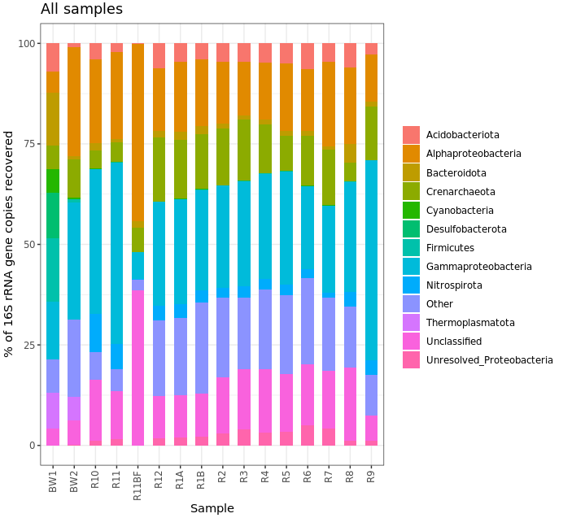





<div class="warning">
<h2><b>ATTENTION!!</b></h2>
<b>This page is now outdated and not being maintained, but being kept here for archive purposes. If you are new to amplicon analysis, I recommend working through <a href="/amplicon/dada2_workflow_ex">this page instead</a> 🙂</b>
</div>

<br>

---
<br>

This module represents a walkthrough of *one* possible workflow for an amplicon dataset (if you need a quick primer on some relevant terminology, visit the [amplicon main page](/amplicon/){:target="_blank"}). This will entail processing the raw sequences with [vsearch](https://github.com/torognes/vsearch){:target="_blank"} and [usearch](https://drive5.com/usearch/){:target="_blank"}, and analyzing the output and making some visualizations with [R](https://www.r-project.org/){:target="_blank"} using some great packages like [*vegan*](https://github.com/vegandevs/vegan){:target="_blank"} and [*phyloseq*](http://joey711.github.io/phyloseq/){:target="_blank"}.  

If you are new to working at the command line and/or the R environment, you could still walk through this, but I recommend running through the [*bash* basics](/bash/bash_intro_binder){:target="_blank"} and [R basics](/R/basics){:target="_blank"} tutorials first.
<br>
<br>

---
---
<br>

## Opening caveats
There are many ways to process amplicon data. Some of the most widely used tools/pipelines include [mothur](https://www.mothur.org/){:target="_blank"}, [usearch](https://drive5.com/usearch/){:target="_blank"}, [vsearch](https://github.com/torognes/vsearch){:target="_blank"}, [Minimum Entropy Decomposition](http://merenlab.org/2014/11/04/med/){:target="_blank"}, [DADA2](https://benjjneb.github.io/dada2/index.html){:target="_blank"}, and [qiime2](https://qiime2.org/){:target="_blank"} (which employs other tools within it). If you are looking solely at a broad level, you will likely get very similar results regardless of which tool you use so long as you make similar decisions when processing your sequences (decisions about things like minimum abundance filtering). But there is a movement in the community away from the traditional OTU approach and on to single-nucleotide resolving methods that generate what are called ASVs (amplicon sequence variants). And the reasoning for this is pretty sound, as recently laid out very nicely by [Callahan et al. here](https://www.nature.com/articles/ismej2017119){:target="_blank"}, but the intricacies of the differences may seem a little nebulous at first if you're not used to thinking about these things yet. If you are new to this, know that most of the experts on these things would recommend using a method that resolves ASVs. It may be the case that you'd like a broader level of resolution than that, but it is still best to first generate ASVs and then you can always "back out" your resolution with clustering at some threshold or binning sequences by taxonomy or whatever. This is to say that clustering OTUs isn't inherently a problem, it's how those OTUs are generated that could bring you into the fray. 

Here I put together this example workflow using [vsearch](https://github.com/torognes/vsearch){:target="_blank"} and [usearch](https://drive5.com/usearch/){:target="_blank"}, but to be clear, this is **not** because I think these tools are better than any others overall. It's been a while since I've worked with an amplicon dataset, but my last workflow involved [mothur](https://www.mothur.org/){:target="_blank"} for most processing and then [MED](http://merenlab.org/2014/11/04/med/){:target="_blank"} for generating ASVs. And if I were currently processing a new amplicon dataset, I would try out and most likely end up using [DADA2](https://benjjneb.github.io/dada2/index.html){:target="_blank"}, and I plan to write an example workflow using that soon, though the developers already have lots of useful information and a tutorial [here](https://benjjneb.github.io/dada2/tutorial.html){:target="_blank"}. (Update: The DADA2 example workflow is now up [here](/amplicon/dada2_workflow_ex){:target="_blank"}.)

That said, I've chosen to use usearch and vsearch here for practical reasons – they are quick and easy to get up and running. For a quick background on these, [usearch](https://drive5.com/usearch/){:target="_blank"} was developed by Robert Edgar ([original paper here](https://academic.oup.com/bioinformatics/article-lookup/doi/10.1093/bioinformatics/btq461){:target="_blank"}), but it is not open-source, and the free version has substantial limitations built in – so if you have a large dataset some of the operations cannot be performed without paying for the higher-end version. To make up for these limitations, as a labor of love (and maybe some other emotions), [Torbjørn Rognes et al.](https://peerj.com/articles/2584/){:target="_blank"} developed [vsearch](https://github.com/torognes/vsearch){:target="_blank"} to be able to fill the needs of the community that usearch could, while also being completely open-source and freely available. And they have done an incredible job with this. The only reason we're going to still use usearch for some commands is because there are some things that usearch does that vsearch doesn't (which I'll point out when we hit them). I *think* this only involves commands where the limitations of the freely available usearch shouldn't be a problem for any dataset, but I might be wrong. Also, it's pretty common to end up hybridizing multiple tools into a workflow to take advantage of what you like from each, so this serves as an example of that.

Keep in mind here that none of this is meant to be authoritative. This is simply one example of one workflow. When working with your own data you should of course never follow any pipeline blindly.  
<br>

---
<br>
# Tools used here
As explained above, we'll be using [vsearch](https://github.com/torognes/vsearch){:target="_blank"} and [usearch](https://drive5.com/usearch/){:target="_blank"} here. At the time this page is being put together I'm using vsearch v2.5.1 and usearch v10.0.240 on Mac OSX. You can follow the installation instructions for how to install these [here](/bash/installing_tools){:target="_blank"}.
 
If you wish to follow along with the analysis portion in [R](https://www.r-project.org/){:target="_blank"}, then you also of course need to have a working installation of R on your computer. If you'd like more info on this, check out the [R basics](/R/basics){:target="_blank"} section before moving forward. 
<br>
<br>

---
<br>

# The data
For a quick overview of the example data we'll be using and where it came from, we are going to work with a subset of the dataset [published here](https://www.frontiersin.org/articles/10.3389/fmicb.2015.01470/full){:target="_blank"}. We were exploring an underwater mountain ~3 km down at the bottom of the Pacific Ocean that serves as a low-temperature (~5-10°C) hydrothermal venting site. This amplicon dataset was generated from DNA extracted from crushed basalts collected from across the mountain with the goal being to begin characterizing the microbial communities of these deep-sea rocks. No one had ever been here before, so as is often the purpose of marker-gene sequencing, this was just a broad level community survey. The sequencing was done on the Illumina MiSeq platform with 2x300 paired-end sequencing using primers targeting the V4 region of the 16S rRNA gene. There are 20 samples total: 4 extraction blanks (nothing added to DNA extraction kit), 2 bottom water samples, 13 rocks, and one biofilm scraped off of a rock. None of these details are important for you to remember, it's just to give some overview if you care.  

In the following figure, overlain on the map are the rock sample collection locations, and the panes on the right show examples of the 3 distinct types of rocks collected: 1) basalts with highly altered, thick outer rinds (>1 cm); 2) basalts that were smooth, glassy, thin exteriors (~1-2 mm); and 3) one calcified carbonate.

<center></center>

<br>
You can download the required dataset and files by copying and pasting the following commands into your terminal. For speed purposes we're only going to work with about 10% of the full dataset. Altogether the uncompressed size of the working directory is < 300MB.

```
cd ~
curl -L -o amplicon_example_workflow.tar.gz https://ndownloader.figshare.com/files/21179823
tar -xzvf amplicon_example_workflow.tar.gz
rm amplicon_example_workflow.tar.gz
cd amplicon_example_workflow/
```

Now, let's get started!
<br>
<br>

---
<br>

# Processing

It's good to try to keep a bird's-eye view of what's going on. So here is an overview of the main processing steps we'll be performing with usearch. Don't worry if anything seems unclear right now, we will discuss each at each step.

||Command|What we're doing|
|:--:|:--------:|----------|
|1|`-fastq_mergepairs`|merge forward and reverse reads together|
|2|`-fastx_truncate`|cut off forward and reverse primers|
|3|`-fastq_filter`|quality filter sequences|
|4|`-fastx_uniques`|dereplicate sequences|
|5|`-cluster_otus`/`-unoise3`|cluster sequences into OTUs and/or generate ASVs|
|6|`-otutab`|generate a count table|
|7|`-sintax`|assign taxonomy to OTUs and/or ASVs|

## Merging forward and reverse reads

Depending on the sequencing facility, when paired-end sequencing was performed you may receive one forward and one reverse fastq file with all samples mixed together, or you may get things already demultiplexed (separate files for each individual sample). In this case our samples have already been demultiplexed and the barcodes have been trimmed off. This means for each of our 20 samples we have a forward (R1) and reverse (R2) reads file:

<center></center>

<br>
The format of the read file names is a letter or 2 specifying which sample it is, followed by a 'sub' (just because these are subsampled from the full file sizes), and then an R1 or R2. All of the .fq files are fastq files (sequences with quality score information), and the .fa files are simply sequences with no quality information. For some basic information about these formats visit the [Amplicon main page]({{ site.url }}/amplicon/).

So our first step is to merge these forward and reverse reads for each sample. This particular sequencing run was 2x300 paired-end over the V4 region, which is roughly ~300 base pairs (bps). So we have virtually full overlap for all of our sequences. The benefit of full-overlap as compared to sequencing a longer region with less overlap is improved base-calling accuracy. Here we are going to use usearch over vsearch in this case because usearch will trim any part of our forward or reverse reads that run past where they should (you can see a visualization of this [here](http://drive5.com/usearch/manual/merge_stagger.html){:target="_blank"} if interested). The command `-fastq_mergepairs` is what we will use to merge our reads, and we could do it for each individual sample like this, `usearch -fastq_mergepairs B1_sub_R1.fq -fastqout B1_sub_merged.fq`, but instead we're going to use a nice little *bash* special character that acts as a wildcard to make things easier. If you're unfamiliar with wildcards, shoot over to the [wildcards section](/bash/bash_intro_binder#wildcards) of the [intro to bash page](/bash/bash_intro_binder){:target="_blank"} when you have some time to learn about them. For now, you just need to know the `*` represents anything, any number of times (including 0 times), so as we use it here it will grab all of the files we need, one at a time, and run our command on all of them. As run here, the `-fastq_mergepairs` command will: 1) merge the paired reads for each sample into a single sequence; 2) rename the merged sequences so each sequence's header now specifies which sample it originated from; 3) combine the merged sequences from all samples into one file; 4) calculate new quality scores for each position of the merged sequences (as detailed [here](https://www.drive5.com/usearch/manual/merge_pair.html){:target="_blank"}). 

```
usearch -fastq_mergepairs *_R1.fq -fastqout all_samples_merged.fq -relabel @
```
So here the magic of the `*` wild card is grabbing all forward read files for every file that ends in _R1.fq. We didn't need to specify the reverse reads because usearch finds them automatically for us. We specify the output file with the `-fastqout` argument. And the last part, `-relabel @`, tells the program to rename the merged sequences based on which sample they originally came from (so it's ok they are all mixed together now in one file). Along with the command finishing we get some overall summary statistics printed to the terminal, such as how many total sequences we had and what proportion of the paired reads successfully merged. Checks like this are needed in order to have some idea of what's going on with your sequences as you move them along. Here almost 90% of them successfully merged, which is pretty good. (Reasons for failed merge attempts are due to default filtering criteria. You can look into the default settings and other options [here](http://drive5.com/usearch/manual/merge_options.html){:target="_blank"}. 

## Trimming primers and quality filtering

Due to the degeneracy of primers they tend to introduce non-biological variation. As such it's important to cut them off, particularly if you are going to perform any sort of single-nucleotide resolution clustering. Here we have our primers in a fasta file that looks like this:

<center></center>

<br>
First we want to make sure the primers are where they are supposed to be (that is at the front and end of our sequences). This is another instance where the functionality of commands in usearch make this rather easy to check, so we're going to take advantage of that. This can be done with the command `-search_oligodb`. It is rather time-consuming, however, so as long as our samples were all from the same sequencing run, we can randomly subset a portion of them to check, by first running the `-fastx_subsample` command:

```
usearch -fastx_subsample all_samples_merged.fq -sample_size 5000 -fastqout all_sub_for_primer_check.fq
usearch -search_oligodb all_sub_for_primer_check.fq -db primers.fa -strand both -userout primer_hits.txt -userfields query+qlo+qhi+qstrand
```

Here the first command is randomly subsampling 5,000 sequences from the total and creating a file we name "all_sub_for_primer_check.fq". And the second command is searching for the primers in that subset of sequences, and generating an output file called "primer_hits.txt" with the results. This file has 4 columns per line: the sequence ID; the start position of where a primer aligned; the final position of where a primer hit; and then a plus or minus for whether the primer was in the same orientation or if its reverse complement was the match. Looking through that file we consistently see that there is a hit to the first 19 bps of a sequence and the last 20. Here's just a shot of the `head` and `tail`:

<center></center>

<br>
This tells us things are as we expect them to be, and we can proceed to trim off the first 19 and the last 20 bps of each sequence to remove our primers.

We'll do this with the vsearch command `-fastq_filter`, and also quality filter based on [maximum expected error](https://www.drive5.com/usearch/manual/exp_errs.html){:target="_blank"}. Quality filtering is critical in reducing the abundance and impact of spurious sequences. There is an intrinsic error rate to all sequencing technologies (and polymerases) that will consistently be generating some portion of sequences that vary from their true biological origin, and this can substantially inflate metrics such as richness and diversity. Quality filtering is one of the steps in place to minimize that problem. We are also going to filter out sequences that seem unusually short or long for what we'd expect. There are no set rules for making these decisions about what's too short or too long, and it's possible you'd be throwing away something interesting. But I'd note again that for the most part broad-level community surveys like this aren't really designed for finding the rarities, and it's much more likely really short or long sequences are spurious rather than something legitimate. Here I just chose ~10% longer and shorter than we'd expect our sequences to be as the limits.

```
vsearch -fastq_filter all_samples_merged.fq --fastq_stripleft 19 --fastq_stripright 20 -fastq_maxee 1 --fastq_maxlen 280 --fastq_minlen 220 --fastaout QCd_merged.fa
```

> **NOTE:** If this command fails, you may need to run it with an additional option set. I haven't been able to recreate this or figure out what's going on (doesn't seem to be version-dependent or method-of-installation dependent), but thanks to some awesome people writing in and helping to troubleshoot ([@zombiephylotype](https://twitter.com/zombiephylotype){:target="_blank"} and [@jaspermcevoy](https://twitter.com/jaspermcevoy){:target="_blank"}), we know it should work if you add `--fastq_qmax 75` to the above command.

The output tells us only a couple thousand sequences were discarded due to poor quality and/or their length. And note that our output file from this is now a fasta file, as after quality filtering we no longer need to keep track of the quality scores for each sequence anymore. 

## Dereplication
The dereplication step collapses all identical sequences to one and simply keeps track of how many there were. This can save a ton of time in further processing steps. We're going to do this dereplication step with the `-derep_fulllength` command:

```
vsearch --derep_fulllength QCd_merged.fa -sizeout -relabel Uniq -output unique_seqs.fa
```

We can see from this output that of ~186,000 total sequences, ~93,000 of them were unique, the most abundant sequence is present in 1,287 copies, and the median is 1, telling us the majority of the unique sequences are present in only one copy (singletons). Having relatively so many singletons is common with amplicon data and is mostly likely a direct consequence of sequencing error. As such, it is also likely the majority of these are simply 1 or 2 bps diverged from a true biological sequence that is present in greater abundance. Sometimes this is done as a "pre-clustering" step, and is often referred to as "denoising". We will be doing it slightly differently here as it is part of the command we're going to use to generate our ASVs.

## Clustering OTUs and/or generating ASVs
OTUs refer to "operational taxonomic units" that are made by grouping sequences into clusters based on similarity. Then for each cluster, a sequence from that cluster is selected to be the representative sequence of that cluster (typically one from the "center" of that cluster in "sequence space", or the most abundant from the cluster). In usearch and vsearch, if you specify 97% OTUs for instance, the program by default attempts to build OTUs (clusters) such that none of the representative sequences for the OTUs are more similar than 97% to any other cluster's representative sequence.

ASVs on the otherhand refer to "amplicon sequence variants". These are generated by methods that enable single-nucleotide resolution, which as the name suggets means you can delineate sequences even if they vary by only one base pair. This most often means similarity levels greater than 99%, giving you distinct units that otherwise would be lost with any form of OTU clustering. (Note that ASV methods integrate approaches to deal with sequencing error, so "OTU clustering" at 100% ID is not the same thing.) ASVs are believed to represent true biological sequences (with sequencing error for the most part corrected and weeded out via abundance-based merging and filtering). There are several tools available that apply different approaches to do this such as [MED](http://merenlab.org/2014/11/04/med/), [DADA2](https://benjjneb.github.io/dada2/index.html){:target="_blank"}, and usearch's `-unoise3` command. 

For now we will just move forward with ASVs, but feel free to experiment. When I process a new tag dataset I usually generate ASVs and then OTUs from those ASVs to get a view of the data at multiple levels of resolution as there can be instances where greater resolution isn't helpful. As usual it depends on the dataset and on what you are trying to find. 

There doesn't seem to be a vsearch way to do this yet, so to generate our ASVs we're going to use the usearch command `-unoise3`. By default, this will filter out any sequences that are less abundant than 8. Typically some minimum abundance threshold is very important for filtering out spurious sequences. There is nothing special about the number 8 here, and actually I feel as though it makes more sense to let the value be determined by the total number of sequences in your dataset. [Bokulich et al.](http://www.nature.com/nmeth/journal/v10/n1/full/nmeth.2276.html){:target="_blank"} suggest using a 0.005% minimum abundance threshold, which in our case here actually comes out to be ~9, so we'll specify that. This command also removes sequences suspected to be chimeric (details of how it does this can be found [here](https://www.biorxiv.org/content/biorxiv/early/2016/09/09/074252.full.pdf){:target="_blank"}). If you were not using a command that integrated a chimera-checker, another option would be to run vsearch's `--uchime_denovo` command, but we won't be here as it's taken care of in this command.

```
usearch -unoise3 unique_seqs.fa -zotus ASVs.fa -minsize 9
```

From the output to the terminal we can see we have ~1500 ASVs, only a few were removed due to being suspected chimeras, and a few thousand were filtered out due to their low abundance. In theory, these are true biological sequences recovered from our 20 samples.

## Generating a count table
The count table is what tells us how many times each sequence appears in each sample. It is the end-product of all this processing that we can't wait to get into R. Now that we've identified what we believe to be true biological sequences, we're going to generate our count table now by going back to all of our merged sequences and mapping them to our ASVs. With usearch this is done with the `-otutab` command that by default requires a sequence to be at least 97% similar in order to map to an ASV, but will map only to the most similar one. We will be using vsearch's `-usearch_global` command to accomplish this. Incorporating another 97% threshold here may seem a bit confusing at first, but the thinking is that more often than not, the 'true' ASV sequences recovered were more than likely the source of the majority of sequences that are within 3% of them, as the source of this 3% variation is believed to be the result of sequencing and pcr errors. Additionally, it is still fundamentally different to have your ASV units built without similarity clustering, as opposed to 97% OTUs. That said, when I ran through this I decided to bump up the required % similarity to 99% when mapping our merged sequences to our ASVs to generate our count table. The downside to this is you will lose some data (as less sequences will map to an ASV), but if you have a decent amount of sequences per sample then you can afford to lose some for the sake of being a bit more conservative. 

First we are going to change the headers from Zotu to ASV with a quick `sed` command for consistency's sake, remove the older file, then run our mapping to generate our count table. 

```
sed -i.tmp 's/Zotu/ASV_/' ASVs.fa
rm ASVs.fa.tmp
vsearch -usearch_global QCd_merged.fa --db ASVs.fa --id 0.99 --otutabout ASV_counts.txt
```
Note that the input file is our previous merged and quality filtered sequences file after we trimmed off the primers. The output to the screen after it finishes shows us we mapped ~65% of our total sequences (as mentioned we could increase this by lowering the %ID required for the above mapping step). And the "ASV_counts.txt" file is our glorious count table. And if you take a peek at it with `less -S ASV_counts.txt` we can see it is organized with samples as column names, ASV sequence IDs as row names, and their counts per sample in the cells.

## Assigning taxonomy
The final step in our sequence processing is to assign taxonomy to our ASV sequences. There are multiple ways to do this as well. Something important to keep in mind is that taxonomy-assigning software is generally built to be fast. To do this, most rely on kmer frequencies to classify to a reference, rather than alignments. If you begin analyzing your data and some particular OTUs or ASVs emerge as being imporant to the overall story, it's a good idea to take those sequences and BLAST them to try to get more information about them. Further, phylogeny can be spotty with short sequences that span hypervariable regions, but even better than aligning would be to make a phylogenetic tree to help you try to pin down some taxonomy for where your sequences of interest likely came from.

Here we will use usearch's `sintax` program with the RDP training set reference fasta available from [here](https://www.drive5.com/usearch/manual/sintax_downloads.html){:target="_blank"}, but already in your working directory you downloaded at the start.

```
usearch -sintax ASVs.fa -db rdp_16s_v16_sp.fa -tabbedout ASV_tax_raw.txt -strand both -sintax_cutoff 0.5
```

The ouput taxonomy file, "ASV_tax.txt", contains 4 columns: the ASV ID; taxonomic lineage with confidence scores for each tier; the orientation of the match to the reference; and then an abridged taxonomic lineage including only tiers with confidence scores above the 0.5 cutoff we specified in the command. Information on how the confidence scores are calculated can be found [here](https://www.drive5.com/usearch/manual/tax_conf.html){:target="_blank"}.

And that's that. Now we're just going to run a few housekeeping commands to get things into a more R-friendly format and copy the relevant files into the R subdirectory:

```
sed -i.tmp 's/#OTU ID//' ASV_counts.txt
cp ASV_counts.txt R_working_dir/
bash convert_usearch_tax.sh
cp ASV_tax.txt R_working_dir/
```

And now we're ready to move onto analysis!
<br>
<br>

---
<br>

# Analysis in R
This portion assumes you already have some baseline experience with R, if you aren't familiar with R at all yet it's probably a good idea to run through the [R basics page](/R/basics){:target="_blank"}. But even if you don't have any experience with R yet, you'll still be able to follow along here and run everything if you'd like. A full R script of everything done here is available in the "R_working_dir" subdirectory called "amplicon_example_analysis.R" that can be opened in RStudio if you prefer to follow along with that rather than copying and pasting commands from here. Either way, this part isn't really about the R code (right now), it's just about the analysis.

## Setting up our working environment
To get started let's open up RStudio, set our current working directory to where we just left our new files, and install the packages we'll need (if you have trouble with any of these, there is more info to follow):

```R
setwd("~/amplicon_example_workflow/R_working_dir/")

install.packages("phyloseq")
install.packages("vegan")
install.packages("DESeq2")
install.packages("ggplot2")
install.packages("dendextend")
install.packages("tidyr")
install.packages("viridis")
install.packages("reshape")
```

Occasionaly you will run into a case where packages don't successfully install via the `install.packages()` function. When this happens, you can often get around that by installing from bioconductor or using devtools like demonstrated below. If any of those didn't succeed, you could try googling with these terms added as well. For example, searching for ["phyloseq bioconductor"](https://www.google.com/search?q=phyloseq+bioconductor&oq=phyloseq+bioconductor&aqs=chrome.0.0j69i60j0.3441j0j7&sourceid=chrome&ie=UTF-8) will bring you to its [bioconductor page](http://bioconductor.org/packages/release/bioc/html/phyloseq.html){:target="_blank"} which has instructions showing how to install like shown here for *phyloseq* and *DESeq2* if they failed by the above method.

```R
source("https://bioconductor.org/biocLite.R")
BiocManager::install("phyloseq")
BiocManager::install("DESeq2")

	# and here is an example using devtools:
install.packages("devtools")
devtools::install_github("vegandevs/vegan")
devtools::install_github("tidyverse/ggplot2")
```

After all have installed successfully, load them up:

```R
library("phyloseq")
library("vegan")
library("DESeq2")
library("ggplot2")
library("dendextend")
library("tidyr")
library("viridis")
library("reshape")
```

If you have a problem loading any of these libraries, close and then restart R and try loading the library again. If still no luck, try installing the package again and loading the library. 9 times out of 10, restarting R will solve the problem. Here are the versions used last time this page was updated:

```R
packageVersion("phyloseq") # 1.26.1
packageVersion("vegan") # 2.5.4
packageVersion("DESeq2") # 1.22.2
packageVersion("ggplot2") # 3.1.0
packageVersion("dendextend") # 1.9.0
packageVersion("tidyr") # 0.8.3
packageVersion("viridis") # 0.5.1
packageVersion("reshape") # 0.8.8
```

 
## Reading in our data
Now we're going to read in our counts table, our taxonomy table, and a table with information about each sample including temperature of venting fluids at the site of collection ("temp"), the "type" of sample it is, and a qualitative characteristic ("char") of the rocks.

```R
count_tab <- read.table("ASV_counts.txt", header=T, row.names=1, check.names=F)

tax_tab <- as.matrix(read.table("ASV_tax.txt", header=T, row.names=1, check.names=F, na.strings="", sep="\t"))

sample_info_tab <- read.table("sample_info.txt", header=T, row.names=1, check.names=F)
sample_info_tab
```

Taking a look at the sample_info_tab, we can see it simply has all 20 samples as rows, and three columns: temperature; type indicating if that row is a blank, water sample, rock, or biofilm; and then a characteristics column called "char" that just serves to distinguish between the main types of rocks (glassy, altered, or carbonate).

## Treatment of "blanks" 

---

>**NOTE:** This is how I did things before [@bejcal](https://twitter.com/bejcal){:target="_blank"} et al. put together [decontam](https://benjjneb.github.io/decontam/){:target="_blank"}, which is a much better way to do this. I'm leaving this here for any interested, but have added an example using decontam to the [DADA2 workflow example page here](/amplicon/dada2_workflow_ex#removing-likely-contaminants){:target="_blank"}. So I absurdly recommend using that rather than employing the more *ad hoc* approach I put together for [this paper](https://doi.org/10.3389/fmicb.2015.01470){:target="_blank"} many years ago now.

---

First we want to deal with our "blanks" (those samples labeled B1-B4). In this case these refer to extraction blanks – meaning when doing the DNA extractions, we ran some extractions alongside the normal ones where we didn't add anything to the kit's starting lysis tubes. These are processed the same as the real samples and sent for sequencing as well. You may or may not have these with your data, if you didn't do it this time, be sure to next time you do an amplicon sequencing run :) 

Sequences that show up in the blanks can be the result of over-amplification of contaminant DNA introduced from things like the DNA extraction or sequencing kit reagents, **or** they can be cross-contamination from real samples into the blanks. As such, strictly throwing away any ASV that shows up at all in the blanks (i.e. disregarding that ASV in all samples) is not wise. Imagine an ASV that contains 90,000 out of 100,000 sequences in a true sample, and has 6 sequences out of 20,000 in a blank. In such a case it is almost certain those sequences came to be in the blank due to cross-contamination from the real sample. I've seen similar cases to this in every dataset I've looked at. 

As with most things, there is no one way or best way to do this. What I do (and did in the [paper](https://www.frontiersin.org/articles/10.3389/fmicb.2015.01470/full){:target="_blank"} these data come from) is compare normalized totals of the ASVs (or OTUs) in the blanks and in the true samples, and use an arbitrary threshold to decide if it is more likely to be contamination from reagents or more likely to have ended up in the blanks due to cross-contamination from a real sample. The arbitrary threshold I apply is that if the sample-normalized count is more than an order of magnitude greater than the blank-normalized count for a given ASV/OTU, then it is kept – if it is not, then it is thrown out and presumed to have been contamination. Here's what this looks like in this case:

```R
  # first we need to get a sum for each ASV across all 4 blanks and all 16 samples
blank_ASV_counts <- rowSums(count_tab[,1:4])
sample_ASV_counts <- rowSums(count_tab[,5:20])

  # now we normalize them, here by dividing the samples' total by 4 – as there are 4x as many samples (16) as there are blanks (4)
norm_sample_ASV_counts <- sample_ASV_counts/4

  # here we're getting which ASVs are deemed likely contaminants based on the threshold noted above:
blank_ASVs <- names(blank_ASV_counts[blank_ASV_counts * 10 > norm_sample_ASV_counts])
length(blank_ASVs) # this approach identified about 50 out of ~1550 that are likely to have orginated from contamination

  # looking at the percentage of reads retained for each sample after removing these presumed contaminant ASVs shows that the blanks lost almost all of their sequences, while the samples, other than one of the bottom water samples, lost less than 1% of their sequences, as would be hoped
colSums(count_tab[!rownames(count_tab) %in% blank_ASVs, ]) / colSums(count_tab) * 100
 
  # now that we've used our extraction blanks to identify ASVs that were likely due to contamination, we're going to trim down our count table by removing those sequences and the blank samples from further analysis
filt_count_tab <- count_tab[!rownames(count_tab) %in% blank_ASVs, -c(1:4)]
  # and here make a filtered sample info table that doesn't contain the blanks
filt_sample_info_tab<-sample_info_tab[-c(1:4), ]

  # and let's add some colors to the sample info table that are specific to sample types and characteristics that we will use when plotting things
    # we'll color the water samples blue: 
filt_sample_info_tab$color[filt_sample_info_tab$char == "water"] <- "blue"
    # the biofilm sample a darkgreen:
filt_sample_info_tab$color[filt_sample_info_tab$char == "biofilm"] <- "darkgreen"
    # the basalts with highly altered, thick outer rinds (>1 cm) brown ("chocolate4" is the best brown I can find...):
filt_sample_info_tab$color[filt_sample_info_tab$char == "altered"] <- "chocolate4"
    # the basalts with smooth, glassy, thin exteriors black:
filt_sample_info_tab$color[filt_sample_info_tab$char == "glassy"] <- "black"
    # and the calcified carbonate sample an ugly yellow:
filt_sample_info_tab$color[filt_sample_info_tab$char == "carbonate"] <- "darkkhaki"

  # and now looking at our filtered sample info table we can see it has an addition column for color
filt_sample_info_tab
```

Now with our blank-removed count table in hand, we're ready to move onto some analyses. 

## Beta diversity
Beta diversity involves calculating metrics such as distances or dissimilarities based on pairwise comparisons of samples. Typically the first thing I do when I get a new dataset into R (whether it's tag data, gene expression data, methylation levels, or pretty much anything) is generate some exploratory visualizations like ordinations and hierarchical clusterings. These give you a quick overview of how your samples relate to each other and can be a way to check for problems like batch effects. 

We're going to use Euclidean distances to generate some exploratory visualizations of our samples. Since differences in sampling depths between samples can influence distance/dissimilarity metrics, we first need to somehow normalize across our samples. 

<h4><center>Normalizing for sampling depth</center></h4>
Common ways to do this involve either subsampling each sample down the the lowest sample's depth, or turning counts into proportions of the total for each sample. However, both of these approaches are generally shunned by people I trust when it comes to such topics (i.e., statisticians). For example, in their 2014 PLOS Computational Biology paper, ["Waste not, want not: why rarefying microbiome data is inadmissible"](http://journals.plos.org/ploscompbiol/article?id=10.1371/journal.pcbi.1003531){:target="_blank"}, McMurdie and Holmes argue that a better method of normalizing across samples is to use a variance stabilizing transformation – which fortunately we can do with the [*DESeq2*](https://bioconductor.org/packages/release/bioc/html/DESeq2.html){:target="_blank"} package.

```R
  # first we need to make a DESeq2 object
deseq_counts <- DESeqDataSetFromMatrix(filt_count_tab, colData = filt_sample_info_tab, design = ~type) # we have to include the colData and design arguments because they are required, as they are needed for further downstream processing by DESeq2, but for our purposes of simply transforming the data right now, they don't matter
deseq_counts_vst <- varianceStabilizingTransformation(deseq_counts)

  # pulling out our transformed table 
vst_trans_count_tab <- assay(deseq_counts_vst)

  # and calculating our Euclidean distance matrix
euc_dist <- dist(t(vst_trans_count_tab))
```

<h4><center>Hierarchical clustering</center></h4>
Now that we have our Euclidean distance matrix, let's make and plot a hierarchical clustering of our samples.

```R
euc_clust <- hclust(euc_dist, method="ward.D2")

# plot(euc_clust) # hclust objects like this can be plotted as is, but i like to change them to dendrograms for two reasons:
  # 1) it's easier to color the dendrogram plot by groups
  # 2) if you want you can rotate clusters with the rotate() function of the dendextend package

euc_dend <- as.dendrogram(euc_clust, hang=0.1)
dend_cols <- filt_sample_info_tab$color[order.dendrogram(euc_dend)]
labels_colors(euc_dend) <- dend_cols

plot(euc_dend, ylab="VST Euc. dist.")
```

<center></center>

<br>
So from our first peek, the broadest clusters separate the biofilm and water samples from the rocks. The next tier splits the rocks into two groups, with samples R8–R11 separate from the others (R1-R6, and R12). As we can see from the coloring we added, R8-R11 were all of the glassier type of basalt with thin (~1-2 mm), smooth exteriors, while the rest (R1-R6, and R12) had more highly altered, thick (>1 cm) outer rinds (excluding the oddball carbonate which isn't a basalt, R7). This is starting to suggest that level of alteration of the basalt may be correlated with community structure. If we look at the map figure again, we can also see that level of alteration also co-varies with whether samples were collected from the northern or southern end of the outcrop as all of the more highly altered basalts were collected from the northern end.

<center></center>

<br>

<h4><center>Ordination</center></h4>
Generally speaking, ordinations provide visualizations of sample-relatedness based on dimension reduction – this is where the 'multidimensional scaling' term (MDS) fits in. The 'dimensions' could be, for instance, whatever you measured in each sample, in our case counts of ASVs. Principle coordinates analysis (PCoA) is a type of multidimensional scaling that operates on dissimilarities or distances. Here we're going to generate and plot our PCoA with *phyloseq*, because it is very convenient for doing such things. But because we're still doing beta diversity here, we want to use our transformed table. So we're going to make a *phyloseq* object with our *DESeq2*-transformed table and generate the PCoA from that.

```R
  # making our phyloseq object with transformed table
vst_count_phy <- otu_table(vst_trans_count_tab, taxa_are_rows=T)
sample_info_tab_phy <- sample_data(filt_sample_info_tab)
vst_physeq <- phyloseq(vst_count_phy, sample_info_tab_phy)

  # generating and visualizing the PCoA with phyloseq
vst_pcoa <- ordinate(vst_physeq, method="MDS", distance="euclidean")
eigen_vals <- vst_pcoa$values$Eigenvalues # allows us to scale the axes according to their magnitude of separating apart the samples


plot_ordination(vst_physeq, vst_pcoa, color="char") + 
  labs(col="type") + geom_point(size=1) + 
  geom_text(aes(label=rownames(filt_sample_info_tab), hjust=0.3, vjust=-0.4)) + 
  coord_fixed(sqrt(eigen_vals[2]/eigen_vals[1])) + ggtitle("PCoA") + 
  scale_color_manual(values=unique(filt_sample_info_tab$color[order(filt_sample_info_tab$char)])) + 
  theme(legend.position="none")
```

<center></center>

<br>
This is just providing us with a different overview of how our samples relate to each other. Inferences that are consistent with the hierarchical clustering above can be considered a bit more robust if the same general trends emerge from both approaches. It's important to remember that these are **exploratory visualizations** and do not say anything statistically about our samples. But our initial exploration here shows us the rock microbial communities seem to be more similar to each other than they are to the water samples (which is what I wanted to see, so this was a good start to me), and focusing on just the basalts (brown and black labels), these visualizations both suggest their communities may correlate with level of exterior alteration.

## Alpha diversity
Alpha diversity entails using summary metrics that describe individual samples, and it is a very tricky thing when working with amplicon data. There are a lot of tools from macro-ecology that have been co-opted into the microbial ecology world unchecked that unfortunately just simply do not work the same. If and when I use any alpha diversity metrics, I mostly consider them useful for relative comparisons of samples from the same experiment. And I am absolutely going to ask some experts on the subject – ahem, [@AmyDWillis](https://twitter.com/AmyDWillis){:target="_blank"} :) – to take a look at this part to be certain I'm not leading anyone astray here. But here are a few things I've done before (unless I'm later informed any of this is wrong, then these were always intended to be examples of what *not* to do).

<h4><center>Rarefaction curves</center></h4>
It is **not** okay to use rarefaction curves to estimate total richness of a sample, or to extrapolate anything from them really, but they can still be useful depending on the data. Let's generate the plot and then we'll see why with this example. We'll be using the `rarecurve()` function from the package [*vegan*](https://github.com/vegandevs/vegan){:target="_blank"} here. Note that *vegan* expects rows to be samples and observations (our ASVs here) to be columns, which is why we transpose the first table in the command with `t()`.

```R
rarecurve(t(filt_count_tab), step=100, col=filt_sample_info_tab$color, lwd=2, ylab="ASVs")
abline(v=(min(rowSums(t(filt_count_tab)))))
```

<center></center>
<br>

In this plot, samples are colored the same way as above, and the black vertical line represents the sampling depth of the sample with the least amount of sequences (a bottom water sample, BW1, in this case). This view suggests that the rock samples (all of them) are more diverse and have a greater richness than the water samples or the biofilm sample – based on where they all cross the vertical line of lowest sampling depth, which is not necessarily predictive of where they'd end up had they been sampled to greater depth 😢 . And again, just focusing on the brown and black lines for the two types of basalts we have, they seem to show similar trends within their respective groups that suggest the more highly altered basalts (brown lines) may host more diverse microbial communities than the glassier basalts (black lines). 

<h4><center>Richness and diversity estimates</center></h4>
Here we're going to plot Chao1 richness esimates and Shannon diversity values. Chao1 is a richness estimator, "richness" being the total number of distinct units in your sample, "distinct units" being whatever you happen to be measuring (ASVs in our case here). And Shannon's diversity index is a metric of diversity. The term diversity includes "richness" (the total number of your distinct units) and "evenness" (the relative proportions of all of your distinct units).

We are going to go back to using the *phyloseq* package for this to use the function `plot_richness()` – which the developers kindly provide some examples of [here](https://joey711.github.io/phyloseq/plot_richness-examples.html){:target="_blank"}. 

```R
  # first we need to create a phyloseq object using our un-transformed count table
count_tab_phy <- otu_table(filt_count_tab, taxa_are_rows=T)
tax_tab_phy <- tax_table(tax_tab)

ASV_physeq <- phyloseq(count_tab_phy, tax_tab_phy, sample_info_tab_phy)

  # and now we can call the plot_richness() function on our phyloseq object
plot_richness(ASV_physeq, color="char", measures=c("Chao1", "Shannon")) + 
  scale_color_manual(values=unique(filt_sample_info_tab$color[order(filt_sample_info_tab$char)])) +
  theme(legend.title = element_blank())
```

<center></center>

Before saying anything about this I'd like to stress again that these are *not* interpretable as "real" numbers of anything (due to the nature of amplicon data), but they can still be useful as relative metrics of comparison. For example, we again see from this that the more highly altered basalts seem to host communities that are more diverse and have a higher richness than the other rocks, and that the water and biofilm samples are less diverse than the rocks. 

And just for another quick example of why *phyloseq* is pretty awesome, let's look at how easy it is to plot by grouping sample types while still coloring by the characteristics column:

```R
plot_richness(ASV_physeq, x="type", color="char", measures=c("Chao1", "Shannon")) + 
  scale_color_manual(values=unique(filt_sample_info_tab$color[order(filt_sample_info_tab$char)])) +
  theme(legend.title = element_blank())
```

<center></center>
<br>

One last note on interpretation here, don't forget Chao1 is richness and Shannon is diversity, and what these mean as discussed above. Take for example the biofilm sample (green) above. It seems to have a higher calculated richness than the two water samples, but a lower Shannon diversity than both water samples. This suggests that the water samples likely have a greater evenness; or to put it another way, even though the biofilm may have more biological units (our ASVs here), it may be largely dominated by only a few of them. 

## Taxonomic summaries
Don't forget that the taxonomy called here was done rapidly and by default has to sacrifice some specificity for speed. For the sequences that become important in your story, you should absolutely pull them out and BLAST them, and possibly make phylogenetic trees to get a more robust idea of who they are most closely related to. 

Here we'll make some broad-level summarization figures. *Phyloseq* is also very useful for parsing things down by taxonomy now that we've got all that information in there already. So I'll be using that where I'm familiar with it, but unfortunately I'm not that familiar with probably about 90% of its functionality. So here you'll see my ugly way of doing things, and then I'm counting on you to shoot me cleaner code so we can update this walkthrough for everyone's benefit 🙂

Let's make a summary of all major taxa proportions across all samples, then summaries for just the water samples and just the rock samples. To start, we need to parse our count matrix by taxonomy.

```R
  # how you want to break things down will depend on your data and your questions, as usual
  # for now let's just generate a table of proportions of each phylum, and breakdown the Proteobacteria to classes

phyla_counts_tab <- otu_table(tax_glom(ASV_physeq, taxrank="Phylum")) # using phyloseq to make a count table that has summed all ASVs that were in the same phylum
phyla_tax_vec <- as.vector(tax_table(tax_glom(ASV_physeq, taxrank="Phylum"))[,2]) # making a vector of phyla names to set as row names

rownames(phyla_counts_tab) <- as.vector(phyla_tax_vec)

  # we also have to account for sequences that weren't assigned any taxonomy even at the phylum level 
  # these came into R as 'NAs' in the taxonomy table, but their counts are still in the count table
  # so we can get that value for each sample by substracting the column sums of this new table (that has everything that had a phylum assigned to it) from the column sums of the starting count table (that has all representative sequences)
unclassified_tax_counts <- colSums(filt_count_tab) - colSums(phyla_counts_tab)
  # and we'll add this row to our phylum count table:
phyla_and_unidentified_counts_tab <- rbind(phyla_counts_tab, "Unclassified"=unclassified_tax_counts)

  # now we'll remove the Proteobacteria, so we can next add them back in broken down by class
temp_major_taxa_counts_tab <- phyla_and_unidentified_counts_tab[!row.names(phyla_and_unidentified_counts_tab) %in% "Proteobacteria", ]

class_counts_tab <- otu_table(tax_glom(ASV_physeq, taxrank="Class")) # making count table broken down by class (contains classes beyond the Proteobacteria too at this point)

class_tax_phy_tab <- tax_table(tax_glom(ASV_physeq, taxrank="Class")) # making a table that holds the phylum and class level info
phy_tmp_vec <- class_tax_phy_tab[,2]
class_tmp_vec <- class_tax_phy_tab[,3]
rows_tmp <- row.names(class_tax_phy_tab)
class_tax_tab <- data.frame("Phylum"=phy_tmp_vec, "Class"=class_tmp_vec, row.names = rows_tmp)
proteo_classes_vec <- as.vector(class_tax_tab[class_tax_tab$Phylum == "Proteobacteria", "Class"]) # making a vector of just the Proteobacteria classes
proteo_classes_vec <- proteo_classes_vec[proteo_classes_vec != "NA"] # removing the NA (these are Proteobacteria not assigned anything at the class level), we'll add the counts back in for these in a second. leaving them here is not an option as there are multiple ones in our Class column (because they can come from any Phylum)


rownames(class_counts_tab) <- as.vector(class_tax_tab$Class) # changing the row names like above so that they correspond to the taxonomy, rather than an ASV identifier
proteo_class_counts_tab <- class_counts_tab[row.names(class_counts_tab) %in% proteo_classes_vec, ] # making a table of the counts of the Proteobacterial classes

  # there are also likely some some sequences that were resolved to the level of Proteobacteria, but not any further, and therefore would be missing from our class table
  # we can find the sum of them by subtracting the proteo class count table from just the Proteobacteria row from the original phylum-level count table
proteo_no_class_annotated_counts <- phyla_and_unidentified_counts_tab[row.names(phyla_and_unidentified_counts_tab) %in% "Proteobacteria", ] - colSums(proteo_class_counts_tab)

  # now combining the tables:
major_taxa_counts_tab <- rbind(temp_major_taxa_counts_tab, proteo_class_counts_tab, "Unresolved_Proteobacteria"=proteo_no_class_annotated_counts)
  # and to check we didn't miss any other sequences, we can compare the column sums to see if they are the same:
identical(colSums(major_taxa_counts_tab), colSums(filt_count_tab)) # if "TRUE", we know nothing fell through the cracks

  # now we'll generate a proportions table for summarizing:
major_taxa_proportions_tab <- apply(major_taxa_counts_tab, 2, function(x) x/sum(x)*100)

  # if we check the dimensions of this table at this point
dim(major_taxa_proportions_tab)
  # we see there are currently 25 rows, which might be a little busy for a summary figure
  # many of these taxa make up a very small percentage, so we're going to filter some out
  # this is a completely arbitrary decision solely to ease visualization and intepretation, entirely up to your data and you
  # here, we'll only keep rows (taxa) that make up greater than 5% in any individual sample
temp_filt_major_taxa_proportions_tab <- data.frame(major_taxa_proportions_tab[apply(major_taxa_proportions_tab, 1, max) > 5, ])
  # checking how many we have that were above this threshold
dim(temp_filt_major_taxa_proportions_tab) # now we have 13, much more manageable for an overview figure

  # though each of the filtered taxa made up less than 5% alone, together they can be more
  # so we're going to add a row called "Other" that keeps track of how much we filtered out (which will also keep our totals at 100%)
filtered_proportions <- colSums(major_taxa_proportions_tab) - colSums(temp_filt_major_taxa_proportions_tab)
filt_major_taxa_proportions_tab <- rbind(temp_filt_major_taxa_proportions_tab, "Other"=filtered_proportions)
```

Now that we have a nice proportions table ready to go, we can make some figures with it. While not always all that informative, expecially at the level of resolution we're using here (phyla and proteo classes only), we'll make some stacked bar charts, boxplots, and some pie charts. We'll use ggplot2 to do this, and for these types of plots it seems to be easiest to work with tables in [narrow format](https://en.wikipedia.org/wiki/Wide_and_narrow_data#Narrow){:target="_blank"}. We'll see what that means, how to transform the table, and then add some information for the samples to help with plotting. 

```R
  # first let's make a copy of our table that's safe for manipulating
filt_major_taxa_proportions_tab_for_plot <- filt_major_taxa_proportions_tab
  # and add a column of the taxa names so that it is within the table, rather than just as row names (this makes working with ggplot easier)
filt_major_taxa_proportions_tab_for_plot$Major_Taxa <- row.names(filt_major_taxa_proportions_tab_for_plot)

  # now we'll transform the table into narrow, or long, format (also makes plotting easier)
filt_major_taxa_proportions_tab_for_plot.g <- gather(filt_major_taxa_proportions_tab_for_plot, Sample, Proportion, -Major_Taxa)
  
  # take a look at the new table and compare it with the old one
head(filt_major_taxa_proportions_tab_for_plot.g)
head(filt_major_taxa_proportions_tab_for_plot)
    # manipulating tables like this is something you may need to do frequently in R
    
  # now we want a table with "color" and "characteristics" of each sample to merge into our plotting table so we can use that more easily in our plotting function
  # here we're making a new table by pulling what we want from the sample information table
sample_info_for_merge<-data.frame("Sample"=row.names(filt_sample_info_tab), "char"=filt_sample_info_tab$char, "color"=filt_sample_info_tab$color, stringsAsFactors=F)
  # and here we are merging this table with the plotting table we just made (this is an awesome function!)
filt_major_taxa_proportions_tab_for_plot.g2 <- merge(filt_major_taxa_proportions_tab_for_plot.g, sample_info_for_merge)
  
  # and now we're ready to make some summary figures with our wonderfully constructed table
  ## a good color scheme can be hard to find, i included the viridis package here because sometimes it's been really helpful for me, though this is not demonstrated in all of the following :/ 
  
  # one common way to look at this is with stacked bar charts for each taxon per sample:
ggplot(filt_major_taxa_proportions_tab_for_plot.g2, aes(x=Sample, y=Proportion, fill=Major_Taxa)) +
  geom_bar(width=0.6, stat="identity") +
  scale_fill_viridis(discrete=TRUE) +
  theme_bw() +
  theme(axis.text.x=element_text(angle=90, vjust=0.4, hjust=1), legend.title=element_blank()) +
  labs(x="Sample", y="% of 16S rRNA gene copies recovered", title="All samples")
```

<center></center>
<br>

Ok, that's not helpful really at all in this case, but I kept it here for the code example. (Also, note that the biofilm sample has a large proportion of Alphaproteobacteria – possibly supporting what we saw above about it having the lowest Shannon diversity estimate, IF the majority of these are represented by the same ASV.) Another way to look would be using boxplots where each box is a major taxon, with each point being colored based on its sample type.

```
ggplot(filt_major_taxa_proportions_tab_for_plot.g2, aes(Major_Taxa, Proportion)) +
  geom_jitter(aes(color=factor(char)), size=2, width=0.15, height=0) +
  scale_color_manual(values=unique(filt_major_taxa_proportions_tab_for_plot.g2$color[order(filt_major_taxa_proportions_tab_for_plot.g2$char)])) +
  geom_boxplot(fill=NA, outlier.color=NA) +
  theme(axis.text.x=element_text(angle=90, vjust=0.4, hjust=1), legend.title=element_blank()) +
  labs(x="Major Taxa", y="% of 16S rRNA gene copies recovered", title="All samples")
```

<center></center>
<br>
  

Meh, let's keep in mind that this was a very coarse level of resolution as we are using taxonomic classifications at the phylum and class ranks. This is why things may look more similar between the rocks and water samples than you might expect, and why when looking at the ASV level – like we did with the exploratory visualizations above – we can see more clearly that these do in fact host distinct communities. But let's look at this for a second anyway. The biofilm sample (green) again clearly stands out as it is almost completely dominated by sequences derived from Alphaproteobacteria. Three of the four "glassy" basalts (black dots) seem to have the greatest proportion of Gammaproteobacteria-derived sequences. And Cyanos and Euryarchaeota for the most part only seem to show up in water samples.
Another way to look at this would be to plot the water and rock samples separately, which might help tighten up some taxa boxplots if they have a different distribution between the two sample types. 

```R
  # let's set some helpful variables first:
bw_sample_IDs <- row.names(sample_info_tab)[sample_info_tab$type == "water"]
rock_sample_IDs <- row.names(sample_info_tab)[sample_info_tab$type == "rock"]

  # first we need to subset our plotting table to include just the rock samples to plot
filt_major_taxa_proportions_rocks_only_tab_for_plot.g <- filt_major_taxa_proportions_tab_for_plot.g2[filt_major_taxa_proportions_tab_for_plot.g2$Sample %in% rock_sample_IDs, ]
  # and then just the water samples
filt_major_taxa_proportions_water_samples_only_tab_for_plot.g <- filt_major_taxa_proportions_tab_for_plot.g2[filt_major_taxa_proportions_tab_for_plot.g2$Sample %in% bw_sample_IDs, ]

  # and now we can use the same code as above just with whatever minor alterations we want
  # rock samples
ggplot(filt_major_taxa_proportions_rocks_only_tab_for_plot.g, aes(Major_Taxa, Proportion)) +
  scale_y_continuous(limits=c(0,50)) + # adding a setting for the y axis range so the rock and water plots are on the same scale
  geom_jitter(aes(color=factor(char)), size=2, width=0.15, height=0) +
  scale_color_manual(values=unique(filt_major_taxa_proportions_rocks_only_tab_for_plot.g$color[order(filt_major_taxa_proportions_rocks_only_tab_for_plot.g$char)])) +
  geom_boxplot(fill=NA, outlier.color=NA) +
  theme(axis.text.x=element_text(angle=90, vjust=0.4, hjust=1), legend.position="top", legend.title=element_blank()) + # moved legend to top 
  labs(x="Major Taxa", y="% of 16S rRNA gene copies recovered", title="Rock samples only")

  # water samples
ggplot(filt_major_taxa_proportions_water_samples_only_tab_for_plot.g, aes(Major_Taxa, Proportion)) +
  scale_y_continuous(limits=c(0,50)) + # adding a setting for the y axis range so the rock and water plots are on the same scale
  geom_jitter(aes(color=factor(char)), size=2, width=0.15, height=0) +
  scale_color_manual(values=unique(filt_major_taxa_proportions_water_samples_only_tab_for_plot.g$color[order(filt_major_taxa_proportions_water_samples_only_tab_for_plot.g$char)])) +
  geom_boxplot(fill=NA, outlier.color=NA) +
  theme(axis.text.x=element_text(angle=90, vjust=0.4, hjust=1), legend.position="top", legend.title=element_blank()) + # moved legend to top 
  labs(x="Major Taxa", y="% of 16S rRNA gene copies recovered", title="Bottom water samples only")
```

<center></center>
<br>
<center></center>
<br>


This shows us more clearly for instance that one of the two water samples had ~30% of its recovered 16S sequences come from Firmicutes, while none of the 13 rock samples had more than 5%. It's good of course to break down your data and look at it in all the different ways you can, this was just to demonstrate one example. 

I'd like to note that the rocks-only plot is similar to [Figure 4 in the original paper](https://www.frontiersin.org/files/Articles/170496/fmicb-06-01470-HTML/image_m/fmicb-06-01470-g004.jpg), made also with rocks only. (Ugh, look at that horrible y-axis label... pffft.) This is a good demonstration of what I noted at the start: that if you make similar decisions in your processing of tag data, you are going to end up with similar results overall regardless of which tools you use (of all the widely utilized ones I mean of course). The processing for that paper was done entirely within *mothur* using 97% OTU clustering, and this run was done with vclust and uclust using a single-nucleotide resolution approach. I haven't linked to other things because so far this is the first rock-only figure we made here, but the same held true for the beta diversity visualizations too. 

Last taxonomic summary we'll through in will just be some pie charts. This is mostly because I think it's worth showing an example of using the `cast()` function to return your tables into "wide" format.

```R
  # notice we're leaving off the "char" and "color" columns, in the code, and be sure to peak at the tables after making them
rock_sample_major_taxa_proportion_tab <- cast(filt_major_taxa_proportions_rocks_only_tab_for_plot.g[, c(1:3)], Major_Taxa ~ Sample)
water_sample_major_taxa_proportion_tab <- cast(filt_major_taxa_proportions_water_samples_only_tab_for_plot.g[, c(1:3)], Major_Taxa ~ Sample)
  # summing each taxa across all samples for both groups 
rock_sample_summed_major_taxa_proportions_vec <- rowSums(rock_sample_major_taxa_proportion_tab)
water_sample_summed_major_taxa_proportions_vec <- rowSums(water_sample_major_taxa_proportion_tab)

rock_sample_major_taxa_summary_tab <- data.frame("Major_Taxa"=names(rock_sample_summed_major_taxa_proportions_vec), "Proportion"=rock_sample_summed_major_taxa_proportions_vec, row.names=NULL)
water_sample_major_taxa_summary_tab <- data.frame("Major_Taxa"=names(water_sample_summed_major_taxa_proportions_vec), "Proportion"=water_sample_summed_major_taxa_proportions_vec, row.names=NULL)

  # plotting just rocks
ggplot(data.frame(rock_sample_major_taxa_summary_tab), aes(x="Rock samples", y=Proportion, fill=Major_Taxa)) + 
  geom_bar(width=1, stat="identity") +
  coord_polar("y") +
  scale_fill_viridis(discrete=TRUE) +
  ggtitle("Rock samples only") +
  theme_void() +
  theme(plot.title = element_text(hjust=0.5), legend.title=element_blank())

  # and plotting just water samples
ggplot(data.frame(water_sample_major_taxa_summary_tab), aes(x="Bottom water samples", y=Proportion, fill=Major_Taxa)) + 
  geom_bar(width=1, stat="identity") +
  coord_polar("y") +
  scale_fill_viridis(discrete=TRUE) +
  scale_color_manual(palette="Spectral") +
  ggtitle("Water samples only") +
  theme_void() +
  theme(plot.title = element_text(hjust=0.5), legend.title=element_blank())
```

<center></center>
<br>
<center></center>
<br>

## Betadisper and permutational ANOVA

As we saw earlier, we have some information about our samples in our sample info table. There are many ways to incorporate this information, but one of the first I typically go to is a permutational ANOVA test to see if any of the available information is indicative of community structure. Here we are going to test if there is a statistically signficant difference between our sample types. One way to do this is with the `betadisper` and `adonis` functions from the *vegan* package. `adonis` can tell us if there is a statistical difference between groups, but it has an assumption that must be met that we first need to check with `betadisper`, and that is that there is a sufficient level of homogeneity of dispersion within groups. If there is not, then `adonis` can be unreliable.

```R
anova(betadisper(euc_dist, filt_sample_info_tab$type)) # 0.006
  # looking by sample type, we get a significant result, this tells us that there is a difference between group dispersions
  # this means that we can't trust the results of an adonis (permutational anova) test on this, because the assumption of homogenous within-group disperions is not met
  # this isn't all that surprising considering how different the water and biofilm samples are from the rocks 
  # what's more interesting is "Do the rocks differ based on their level of exterior alteration?"
  # so let's try this just looking at just the basalt rocks, based on their characteristics of glassy and altered

  # first we'll need to go back to our transformed table, and generate a distance matrix only incorporating the basalt samples
  # and to help with that I'm making a variable that holds all basalt rock names (just removing the single calcium carbonate sample, R7)
basalt_sample_IDs <- rock_sample_IDs[!rock_sample_IDs %in% "R7"]
  # new distance matrix of only basalts
basalt_euc_dist <- dist(t(vst_trans_count_tab[ , colnames(vst_trans_count_tab) %in% basalt_sample_IDs]))

  # and now making a sample info table with just the basalts
basalt_sample_info_tab <- filt_sample_info_tab[row.names(filt_sample_info_tab) %in% basalt_sample_IDs, ]

  # running betadisper on just these based on level of alteration as shown in the images above:
anova(betadisper(basalt_euc_dist, basalt_sample_info_tab$char)) # 0.17
  # and now we get a result that doesn't find a significant difference between the dispersions of the two groups we're considering, the glassy vs more highly altered basalts
  # so we can now test if the groups host different communities with adonis, having met this assumption
adonis(basalt_euc_dist~basalt_sample_info_tab$char) # 0.005
  # and with a significance level of 0.005, this gives us our first statistical evidence that there is actually a difference in microbial communities hosted by the more highly altered basalts as compared to the glassier less altered basalts, pretty cool!
```

It can be useful to incorporate this statistic into a visualization. So let's make a new PCoA of just the basalts, and slap our proud significance on there. 

```R
  # making our phyloseq object with transformed table
basalt_vst_count_phy <- otu_table(vst_trans_count_tab[, colnames(vst_trans_count_tab) %in% basalt_sample_IDs], taxa_are_rows=T)
basalt_sample_info_tab_phy <- sample_data(basalt_sample_info_tab)
basalt_vst_physeq <- phyloseq(basalt_vst_count_phy, basalt_sample_info_tab_phy)

  # generating and visualizing the PCoA with phyloseq
basalt_vst_pcoa <- ordinate(basalt_vst_physeq, method="MDS", distance="euclidean")
basalt_eigen_vals <- basalt_vst_pcoa$values$Eigenvalues # allows us to scale the axes according to their magnitude of separating apart the samples

  # and making our new ordination of just basalts with our adonis statistic
plot_ordination(basalt_vst_physeq, basalt_vst_pcoa, color="char") + 
  labs(col="type") + geom_point(size=1) + 
  geom_text(aes(label=rownames(basalt_sample_info_tab), hjust=0.3, vjust=-0.4)) + 
  annotate("text", x=25, y=73, label="Highly altered vs glassy") +
  annotate("text", x=25, y=67, label="Permutational ANOVA = 0.005") + 
  coord_fixed(sqrt(basalt_eigen_vals[2]/basalt_eigen_vals[1])) + ggtitle("PCoA - basalts only") + 
  scale_color_manual(values=unique(basalt_sample_info_tab$color[order(basalt_sample_info_tab$char)])) + 
  theme(legend.position="none")
```

<center></center>
<br>

## Differential abundance analysis with DESeq2
For a multitude of reasons discussed on the [caveat central page](/amplicon/caveats){:target="_blank"} for amplicon sequencing:

<center><b>Recovered 16S rRNA gene copy numbers do not equal organism abundance.</b></center>
<br>
That said, recovered 16S rRNA gene copy numbers do represent... well, numbers of recovered 16S rRNA gene copies. So long as you're interpreting them that way, and thinking of your system in the appropriate way, you can perform differential abundance testing to test for which representative sequences have significantly different copy-number counts between samples – which can be useful information and guide the generation of hypotheses. One tool that can be used for this is *DESeq2*, which we used above to transform our count table for beta diversity plots. 

Now that we've found a statistical difference between our two rock samples, this is one way we can try to find out which ASVs (and possibly which taxa) are contributing to that difference. If you are going to use *DESeq2*, be sure to carefully go over their thorough manual and other information you can find [here](https://bioconductor.org/packages/release/bioc/html/DESeq2.html){:target="_blank"}.

We are going to take advantage of another *phyloseq* convenience, and use the `phyloseq_to_deseq2` function to make our *DESeq2* object. 

```R
  # first making a basalt-only phyloseq object of non-transformed values (as that is what DESeq2 operates on
basalt_count_phy <- otu_table(count_tab[, colnames(count_tab) %in% basalt_sample_IDs], taxa_are_rows=T)
basalt_count_physeq <- phyloseq(basalt_count_phy, basalt_sample_info_tab_phy)
  
  # now converting our phyloseq object to a deseq object
basalt_deseq <- phyloseq_to_deseq2(basalt_count_physeq, ~char)

  # and running deseq standard analysis:
basalt_deseq <- DESeq(basalt_deseq)
```

The `DESeq()` function is doing a lot of things. Be sure you look into them and understand what is going on here, it is well detailed in their [manual](https://bioconductor.org/packages/release/bioc/manuals/DESeq2/man/DESeq2.pdf){:target="_blank"}.

We can now access the results. In our setup here, we only have 2 groups, so what is being contrasted is pretty straightforward. Normally, you will tell the `results` function which groups you would like to be contrasted (all were done at the `DESeq2` function call, but we parse it by specifying now). We will also provide the p-value we wish to use to filter the results with later, as recommended by the `?results` help page, with the "alpha" argument.

```R
  # pulling out our results table, we specify the object, the p-value we are going to use to filter our results, and what contrast we want to consider by first naming the column, then the two groups we care about
deseq_res_altered_vs_glassy <- results(basalt_deseq, alpha=0.01, contrast=c("char", "altered", "glassy"))

  # we can get a glimpse at what this table currently holds with the summary command
summary(deseq_res_altered_vs_glassy) 
    # this tells us out of about 1450 ASVs, with adj-p < 0.01, there are ~40 increased when comparing altered basalts to glassy basalts, and about 60 decreased
      # "decreased" in this case means at a lower count abundance in the altered basalts than in the glassy basalts, and "increased" means greater proportion in altered than in glassy

  # let's subset this table to only include these that pass our specified significance level
sigtab_res_deseq_altered_vs_glassy <- deseq_res_altered_vs_glassy[which(deseq_res_altered_vs_glassy$padj < 0.01), ]

summary(sigtab_res_deseq_altered_vs_glassy) # now we can see this table only contains those we consider significantly differentially abundant

  # next let's stitch that together with these ASV's taxonomic annotations for a quick look at both together
sigtab_deseq_altered_vs_glassy_with_tax <- cbind(as(sigtab_res_deseq_altered_vs_glassy, "data.frame"), as(tax_table(ASV_physeq)[row.names(sigtab_res_deseq_altered_vs_glassy), ], "matrix"))

  # and now let's sort that table by the baseMean column
sigtab_deseq_altered_vs_glassy_with_tax[order(sigtab_deseq_altered_vs_glassy_with_tax$baseMean, decreasing=T), ]

  # this puts a Nitrospira at the top that was in 4-fold greater abundance in the glassy basalts than in the more highly altered basalts (log2FoldChange = -2.383517)
```

If you glance through the taxonomy of our significant table here, you'll see a lot have the same designations. It's possible this is one of those cases where the single-nucleotide resolution approach more inhibits your cause than helps it. You can imagine that with organisms having multiple copies of the 16S rRNA gene, that aren't necessarily identical, this could be muddying what you're looking for here by splitting the signal up and weaking it. Another way to look at this would be to sum the ASVs by the same genus designations, or to go back and cluster them into some form of OTU (after identifying ASVs)– in which case you'd still be using the ASV units, but then clustering them at some arbitrary level to see if that level of resolution is more revealing for the system you're looking at. 
<br>
<br>

---
---
<br>
# So what now?

<center><b>Now is when  you do the science part 🙂</b></center>
<br>
Above we barely scratched the surface on just a handful of things. Here's where your questions and the experimental design start to guide how you go further. In this paper for instance we ended up incorporating other seafloor basalt studies to identify what looked to be conserved taxa that showed up everywhere (like a sulfur-oxidizing gammaproteobacterium, *Thioprofundum lithotrophicum*), and we also identified that there seems to be a basalt-hosted Thaumarchaeota (*Nitrosopumilus* sp.) distinct from those present in the bottom water samples we analyzed; this was interesting to us because the genus has a known water-column version (*N. maritimus*) and sediment version (*N. koreensis*), and it seems there may also be a basalt-hosted counterpart that exists in relatively high abundance and may play a substantial role in ammonia oxidation and chemolithoautotrophy globally on deepsea basalts. And this is what I mean about marker-gene data being a tool for hypothesis generation: this bug can now be targeted with metagenomics and ultimately culturing efforts so we can try to figure out if it is actually playing a large role in biogeochemical cycling and the chemical transformation of much of the seafloor (my money's on yes, naturally). To see more of how this dataset ended up, check out the discussion of the [paper](https://www.frontiersin.org/articles/10.3389/fmicb.2015.01470/full){:target="_blank"}.  
