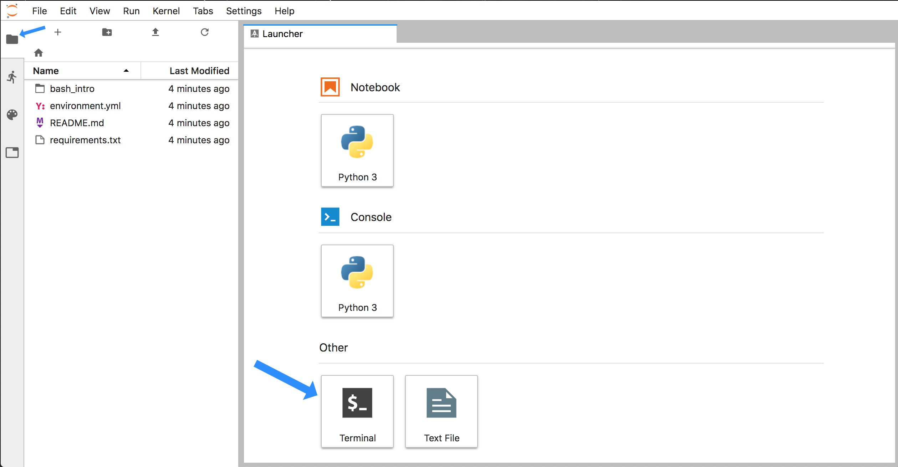
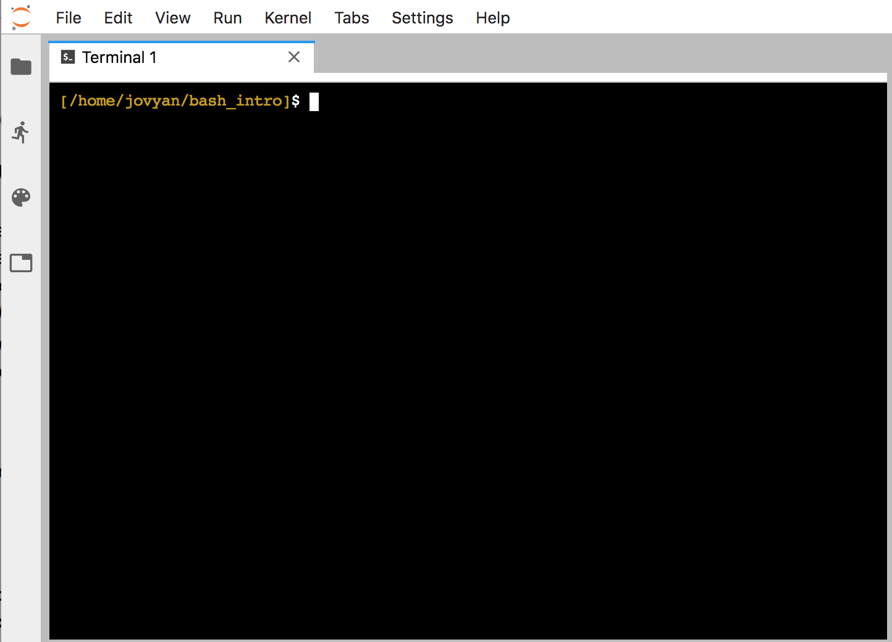
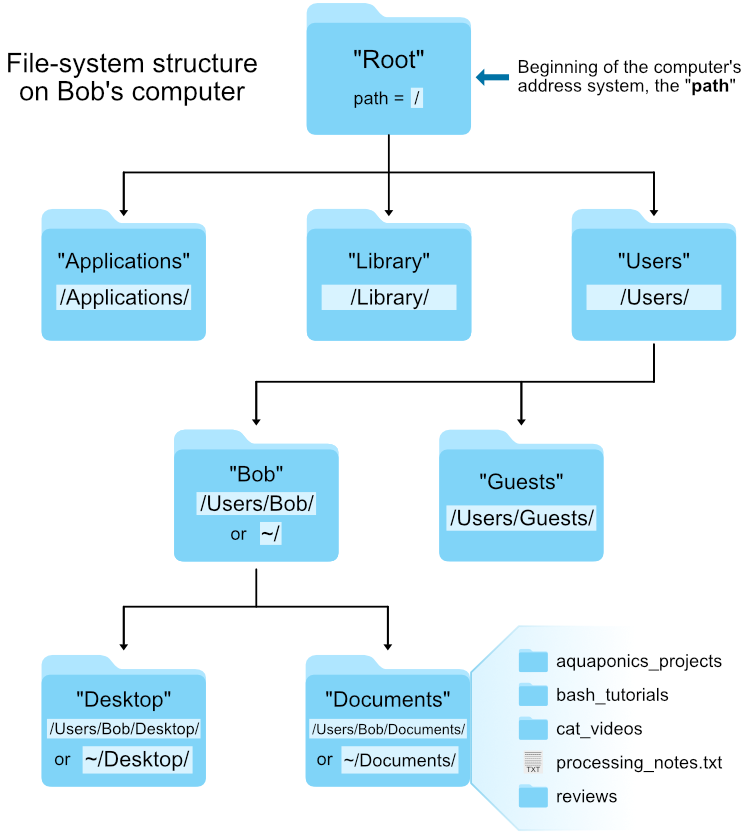





> **Things covered here:**  
*  Some quick terms
*  Why familiarity with the command line is valuable
*  Running commands and general syntax
*  File-system structure and how to navigate
*  Viewing, creating, and manipulating "plain-text" documents
*  Intro to pipes and redirectors
*  Intro to wildcards

<br>

# Important note!
**Maybe the most important thing to keep in mind here is that this is all about *exposure*, not memorization or mastering anything. Don't worry about the details. At first we just need to starting building a mental framework of the foundational rules and concepts. That equips us to figure out the things we need to, when we need to do them** 🙂

<center>Here's a high-resolution timelapse of my ongoing journey:</center>
<center></center>

<br>
>Whether you're going through this page with someone in-person or you're going through it by yourself, you'll see that it's written to be completely self-contained. Meaning just about everything I would say in person is also written here in a very conversational format. This is so at any point in time you can return to this and find something again. So don't let the large amount of information and details feel overwhelming if it starts too, it is definitely a lot when this is all new. But you don't need to learn it all perfectly in one pass, I certainly didn't. And maybe you won't have the time or need to try appling these skills for a while after going through this. But getting some exposure to these concepts now will help when that point comes, because you'll already know that you *can* figure it out when you need to. And then you can come back to this page to look at some things to help refresh your memory and get you started 🙂

<br>

---
<br>

# Some terminology
First, here are some terms that are often used interchangeably.  

| Term     | What it is          |
|:-------------:|------------------|
| **`shell`** | what we use to talk to the computer; anything where you are pointing and clicking with a mouse is a **G**raphical **U**ser **I**nterface (**GUI**) shell; something with text only is a **C**ommand **L**ine **I**nterface (**CLI**) shell |  
| **`command line`** | a text-based environment capable of taking input and providing output |  
| **`Unix`** | a family of operating systems |  
| **`bash`** | the most common programming language used at a Unix command-line |  

<br>

---
<br>

# Why learn the command line?

*  it's the foundation for most of bioinformatics
*  enables use of non-GUI (Graphical User Interface) tools
*  reproducibility
*  quickly perform operations on large files (without reading into memory)
*  automation of repetitive tasks (need to rename 1,000 files, or process 1,000 samples the same way?)
*  enables use of higher-powered computers elsewhere (server/cloud)  

<br>

---
<br>

# Accessing our command-line environment
Before we get started, we need a terminal to work in. You can either work on your own computer if you already have access to a Unix-like command-line environment (which you can get help with [here](/bash/getting_bash_env){:target="_blank"} if needed), or you can work in a "Binder" I've created for this page. [Binder](https://mybinder.org/){:target="_blank"} is an incredible project with incredible people behind hit. I'm still very new to it, but the general idea is it makes it easier to setup and share specific working environments in support of open science. What this means for us here is that we can just click this little badge – [](https://mybinder.org/v2/gh/AstrobioMike/binder-bash-intro/master?urlpath=lab){:target="_blank"} – and it'll open the proper bash environment with all our needed example files in a web-browser ready to rock... how awesome is that?!? So yeah, if you want to work in the binder, click it already! 

When that page finishes loading (it may take a couple minutes), you will see a screen like this (minus the blue arrows):

<center></center>
<br>

Now click the **folder icon** at the top-left (that the smaller blue arrow points to above) and then click the "**Terminal**" icon at the bottom, and we'll be in our appropriate command-line environment:

<center></center>
<br>

This is our "command line", where we will be typing all of our commands 🙂

>**Note:** If you want to get a bash environment of your own going on your computer, you can see [this page](/bash/getting_bash_env){:target="_blank"} for some help, and can then follow this page working on your own computer.

<br>

---
<br>

**If you are not using the binder environment**, but want to follow along with this page, then for right now, and only for right now, I would like you to blindly copy and paste the following commands into your terminal window. This is so that we are working in the same place with the same files.  

<center><b>SKIP THESE COMMANDS IF YOU ARE WORKING IN THE BINDER ENVIRONMENT SHOWN IN THE PICTURE ABOVE</b></center>

```
cd ~
curl -L -o bash_intro.tar.gz https://ndownloader.figshare.com/files/15537653
tar -xzvf bash_intro.tar.gz && rm bash_intro.tar.gz
cd bash_intro
```

Don't forget to press enter to execute the last command (usually that doesn't copy over). If your system does not have `curl` installed, and you get an error message from the above, then it's probably best to work in the [binder environment](/bash/bash_intro_binder#accessing-our-command-line-environment) for now while getting used to things 🙂  

<br>

---
<br>

# A few foundational rules

* **Spaces are special!** The command line uses spaces to know how to properly break things apart. This is why it's not ideal to have filenames that contain spaces, but rather it's better to use dashes (**`-`**) or underscores (**`_`**) – e.g., "draft_v3.txt" is preferred over "draft v3.txt".  
<br>

* The general syntax working at the command line goes like this: **`command argument`**.  
<br>

* Arguments (which can also be referred to as "flags" or "options" or "parameters") can be **optional** or **required** based on the command being used.  

<br>

<h2><b><center>Now, let's get started!</center></b></h2>

---
<br>

# Running commands

>**NOTE:** It's okay to copy and paste things. This is not a typing test 🙂

**`date`** is a command that prints out the date and time. This particular command does not require any arguments:

```bash
date
```

When we run **`date`** with no arguments, it uses some default settings, like assuming we want to know the time in our local time zone (well, the computer's local time zone). But we can provide optional arguments to **`date`**. Optional arguments most often require putting a dash in front of them in order for the program to interpret them properly. Here we are adding the **`-u`** argument to tell it to report UTC time instead of the local time: 

```bash
date -u
```

Note that if we try to run it without the dash, we get an error:

```bash
date u
```

Also note that if we try to enter this without the "space" separating **`date`** and the optional argument **`-u`**, the computer won't know how to break apart the command and we get a different error:

```bash
date-u
```

>The first error comes from the program **`date`**, and it doesn't know what to do with the letter **`u`**. The second error comes from **`bash`**, the language we are working in, because it's trying to find a program called "date-u" since we didn't tell it how to properly break things apart. 

Unlike `date`, most commands require arguments and won't work without them. **`head`** is a command that prints the first lines of a file, so it **requires** us to provide the file we want it to act on: 

```bash
head example.txt
```

Here "example.txt" is the **required** argument, and in this case it is also what's known as a **positional** argument. Whether things are positional arguments or not depends on how the command was written. Sometimes we need to specify the input file by putting something in front of it (e.g. some commands will use the `-i` flag, but it's often other things as well).

There are also optional arguments for the **`head`** command. The default for **`head`** is to print the first 10 lines of a file. We can change that by specifying the **`-n`** flag, followed by how many lines we want:

```bash
head -n 5 example.txt
```

How would we know we needed the **`-n`** flag for that? There are a few ways to find out. Many standard shell commands and other programs will have built-in help menus that we can access by providing **`-h`** or **`--help`** as the only argument:

```bash
head -h
head --help
```

And/or we can go to google to look for help. This is one of the parts that is not about memorization at all. We might remember a few if we use them a lot, but searching for options and details when needed is definitely the norm!

<blockquote>
What we've done so far really is the framework for how all things work at the command line! Multiple commands can be strung together, and some commands can have many options, inputs, and outputs and can grow to be quite long, but this general framework is underlying it all.<br><br><center><b>Becoming familiar with these baseline rules is important, memorizing particular commands and options is not!</b></center><br>
</blockquote>

<br>

---
<br>

# The Unix file-system structure

Your computer stores file locations in a hierarchical structure. You are likely already used to navigating through this stucture by clicking on various folders (also known as directories) in a Windows Explorer window or a Mac Finder window. Just like we need to select the appropriate files in the appropriate locations there (in a GUI), we need to do the same when working at a command-line interface. What this means in practice is that each file and directory has its own "address", and that address is called its "**path**". 

Here is an image of an example file-system structure:


<center><a href="https://raw.githubusercontent.com/AstrobioMike/AstrobioMike.github.io/master/images/file_system_structure.png"></a></center>
<br>

There are two special locations in all Unix-based systems: the "**root**" location and the current user's "**home**" location. "Root" is where the address system of the computer starts; "home" is where the current user's location starts.

We tell the command line where files and directories are located by providing their address, their "path". If we use the **`pwd`** command (for **p**rint **w**orking **d**irectory), we can find out what the path is for the directory we are sitting in. And if we use the **`ls`** command (for **l**i**s**t), we can see what directories and files are in the current directory we are sitting in.

```
pwd
ls
``` 

## Absolute vs relative path
There are two ways to specify the path (address) of the file we want to do something to:

* An **absolute path** is an address that starts from an explicitly specified location: either the "root" **`/`** or the "home" **`~/`** location. 
* A **relative path** is an address that starts from wherever we are currently sitting.

For example, let's look again at the **`head`** command we ran above:

```bash
head example.txt
```

**What we are actually doing here is using a *relative path* to specify where the "example.txt" file is located.** This is because the command line automatically looks in the current working directory if we don't specify anything else about its location. 

We can also run the same command on the same file using an **absolute path**:

```bash
head ~/bash_intro/example.txt
```

The previous two commands both point to the same file right now. But the first way, **`head example.txt`**, will only work if we are entering it while "sitting" in the directory that holds that file, while the second way will work no matter where we happen to be in the computer. 

>**Note:** The address of a file, its "path", includes the file name also, it doesn't stop at the directory that holds it.

It is important to always think about *where* we are in the computer when working at the command line. **One of the most common errors/easiest mistakes to make is trying to do something to a file that isn't where we think it is.** Let's run **`head`** on the "example.txt" file again, and then let's try it on another file: "notes.txt":

```bash
head example.txt
head notes.txt
```
Here the **`head`** command works fine on "example.txt", but we get an error message when we call it on "notes.txt" telling us no such file or directory. If we run the **`ls`** command to **l**i**s**t the contents of the current working directory, we can see the computer is absolutely right – spoiler alert: it usually is – and there is no file here named "notes.txt". 

The **`ls`** command by default operates on the current working directory if we don't specify any location, but we can tell it to list the contents of a different directory by providing it as a positional argument: 

```bash
ls
ls experiment
```

We can see the file we were looking for is located in the subdirectory called "experiment". Here is how we can run **`head`** on "notes.txt" by specifying an accurate **relative path** to that file:

```bash
head experiment/notes.txt
```

If we had been using **tab-completion**, we would not have made that mistake!

### BONUS ROUND: Tab-completion is your friend!
Tab-completion is a huge time-saver, but even more importantly it is a perpetual sanity-check that helps prevent mistakes. 

If we are trying to specify a file that's in our current working directory, we can begin typing its name and then press the **`tab`** key to complete it. If there is only one possible way to finish what we've started typing, it will complete it entirely for us. If there is more than one possible way to finish what we've started typing, it will complete as far as it can, and then hitting **`tab`** twice quickly will show all the possible options. **If tab-complete does not do either of those things, then we are either confused about where we are, or we're confused about where the file is that we're trying to do something to** – this is invaluable.

> **Quick Practice**  <br>
> Try out tab-complete! Run **`ls`** first to see what's in our current working directory again. Then type **`head e`** and then press the **`tab`** key. This will auto-complete out as far as it can, which in this case is up to "ex", because there are multiple possibilities still at that point. If we press **`tab`** twice quickly, it will print out all of the possibilities for us. And if we enter "a" and press **`tab`** again, it will finish completing "example.txt" as that is the only remaining possibility, and we can now press **`return`**. 

<center><b>Use tab-completion whenever you can!!</b></center>
<br>

## Moving around
We can also move into the directory containing the file we want to work with by using the **`cd`** command (**c**hange **d**irectory). This command takes a positional argument that is the path (address) of the directory we want to change into. This can be a relative path or an absolute path. Here we'll use the relative path of the subdirectory, "experiment", to change into it (use tab-completion!):

```bash
cd experiment/
pwd
ls
head notes.txt
```

Great. But now how do we get back "up" to the directory above us? One way would be to provide an absolute path, like **`cd ~/bash_intro`**, but there is also a handy shortcut. **`..`** are special characters that act as a relative path specifying "up" one level – one directory – from wherever we currently are. So we can provide that as the positional argument to **`cd`** to get back to where we started:

```bash
cd ..
pwd
ls
```

Moving around the computer like this may feel a bit cumbersome at first, but after spending a little time with it and getting used to tab-completion you'll soon find yourself slightly frustrated when you have to scroll through a bunch of files and click on something by eye in a GUI 🙂

<br>

---
<br>

<h4><i>Terms presented in the previous section:</i></h4>

| Term     | What it is          |
|:----------:|------------------|
| **`path`** | the address system the computer uses to keep track of files and directories |
| **`root`** | where the address system of the computer starts, **`/`** |
| **`home`** | where the current user's location starts, **`~/`**|
| **`absolute path`** | an address that starts from a specified location, i.e. root, or home |
| **`relative path`** | an address that starts from wherever we are |
| **`tab-completion`** | our best friend |


<h4><i>Commands presented in the previous section:</i></h4>

|Command     |Function          |
|:----------:|------------------|
|**`date`**| prints out information about the current date and time |
|**`head`**| prints out the first lines of a file |
|**`pwd`**       |prints out where we are in the computer (**p**rint **w**orking **d**irectory)|
|**`ls`**        |lists contents of a directory (**l**i**s**t)|
|**`cd`**| **c**hange **d**irectories |


<h4><i>Special characters presented in the previous section:</i></h4>

|Characters     | Meaning          |
|:----------:|------------------|
| **`/`** | the computer's root location |
| **`~/`** | the user's home location |
| **`../`** |specifies a directory one level "above" the current working directory|

<br>

---
<br>

# Working with plain-text files and directories
Next we're going to look at some more ways to learn about and manipulate file and directories at the command line.

---

>To be sure we are still working in the same place, let's run: 
>```bash
>cd ~/bash_intro
>```

---

## Working with files
We will often want to get a look at a file to see how it's structured. We've already used a very common tool for peeking at files, the **`head`** command. There is also **`tail`**, which prints the last 10 lines of a file:

```bash
head example.txt
tail example.txt
```

This is especially helpful if a file is particularly large, as **`head`** will just print the first ten lines and stop. This means it will be just as instantaneous whether the file is 10KB or 10GB. 

Another standard useful program for viewing the contents of a file is **`less`**. This opens a searchable, read-only program that allows you to scroll through the document: 

```bash
less example.txt
```

To exit the **`less`** program, press the "**q**" key. 

The **`wc`** (**w**ord **c**ount) command is useful for counting how many lines, words, and characters there are in a file: 

```bash
wc example.txt
```

<challengeBlock>
<center><b>QUICK PRACTICE!</b></center>

How can we get <i>only</i> the number of lines in a file from the <htmlCode>wc</htmlCode> command?
<br>

<div class="wrap-collabsible">
  <input id="q1" class="toggle" type="checkbox">
  <label for="q1" class="lbl-toggle">Solution</label>
  <div class="collapsible-content">
    <div class="content-inner">
		<pre>wc -l example.txt</pre>

Adding the optional flag <htmlCode>-l</htmlCode> will print just how many lines are in a file. We could find this out by running <htmlCode>wc --help</htmlCode> or by visiting our good friend Google 🙂 
<br>
<br>
<center>Printing out how many lines are in a file like this is super-useful for things like quickly seeing how many rows are in a large table, or how many sequences are in a file.</center>
		
    </div>
  </div>
</div>
</challengeBlock>


<br>

The most common command-line tools like these and many others we'll see are mostly only useful for operating on what are known as **plain-text files** – also referred to as "flat files". 

### BONUS ROUND: What's a plain-text file?
A general definition of a plain-text file is a text file that doesn't contain any special formatting characters or information, and that can be properly viewed and edited with any standard text editor.  

Common types of plain-text files are those ending with extensions like ".txt", ".tsv" (**t**ab-**s**eparated **v**alues), or ".csv" (**c**omma **s**eparated **v**alues). Some examples of common file types that are *not* plain-text files would be ".docx", ".pdf", or ".xlsx". This is because those file formats contain special types of compression and formatting information that are only interpretable by programs specifically designed to work with them.  

> **A note on file extensions**<br>
> File extensions themselves do not actually do anything to the file format. They are *mostly* there just for our convenience/organization – "mostly" because some programs require a specific extension to be present for them to even try interacting with a file. But this has nothing to do with the file contents, just that the program won't let you interact with it unless it has a specific extension.


## Copying, moving, and renaming files

<div class="warning">
<center><h2>WARNING!</h2></center>
<b>Using commands that do things like create, copy, and move files at the command line will overwrite files if they have the same name. And using commands that delete things will do so permanently. Use caution while getting used to things – and then forever after</b> 🙂
</div>
The commands **`cp`** and **`mv`** (**c**o**p**y and **m**o**v**e) have the same basic structure. They both require two positional arguments – the first is the file you want to act on, and the second is where you want it to go (which can include the name you want to give it). 

To see how this works, let's make a copy of "example.txt":

```bash
ls
cp example.txt example_copy.txt
ls
```

By just giving the second argument a name and nothing else (meaning no path in front of the name), we are implicitly saying we want it copied to where we currently are. 

To make a copy and put it somewhere else, like in our subdirectory "data", we could change the second positional argument using a **relative path** ("relative" because it starts from where we currently are):

```bash
ls data/
cp example.txt data/example_copy.txt
ls data/
```

To copy it to that subdirectory but keep the same name, we could type the whole name out, but we can also just provide the directory but leave off the file name:

```bash
cp example.txt data/
ls data/
```

If we wanted to copy something *from somewhere else to our current working directory* and keep the same name, we can use another special character, a period (**`.`**), which specifies the current working directory:

```bash
ls
cp experiment/notes.txt .
ls
```

The **`mv`** command is used to move files. Let's move the "example_copy.txt" file into the "experiment" subdirectory:

```bash
ls
ls experiment/
mv example_copy.txt experiment/
ls
ls experiment/
```

The **`mv`** command is also used to *rename* files. This may seem strange at first, but remember that the path (address) of a file actually includes its name too (otherwise everything in the same directory would have the same path). 

```bash
ls
mv notes.txt notes_old.txt
ls
```

To delete files there is the **`rm`** command (**r**e**m**ove). This requires at least one argument specifying the file we want to delete. But again, caution is warranted. There will be no confirmation or retrieval from a waste bin afterwards.

```bash
ls
rm notes_old.txt
ls
```

## A terminal text editor
It is often very useful to be able to generate new plain-text files quickly at the command line, or make some changes to an existing one. One way to do this is using a text editor that operates at the command line. Here we're going to look at one program that does this called **`nano`**.

When we run the command **`nano`** it will open a text editor in our terminal window. If we give it a file name as a positional argument, it will open that file if it exists, or it will create it if it doesn't. Here we'll make a new file:

```bash
nano sample_names.txt
```

When we press **`return`**, our environment changes to this:

<center></center>
<br>


Now we can type as usual. Type in a couple of sample names, one on each line – it doesn't matter what the names are: 

<center></center>
<br>

<br>

Afterwards, to save the file and exit, we need to use some of the keyboard shortcuts listed on the bottom. "WriteOut" will save our file, and the **`^O`** represents pressing **`ctrl + o`** together (it doesn't need to be a capital "O"). This will ask us to either enter or confirm the file name, we can just press **`return`**. Now that it is saved, to exit we need to press **`ctrl + x`**. 

And now our new file is in our current working directory:

```bash
ls
head sample_names.txt
```

>**NOTE:** Quickly <a href="https://www.google.com/search?q=how+to+exit+nano" target="_blank">googling</a> how to get out of things like **`nano`** the first 15 times we use them is 100% normal!

## Working with directories
Commands for working with directories for the most part operate similarly. We can make a new directory with the command **`mkdir`** (for **m**a**k**e **dir**ectory): 

```bash
ls
mkdir subset
ls
```

And similarly, directories can be deleted with **`rmdir`** (for **r**e**m**ove **dir**ectory):

```bash
rmdir subset/
ls
```

The command line is a little more forgiving when trying to delete a directory. If the directory is not empty, **`rmdir`** will give you an error. 

```bash
rmdir experiment/
```
<br>

---
<br>

<h4><i>Commands presented in the previous section:</i></h4>

|Command     |Function          |
|:----------:|------------------|
|**`head`**      |prints the first lines of a file|
|**`tail`**      |prints the last lines of a file|
|**`less`**      |allows you to browse a file (exit with **`q`** key)|
|**`wc`**       |count lines, words, and characters in a file|
|**`cp`**      |copy a file or directory (use with caution)|
|**`mv`**      |mv a file or directory (use with caution)|
|**`rm`**      |delete a file or directory (use with caution)|
|**`mkdir`**       |create a directory|
|**`rmdir`**     |delete an empty directory|
|**`nano`**     |create and edit plain text files at the command line|


<h4><i>Special characters presented in the previous section:</i></h4>

|Characters     | Meaning          |
|:----------:|------------------|
| **`.`** | specifies the current working directory |

<br>

---
<br>

# Redirectors and wildcards
So far we've only seen individual commands and printing information to the screen. This is useful for in-the-moment things, but not so much for getting things done. Next we're going take our first look at some of the things that make the Unix command-line environment so versatile and powerful: redirectors and wildcards! 

---

>To be sure we are still working in the same place, let's run: 
>```bash
>cd ~/bash_intro
>```

---

<br>
## Redirectors
When we are talking about "redirectors" here, we are referring to things that change where the output of something is going. The first we're going to look at is called a "pipe" (**`|`**). 

> A pipe (**`|`**) is used to connect multiple commands. It takes the *output* from the previous command and "pipes" it into the *input* of the following command.

Let's look at an example. Remember we used **`wc -l`** to count how many lines were in a file:

```bash
wc -l example.txt
```

And that **`ls`** lists the files and directories in our current working directory:

```bash
ls
```

If we "pipe" (**`|`**) the **`ls`** command into the **`wc -l`** command, instead of printing the output from **`ls`** to the screen as usual, it will go into **`wc -l`** which will print out how many items there are:

```bash
ls | wc -l
```

For another example, let's look at what's in the subdirectory, "data/all_samples/":

```bash
ls data/all_samples/
```

That prints out a lot of stuff, let's see how many things are in that directory: 

```bash
ls data/all_samples/ | wc -l
```

We'll get back to making sense of that when we get to *wildcards* in the next section.  

> Another important character is the greater than sign, **`>`**. This tells the command line to *redirect* the output to a file, rather than just printing it to the screen as we've seen so far.

For an example of this we will write the output of **`ls`** to a new file called "directory_contents.txt":

```bash
ls
ls > directory_contents.txt
```

Notice that when we redirect the output with the **`>`**, nothing printed to the screen. And we've just created a file called "directory_contents.txt":

```bash
ls
head directory_contents.txt
```

**It's important to remember that the `>` redirector will overwrite the file you are pointing to if it already exists.** 

```bash
ls experiment/ > directory_contents.txt
head directory_contents.txt
```

If we want to append an output to a file, rather than overwrite it, we can use two of them instead, **`>>`**:

```bash
ls >> directory_contents.txt
head directory_contents.txt
```

## Wildcards
> Wildcards as used at the command line are special characters that enable us to specify multiple items very easily. The **`*`** and **`?`** are probably the most commonly used, so let's try them out! 

<h3>The asterisk (<b>*</b>)</h3>

As we've seen, **`ls`** lists the contents of the current working directory, and by default it assumes you want everything: 

```bash
ls
```

But we can be more specific about what we're interested in by giving it a positional argument that narrows things down. Let's say we only want to look for files that end with the extension ".txt". The **`*`** wildcard can help us with that.

Here's an example:

```bash
ls *.txt
```

What this is saying is that no matter what comes before, if it ends with ".txt" we want it. 

> At the command line, the **`*`** means any character, any number of times (including 0 times). 

For a more practical example, let's change directories into that messy subdirectory we saw earlier: 

```bash
cd data/all_samples/
ls
ls | wc -l
```

So there are 900 files here, and it looks like there are 3 different extensions: ".txt"; ".tsv", and ".fq" (a common extension for the "fastq" format, which holds sequences and their quality information). 

<challengeBlock>
<center><b>QUICK PRACTICE!</b></center>

With 900 files and 3 file types (".txt", ".tsv", and ".fq"), we might expect there to be 300 of each type, but let's make sure. Using what we've seen above, how can we count how many files of each type there are in this directory?
<br>

<div class="wrap-collabsible">
  <input id="q2" class="toggle" type="checkbox">
  <label for="q2" class="lbl-toggle">Solution</label>
  <div class="collapsible-content">
    <div class="content-inner">
		<pre>ls *.txt | wc -l<br>ls *.tsv | wc -l<br>ls *.fq | wc -l</pre>

Ah good, it's nice when things make sense 🙂
		
    </div>
  </div>
</div>
</challengeBlock>


So far we've just been using the **`*`** wildcard with the **`ls`** command. But wildcards can be used with many of the common shell commands we've seen so far. 

For example, we can use it with the **`mv`** command to move all 300 of the ".fq" files into their own directory at once:

```bash
ls | wc -l

mkdir fastq_files
ls fastq_files/

ls *.fq
mv *.fq fastq_files/

ls fastq_files/

ls | wc -l
```

<challengeBlock>
<center><b>QUICK QUESTION!</b></center>

Why does this say 601 instead of 600?
<br>

<div class="wrap-collabsible">
  <input id="q3" class="toggle" type="checkbox">
  <label for="q3" class="lbl-toggle">Solution</label>
  <div class="collapsible-content">
    <div class="content-inner">
    
It's also counting the new directory we created 🙂
		
    </div>
  </div>
</div>
</challengeBlock>


> **Note:** When using wildcards, running **`ls`** first like done in the above example (**`ls *.fq`**) is good practice before actually running a command. It is a way of checking that we are specifying exactly what we think we are specifying. 

### BONUS ROUND: History!

The shell also keeps track of our previous commands for us. There are a few different ways we can take advantage of this, one is by using the **`history`** command. But that alone will print all of it to the screen. It can be more practical to "pipe" (**`|`**) that into something else like **`tail`** to see the last few commands:

```bash
history | tail
```

Or **`less`** so we can scroll through our previous commands:

```bash
history | less
```

To get out of **`less`**, press the **`q`** key. 

We can also use the up and down arrows at the command line to scroll through previous commands. This is useful for finding commands, but it's also useful for making sure we are acting on the files we want to act on when using wildcards. As mentioned above, we can check first with **`ls *.fq`**, press **`return`** to see we are acting on the files we want, and then press the up arrow to bring up the previous command, and change it to what we want without altering the "*.fq" part of the command – as we already know it's correct. Any time we can remove the chance of human error, we should 🙂


<challengeBlock>
<center><b>QUICK PRACTICE!</b></center>

We've already moved all the ".fq" files into their own directory. Create separate directories for the ".txt" files and the ".tsv" files too, and then try to move those files into their appropriate directories. 
<br>

<div class="wrap-collabsible">
  <input id="q4" class="toggle" type="checkbox">
  <label for="q4" class="lbl-toggle">Solution</label>
  <div class="collapsible-content">
    <div class="content-inner">

<pre>mkdir text_files
ls *.txt
mv *.txt text_files

mkdir tsv_files
ls *.tsv
mv *.tsv tsv_files

ls</pre>

It doesn't matter what the directories are named, but at the end they should be the only 3 things in the working directory 🙂
		
    </div>
  </div>
</div>
</challengeBlock>


<h3>The question mark (<b>?</b>)</h3>

> At the command line, the **`?`** wildcard represents *any* character that appears *only one time*. 

To see how this can be needed at times when the **`*`** won't do, let's change into the "fastq_file" subdirectory:

```bash
cd fastq_files/
```

And let's say we wanted only the ".fq" files for samples 10-19. If we tried to grab those with the **`*`**, we'd get more than we wanted:

```bash
ls sample_1*.fq
```

Because the **`*`** allows for any character *any number* of times, it is also grabbing those in the 100s. But if we use the **`?`** wildcard, which only allows any character *one time*, we get only the samples we want:

```bash
ls sample_1?.fq
```

<br>

---
<br>

They may seem a little abstract at first, but redirectors and wildcards are two fundamental concepts of working at the command line that help make it a very powerful environment to work in. Just knowing they exist and generally what they do means that you can learn more about them when needed.

<h4><i>Special characters presented in the previous section:</i></h4>

|Character     |Function          |
|:----------:|------------------|
|**`|`**      |a "pipe" allows stringing together multiple commands| 
|**`>`**      |sends output to a file (**overwrites** target file)| 
|**`>>`**      |sends output to a file (appends to target file)| 
|**`*`**      |represents any character appearing any number of times|
|**`?`**      |represents any character appearing only once| 

<br>

---
---
<br>
<h1>Congrats on getting through the basics!</h1>
While the commands change, the general structure of how to operate at the command line stays the same. There are a lot of base commands in *bash*, and a dizzying number of optional arguments for most of them – as usual, google is our friend. If you end up working at the command line frequently, you will remember some things, but also you will often do a quick search to remember what the flag is for a specific argument, or how exactly a specific command works. Again, this really isn't about memorization.

When you want to go further, be sure to check out the [6 glorious commands page](/bash/six_commands){:target="_blank"} and then [the wonderful world of loops](/bash/for_loops){:target="_blank"}! 

<br>

---
<br>

# All commands presented here

|Command     |Function          |
|:----------:|------------------|
|**`date`**   | prints out information about the current date and time |
|**`pwd`**       |prints out where we are in the computer (**p**rint **w**orking **d**irectory)|
|**`ls`**        |lists contents of a directory (**l**i**s**t)|
|**`cd`**| **c**hange **d**irectories |
|**`head`**      |prints out the first lines of a file|
|**`tail`**      |prints out the last lines of a file|
|**`less`**      |allows us to browse a file (exit with **`q`** key)|
|**`wc`**       |count lines, words, and characters in a file|
|**`cp`**      |copy a file or directory (use with caution)|
|**`mv`**      |move or rename a file or directory (use with caution)|
|**`rm`**      |delete a file or directory (use with caution)|
|**`mkdir`**       |create a directory|
|**`rmdir`**     |delete an empty directory|
|**`nano`**     |create and edit plain text files at the command line|


# All terms presented here

| Term     | What it is          |
|:----------:|------------------|
| **`shell`** | what we use to talk to the computer; anything where you are pointing and clicking with a mouse is a **G**raphical **U**ser **I**nterface (**GUI**) shell; something with text only is a **C**ommand **L**ine **I**nterface (**CLI**) shell |
| **`command line`** | a text-based environment capable of taking input and providing output |
| **`Unix`** | a family of operating systems |
| **`bash`** | the most common programming language used at a Unix command-line | 
| **`path`** | the address system the computer uses to keep track of files and directories |
| **`root`** | where the address system of the computer starts, **`/`** |
| **`home`** | where the current user's location starts, **`~/`**|
| **`absolute path`** | an address that starts from a specified location, i.e. root, or home |
| **`relative path`** | an address that starts from wherever we are |
| **`tab-completion`** | our best friend |


# All special characters presented here

|Characters     | Meaning          |
|:----------:|------------------|
| **`/`** | the computer's root location |
| **`~/`** | the user's home location |
| **`..`** |specifies a directory one level "above" the current working directory|
| **`.`** |specifies the current working directory|
|**`|`**      | a "pipe" allows stringing together multiple commands |
|**`>`**      |sends output to a file (**overwrites** target file)|
|**`>>`**      |sends output to a file (appends to target file)|
|**`*`**      |represents any character appearing any number of times|
|**`?`**      |represents any character appearing only once|

<br>

---
---

<h4><a href="/bash/six_commands" style="float: right"><b>Next:</b> Six glorious commands</a></h4>
