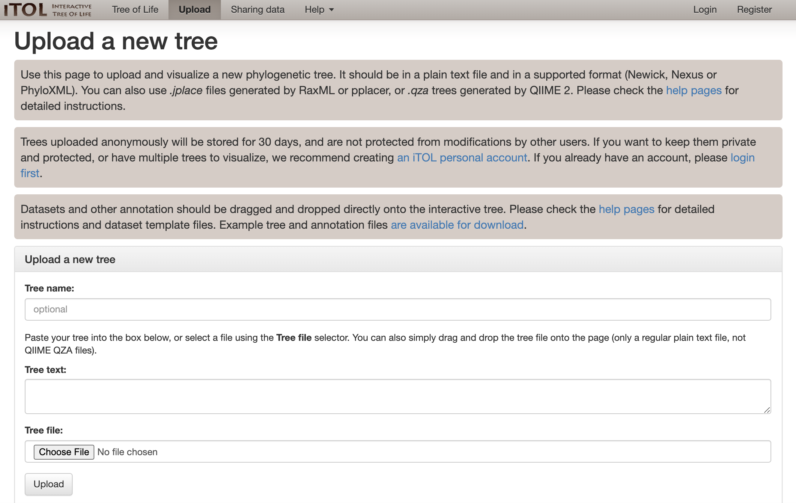
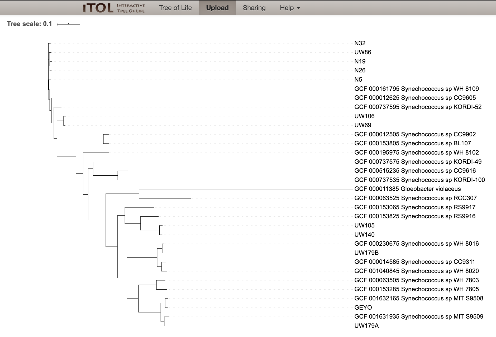
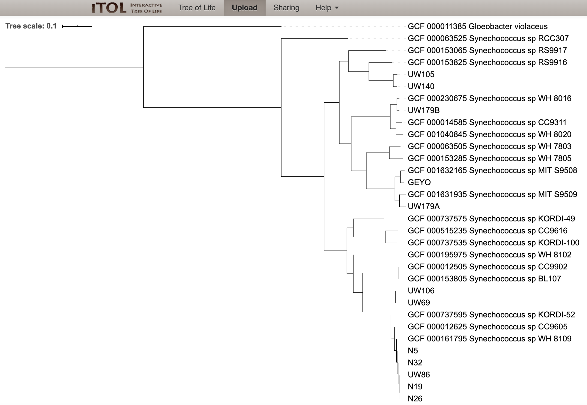
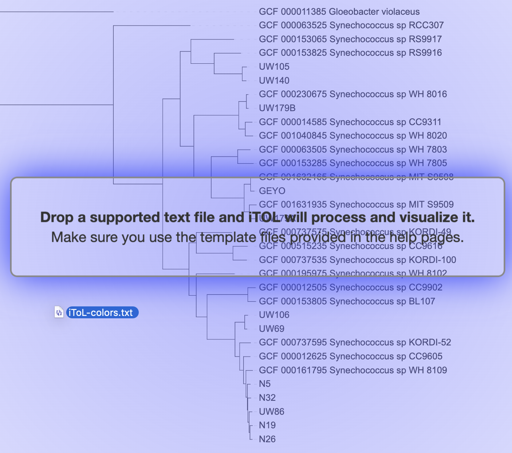
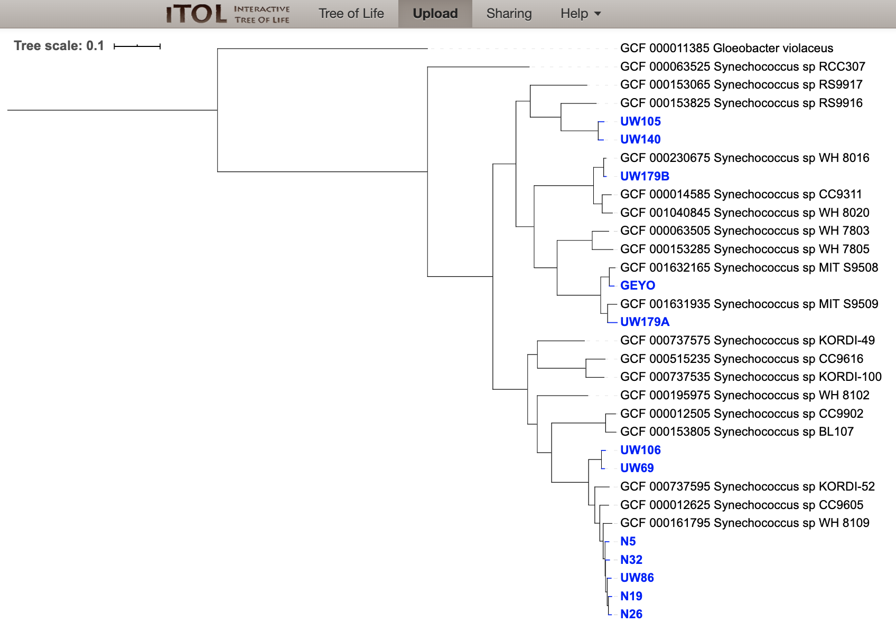
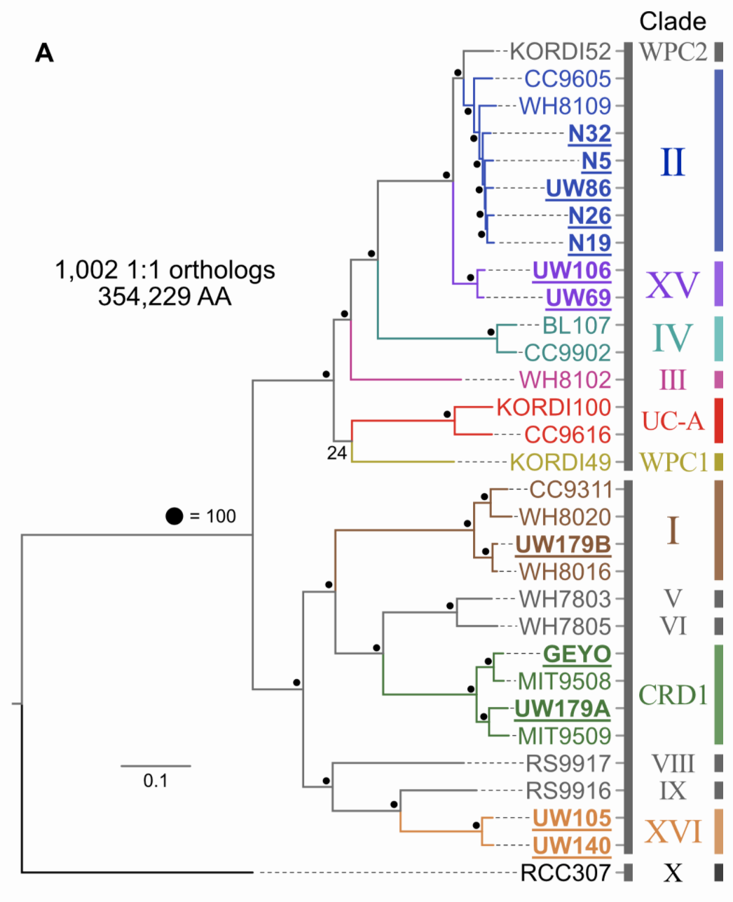





Here we are going to talk about what phylogenomics is (regarding one common use of the term at least) and what goes into generating a phylogenomic tree. Then we're going to create one with [GToTree](https://github.com/AstrobioMike/GToTree/wiki/what-is-gtotree%3F){:target="_blank"} 🙂

<center><a href="../images/hug-tree-of-life.png"></a></center>

<p align="right" style="font-size:0.85em; padding-right: 15%">the instantly iconic "new view of the Tree of Life" from <a href="https://www.nature.com/articles/nmicrobiol201648" target="_blank">Hug et al. 2016</a></p>

<hr style="height:10px; visibility:hidden;" />
---
---
<hr style="height:10px; visibility:hidden;" />


> **NOTE**  
> This page focuses on how the term phylogenomics is most often utilized in my little bubble of existence – which is in the context of attempting to infer evolutionary relationships between organisms. But the term can also be used, and was [initially described](https://genome.cshlp.org/content/8/3/163.full){:target="_blank"}, within the context of functional genomics.

<hr style="height:10px; visibility:hidden;" />
---
---
<br>
# Concepts

## What is phylogenomics?

Put into one over-simplified, slightly misleading, but conceptually usefull sentence: **phylogenomics is attempting to infer evolutionary relationships at a genomic level**. This is over-simplified and slightly misleading because in practice we are not using the entire genomes of all of the organisms we wish to focus on. And depending on the breadth of diversity we are considering, it might be impossible and/or meaningless to use entire genomes anyway (because they might be too different). So really, it's more appropriate to say: **phylogenomics is attempting to infer evolutionary relationships at something closer to the genome-level than an individual-gene phylogeny gets us** (like a 16S rRNA gene tree). 

Most phylogenetic trees that biologists are used to seeing and working with are visual representations of the estimated evolutionary relationships of various copies of a single gene-type (like the 16S rRNA gene). When we do this, if we are trying at all to think on the organism level (which we very often are), ***we are using those gene copies as proxies to stand in for the organism itself, and we are assuming the evolutionary relationships of those genes tell us something meaningful about the evolutionary relationships of their source organisms***.

We are doing the same thing with phylogenomics, just instead of a single gene, we are using multiple genes. In the end, we are still just using sequences as proxies. So an even more appropriate definition might be: **phylogenomics is attempting to infer evolutionary relationships between sequences comprised of multiple concatenated genes, while assuming those inferred evolutionary relationships tell us something meaningful with regard to the evolutionary relationships of their source genomes**. But that can sound pretty convoluted if we're just starting to get into this mental space, hence the over-simplified, slightly misleading version first – that does still get the point across 🙂

Now, with that laid out there, I want to immediately follow up with saying for the most part, it *is* a safe assumption that the inferred evolutionary relationships of the multi-gene sequences we are getting *are* meaningfully representative of their source genomes' evolutionary relationships. And this generally becomes a safer assumption when a greater number of *appropriate* genes are included – and a less safer assumption if fewer, or *inappropriate*, genes are included. Which and how many genes are *appropriate* entirely depends on the breadth of diversity we are interested in spanning (more on that below). In general, for a given set of organisms of interest, it'd be a good idea to use as many *single-copy core genes* as that set of organisms has. But this certainly isn't always necessary in order to get a trusted signal that meets our current needs (our *Synechococcus* example below actually demonstrates this).

<hr style="height:10px; visibility:hidden;" />

---
<br>
## What are single-copy core genes? 
*Single-copy core* genes, or just **s**ingle-**c**opy **g**enes (SCGs), are genes that are present in exactly 1 copy in most of the organisms we happen to currently be talking about. To compare genes across organisms, we of course need those organisms we are considering to actually have these genes. But we also want genes in single-copy (rather than genes that tend to exist in multiple copies within our target organisms) because *one of the built-in assumptions in phylogenetics in general is that the genes being considered are under similar evolutionary pressures*. This is tenuous to begin with even with single-copy genes (and is probably never actually entirely true), but it becomes much more likely we are violating that assumption if there are multiple gene-copies within the same genome (these are known as paralogs). So that's why when we are talking about phylogenomics in general, SCGs play such a predominant role. 

<hr style="height:10px; visibility:hidden;" />

---
<br>
## Which genes should we use?
*The organisms we are considering are what dictate the genes that should be used.* Following what we touched on above about why SCGs are so useful in phylogenomics, the amount of genes that are going to fit those criteria is going to be relatively larger if we are focusing on a more closely related group of organisms than it will be if we are focusing on a more diverged group of organisms. The Tree of Life pictured above from [Hug et al. 2016](https://www.nature.com/articles/nmicrobiol201648){:target="_blank"} utilizes 15 target genes because it is designed to span 3 domains. But if, for instance, we were only focusing on Cyanobacteria, the number of shared, single-copy genes across that group would be much greater. For example, to design a single-copy gene set specific to Cyanobacteria for [GToTree](https://github.com/AstrobioMike/GToTree/wiki/what-is-gtotree%3F){:target="_blank"}, I tried to find all the genes that are present in exactly 1 copy in at least 90% of all Cyanobacteria genomes available from NCBI. That process (described in more detail and with an example [here](https://github.com/AstrobioMike/GToTree/wiki/SCG-sets){:target="_blank"}) yielded 251 gene targets when it was performed. In contrast, when applying the same process to all bacterial genomes, it yielded 74. **There isn't one, ideal set of target genes to always use because it entirely depends on the breadth of diversity we are trying to look at 🙂**

<hr style="height:10px; visibility:hidden;" />

---
<br>
## Overview of the process
Ok, great. So now let's say we have the genomes we want to include (imagine just 3 for our cartoon example here), and we have the set of single-copy genes we want to target (also pretending to be just 3 for now). What's next? 

<a href="../images/phylo-img.png"></a>

One of the most common approaches these days can look something like this: 

1. **Identify our target genes in all of our input genomes**
  * these are represented by the colors in our cartoon on the right
  * notice that Genome "B" is missing one of the 3 example target genes

2. **Align each set of identified genes individually**
  * e.g. all the copies of target gene "X" that were identified from all input genomes are aligned together; the same process is done individually for all gene sets
  * for any genomes that are missing one of the target genes, gaps are inserted into the alignment for that gene for that genome (like in the alignment of gene "Y" for Genome "B" on the right)

3. **Stick all of these alignments together horizontally**
  * all of the individual gene alignments are stuck together horizontally, often with some "spacing" characters like a few "X"s if it's an amino-acid alignment

4. **Infer evolutionary relationships of those combined sequences**
  * Tree time!

<hr style="height:10px; visibility:hidden;" />

Most of these general steps can be done in different ways, and there are lots of decisions to be made, e.g. how we try to identify our target genes, what we use to align them, and what we use to make our tree. And there are also many things we might want to look out for, for example:

  * We might want to put something in place to do some form of automated screening to try to ensure that we aren't letting any genes through that were identified as being a version of our target gene, but maybe shouldn't have been (as that may compromise our alignment of that gene set). 
  * If a given input genome had multiple copies of our target gene identified, we might not want to include that gene from that genome as we may not be sure which to include (see [SCG section above](/genomics/phylogenomics#what-are-single-copy-core-genes) for why).
  * If an input genome had very few of our target genes identified overall, we might want to remove that genome from the analysis altogether.

Below we are going to use [GToTree](https://github.com/AstrobioMike/GToTree/wiki/what-is-gtotree%3F){:target="_blank"} to do some phylogenomics, and we'll see how it automates these processes for us. 

<hr style="height:10px; visibility:hidden;" />

---
<br>
# Let's do some phylogenomics!
As described in its illustrious [Bioinformatics publication](https://doi.org/10.1093/bioinformatics/btz188){:target="_blank"} 💩 [GToTree](https://github.com/AstrobioMike/GToTree/wiki/what-is-gtotree%3F){:target="_blank"} is a user-friendly workflow for phylogenomics. It handles all of the potentially computationally prohibitive tasks under the hood for us, like: accessing genomic data on large scales; integrating genomes from different file formats; performing filtering of genes and genomes; swapping input labels for lineage info; stitching together the different tools in the process for us; etc. It makes generating and iterating phylogenomic trees much more tractable. There's lots more information at the [GToTree wiki](https://github.com/AstrobioMike/GToTree/wiki){:target="_blank"}, but here is an overview figure:

<center><a href="../images/GToTree-Overview.png"></a></center>

<hr style="height:10px; visibility:hidden;" />

> **NOTE**  
> GToTree is not a taxonomy assignment tool, it is a tool for building de novo phylogenomic trees. See [When to use GToTree and when not?](https://github.com/AstrobioMike/GToTree/wiki/Things-to-consider#when-to-use-gtotree-and-when-not){:target="_blank"} for more discussion on this 🙂

<hr style="height:10px; visibility:hidden;" />

---
<br>

## Installing GToTree
If wanted, a [Binder](https://mybinder.org/){:target="_blank"} is available to work in by clicking this badge here [](https://mybinder.org/v2/gh/AstrobioMike/binder-happy-belly-phylogenomics/master?urlpath=lab){:target="_blank"} – and an example of getting into the binder command-line environment can be found [here](/unix/getting-started#accessing-our-command-line-environment){:target="_blank"} if needed (but be sure to activate the binder by clicking on the badge above, not the one on the other page). 

> **A couple notes on using binder for this tutorial**  
> Binder is amazing, but those environments aren't built for speed, and most laptops will far outperform the binder environment on many tasks. If wanting to actively follow along with the below example, it will likely go about 4 times faster if working on your own system rather than the Binder environment. The example is not large or memory intensive, so if you have access to a [Unix-like environment](https://astrobiomike.github.io/unix/getting_unix_env){:target="_blank"}, I recommend working on your own system and installing `GToTree` as shown below.
> 
> Lastly, if working in the Binder environment, be sure to add the `-P` flag to the `GToTree` command. Binder can't utilize `ftp`, so adding the `-P` flag tells `GToTree` to use `http` instead.

If using the Binder, we can skip the GToTree installation step as it is already installed there.

To install it on our system, we can create a [conda](/unix/conda-intro){:target="_blank"} environment with [GToTree](https://github.com/AstrobioMike/GToTree/wiki/what-is-gtotree%3F){:target="_blank"}, and activate it like so: 

```bash
conda create -y -n gtotree -c conda-forge -c bioconda -c defaults -c astrobiomike gtotree

conda activate gtotree
```

<hr style="height:10px; visibility:hidden;" />

---
<br>

## Synechococcus example
*Synechococcus* is an abundant cyanobacterium found throughout the global ocean (and other places, but here we're just talking about marine *Synechococcus*. A couple of years ago I was fortunate enough to get to work with several newly sequenced *Synechococcus* genomes. One of the things we wanted to do was to see where these new genomes fit into the evolutionary landscape of already known reference *Synechococcus*. A taxonomy assignment tool would tell us these are *Synechococcus*, which is a necessary first step and what we would do here first if we didn't already know that. But then the next thing I wanted in this case was to see which *Synechoccocus* references our new genomes were most closely related to – which is where a de novo phylogenomic tree comes in handy. (When working with new genomes, whether from isolate sequencing or recovered from metagenomes, I virtually always do taxonomy assignment with the wonderful [GTDB-Tk](https://github.com/Ecogenomics/GTDBTk){:target="_blank"} prior to generating phylogenomic trees with [GToTree](https://github.com/AstrobioMike/GToTree/wiki/what-is-gtotree%3F){:target="_blank"}.)

There are 2 required things we need to tell GToTree: 1) which genomes we want to work on; and 2) which target genes we want to use to build our phylogenomic tree.


### Input genomes
We are going to place our new genomes (that we have in fasta format) into the context of some marine reference *Synechococcus* (that we will give to GToTree as NCBI accessions and it will go get them for us). 

We can download this starting example data with the following:

```bash
curl -L -o syn-gtotree-example.tar.gz https://ndownloader.figshare.com/files/23277134

tar -xvzf syn-gtotree-example.tar.gz

cd syn-gtotree-example/
```

If we look at the `ref-syn-accs.txt` file, we can see there are 20 NCBI assembly accessions in there:

```bash
wc -l ref-syn-accs.txt
head ref-syn-accs.txt
```

```
GCF_000012505
GCF_000012625
GCF_000014585
GCF_000063505
GCF_000063525
GCF_000153065
GCF_000153285
GCF_000153805
GCF_000153825
GCF_000161795
```

These include 19 marine *Synechococcus* references, and one for *Gloeobacter violaceus* (a more distant cyanobacterium) to serve as an outgroup enabling us to root our tree.

> **NOTE**  
> To generate this list of reference accessions, we could either do a search in the [assembly area of the NCBI website](https://www.ncbi.nlm.nih.gov/assembly/){:target="_blank"} or we could search for them from the command line using [EDirect](https://dataguide.nlm.nih.gov/edirect/documentation.html){:target="_blank"}. There are examples of generating our reference accession list both ways on the [GToTree wiki *Alteromonas* example here](https://github.com/AstrobioMike/GToTree/wiki/example-usage#generating-inputs){:target="_blank"}.


And we can see we have 12 our of newly sequences genomes as fasta files:

```bash
ls *.fa | wc -l
```

We just need to put them into a file we can give to GToTree, e.g.:

```bash
ls *.fa > our-genome-fasta-files.txt

head our-genome-fasta-files.txt
```

```
GEYO.fa
N19.fa
N26.fa
N32.fa
N5.fa
UW105.fa
UW106.fa
UW140.fa
UW179A.fa
UW179B.fa
```

<hr style="height:10px; visibility:hidden;" />

### Specifying our target genes
In this case we are working with all *Synechococcus*, which are Cyanobacteria. We can see the HMM target gene sets that come with GToTree with `gtt-hmms`:

```bash
gtt-hmms
```

Which tells us where our HMMs are stored (and where we could add our custom ones to if we wanted), and then lists what's currently available:

```
   The environment variable GToTree_HMM_dir is set to:
        /Users/mdlee4/miniconda3/envs/gtotree/share/gtotree/hmm_sets/

    The 15 available HMM SCG-sets here include:

	   Actinobacteria.hmm                (138 genes)
	   Alphaproteobacteria.hmm           (117 genes)
	   Archaea.hmm                        (76 genes)
	   Bacteria.hmm                       (74 genes)
	   Bacteria_and_Archaea.hmm           (25 genes)
	   Bacteroidetes.hmm                  (90 genes)
	   Betaproteobacteria.hmm            (203 genes)
	   Chlamydiae.hmm                    (286 genes)
	   Cyanobacteria.hmm                 (251 genes)
	   Epsilonproteobacteria.hmm         (260 genes)
	   Firmicutes.hmm                    (119 genes)
	   Gammaproteobacteria.hmm           (172 genes)
	   Proteobacteria.hmm                (119 genes)
	   Tenericutes.hmm                    (99 genes)
	   Universal_Hug_et_al.hmm            (15 genes)
```

There is a set of HMMs for Cyanobacteria that holds 251 genes that is suitable for use with this our focus on *Synechococcus*. SCG-sets included with GToTree were generated as described [here](https://github.com/AstrobioMike/GToTree/wiki/SCG-sets){:target="_blank"}.

### Running GToTree
The help menu of GToTree can be seen with `GToTree -h`. Here we'll start the command, and then breakdown the code and what GToTree is doing while it's running. As run here, the largest time spent is by far in making the alignments (running with more threads means more alignments can run concurrently, which leads to a large improvement in runtime). With aligning and treeing the full 251 genes from the Cyanobacteria HMM set, this took ~6 minutes on my laptop and 25 minutes on the Binder. If we'd like this to run much faster just for this example's sake, we can just target the 15 genes in the Universal HMM set, which then takes < 1 minute on my laptop and 6 minutes on the binder (though we may be sacrificing some ability to resolve their relationships by using a much smaller gene set than is ideal for our target breadth of diversity).

**There will also be a results download option below if we want to skip the processing.**

>**NOTE**  
>If running on the binder, be sure to provide the `-P` flag to specify to use https instead of ftp.


```bash
GToTree -a ref-syn-accs.txt -f our-genome-fasta-files.txt -H Cyanobacteria \
        -t -L Species -j 4 -o Syn-GToTree-out
```


>**Code breakdown**  
>
> * `GToTree` – specifying the programe
>   * `-a` – file holding the input genomes we are providing as NCBI assembly accessions
>   * `-f` – file holding the input genomes we are providing as fasta files
>   * `-H` – the target genes we want to search for (can provide our own or see all available with `gtt-hmms`)
>   * `-t` – this tells GToTree to use [TaxonKit](https://bioinf.shenwei.me/taxonkit/){:target="_blank"} to add lineage information to the labels of the reference genomes we are using
>   * `-L` – this allows us to specify how much lineage info we want in our labels, since with this tree we are focusing solely on *Synechococcus*, we are setting it to "Species" (which actually includes genus, species, and strain designations in NCBI for these bugs)
>   * `-j` – sets the number of jobs to run in parallel where possible (e.g. as set above, this will download and search 4 genomes at a time, and run 4 alignments at a time)
>   * `-o` – set the name of the output directory
> 
> See `GToTree -h` for more info.

<hr style="height:10px; visibility:hidden;" />

When we execute that command, in this example GToTree:

1. Downloads the amino-acid sequences for each of the reference accessions we provided
2. Calls open-reading frames on all the input fasta files (using [prodigal](https://github.com/hyattpd/Prodigal){:target="_blank"}) 
3. Identifies our target genes within them (using [HMMER3](http://hmmer.org/){:target="_blank"})
4. Estimates completion/redundancy based on the target genes
5. Filters out [gene-hits based on length](https://github.com/AstrobioMike/GToTree/wiki/user-guide#filtering-gene-hits-by-length){:target="_blank"} and [genomes based on how many hits they have of the target genes](https://github.com/AstrobioMike/GToTree/wiki/user-guide#filtering-genomes-based-on-hits-to-target-genes){:target="_blank"}
6. Adds in required gap sequences for genomes missing any genes
7. Aligns each individual gene-set with [muscle](https://www.drive5.com/muscle/){:target="_blank"}
8. Performs automated trimming of alignments with [Trimal](http://trimal.cgenomics.org/){:target="_blank"}
9. Concatenates all alignments together
10. Trees with [FastTree](http://www.microbesonline.org/fasttree/){:target="_blank"} by default

>**Citation Notice**  
>As can be seen here, GToTree relies on many programs. As pointed out in the ["Note the citations file"](/genomics/phylogenomics#note-the-citations-file) section below, GToTree will produce a "citations.txt" file with each run that includes the programs used and their citation info. It is important to cite these programs along with GToTree should you use it in published work 🙂

<hr style="height:10px; visibility:hidden;" />

### Making iToL mapping file to color our new genomes
This is entirely optional, but the last thing we are going to do here is quickly make a color-mapping file to easily highlight our new genomes on the [Interactive Tree of Life (iToL)](https://itol.embl.de/){:target="_blank"} site where we will visualize our tree. 

This needs an input file that just holds the labels on the tree we want to color, which for us here, we can quickly make from our input fasta list by removing the ".fa":

```bash
cut -f 1 -d "." our-genome-fasta-files.txt > labels-to-color.txt
```

>**NOTE**  
>If that line of code is unfamiliar, it would probably be very worth it to run through this short [Unix crash course](/unix/unix-intro){:target="_blank"} sometime 🙂

And now we can use a GToTree helper program to quickly make the iToL-compatible file:

```bash
gtt-gen-itol-map -g labels-to-color.txt -o iToL-colors.txt
```

<hr style="height:10px; visibility:hidden;" />

### Visualizing
The generated output files we need on our local computer in order to be able to upload them to the [Interactive Tree of Life (iToL) website](https://itol.embl.de/){:target="_blank"} are the "Syn-GtoTree-out.tre" file, and the "iToL-colors.txt" file. These can be downloaded from the binder environment using the file navigator panel on the left side, or both of these can be downloaded by clicking these links:  

* [Syn-GtoTree-out.tre](https://ndownloader.figshare.com/files/23305604){:target="_blank"}
* [iToL-colors.txt](https://ndownloader.figshare.com/files/23305610){:target="_blank"}

We can upload our tree to visualize it at the iToL website [here](https://itol.embl.de/upload.cgi){:target="_blank"}:

<center><a href="../images/iToL-upload-page.png"></a></center>
<br>

Which we can just drag and drop our "Syn-GtoTree-out.tre" file onto:

<center><a href="../images/iToL-upload-drop.png"></a></center>
<br>

Which will then load up our tree:

<center><a href="../images/iToL-syn-start-tree.png"></a></center>
<br>

Now we can root our tree at *Gloeobacter violaceus*:

<center><a href="../images/iToL-syn-rooting.png"></a></center>
<br>

<center><a href="../images/iToL-syn-rooted.png"></a></center>
<br>

And last we can drag and drop our "iToL-colors.txt" file onto the tree to highlight our new genomes:

<center><a href="../images/iToL-dropping-cols.png"></a></center>
<br>

Which gives us a view of our tree like this:

<center><a href="../images/iToL-syn-tree-final-view.png"></a></center>
<br>

At the time of doing [this work](https://doi.org/10.1111/1462-2920.14552){:target="_blank"} initially ([open pdf download available here](https://astrobiomike.github.io/research/Lee_et_al_2019_EnvMicro.pdf){:target="_blank"}), I didn't have GToTree yet, and made a tree with 1,002 single-copy genes highly specific for just the target 31 marine *Synechococcus* identified using [anvi'o's pangenomic workflow](http://merenlab.org/2016/11/08/pangenomics-v2/){:target="_blank"}. It turns out this is a good example of what was noted above:

>*In general, for a given set of organisms of interest, it'd be a good idea to use as many single-copy core genes as that set of organisms has. But this certainly isn't always necessary in order to get a trusted signal that meets our current needs.*

Here, the Cyanobacteria-specific SCG-set of 251 genes gave back virtually the same tree and relationships that we got from the tree of 1,002 target genes that is in [figure 1](../images/syn-paper-figure-1.png){:target="_blank"} of the paper (minus some rotations, coloring, and label-adjustment):

<center><a href="../images/phylo_syn_fig1_A.png"></a></center>
<hr style="height:20px; visibility:hidden;" />

---
<br>

## Other useful outputs 
There are several files produced by GToTree in addition to the tree file. 

* the alignment file (so we can make our tree with a different treeing program if we'd like)
* a genomes summary table that holds info on each genome like estimated percent completion/redundancy, lineage info, input label and final label in tree, etc.
* a single-copy gene hit table with counts per target gene per genome
* run log
* a partitions file enabling making trees with mixed models (example linked below under [More examples](/genomics/phylogenomics#more-examples))
* a citations file listing all programs used and associated citations (see next section)

<hr style="height:20px; visibility:hidden;" />

---
<br>

## Note the citations file
As described above, GToTree relies on many programs. Each GToTree run will generate a citations file that includes the programs that were used in that run that should be cited along with GToTree, should we happen to publish this work. For instance, with the example run above, it generated this "citations.txt" file:

```
GToTree
Lee MD. GToTree: a user-friendly workflow for phylogenomics. Bioinformatics. 2019; (March):1-3. doi:10.1093/bioinformatics/btz188

HMMER3
Eddy SR. Accelerated profile HMM searches. PLoS Comput. Biol. 2011; (7)10. doi:10.1371/journal.pcbi.1002195

Muscle
Edgar RC. MUSCLE: a multiple sequence alignment method with reduced time and space complexity. BMC Bioinformatics. 2004; 5, 113. doi:10.1093/nar/gkh340

TrimAl
Gutierrez SC. et al. TrimAl: a Tool for automatic alignment trimming. Bioinformatics. 2009; 25, 1972–1973. doi:10.1093/bioinformatics/btp348

Prodigal
Hyatt,D. et al. Gene and translation initiation site prediction in metagenomic sequences. Bioinformatics. 2010; 28, 2223–2230. doi:10.1186/1471-2105-11-119

TaxonKit
Shen W. and Xiong J. TaxonKit: a cross-platform and efficient NCBI taxonomy toolkit. bioRxiv. 2019. doi:10.1101/513523

FastTree 2
Price MN. et al. FastTree 2 - approximately maximum-likelihood trees for large alignments. PLoS One. 2010; 5. doi:10.1371/journal.pone.0009490

GNU Parallel
Tange O. GNU Parallel 2018. doi:10.5281/zenodo.1146014
```

<hr style="height:20px; visibility:hidden;" />

---
<br>

## More examples
There are several more examples up on the [GToTree wiki](https://github.com/AstrobioMike/GToTree/wiki/what-is-gtotree%3F){:target="_blank"}, such as:  

* [generating a Tree of Life](https://github.com/AstrobioMike/GToTree/wiki/example-usage#tol-example){:target="_blank"}
* [using the alignment and partitions file generated by GToTree to create a mixed-model tree with IQTree](https://github.com/AstrobioMike/GToTree/wiki/example-usage#using-the-alignment-and-partitions-file-with-another-program){:target="_blank"}  
* [doing an additional PFam search to vizualize the presence/absence of it across the bacterial domain while building our tree](https://github.com/AstrobioMike/GToTree/wiki/example-usage#visualization-of-gene-presenceabsence-across-the-bacterial-domain){:target="_blank"}

