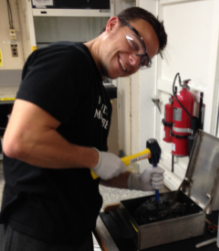

[broken link](https://mmkkdddd.com)

## Michael D. Lee, Ph.D.

#### Bioinformatician exploring microbial ecology and evolution

*Email:*   Mike.Lee@nasa.gov  
  
  
  
{:target="_blank"}

**Current positions**  
*NASA GeneLab Bioinformatician*  
*BMSIS Research Scientist*  

**Affiliations**  
[*NASA*](https://www.nasa.gov/){:target="_blank"}  
[*NASA GeneLab*](https://genelab.nasa.gov/){:target="_blank"}  
[*Blue Marble Space Institute of Science*](https://www.bmsis.org/){:target="_blank"}  

**Education**  
* A.S. General Science ([Ocean County College](https://www.ocean.edu/){:target="_blank"}, NJ, USA, 2011)  
* B.S. Biology ([Kean University](https://www.kean.edu/){:target="_blank"}, NJ, USA, 2013)  
* Ph.D. Biology ([University of Southern California](https://www.usc.edu/){:target="_blank"}, CA, USA, 2018)  

**Research summary**  
I'm a bioinformatician with [NASA GeneLab](https://genelab.nasa.gov/){:target="_blank"} and a research scientist with [Blue Marble Space Institute of Science](https://www.bmsis.org/){:target="_blank"} located at NASA's Ames Research Center in northern California, USA. I focus primarily on microbial ecology and evolution in all kinds of different systems ranging from the bottoms of our oceans up to the International Space Station 👽

*Publication groupings*:  
- [Michael D. Lee, Ph.D.](#michael-d-lee-phd)
    - [Bioinformatician exploring microbial ecology and evolution](#bioinformatician-exploring-microbial-ecology-and-evolution)
- [Software](#software)
  - [GToTree{:target="\_blank"}](#gtotreetarget_blank)
  - [Bioinformatics Tools (bit){:target="\_blank"}](#bioinformatics-tools-bittarget_blank)
  - [Publications](#publications)
    - [**Space Biology**](#space-biology)
    - [**Astrobiology**](#astrobiology)
    - [**Marine Microbes**](#marine-microbes)
    - [**Software, platforms, workflows, and education**](#software-platforms-workflows-and-education)
    - [**CoVID-19**](#covid-19)
    - [**Aquaponics**](#aquaponics)
    - [**Genome Announcements**](#genome-announcements)

<!--**CV**  
[Lee_CV_2020.pdf](/research/Lee_CV_Feb_2020.pdf){:target="_blank"}  
-->

---
---
 

## Software

### [GToTree](https://github.com/AstrobioMike/GToTree/wiki){:target="_blank"}
* Genome-level evolutionary inference (i.e. phylogenomics) is becoming an increasingly essential step in many biologists’ work. [GToTree](https://github.com/AstrobioMike/GToTree/wiki/what-is-gtotree%3F){:target="_blank"} is a comprehensive, user-friendly workflow for phylogenomics that greatly simplifies the computational work required of researchers to generate phylogenomic trees. [Code](https://github.com/AstrobioMike/GToTree){:target="_blank"}; [Publication](https://doi.org/10.1093/bioinformatics/btz188){:target="_blank"}; [Wiki](https://github.com/AstrobioMike/GToTree/wiki){:target="_blank"}  

### [Bioinformatics Tools (bit)](https://github.com/AstrobioMike/bit#bioinformatics-tools-bit){:target="_blank"}
* [bit](https://github.com/AstrobioMike/bit#bioinformatics-tools-bit){:target="_blank"} holds a collection of scripts and small programs I've written over time that I use frequently enough that it's been worth it for me to package them through [conda](https://conda.io/docs/){:target="_blank"} to make them available to me and others anywhere. [Code](https://github.com/AstrobioMike/bit#bioinformatics-tools-bit){:target="_blank"}; [Publication](https://doi.org/10.12688/f1000research.79530.1){:target="_blank"}; [Documentation](https://github.com/AstrobioMike/bit#bioinformatics-tools-bit){:target="_blank"}  

 

---
---
 

### Publications

#### **Space Biology**

  

**Lee, M.D.**, O'Rourke, A., Lorenzi, H., Bebout, B.M., Dupont, C.L., and Everroad, R.C. (2021). [Reference-guided metagenomics reveals genome-level evidence of potential microbial transmission from the ISS environment to an astronaut's microbiome](https://doi.org/10.1016/j.isci.2021.102114){:target="_blank"}. *iScience*.  
[PDF download](https://www.cell.com/action/showPdf?pii=S2589-0042%2821%2900082-1){:target="_blank"}  

  

O'Rourke, A. and **Lee, M.D.**, Nierman, W.C., Everroad, R.C., and Dupont, C.L. (2020). [Genomic and phenotypic characterization of *Burkholderia* isolates from the potable water system of the International Space Station](https://doi.org/10.1371/journal.pone.0227152){:target="_blank"}. *PLoS ONE*.  
[PDF download](https://journals.plos.org/plosone/article/file?id=10.1371/journal.pone.0227152&type=printable){:target="_blank"}  

#### **Astrobiology**

  

Zajkowski, T., **Lee, M.D.**, Mondal, S.S., Carbajal, A., Dec, R., Brennock, P.D., Piast, R.W., Snyder, J.E., Bense, N.B., Dzwolak, W., Jarosz, D.F., and Rothschild, L.J. (2021). [The hunt for ancient prions: Archaeal prion-like domains form amyloid-based epigenetic elements](https://doi.org/10.1093/molbev/msab010){:target="_blank"}. *Molecular Biology and Evolution*.  
[PDF download](/research/Zajkowski-et-al-2021.pdf){:target="_blank"}  

  

Seyler, L., Kujawinski, E.B., Azua-Bustos, A., **Lee, M.D.**, Marlow, J., Perl, S.M., and Cleaves II, H.J (2020). [Metabolomics As an Emerging Tool in the Search for Astrobiologically Relevant Biomarkers](https://doi.org/10.1089/ast.2019.2135){:target="_blank"}. *Astrobiology*.  
[PDF download](https://www.liebertpub.com/doi/pdf/10.1089/ast.2019.2135){:target="_blank"}  

  

O'Rourke, A.O., Zoumplis, A., Wilburn, P., **Lee, M.D.**, Lee, Z., Vecina, M., and Mercader, K. (2020). [Following the Astrobiology roadmap: origins, habitability, and future exploration](https://doi.org/10.21775/9781912530304){:target="_blank"}. Book chapter in *Astrobiology: current, evolving, and emerging perspectives* by Caister Academic Press.  
[PDF download](https://doi.org/10.21775/9781912530304.01){:target="_blank"}  

  

Momper, L.M., Jungbluth, S.P., **Lee, M.D.**, and Amend, J.P. (2017). [Energy and carbon metabolisms in a deep terrestrial subsurface fluid microbial community](https://doi.org/10.1038/ismej.2017.94){:target="_blank"}. *ISMEJ*.  
[PDF download](/research/Momper_et_al_2017_ISME.pdf){:target="_blank"}  

  

**Lee, M.D.**, Walworth, N.G., Sylvan, J.B., Edwards, K.J., and Orcutt, B.N. (2015). [Microbial communities on seafloor basalts at Dorado Outcrop reflect level of alteration and highlight global lithic clades](https://doi.org/10.3389/fmicb.2015.01470){:target="_blank"}. *Frontiers in Microbiology*.  
[PDF download](/research/Lee_et_al_2015_FrontMicro.pdf){:target="_blank"}  

#### **Marine Microbes**

  

Walworth, N.G., Saito, M.A., **Lee, M.D.**, McIlvin, M.R., Moran, D.M., Kellogg, R.M., Fu, F-X., Hutchins, D.A., and Webb, E.A. (2022). [Why environmental biomarkers work: transcriptome–proteome correlations and modeling of multistressor experiments in the marine bacterium *Trichodesmium*](https://doi.org/10.1021/acs.jproteome.1c00517){:target="_blank"}. *Journal of Proteome Research*  
[PDF download](Walworth-et-al-2022.pdf){:target="_blank"}

  

Qu, P., Fu, F-X., Wang, X-W., Kling, J.D., Elghazzawy, M., Huh, M., Zhou, Q-Q., Want, C., Wing Kwan Mak, E., **Lee, M.D.**, Yang, N., and Hutchins, D. (2022). [Two co-dominant nitrogen-fixing cyanobacteria demonstrate distinct acclimation and adaptation responses to cope with ocean warming](https://doi.org/10.1111/1758-2229.13041){:target="_blank"}. *Environmental Microbiology Reports*  
[PDF download](Qu-et-al-2022.pdf){:target="_blank"}

  

Maza-Márquez, P., **Lee, M.D.**, Detweiler, A.M., and Bebout, B.M. (2022). [Millimeter-scale vertical partitioning of nitrogen cycling in hypersaline mats reveals prominence of genes encoding multi-heme and prismane proteins](https://doi.org/10.1038/s41396-021-01161-z){:target="_blank"}. *ISMEJ*  
[PDF download](https://doi.org/10.1038/s41396-021-01161-z){:target="_blank"}

  

McParland, E.L., **Lee, M.D.**, Webb, E.A., Alexander, H., and Levine, N.M. (2021). [DMSP synthesis genes distinguish two types of DMSP producer phenotypes](https://doi.org/10.1111/1462-2920.15393){:target="_blank"}. *Environmental Microbiology*.  
[PDF download](https://sfamjournals.onlinelibrary.wiley.com/doi/epdf/10.1111/1462-2920.15393){:target="_blank"}  

  

Maza-Márquez, P., **Lee, M.D.**, and Bebout, B.M. (2021). [The Abundance and Diversity of Fungi in a Hypersaline Microbial Mat from Guerrero Negro, Baja California, México](https://doi.org/10.3390/jof7030210){:target="_blank"}. *Journal of Fungi*.  
[PDF download](https://www.mdpi.com/2309-608X/7/3/210/pdf){:target="_blank"}  

  

Walworth, N.G., **Lee, M.D.**, Dolzhenko, E., Fu, F-X., Smith, A.D., Webb, E.A., and Hutchins, D.A. (2020). [Long-Term m5C Methylome Dynamics Parallel Phenotypic Adaptation in the Cyanobacterium *Trichodesmium*](https://doi.org/10.1093/molbev/msaa256){:target="_blank"}. *Molecular Biology and Evolution*.  
[PDF download](Walworth-et-al-2020.pdf){:target="_blank"}  

  

**Lee, M.D.**, Ahlgren, N.A., Kling, J. D., Walworth, N.G., Rocap, G., Saito, M.A., Hutchins, D.A., and Webb, E.A. (2019). [Marine *Synechococcus* isolates representing globally abundant genomic lineages demonstrate a unique evolutionary path of genome reduction without a decrease in GC content](https://doi.org/10.1111/1462-2920.14552){:target="_blank"}. *Environmental Microbiology*.  
[PDF download](/research/Lee_et_al_2019_EnvMicro.pdf){:target="_blank"}

  

Ahlgren, N.A., Belisle, B.S., and **Lee, M.D.** (2019). [Genomic mosaicism underlies the adaptation of marine Synechococcus ecotypes to distinct oceanic iron niches](https://doi.org/10.1111/1462-2920.14893){:target="_blank"}. *Environmental Microbiology*.  
[PDF download](Ahlgren_et_al_2019_Syn_EM.pdf){:target="_blank"}  

  

Kling, J.D., **Lee, M.D.**, Fu, F-X., Phan, M.D., Wang, X., Qu, P., and Hutchins, D.A. (2019). [Transient exposure to unusually high temperatures reshapes coastal phytoplankton communities](https://www.nature.com/articles/s41396-019-0525-6){:target="_blank"}. *ISME*.  
[PDF download](Kling_et_al_2019_ISME.pdf){:target="_blank"}  

  

**Lee, M.D.**, Kling, J.D., Araya, R., and Ceh, J. (2018). [Jellyfish life stages shape associated microbial communities, while a core microbiome is maintained across all](https://doi.org/10.3389/fmicb.2018.01534){:target="_blank"}. *Frontiers in Microbiology*.  
[PDF download](Lee_et_al_2018_Front_Micro.pdf){:target="_blank"}  

  

**Lee, M.D.**, Walworth, N.G., McParland, E.L., Fu, F.-X., Mincer, T.J., Levine, N.M., Hutchins, D.A., and Webb, E.A. (2017). [The *Trichodesmium* consortium: conserved heterotrophic co-occurrence and genomic signatures of potential interactions](https://doi.org/10.1038/ismej.2017.49){:target="_blank"}. *ISMEJ*.  
[PDF download](/research/Lee_et_al_2017_ISME.pdf){:target="_blank"}  

  

**Lee, M.D.**, Webb, E.A., Walworth, N.G., Fu, F.-X., Held, N.A., Saito, M.A., and Hutchins, D.A. (2017). [Transcriptional activities of the microbial consortium living with the marine nitrogen-fixing cyanobacterium *Trichodesmium* reveal potential roles in community-level nitrogen cycling](https://doi.org/10.1128/AEM.02026-17){:target="_blank"}. *Applied and Environmental Microbiology*.  
[PDF download](/research/Lee_et_al_2017_AEM.pdf){:target="_blank"}  

  

Walworth, N.G. and **Lee, M.D.**, Suffridge, C., Qu, P., Fu, F-X., Saito, M.A., Webb, E.A., Sañudo-Wilhelmy, S.A., and Hutchins, D.A (2017). [Functional genomics and phylogenetic evidence suggest genus-wide cobalamin production by the globally distributed marine nitrogen fixer Trichodesmium](https://doi.org/10.3389/fmicb.2018.00189){:target="_blank"}. *Frontiers in Microbiology*.  
[PDF download](/research/Walworth_Lee_et_al_2018_FrontMicro.pdf){:target="_blank"}  

  

Walworth, N.G., Fu., F-X., **Lee, M.D.**, Cai, X., Saito, M.A., Webb, E.A., and Hutchins, D.A (2017). [Nutrient co-limited *Trichodesmium* as nitrogen source or sink in a future ocean](https://doi.org/10.1128/AEM.02137-17){:target="_blank"}. *Applied and Environmental Microbiology*.  
[PDF download](/research/Walworth_et_al_2017_AEM.pdf){:target="_blank"}  

  

Hutchins, D.A., Fu, F.-X., Walworth, N.G., **Lee, M.D.**, Saito, M.A., and Webb, E.A. (2017). [Comment on “The complex effects of ocean acidification on the prominent N2-fixing cyanobacterium *Trichodesmium*”](https://doi.org/10.1126/science.aao0067){:target="_blank"}. *Science*.  
[PDF download](/research/Hutchins_et_al_2017_Science.pdf){:target="_blank"}  

  

Walworth, N.G., Hutchins, D.A., Dolzhenko, E., **Lee, M.D.**, Fu., F-X., Smith, A.D., and Webb, E.A. (2017). [Biogeographic conservation of the cytosine epigenome in the globally important marine, nitrogen-fixing cyanobacterium *Trichodesmium*](https://doi.org/10.1111/1462-2920.13934){:target="_blank"}. *Environmental Microbiology*.  
[PDF download](/research/Walworth_et_al_2017_EnvMicro.pdf){:target="_blank"}  

  

Ramirez, G.A., Hoffman, C.L., **Lee, M.D.**, Lesniewski, R.A., Barco, R., Garber, A., Toner, B.M., Wheat, C.G., Edwards, K.J., Orcutt, B.N. (2016). [Assessing marine microbial induced corrosion monitored in Santa Catalina Island, California](https://doi.org/10.3389/fmicb.2016.01679){:target="_blank"}. *Frontiers in Microbiology*.  
[PDF download](/research/Ramirez_et_al_2016_FrontMicro.pdf){:target="_blank"}  

  

Walworth, N.G., **Lee, M.D.**, Fu, F.-X., Hutchins, D.A., and Webb, E.A. (2016). [Molecular and physiological evidence of genetic assimilation to high CO2 in the marine nitrogen fixer *Trichodesmium*](https://doi.org/10.1073/pnas.1605202113){:target="_blank"}. *PNAS*.   
[PDF download](/research/Walworth_et_al_2016_PNAS.pdf){:target="_blank"}  

  

Walworth, N.G., Fu, F.-X., Webb, E.A., Saito, M.A., Moran, D., McIlvin, M.R., **Lee, M.D.**, and Hutchins, D.A. (2016). [Mechanisms of increased *Trichodesmium* fitness under iron and phosphorus co-limitation in the present and future ocean](https://doi.org/10.1038/ncomms12081){:target="_blank"}. *Nature Communications*.   
[PDF download](/research/Walworth_et_al_2016_NatCom.pdf){:target="_blank"}  

#### **Software, platforms, workflows, and education**

  

**Lee, M.D.** (2022). [bit: a multipurpose collection of bioinformatics tools](https://doi.org/10.12688/f1000research.79530.1){:target="_blank"}. *F1000Research*.  
[PDF download](https://f1000research.com/articles/11-122/v1/pdf?article_uuid=85d81770-170f-4d30-90f7-751701ee239d){:target="_blank"}  
[Software](https://github.com/AstrobioMike/bit){:target="_blank"} | [Documentation](https://github.com/AstrobioMike/bit#bioinformatics-tools-bit){:target="_blank"}  

  

Tully, B.J., Buongiorno, J., Cohen, A.B., Cram, J.A., Garber, A.I., Hu, S.K., et al. (2021). [The Bioinformatics Virtual Coordination Network: An Open-Source and Interactive Learning Environment](https://doi.org/10.3389/feduc.2021.711618){:target="_blank"}. *Frontiers in Education*.  
[PDF download](/research/Tully-et-al-Frontiers-2021.pdf){:target="_blank"}  

  

Overbey, E.G., Saravia-Butler, A.M., Zhang, Z., Rathi, K.S., Fogle, H., da Silveira, W.A., et al. (2021). [NASA GeneLab RNA-seq consensus pipeline: Standardized processing of short-read RNA-seq data](https://doi.org/10.1016/j.isci.2021.102361){:target="_blank"}. *iScience*.  
[PDF download](https://www.sciencedirect.com/science/article/pii/S2589004221003291/pdfft?isDTMRedir=true&download=true){:target="_blank"}  

  

Eren, A.M., Kiefl, E., Shaiber, A., Veseli, E., Miller, S.E., Schechter, M.S., et al. (2020). [Community-led, integrated, reproducible multi-omics with anvi’o](https://www.nature.com/articles/s41564-020-00834-3){:target="_blank"}. *Nature Microbiology*.  
[PDF download](https://www.nature.com/articles/s41564-020-00834-3.pdf){:target="_blank"}  

  

**Lee, M.D.** (2019). [GToTree: a user-friendly workflow for phylogenomics](https://doi.org/10.1093/bioinformatics/btz188){:target="_blank"}. *Bioinformatics*.  
[PDF download](https://academic.oup.com/bioinformatics/advance-article-pdf/doi/10.1093/bioinformatics/btz188/28405135/btz188.pdf){:target="_blank"}  
[Software](https://github.com/AstrobioMike/GToTree){:target="_blank"} | [Documentation](https://github.com/AstrobioMike/GToTree/wiki){:target="_blank"}  

  

**Lee, M.D.** (2019). [Applications and considerations of GToTree: a user-friendly workflow for phylogenomics](https://doi.org/10.1177%2F1176934319862245){:target="_blank"}. *Evolutionary Bioinformatics*.  
[PDF download](https://journals.sagepub.com/doi/pdf/10.1177/1176934319862245){:target="_blank"}  

  

**Lee, M.D.** (2019). [Happy Belly Bioinformatics: an open-source resource dedicated to helping biologists utilize bioinformatics](https://doi.org/10.21105/jose.00053){:target="_blank"}. *The Journal of Open-Source Education*.  
[PDF download](https://www.theoj.org/jose-papers/jose.00053/10.21105.jose.00053.pdf){:target="_blank"}

#### **CoVID-19**

  

Jochum, M., **Lee, M.D.**, Curry, K., Zaksas, V., Vitalis, E., Treangen, T., Aagaard, K., and Ternus, K. (2022). [Analysis of bronchoalveolar lavage fluid metatranscriptomes among patients with COVID-19 disease
](https://doi.org/10.1038/s41598-022-25463-0){:target="_blank"}. *Scientific Reports*.  
[PDF download](https://www.nature.com/articles/s41598-022-25463-0.pdf){:target="_blank"}  

  

Sapoval, N., Mahmoud, M., Jochum, M., Liu, Y., Elworth, R.A.L., Wang, Q., Albin, D., Ogilvie, H., **Lee, M.D.**, Villapol, S., Hernandez, K., Berry, I.M., Foox, J., Beheshti, A., Ternus, K., Aagaard, K., Posada, D., Mason, C., Sedlazeck, F.J., and Trangen, T.J. (2021). [Hidden genomic diversity of SARS-CoV-2: implications for qRT- PCR diagnostics and transmission](https://doi.org/10.1101/gr.268961.120){:target="_blank"}. *Genome Research.*  
[PDF download](https://genome.cshlp.org/content/early/2021/02/18/gr.268961.120.full.pdf+html){:target="_blank"}  

#### **Aquaponics**

  

Day, J.A.,Diener, C., Otwell, A.E., Tams, K.E., Bebout, B.M., Detweiler, A.M., **Lee, M.D.**, Scott, M.T., Ta, W., Ha, M., Carreon, S.A., Tong, K., Ali, A.A., Gibbons, S.M., and Baliga, N.S.  (2021). [Lettuce (*Lactuca sativa*) productivity influenced by microbial inocula under nitrogen-limited conditions in aquaponics](https://doi.org/10.1371/journal.pone.0247534){:target="_blank"}. *PLOS ONE.*  
[PDF download](https://journals.plos.org/plosone/article/file?id=10.1371/journal.pone.0247534&type=printable){:target="_blank"}  

#### **Genome Announcements**

  

Becket, E. et al. (2020). [Draft Genome Sequences of Bacillus glennii V44-8, Bacillus saganii V47-23a, Bacillus sp. Strain V59.32b, Bacillus sp. Strain MER_TA_151, and Paenibacillus sp. Strain MER_111, Isolated from Cleanrooms Where the Viking and Mars Exploration Rover Spacecraft Were Assembled](https://mra.asm.org/content/9/26/e00354-20){:target="_blank"}. *Microbiology Resource Announcements*.  
[PDF download](https://mra.asm.org/content/ga/9/26/e00354-20.full.pdf){:target="_blank"} 

  

Sharma, I. and **Lee, M.D.** (2019). [Draft Genome Sequence of Cyclobacterium marinum Strain Atlantic-IS, Isolated from the Atlantic Slope off the Coast of Virginia, USA](https://mra.asm.org/content/8/50/e01089-19){:target="_blank"}. *Microbiology Resource Announcements*.  
[PDF download](https://mra.asm.org/content/ga/8/50/e01089-19.full-text.pdf){:target="_blank"} 

---

