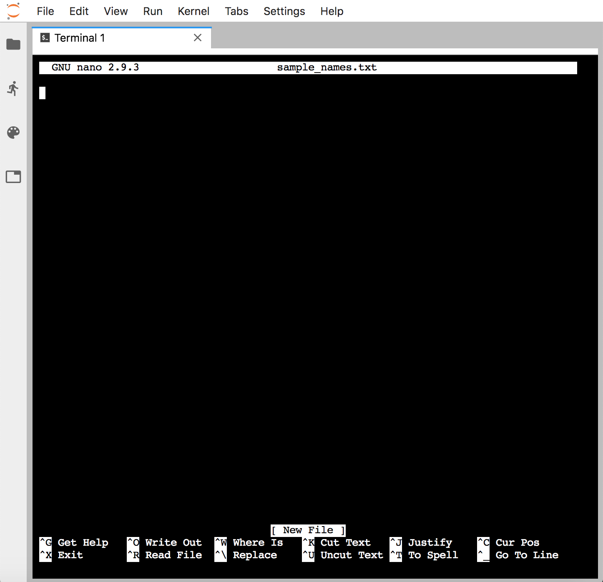
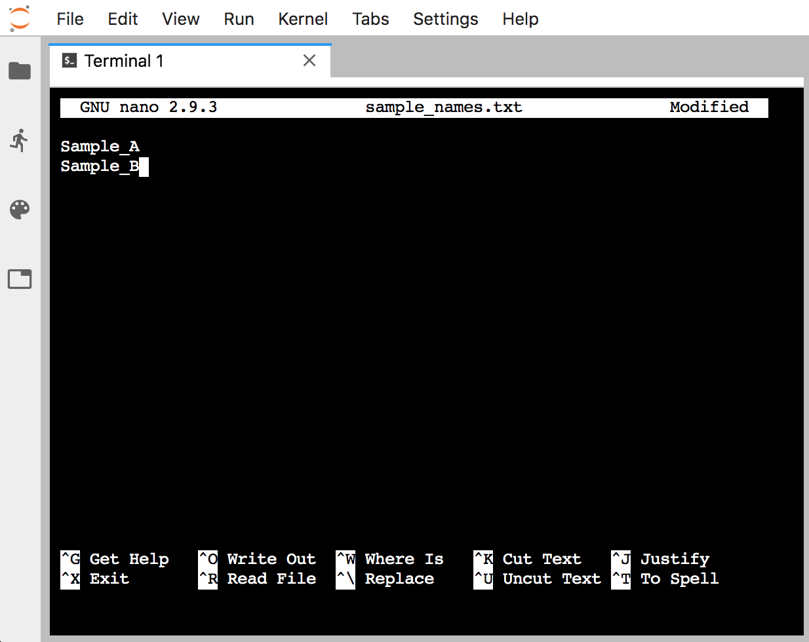



<hr>
<center>This is part 2 of 5 of an <a href="/stamp2019/unix-crash-course" target="_blank">introduction to Unix</a>. If you'd like to follow along, but need to pull up the proper working environment, visit <a href="/stamps2019/getting-started#accessing-our-command-line-environment" target="_blank">here</a> and then come back 🙂</center>
<hr>
<hr style="height:10px; visibility:hidden;" />

> **Things covered here:**
> * Working with files
> * What a plain-text file is
> * Introduction to a command-line text editor: **`nano`**
> * Working with directories

<hr style="height:10px; visibility:hidden;" />

---
<hr style="height:10px; visibility:hidden;" />

# Working with files

<hr style="height:1px; visibility:hidden;" />

>To be sure we are still working in the same place, let's run: 
>```bash
>cd ~/unix_intro
>```

<hr style="height:5px; visibility:hidden;" />

We will often want to get a look at a file to see how it's structured. We've already used a very common tool for peeking at files, the **`head`** command. There is also **`tail`**, which prints the last 10 lines of a file:

```bash
head example.txt
tail example.txt
```

This is especially helpful if a file is particularly large, as **`head`** will just print the first ten lines and stop. This means it will be just as instantaneous whether the file is 10KB or 10GB. 

Another standard useful program for viewing the contents of a file is **`less`**. This opens a searchable, read-only program that allows you to scroll through the document: 

```bash
less example.txt
```

To exit the **`less`** program, press the "**q**" key. 

The **`wc`** (**w**ord **c**ount) command is useful for counting how many lines, words, and characters there are in a file: 

```bash
wc example.txt
```

<hr style="height:1px; visibility:hidden;" />
<challengeBlock>
<center><b>QUICK PRACTICE!</b></center>

How can we get <i>only</i> the number of lines in a file from the <htmlCode>wc</htmlCode> command?
<br>

<div class="wrap-collabsible">
  <input id="q1" class="toggle" type="checkbox">
  <label for="q1" class="lbl-toggle">Solution</label>
  <div class="collapsible-content">
    <div class="content-inner">
		<pre>wc -l example.txt</pre>

Adding the optional flag <htmlCode>-l</htmlCode> will print just how many lines are in a file. We could find this out by running <htmlCode>wc --help</htmlCode> or by visiting our good friend Google 🙂 
<br>
<br>
<center>Printing out how many lines are in a file like this is super-useful for things like quickly seeing how many rows are in a large table, or how many sequences are in a file.</center>
		
    </div>
  </div>
</div>
</challengeBlock>
<hr style="height:10px; visibility:hidden;" />

The most common command-line tools like these and many others we'll see are mostly only useful for operating on what are known as **plain-text files** – also referred to as "flat files". 

<hr style="height:10px; visibility:hidden;" />
## BONUS ROUND: What's a plain-text file?
A general definition of a plain-text file is a text file that doesn't contain any special formatting characters or information, and that can be properly viewed and edited with any standard text editor.  

Common types of plain-text files are those ending with extensions like ".txt", ".tsv" (**t**ab-**s**eparated **v**alues), or ".csv" (**c**omma **s**eparated **v**alues). Some examples of common file types that are *not* plain-text files would be ".docx", ".pdf", or ".xlsx". This is because those file formats contain special types of compression and formatting information that are only interpretable by programs specifically designed to work with them.  

> **A note on file extensions**<br>
> File extensions themselves do not actually do anything to the file format. They are *mostly* there just for our convenience/organization – "mostly" because some programs require a specific extension to be present for them to even try interacting with a file. But this has nothing to do with the file contents, just that the program won't let you interact with it unless it has a specific extension.

<hr style="height:10px; visibility:hidden;" />
# Copying, moving, and renaming files

<hr style="height:1px; visibility:hidden;" />
<div class="warning">
<center><h2>WARNING!</h2></center>
<b>Using commands that do things like create, copy, and move files at the command line will overwrite files if they have the same name. And using commands that delete things will do so permanently. Use caution while getting used to things – and then forever after</b> 🙂
</div>
<hr style="height:10px; visibility:hidden;" />

The commands **`cp`** and **`mv`** (**c**o**p**y and **m**o**v**e) have the same basic structure. They both require two positional arguments – the first is the file you want to act on, and the second is where you want it to go (which can include the name you want to give it). 

To see how this works, let's make a copy of "example.txt":

```bash
ls
cp example.txt example_copy.txt
ls
```

By just giving the second argument a name and nothing else (meaning no path in front of the name), we are implicitly saying we want it copied to where we currently are. 

To make a copy and put it somewhere else, like in our subdirectory "data", we could change the second positional argument using a **relative path** ("relative" because it starts from where we currently are):

```bash
ls data/
cp example.txt data/example_copy.txt
ls data/
```

To copy it to that subdirectory but keep the same name, we could type the whole name out, but we can also just provide the directory but leave off the file name:

```bash
cp example.txt data/
ls data/
```

If we wanted to copy something *from somewhere else to our current working directory* and keep the same name, we can use another special character, a period (**`.`**), which specifies the current working directory:

```bash
ls
cp experiment/notes.txt .
ls
```

The **`mv`** command is used to move files. Let's move the "example_copy.txt" file into the "experiment" subdirectory:

```bash
ls
ls experiment/
mv example_copy.txt experiment/
ls
ls experiment/
```

The **`mv`** command is also used to *rename* files. This may seem strange at first, but remember that the path (address) of a file actually includes its name too (otherwise everything in the same directory would have the same path). 

```bash
ls
mv notes.txt notes_old.txt
ls
```

To delete files there is the **`rm`** command (**r**e**m**ove). This requires at least one argument specifying the file we want to delete. But again, caution is warranted. There will be no confirmation or retrieval from a waste bin afterwards.

```bash
ls
rm notes_old.txt
ls
```

<hr style="height:10px; visibility:hidden;" />
# A terminal text editor
It is often very useful to be able to generate new plain-text files quickly at the command line, or make some changes to an existing one. One way to do this is using a text editor that operates at the command line. Here we're going to look at one program that does this called **`nano`**.

When we run the command **`nano`** it will open a text editor in our terminal window. If we give it a file name as a positional argument, it will open that file if it exists, or it will create it if it doesn't. Here we'll make a new file:

```bash
nano sample_names.txt
```

When we press **`return`**, our environment changes to this:

<center></center>
<br>

Now we can type as usual. Type in a couple of sample names, one on each line – it doesn't matter what the names are: 

<center></center>
<br>

<hr style="height:10px; visibility:hidden;" />

Afterwards, to save the file and exit, we need to use some of the keyboard shortcuts listed on the bottom. "WriteOut" will save our file, and the **`^O`** represents pressing **`ctrl + o`** together (it doesn't need to be a capital "O"). This will ask us to either enter or confirm the file name, we can just press **`return`**. Now that it is saved, to exit we need to press **`ctrl + x`**. 

And now our new file is in our current working directory:

```bash
ls
head sample_names.txt
```

<hr style="height:1px; visibility:hidden;" />
>**NOTE:** Quickly <a href="https://www.google.com/search?q=how+to+exit+nano" target="_blank">googling</a> how to get out of things like **`nano`** the first 15 times we use them is 100% normal!

<hr style="height:10px; visibility:hidden;" />
# Working with directories
Commands for working with directories for the most part operate similarly. We can make a new directory with the command **`mkdir`** (for **m**a**k**e **dir**ectory): 

```bash
ls
mkdir subset
ls
```

And similarly, directories can be deleted with **`rmdir`** (for **r**e**m**ove **dir**ectory):

```bash
rmdir subset/
ls
```

The command line is a little more forgiving when trying to delete a directory. If the directory is not empty, **`rmdir`** will give you an error. 

```bash
rmdir experiment/
```

<hr style="height:25px; visibility:hidden;" />

---
<br>

# Summary
So far we've only seen individual commands and printing information to the screen. This is useful for in-the-moment things, but not so much for getting things done. Next we're going to start looking at some of the things that make the command line so versatile and powerful, starting with [redirectors and wildcards!](/stamps2019/wild-redirectors)

<h4><i>Commands introduced:</i></h4>

|Command     |Function          |
|:----------:|------------------|
|**`tail`**      |prints the last lines of a file|
|**`less`**      |allows us to browse a file (exit with **`q`** key)|
|**`wc`**       |count lines, words, and characters in a file|
|**`cp`**      |copy a file or directory |
|**`mv`**      |move or rename a file or directory |
|**`rm`**      |delete a file or directory |
|**`mkdir`**       |create a directory|
|**`rmdir`**     |delete an empty directory|
|**`nano`**     |create and edit plain text files at the command line|


<h4><i>Special characters introduced:</i></h4>

|Characters     | Meaning          |
|:----------:|------------------|
| **`.`** | specifies the current working directory |

<hr style="height:20px; visibility:hidden;" />

---
---

<h5><a href="/stamps2019/getting-started" style="float: left"><b>Previous:</b> 1. Getting started</a>

<a href="/stamps2019/wild-redirectors" style="float: right"><b>Next:</b> 3. Redirectors and wildcards</a></h5>
