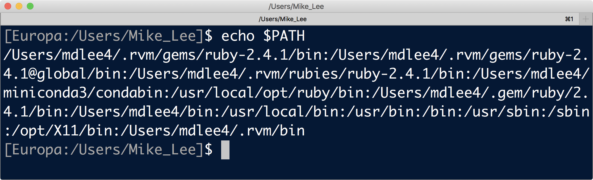
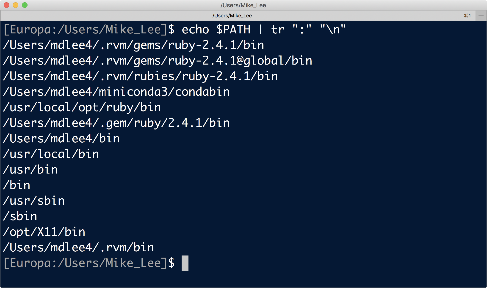
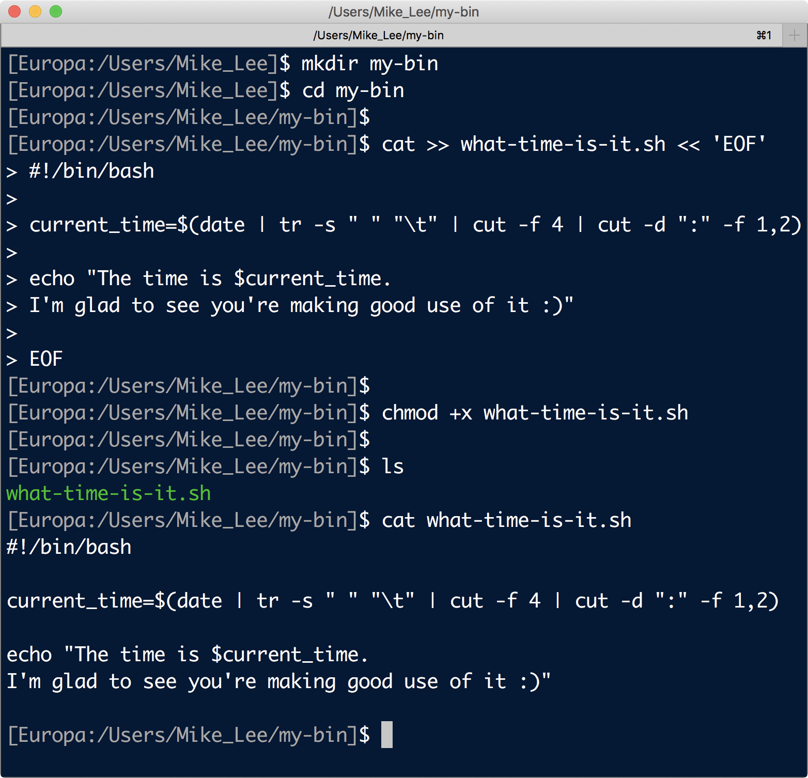
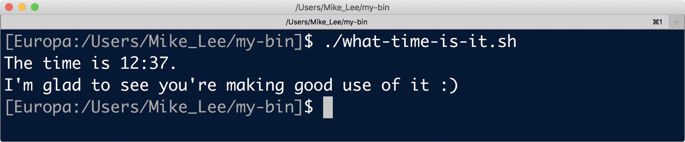
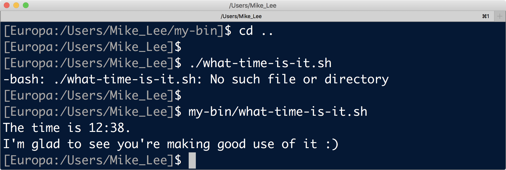
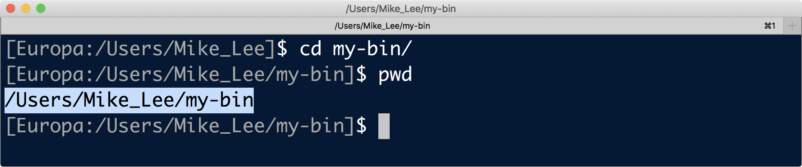
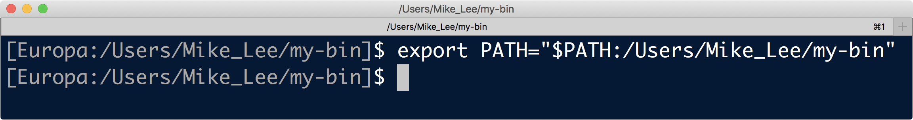
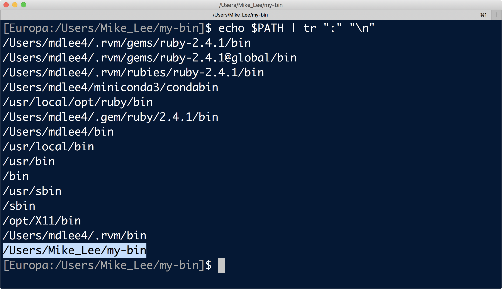
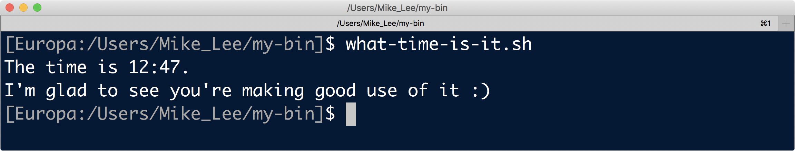
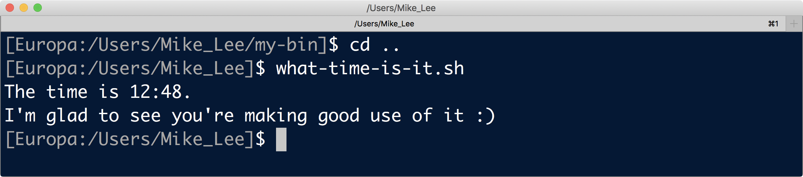





When I was starting out, the whole concept of what the "PATH" was and what it did was way more confusing to me than it needed to be. For some reason I just didn't come across a straightforwrard explanation for a long time (or wasn't paying attention or understanding if I had...). If the "PATH" is still a nebulous concept for you, then you've come to the right place 🙂  

<hr style="height:10px; visibility:hidden;" />

---
---
<br>
# The PATH demystified
As mentioned in the [intro to Unix section](/unix/unix-intro){:target="_blank"}, one of the easiest mistakes to make at the command line is to be trying to specify a file or program that isn't where we think it is. For files, we usually point to where the file is (if it's not in our current working directory) using the [*absolute* or *relative* path](/unix/getting-started#absolute-vs-relative-path){:target="_blank"}, where "path" here, in lowercase, just means a sort of address in the computer. But for programs that we use often, we usually want to be able to call them without having to provide the complete path to wherever the program is located. So a big part of getting specific programs to work properly at the command line is having them in a location on the computer that you can access no matter [where you are](/unix/getting-started#the-unix-file-system-structure){:target="_blank"}.  

The command line automatically checks in a list of pre-defined locations (directories) everytime you are trying to call a certain command. This is why we can use certain commands like **`ls`** and **`pwd`** and such from any directory we happen to be in. This list of pre-designated directories is stored in a special variable called the "PATH" (all caps required). You can see your PATH, and which directories are stored in it, by entering **`echo $PATH`** at the command line (the **`$`** is used to call variables in bash and other Unix languages; see the [variables](/unix/for-loops#variables){:target="_blank"} if new to this). Here's a look at mine:

<center></center>

<br>
This is a colon-delimited list of all the directories the command line looks in by default for programs. To make it a little friendlier to glance at, we can change the colons to newline characters by [piping](/unix/wild-redirectors#redirectors){:target="_blank"} the output of **`echo $PATH`** into **`tr`**, one of our [six glorious commands](/unix/six-glorious-commands#tr){:target="_blank"}, to change the colons to newline characters for a more user-friendly output: 

```bash
echo $PATH | tr ":" "\n"
```

<center></center>

<br>
We can now more clearly see this is a list of directories. All of these places, stored in the variable called "PATH", are searched whenever we are typing a command in the terminal window. If the command we are trying to use is present in any of the directories listed in our PATH, we don't need to point at its specific location in full (its path, lowercase) when we are trying to use it – which is of course nice for things we use often. 

**To make a program available anywhere, we can either place that program in a directory that's already in our PATH, or we can add a new directory to our PATH that contains the program.** (Keep in mind that the order in which things appear in your PATH *does* matter. If you have two versions of a program with the same name, whichever shows up first will be the one that's used.)  

<hr style="height:10px; visibility:hidden;" />

---
---
<br>

# Adding a directory to your PATH
To demonstrate how to add a directory to your PATH, we're going to create a new directory and within it make a quick *bash* script that tells us what time it is. We're then going to add that directory to our PATH so that we can use the time-telling script from anywhere. If you want to follow along, you can make both by copying and pasting the following code block. If the following is confusing to you at first glance, running through the [Unix crash course](/unix/unix-intro){:target="_blank"} will get you almost entirely up to speed. For now, this is about the PATH though, so don't worry too much about any minor details of this script – though a quick explanation follows 🙂

```bash
mkdir my-bin
cd my-bin

cat >> what-time-is-it.sh << 'EOF'
#!/bin/bash

current_time=$(date | tr -s " " "\t" | cut -f 4 | cut -d ":" -f 1,2)

echo "The time is $current_time.
I'm glad to see you're making good use of it :)"

EOF

chmod +x what-time-is-it.sh

ls
cat what-time-is-it.sh
```

<center></center>

<br>
Ok great, so we just wrote a program that tells us what time it is according to our computer. That `cat >> what-time-is-it.sh << 'EOF'` line is say to put whatever we type that follows into that file we are just creating, up until we type "EOF". Then for the little example script: **`#!/bin/bash`** tells the computer which program to use when executing the script; the **`current_time`** line is us setting a variable, called "current_time", and storing within it the time that we use some *unix* magic to cut out of what the command **`date`** outputs; and then we are having it **`echo`** out the sentences (print to the terminal) and inserting the variable **`$current_time`**. Note the **`$`** here is just calling the variable in the same way as when we did **`echo $PATH`** above. The last little part **`chmod +x what_time_is_it.sh`** is changing the properties of the file so that the computer knows it's a program and will let us execute it more conveniently. 

Let's give it shot now. At the moment, the "what-time-is-it.sh" script is *not* in our PATH. It exists only in the directory we are sitting in, and that directory is *not* in the list of directories that pops up when we run **`echo $PATH`**. So right now, to execute the program, we need to tell the computer where it is with its [relative or absolute path](/unix/getting-started#absolute-vs-relative-path){:target="_blank"}. *Executing* a file is different than *doing something to it* like we did with the **`cat`** command). And to *execute* a program, we need to be a bit more explicit even if it's sitting in our current working directory. Here we'll use the relative path, which looks like this:

```bash
./what_time_is_it.sh
```

<center></center>

<br>
And note, if we are not in this working directory that contains the script, we have to point to it in much the same way. Here, let's move up one level and try again:

```bash
cd ..

./what-time-is-it.sh 

my-bin/what-time-is-it.sh 
```

<center></center>

<br>
Now to make our program accessible to us wherever we are, without having to point at its location (its path, lowercase), we're going to add its directory, **`my-bin`**, to the list of pre-specified directories in our PATH (the variable, all caps). To remove as much of our mortal enemy as possible from the process (human error), it's easiest to just change into the directory we want to add, run `pwd`, and copy the [absolute path](/unix/getting-started#absolute-vs-relative-path){:target="_blank"}:

```bash
cd my-bin/
pwd
```

<center></center>

<br>
Now that the [absolute path](/unix/getting-started#absolute-vs-relative-path){:target="_blank"} of the directory is patiently waiting in the purgatory between copy and paste, we can modify our PATH to include it. This can be done temporarily or permanently, so let's run through both here. 

## Temporarily

Running the following code modifies the PATH just for the current terminal session, so when you close the window it will be gone. Here is what mine looks like, we'll break it down after looking at it:

```bash
export PATH="$PATH:/Users/Mike_Lee/my-bin"
```

<center></center>

<br>
Here, `export` is the command we are using, then we are specifying the variable we want to set, "PATH". Then we are saying we want to set the "PATH" variable to include everything that is already in the PATH, by first putting **`$PATH`**, then we put a colon, which we saw above is what delimits the list of directories in the PATH variable, and then we added our new directory, **`/Users/Mike_Lee/my-bin`** in my case – that's the part you would change to match yours. (The **`export`** part of this is a little more into the weeds than we need here, but basically it sets the variable for any [sub-processes](https://en.wikipedia.org/wiki/Child_process){:target="_blank"} launched by the terminal.) Now if we look at my PATH like we did above, we see that at the end the directory **`/Users/Mike_Lee/my-bin`** is included!

```bash
echo $PATH | tr ":" "\n"
```

<center></center>

<br>
Beautiful, and to see the benefits, we can now run our **`what_time_is_it.sh`** program without pointing to its location. Here is in the directory it sits (without needing to have the `./` like we needed above):

<center></center>

<br>
But we can also be anywhere else now:

<center></center>

<br>
## Permanently
As noted above, that method only *temporarily* modifies our PATH, which is sometimes useful. But more often than not we'll want to modify it permanently. To do so we need to edit a special file called **`~/.bash_profile`** (files with a **`.`** in front of them are "hidden" files). This file either already exists in your home directory or we will create it if it doesn't yet, and it gets run everytime you open a terminal window. This file and others like it are what allow us to customize our terminal window with things like setting variables we always want, adding color schemes, or modifying your prompt. Here is one way we can permanently add a directory to our PATH by using **`echo`** to append the code to the end of that file:

```bash
echo 'export PATH="$PATH:/Users/Mike_Lee/my-bin"' >> ~/.bash_profile
```

Note that the code is exactly the same as we ran above, but now we're appending it to the **`~/.bash_profile`**. And since this file gets run each time we open a terminal window, it's the same thing as if we did it ourselves everytime we opened a terminal window – except much better of course because we don't have to actually do it ourselves. Keep in mind that doing it this way, where we **`echo`** the text needed into the file, isn't the only way to do this. The **`~/.bash_profile`** is just a text file, so we could open it with a regular text editor or a terminal-based one like [nano](/unix/working-with-files-and-dirs#a-terminal-text-editor){:target="_blank"} and enter the same text that way. Also, since this file is run everytime you open a terminal session, it actually hasn't been run yet since we just updated it right now, so our PATH variable hasn't yet been updated to include the directory we just added. So we can either open a new terminal session, or we can run the **`source`** command on the **`~/.bash_profile`** file like this: 

```bash
source ~/.bash_profile
```
<br>

---
---
<br>

And that's it! The **`PATH`** variable is just a special variable that contains all of the directories that are automatically searched when we try to call a program. Feel free to delete the **`what_time_is_it.sh`** script, but consider keeping the **`my-bin`** directory as a place to put things if you want them to be available anywhere. Now that this directory is already in your PATH, you won't have to worry about that part anymore and anything you put in there will be accessible from anywhere on your computer.  

# One last important note
You can add any directories to your PATH that you'd like, **but be sure to always include the `$PATH` in the list as you edit it**, otherwise you might get stuck with no regular commands working anymore (like **`ls`**, **`pwd`**, **`wc`**, etc.). If that happens, don't despair! You can open that **`~/.bash_profile`** in any regular text editor (you may have to select "show hidden files" or something like that in the Finder window in order to see it), and then just delete whatever was added that messed things up. Then you'll be able to launch a new terminal again that works just fine and try again! 
