



A large part of the value of working at a Unix-like command-line is the way it easily lets us automate things. In this vein, there are many things we can do to customize our Unix-like command-line environment, including things to make ourselves more efficient when working there. 

**This page introduces the concepts of startup files, aliases, and functions while demonstrating a handful of things I find helpful enough that I typically set them up right away anytime I start working on a new system** 🙂

---

>**NOTE**  
>This page assumes we already have some familiarity with working at a Unix-like command-line. If that's not the case yet, then consider running through the [Unix crash course](/unix/unix-intro){:target="_blank"} first 🙂


<hr style="height:10px; visibility:hidden;" />

---
---
<br>

# What is a startup file?
High-level, a startup file is a file that is automatically run everytime a command-line session is started. startup files are integral to setting up our working environment properly. These files are just like [shell scripts](/unix/scripting){:target="_blank"}, in that they do the same thing as if we were running each line one at a time by ourselves, but it is all taken care of for us automatically whenever a new session is started. 

As mentioned, these files are integral to setting up our working environment, and while unlikely, it is possible we could mess them up. Don't worry about that too much though. There is a standard template for all users, and if things somehow went wrong, we could have whoever handles our user account just replace the one we messed up if needed. And we can always make a backup copy of them before starting to alter them if wanted 🙂

> **NOTE**  
> The actual filenames of the startup files used below are appropriate if we are using a `bash` shell, making the filenames, e.g., `~/.bashrc` and `~/.bash_aliases`. If working with a different shell, these files will be named differently – e.g., if using `Z shell`, it would be `~/.zshrc` and `~/.zsh_aliases`, and the files in codeblocks below would need to be changed accordingly. We can see which shell we are using by running `echo $0`. 

<hr style="height:10px; visibility:hidden;" />

---
<br>

<!--## Always having a backup ~/.bashrc
Since the `~/.bashrc` file is integral to things working properly, and I occasoinally make changes to that file (like we will below), I like to automatically make a backup of that file everytime I start a new terminal session. That way if I accidentally mess something up, I might be able to replace the file with the version of my `~/.bashrc` that was working before I messed with it (or have someone else replace it if I can't even do that 😬). 

I set up making a copy of my current one at the start of every new session by adding a line to the `~/.bashrc` file that makes a copy of itself. 

We can add that by copying/pasting the following codeblock (for ease of use with this page, but usually it is easier to edit the file with a text editor like [nano](/unix/working-with-files-and-dirs#a-terminal-text-editor){:target="_blank"}):

```bash
printf "\n# making a backup of ~/.bashrc in case I break something\n" >> ~/.bashrc
printf "cp ~/.bashrc ~/.backup_bashrc\n\n" >> ~/.bashrc
```

Now if we look at the end of our `~/.bashrc` file, we'll see these lines there:

<center>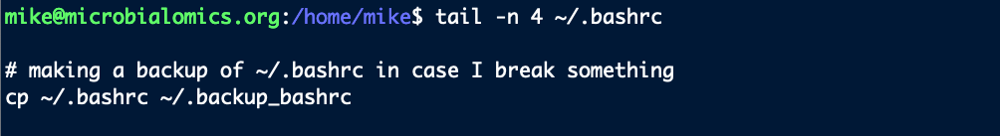</center>
<br>

Things are changed in the `~/.bashrc` file now, and as mentioned this file is read everytime a session is started. But those changes aren't in effect yet in our current session. So for them to take effect, we either need to start a new terminal (exit and sign back in if working on a remote machine), or `source` the file we just changed like this:

```bash
source ~/.bashrc
```

And we can see our backup file is present after we ran `source` on the updated file. 

<center>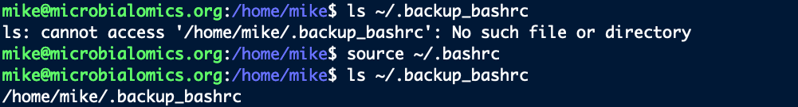</center>
<br>

This little step doesn't virtually nothing to setup and nothing to run given the small size of the file, and it just might help us out some day (it's . It's also possible this backup might get overwritten with our problematic one depending on what we do. But even if we completely lose our working `~/.bashrc`, we can always restore the original one that comes from a system-wide template if needed (or ask whoever manages our user account to do so).

---
<br>-->

# Modifying our prompt to facilitate 'scp'
The prompt is the text in front of our cursor at the command line. `scp` (**s**ecure **c**o**p**y) is a program that lets us send files between different machines. It has the same syntax as the `cp` command, where the first positional argument is what we want to copy, and the second (or last if we have multiple things we want to copy) is where we want it to go. In whichever positional argument we are specifying the remote machine's location, we first have to indicate how to find the remote machine in a similar fashion to what we enter to connect to it with `ssh`. 

I like to modify my prompt so that it has that information and the full path to the current working directory I am in. Then, when I want to `scp` files to or from where I am working on a remote machine, I can just copy my prompt to help quickly build the command. 

For example, if I typically login with `ssh mike@microbialomics.org`, and I set up my prompt on the remote machine I am working on to look like this:

<center></center>
<br>

When I want to `scp` a file to or from there, I can just highlight and copy the whole prompt:

<center></center>
<br>

And paste it in and add the filename to quickly create the argument saying where the file is as I build the `scp` command on my other computer:

<center></center>
<br>

This is super-convenient when sending files back and forth 🙂

<hr style="height:10px; visibility:hidden;" />

## How we can change it
This prompt is held in a variable called `PS1`, which is typically set in the `~/.bashrc` file (if in a `bash` shell, see note [above](/unix/more-automation-power#what-is-a-startup-file)). We could just change that variable interactively at the command-line if we only wanted to change it for the current session, but to change it for good, we should alter it in the `~/.bashrc` file. It is easiest to edit files like this at the command-line with a text editor such as [nano](/unix/working-with-files-and-dirs#a-terminal-text-editor){:target="_blank"}. E.g., we can open this file and start looking through it with:

```bash
nano ~/.bashrc
```

As a reminder, to exit `nano` without saving anything, we can press `ctrl+x` (then the letter `n` if that didn't already completely exit. And to exit `nano` with saving our changes, we can press `ctrl+x`, then the letter `y`, then `enter/return`. 

In many systems, the part that handles the prompt in the `~/.bashrc` file will look something like this initially:

```bash
if [ "$color_prompt" = yes ]; then
    PS1='${debian_chroot:+($debian_chroot)}\[\033[01;32m\]\u@\h\[\033[00m\]:\[\033[01;34m\]\w\[\033[00m\]\$ '
else
    PS1='${debian_chroot:+($debian_chroot)}\u@\h:\w\$ '
fi
```

<hr style="height:10px; visibility:hidden;" />

There is a lot of mess in there, but looking just at the first PS1 line above, the key parts we currently care about that affect the actual text of the prompt that we see in our terminal are:
- `\u` - this is a shortcut for our username
- `@` - here is our @ symbol separating the username from what's next
- `\h` - this is a shortcut for the hostname of the maching we are on (we can see it by running `hostname`)
- `:` - separating those prior things from the current working directory
- `\w` - a shortcut for current working directory (displayed from the `~/` home location)
- `\$ ` - the dollar-sign at the end followed by an empty space, so our cursor starts after that

<hr style="height:10px; visibility:hidden;" />

This gives us something like this as our prompt (where each <...> would be replaced with the actual info:

```
<username>@<hostname>:<current_working_directory> $
```

<hr style="height:10px; visibility:hidden;" />

As mentioned, I like to change this so it matches exactly what I would need to type run an `scp` command. In this case, for me that requires changing the part after the @ symbol (what is set by `\h` in the above right now) so that it is exactly whatever I need to type when I `ssh` into the machine. And I like to change the part after the colon (which is set by `\w` in the above) so that it is the full, absolute path, rather than the path starting from the home location (which is what `\w` gives us).

So if I `ssh` into the machine like this, for example:

```bash
ssh mike@microbialomics.org
```

I would change the `\h` to be `microbialomics.org`.

And to get the full, absolute path, I would change the `\w` to `${PWD}` (a variable that holds the full path to the current working directory).

I typically copy the original settings, comment them out (but leave them there so I still have them in case I want them in the future), and then paste them below and modify what I need. Following doing this (I used [nano](/unix/working-with-files-and-dirs#a-terminal-text-editor){:target="_blank"} to edit the file), that part of my `~/.bashrc` would looks like this after making the changes noted above (I only changed the first PS1 line in the modified block):


```bash
#if [ "$color_prompt" = yes ]; then
#    PS1='${debian_chroot:+($debian_chroot)}\[\033[01;32m\]\u@\h\[\033[00m\]:\[\033[01;34m\]\w\[\033[00m\]\$ '
#else
#    PS1='${debian_chroot:+($debian_chroot)}\u@\h:\w\$ '
#fi

## my modified prompt
if [ "$color_prompt" = yes ]; then
    PS1='${debian_chroot:+($debian_chroot)}\[\033[01;32m\]\u@microbialomics.org\[\033[00m\]:\[\033[01;34m\]${PWD}\[\033[00m\]\$ '
else
    PS1='${debian_chroot:+($debian_chroot)}\u@\h:\w\$ '
fi
```

Then I exited and saved my changes to the `~/.bashrc` file by pressing `ctrl+x`, the `y` key, and then `enter/return`.

As mentioned above, that `~/.bashrc` file is loaded when we start a new session, so right now the changes we made haven't taken effect yet. We could start a new session, or we coul jus tload the updated file like so: 

```bash
source ~/.bashrc
```

And now our prompt will have changed, making it super-convenient to copy/paste when using `scp` to send something to or from the remote machine 🙂 

<hr style="height:10px; visibility:hidden;" />

---
<br>


# What is an alias?
<hr style="height:10px; visibility:hidden;" />

An [alias](https://en.wikipedia.org/wiki/Alias_(command)){:target="_blank"} is typically just a shorthand for a longer one-liner command. For instance, here is a contrived example of how we can set an alias for the current session. 

`date` by itself prints out a few things, but we can get just the day with `date +%A`:

<center></center>
<br>

If this were something we used a lot, we could set an alias to execute `date +%A` for us without us needing to type out the full command. Here we are making an alias called `today` to do this for us. 

If we just try to run `today` right now, we will get a command not found error. Here's how we set it:

```bash
alias today="date +%A"
```

And now we'll get the day:
<center>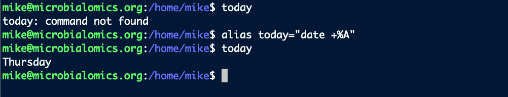</center>
<br>

But doing things like above, it is only for the current session, and it will be gone when we exit and sign back in. To keep an alias, we need it to be set by one of the startup scripts, which we'll cover now.

<hr style="height:10px; visibility:hidden;" />

## Where to set a permanent alias
In the `~/.bashrc` file again, there are likely also some lines that look like this (if they don't exist, you can add them):

```bash
if [ -f ~/.bash_aliases ]; then
    . ~/.bash_aliases
fi
```

As mentioned above, this `~/.bashrc` file is run everytime a session is started. In that file, these lines of code are saying "if the file `~/.bash_aliases` exists, then also run that file to setup what is in there". (We could just put aliases in the `~/.bashrc`, but it's also common practice to keep them in their own file as we'll do here.)

So we are going to add our commands that set up our aliases to that `~/.bash_aliases` file, and then they will be loaded anytime we start a new session – therefore making them always available to us.

<hr style="height:10px; visibility:hidden;" />

## How to set a permanent alias
Just like with modifying the `~/.bashrc` file, it's generally easiest to add these with a text editor like [nano](/unix/working-with-files-and-dirs#a-terminal-text-editor){:target="_blank"} (which is what I'll be using here).  

Here's how we would add the above, just to serve as an example of how we can add them permanently. We can edit (and/or create if it doesn't yet exist) the `~/.bash_aliases` file with the following:

```bash
nano ~/.bash_aliases
```

And then paste in our command to create the alias:

```bash
alias today="date +%A"
```

<center>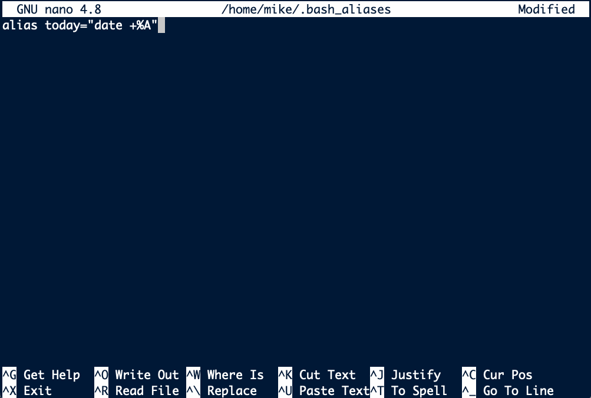</center>
<br>

To save and exit `nano`, we can press `ctrl+x`, followed by the key `y`, followed by pressing `enter/return`. 

And remember we need to source the `~/.bashrc` file for the changes to take effect in our current session:

```bash
source ~/.bashrc
```

Now that alias will always be there when we sign in. But we probably don't want to keep that one, so we could always delete that line from the `~/.bash_aliases` file with any editor (like [nano](/unix/working-with-files-and-dirs#a-terminal-text-editor){:target="_blank"}). This was just an example to explain the process, but now we'll look at some I actually use frequently. 

<hr style="height:10px; visibility:hidden;" />

---
<br>

# Some aliases I find helpful
<hr style="height:10px; visibility:hidden;" />
Below are some of the aliases I typically setup on any machine I will be working on regularly. 
<hr style="height:10px; visibility:hidden;" />


## Store last command
I like to create an alias that appends the last command I ran into a file called 'log' in the current working directory. I find this really handy when I am testing/figuring things out. 

When I find the command I want, and I want to save it, instead of copying and pasting the last thing I ran, I can just type `store`, and it is added to the log file for me. 

This one-liner will do this for us:

```bash
history -p !!:p >> log; printf "\n" >> log
```

Which would be annoying to type out in full everytime we want to use it, so instead, let's create an alias in our `~/.bash_aliases` file by coping and pasting this into that file (see example just above if needing a reminder on using `nano` to do this):

```bash
alias store='history -p !!:p >> log; printf "\n" >> log'
```

And remember we need to run this so the changes to be in effect in our current session:

```bash
source ~/.bashrc
```

Now whenever we want, we can run `store` to save the last command we ran in a file called 'log' in the current working directory:

<center>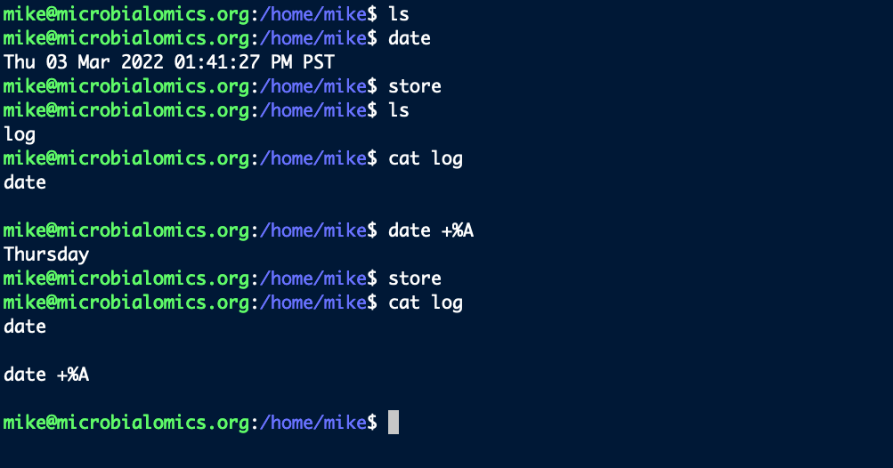</center>
<br>


## Get the size of and sort all items in a directory
When in the crunch of trying to see where all our storage has disappeared to, I find it convenient to run something like this which will :

```bash
du -sh * | sort -h
```

But I don't like to remember or type all that out. So I add this alias to my `~/.bash_aliases` file:

```bash
alias dush='du -sh * | sort -h'
```

Now just running `dush` will list the sizes of all directories and files in the current working directory in order of size:

<center>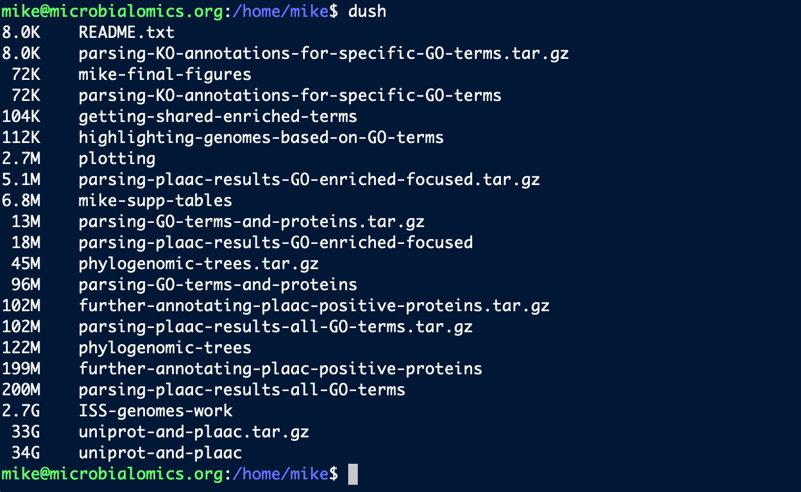</center>
<br>

## Printing in formatted columns
`column` is a handy command for quickly viewing plain text tables like tab-separated value (tsv) and comma-separated value (csv) files, but I typically like to give it a few arguments I'd rather not type out each time. So I have these for tsv and csv in my `~/.bash_aliases` file:

```bash
alias col-t="column -ts $'\t'"

alias col-c="column -ts ','"
```

```bash
source ~/.bashrc
```

So it's easier to quickly check out table files in a more organized fashion (note I typically [pipe](/unix/wild-redirectors#redirectors){:target="_blank"} the output of `head` or `tail` into this): 

<center>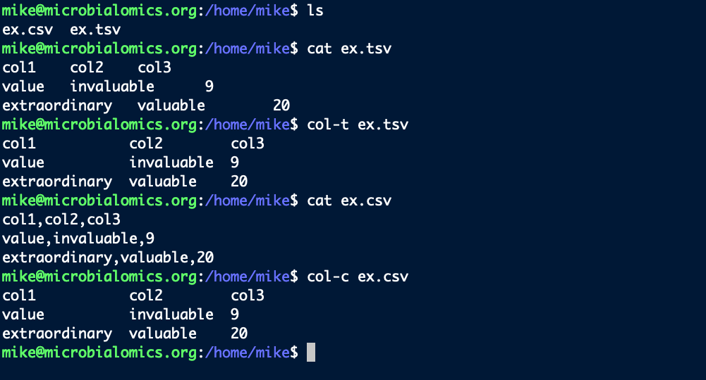</center>
<br>


## SSH connections
I connect to remote computers pretty much all day everyday. So I don't always want to type out the connection (especially for ones where I need to use an IP address intead of words). So I will typically add an alias for connecting to any remote machine I use regularly. E.g., if this were real, I would add this to my `~/.bash_aliases` file:

```bash
alias hb-connect="ssh mike@microbialomics.org"
```

```bash
source ~/.bashrc
```

And now I would just have to run `hb-connect` to connect and get my password prompt.

<hr style="height:10px; visibility:hidden;" />

---
<br>

# Using aliases to quickly access info
<hr style="height:10px; visibility:hidden;" />

The following examples likely won't be helpful exactly as they are, but I include them just to show another way I happen to use aliases that has been helpful to my efficiency at the command line. It's basically just storing some short notes at our fingertips so we don't have to look anywhere for them whenever we need them 🙂

<hr style="height:10px; visibility:hidden;" />

## GDrive notes example
I occassionally want to access my google drive from the command line (I use [GDrive](https://github.com/prasmussen/gdrive){:target="_blank"} for this). But I don't do it enough to actually remember how to do it. So I have a short file with some info and example commands stored somewhere on my system, e.g., maybe at `~/notes/gdrive-notes.txt`, and I have an alias that prints out that file to my terminal. So anytime I end up in a situation where I want to use [GDrive](https://github.com/prasmussen/gdrive){:target="_blank"}, I don't need to google to find the documentation or search for my previous notes trying to find an example of what I need to do. Instead, I just type `gdrive-notes` and it prints out my most helpful examples instantly. For this example, it'd be adding this to the `~/.bash_aliases` file:

```bash
alias gdrive-notes="cat ~/notes/gdrive-notes.txt"
```

And so when I run `gdrive-notes`, this prints out to my terminal:

```
#########################################################

## My gdrive notes ##

# helpful sites
https://github.com/gdrive-org/gdrive
https://www.howtoforge.com/tutorial/how-to-access-google-drive-from-linux-gdrive/

# list most recent additions
gdrive list

# list with search term, limit to 10:
gdrive list -m 10 --query "name contains 'Europa'"

# can get more info with the ID associated with things, e.g.:
gdrive info 1alvKgpZwT9sY0blablayOgT6KSXXX_blabla

# can search within a folder after getting the ID like so:
gdrive list --query " '1alvKgpZwT9sY0blablayOgT6KSXXX_blabla' in parents"

# download directory and skip files already present (download file same way but no flags)
gdrive download -r 1alvKgpZwT9sY0blablayOgT6KSXXX_blabla --skip

# upload directory
gdrive upload -r --parent 1alvKgpZwT9sY0blablayOgT6KSXXX_blabla local-directory-to-upload/

# first login/token setup can be done with:
gdrive about
    # this couldn't be authorized by google last time i tried, the 
    # workaround for ones setup already on other systems is just copying 
    # the ~/.gdrive/ directory to the new system

#########################################################
```

Most likely quickly giving me an example of whatever I am trying to do 🙂

<hr style="height:10px; visibility:hidden;" />

## My typical BLAST command example

I use BLAST quite a bit, and I most often run it in a similar way where I'll want to do things like: 

- specifying the output format
- setting options like `-max_hsps 1` and `-max_target_seqs 1`
- and sorting the output and adding a header

So, similar to above, I have a plain text file that holds a template of how I typically run things – which is a little long and cumbersome to type out from scratch each time. And I create an alias that prints that out to the terminal, so I can quickly copy and paste it, and then just modify it for my current files. If that file were located at `~/notes/my-typical-blast.txt`, here's what I would put in my `~/.bash_aliases` file:

```bash
alias blast-typical="cat ~/notes/my-typical-blast.txt"
```

And now I can always pull that up quickly with just running `blast-typical` to print this to my terminal:

```
blastp -query XXX -db XXX -outfmt \"6 qseqid qlen sseqid slen length pident evalue bitscore\" -max_hsps 1 -max_target_seqs 1 | sort -nrk 8 > blast_out.tmp && cat <(printf \"qseqid\tqlen\tsseqid\tslen\tlength\tpident\tevalue\tbitscore\n\") blast_out.tmp > blast-out.tsv && rm blast_out.tmp
```

Again, these 2 specific things probably won't be useful to anyone in their exact state, but they are just meant to show another way I use aliases that has been helpful for me  🙂


<hr style="height:10px; visibility:hidden;" />

---
<br>

# What is a function?
<hr style="height:10px; visibility:hidden;" />

Another thing we can add to startup files in much the same way as aliases, are [functions](https://www.gnu.org/software/bash/manual/html_node/Shell-Functions.html){:target="_blank"} – which here can be thought of like aliases except that they can also handle positional arguments. 

The syntax for creating a shell function can look like this (with the "<..>" parts to be replaced with whatever we want):

```bash
<name_of_function> () {
    <things_we_want_to_do>
}    
```

First we will use another extremely contrived example to demonstrate this. Here we are making a function that greets whatever we put as the first positional argument (see the [introduction to scripting page](/unix/scripting){:target="_blank"} if wanting to know more about positional arguments as variables):

```bash
greeting () {

    echo "Hi, ${1}! Hope you are well :)"

}
```

Now when we use it, with the command `greeting`, it will run the command we specified and put in the variable spot (the `${1}`) whatever we provide as the first positional argument:

```bash
greeting Mike
```

<center>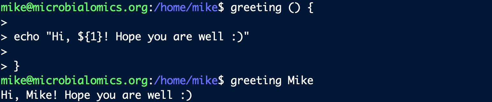</center>
<br>

These can get as complicated as we want them to be, holding as many lines as we want in the interior code between the curly braces, but that is all we need to know to get started with them 🙂 

<hr style="height:10px; visibility:hidden;" />

## Where to set a permanent function
Functions we want to be persistently available could also go directly in the `~/.bashrc` file, or in the `~/.bash_aliases` file like we used above (which would be loaded by the `~/.bashrc` on each session startup), but we can also make a dedicated startup file for them if we want. I've commonly seen `~/.bash_functions` serve this purpose. 

This file is not typically already checked and loaded by the `~/.bashrc` file like the `~/.bash_aliases` file is, however. So we need to add these lines to our `~/.bashrc` file:

```bash
if [ -f ~/.bash_functions ]; then
    . ~/.bash_functions
fi
```

Again, this can be done most easily with a text editor line [nano](/unix/working-with-files-and-dirs#a-terminal-text-editor){:target="_blank"}. I just opened it with `nano ~/.bashrc`, scrolled to the bottom, and added the from text:

<center>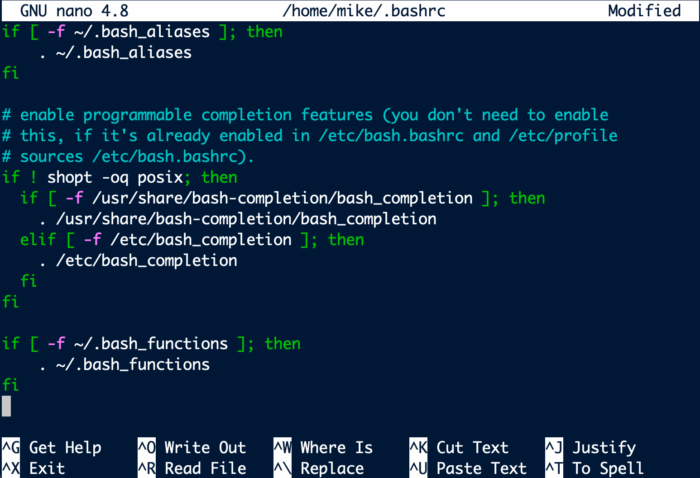</center>
<br>

To save and exit `nano`, we can press `ctrl+x`, followed by the key `y`, followed by pressing `enter/return`. 


So now that the `~/.bashrc` file will check for it and load it if it exists, we are going to add our commands that set up our functions to that `~/.bash_functions` file, and then they will be loaded anytime we start a new session – therefore making them always available to us.

<hr style="height:10px; visibility:hidden;" />

## How to set a permanent function

Here's how we would add the above example function to the `~/.bash_functions` file (using [nano](/unix/working-with-files-and-dirs#a-terminal-text-editor){:target="_blank"} like before):

```bash
nano ~/.bash_functions
```

And then put in our command creating the function:

```bash
greeting () {

	echo "Hi, ${1}! Hope you are well :)"

}
```

<center>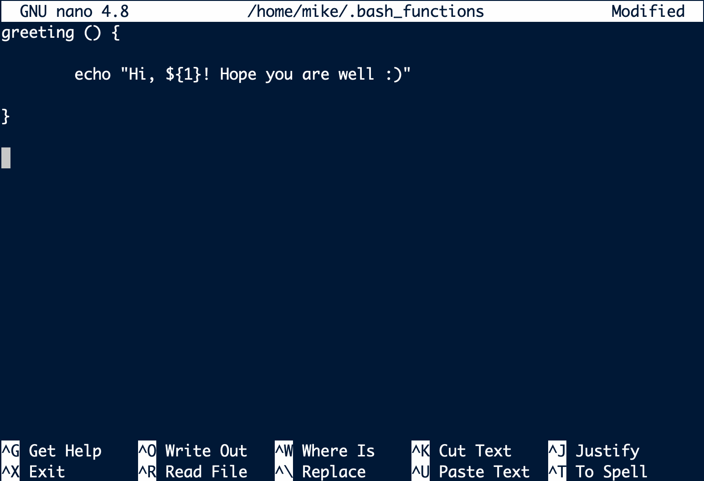</center>
<br>

To save and exit `nano`, we can press `ctrl+x`, followed by the key `y`, followed by pressing `enter/return`. 

And remember we need to source the `~/.bashrc` file for the changes to take effect in our current session:

```bash
source ~/.bashrc
```

Now that function will always be there when we sign in. If we wanted to get rid of that toy example function, we could just open the `~/.bash_functions` file again with any editor and delete it. That was just to demonstrate the process, now we'll look at one that I find helpful to always have handy.

<hr style="height:10px; visibility:hidden;" />

---
<br>

# A quick function I find helpful
There are tons of individual-specific things we can do with functions to make our time at the command-line more efficient and easier. Here is just a standard one I typically setup on any machine I will be working on regularly. 

## Getting indexed column headers
Sometimes I want to use `cut` or `awk` on specific columns in a tsv or csv that has lots of columns, and I find myself trying to count the column names to find which numbers I need to pass to the program I want to use. E.g.,  here is peeking at the first 2 lines of a tsv with about 40 columns:

<center>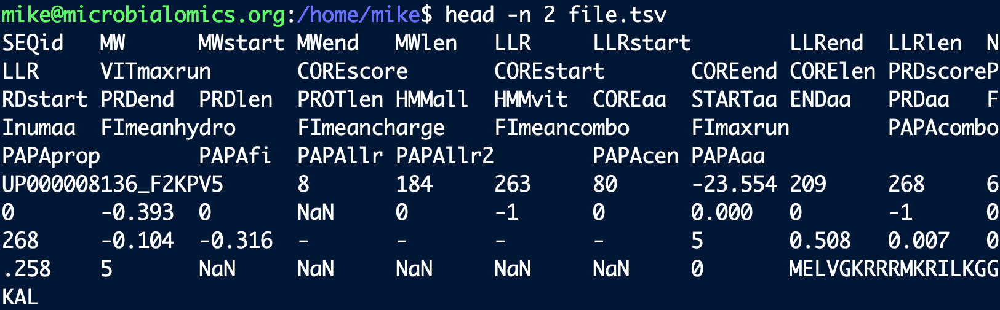</center>
<br>

And say I know I want to act on the "COREscore" column, it can be annoying to try to count the columns to find out which number that one is. There is a short one-liner we can use to list them with numbers pretty quickly, e.g.:

```bash
head -n 1 file.tsv | tr "\t" "\n" | cat -n
```

<center>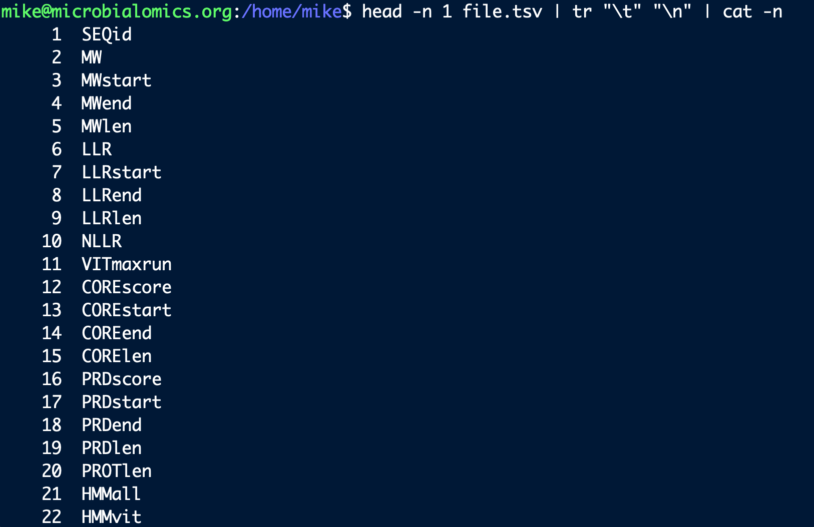</center>
<br>

Where we are getting the first line with `head`, changing the delimiter into a newline character with `tr`, then [piping](unix/wild-redirectors#redirectors){:target="_blank"} that into `cat` with an argument to add line numbers. Then, if I wanted to act on the "COREscore" column with something like `cut` or `awk`, I can quickly see it's column number 12.

That's great, but it's nicer to just type one word quickly to do this. 

As mentioned, aliases can't handle positional arguments, which is why we are putting this in a function. I typically add one for tsv files and one for csv files, rather than one that handles both with an addtional positional argument to specify the delimiter (which would be fine too and maybe preferred by some). So I'd add these to the `~/.bash_functions` file with [nano](/unix/working-with-files-and-dirs#a-terminal-text-editor){:target="_blank"}:

```bash
nano ~/.bash_functions
```

```bash
colnames-t () {

	head -n 1 ${1} | tr "\t" "\n" | cat -n

}

colnames-c () {

	head -n 1 ${1} | tr "," "\n" | cat -n

}
```

<center>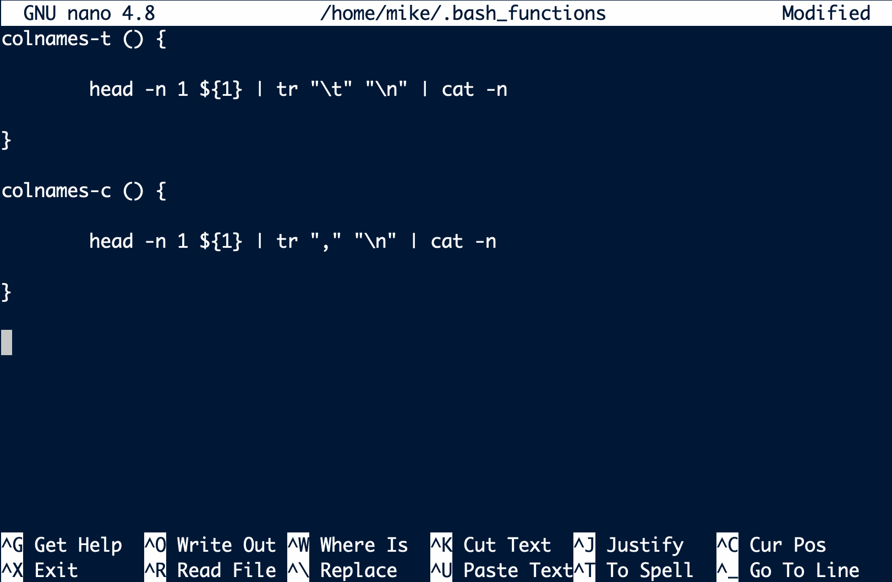</center>
<br>


And making sure they are loaded to take effect in the current session:
```bash
source ~/.bashrc
```

Now we can always use them quickly with a single command instead of typing out the full one-liner ourselves each time:

<center>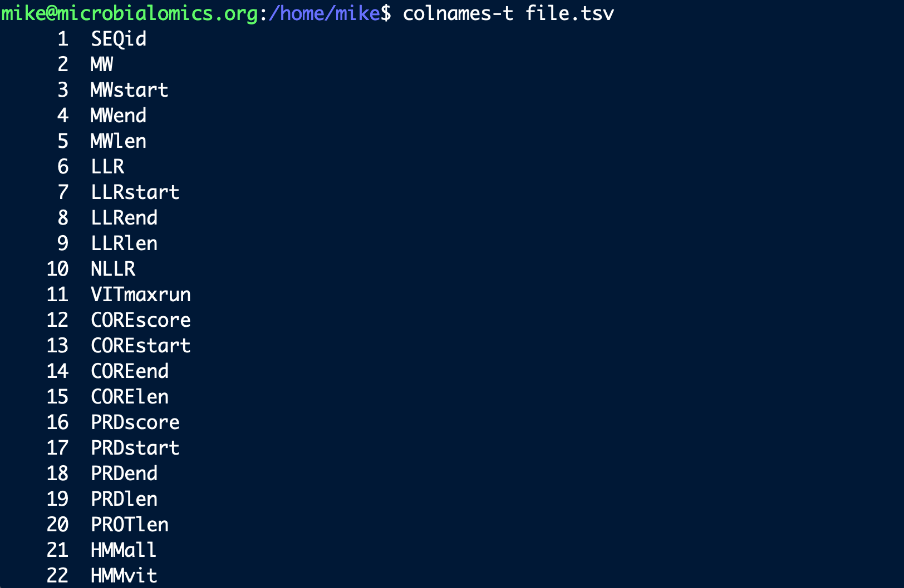</center>
<br>


<hr style="height:10px; visibility:hidden;" />

---
---
<br>

> There are virtually always more and better ways to do things, and we all have tips and tricks we've developed or come across that might help others. So if you have any particularly handy things you think might be useful to others, please share! You can suggest things to add through posting an [issue](https://github.com/AstrobioMike/AstrobioMike.github.io/issues){:target="_blank"}, cloning the [repository](https://github.com/AstrobioMike/AstrobioMike.github.io){:target="_blank"} and making the suggested additions yourself and submitting a pull request if wanted, or just reach out to me however 🙂


