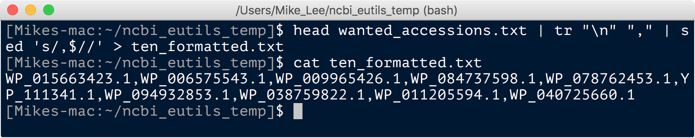
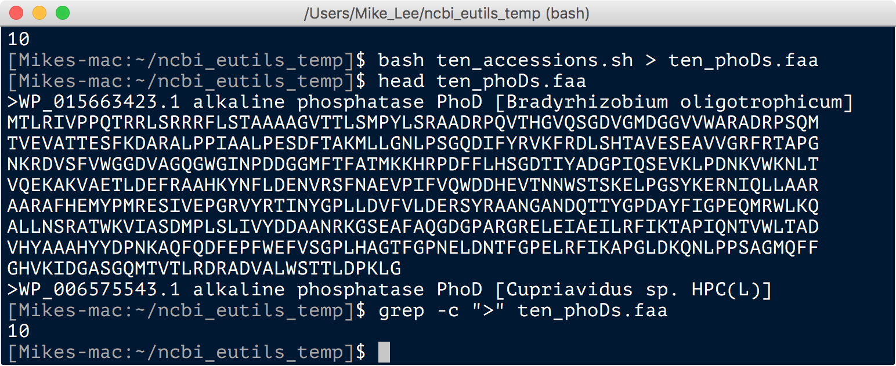
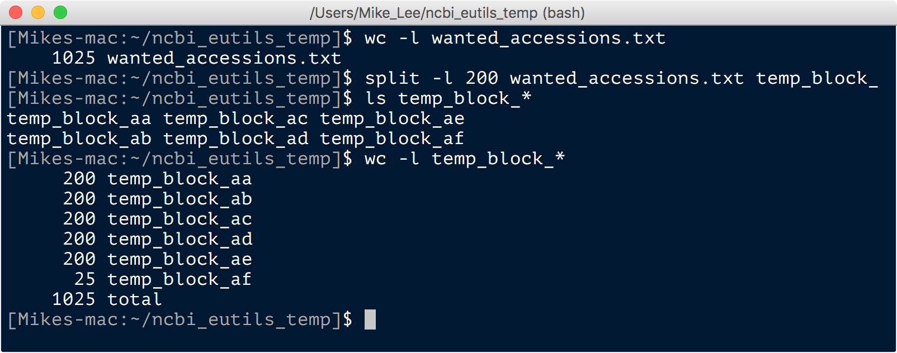





[NCBI](https://www.ncbi.nlm.nih.gov/){:target="_blank"} is pretty damn awesome. But the first few times I wanted to download a massive amount of reference sequences I found myself struggling a bit. If that has happened to you, then hopefully this page helps out. NCBI's [Entrez Direct E-utilities](https://www.ncbi.nlm.nih.gov/books/NBK179288/){:target="_blank"} offers one avenue to be able to download data in bulk at the command-line, but it can take a bit of Unix dancing. I initially wrote this demonstrating one of the ways to do that dance, and you can still find that under the [Entrez section](/unix/ncbi_eutils#entrez) at the bottom of this page because it shows some general Unix tricks that are helpful in other situations. But wonderfully, after sharing the page, [@asherichia](https://twitter.com/asherichia){:target="_blank"} sent me a link to [@kaiblin](https://twitter.com/kaiblin){:target="_blank"}'s [github page](https://github.com/kblin){:target="_blank"}, where he and some others have put together two amazing tools for downloading data from NCBI. So now, I've just added two simplified examples of downloading genomes and proteins to the top of the page here demonstrating how to use their tools (even though they are very straightforward to use, and their repository [README](https://github.com/kblin/ncbi-genome-download){:target="_blank"} shows a bunch of helpful examples). Both of these tools can be installed easily via `pip` at the command line, i.e. `pip install ncbi-genome-download` and `pip install ncbi-acc-download` (if you're doing it on a server and hit a permissions error, adding the `--user` flag to `pip` usually works).  
<br>

---
---
<br>
# ncbi-genome-download
Their script to download genomes, `ncbi-genome-download`, goes through NCBI's [ftp server](ftp://ftp.ncbi.nlm.nih.gov/){:target="_blank"}, and can be found [here](https://github.com/kblin/ncbi-genome-download){:target="_blank"}. They have quite a few options available to specify what you want that you can view with `ncbi-genome-download -h`, and there are examples you can look over at the [github repository](https://github.com/kblin/ncbi-genome-download){:target="_blank"}. For a quick example here, I'm going to pull fasta files for all [RefSeq](https://www.ncbi.nlm.nih.gov/refseq/){:target="_blank"} *Alteromonas* reference genomes labeled as "complete" – [see here](https://www.ncbi.nlm.nih.gov/assembly/help/#glossary){:target="_blank"} for definitions of RefSeq assembly levels – just because I have a softspot for *Alteromonas*:

```bash
ncbi-genome-download bacteria -g Alteromonas -l complete -F fasta -o Alteromonas_refseq_genomes
```

Here I'm specifying the positional argument of `bacteria` to tell it which group, then the genus with the `-g` flag, the assembly level with the `-l` flag, the format of the output with the `-F` flag, and the output directory with the `-o` flag. On my personal MacBook Pro this took a mere 40 seconds to download 30 genomes. Pretty sweet!  
<br>

---
<br>
# ncbi-acc-download
The script they provide to download data by accession number, `ncbi-acc-download`, can be found [here](https://github.com/kblin/ncbi-acc-download){:target="_blank"} and uses [Entrez](https://www.ncbi.nlm.nih.gov/books/NBK184582/){:target="_blank"}. Other than accession numbers, which are supplied as a positional argument, you can tell the script whether you want nucleotides or proteins via the `-m` flag. The nucleotide option returns results in [GenBank format](https://www.ncbi.nlm.nih.gov/Sitemap/samplerecord.html){:target="_blank"}, and the protein option returns results in fasta format. Here's the syntax to pull a single protein sequence: 

```bash
ncbi-acc-download -m protein WP_015663423.1
```

If we wanted to grab multiple accessions, they can be supplied as a comma-delimited list:

```bash
ncbi-acc-download -m protein WP_015663423.1,WP_006575543.1,WP_009965426.1
```

And if you have a ton of these accessions in a single-column file, you can see one way to convert that to a comma-separated list in the [formatting for bulk download section](/unix/ncbi_eutils#formatting-for-bulk-download) below.  

Thanks again to [@asherichia](https://twitter.com/asherichia){:target="_blank"} for pointing me towards these two very helpful tools on [@kaiblin](https://twitter.com/kaiblin){:target="_blank"}'s [github page](https://github.com/kblin){:target="_blank"}!  
<br>

---
<br> 
# Entrez
I don't use this toolset for much more than pulling proteins and genomes from time to time, so I don't have a strong grasp on everything it can do. And now that I know about the helper download tools from [@kaiblin](https://twitter.com/kaiblin){:target="_blank"}'s [github page](https://github.com/kblin){:target="_blank"} demonstrated above, I will probably use it even less. But as mentioned there are some Unix lines in here that may be helpful in other scenarios, so I figured I'd keep this example up of pulling amino acid sequences en masse. If you want to go further with using Entrez at the command line, make sure to look over the full functionality [here](https://www.ncbi.nlm.nih.gov/books/NBK25499/){:target="_blank"}.  

## The efetch command
The `efetch` command let's you pull all kinds of data from NCBI. If you run `efetch -help`, you can look at lots of parameters and types of info you can pull. Here, to get an idea of how the command works, let's just pull one amino acid sequence for an alkaline phosphatase:

```bash
efetch -db protein -format fasta -id AEE52072.1
```

And after a second the sequence should print out to the screen:

<center></center>

<br>
These are some of the typical flags you need to supply to `efetch` or other E-utils commands: `-db` to specify which database; `-format` to tell it how you want the data; and -id to provide the desired accession numbers or unique IDs. Note that the default behavior just prints the output to the terminal, so to save the output you need to [redirect it](/unix/wild-redirectors){:target="_blank"} to a file.  

The efetch command can also take multiple IDs separated by commas. Here's an example pulling two sequences and writing the output to a new file:

```bash
efetch -db protein -format fasta -id AEE52072.1,ADV47642.1 > my_seqs.faa
```

In practice of course we can download one or two from the site though, and we're only using this because we want a lot. While unfortunately you can't provide the `-id` argument of `efetch` a file of accession numbers, we can easily do a little Unix workaround that we'll see. Additionally, [@ctskennerton](https://twitter.com/ctskennerton){:target="_blank"} pointed out to me that you *can* in fact provide a regular one-column file of accession numbers to the `epost` command (which basically queues up accessions to then be acted on), and then pipe the output of that into the `efetch` command. This is pretty sweet as it's a bit cleaner than the workaround I initially used, but it doesn't seem to work with a lot of accessions. When I tested things it worked fine for me on ~1,000 protein seqs, but I got "request timed out" errors when trying to run it on ~10,000 sequences. So I've kept the initial Unix workaround in here and added the `epost | efetch` way too. If you're doing this regularly with a manageable number of references to pull, then doing it the cleaner way shouldn't be a problem. Thanks to [@ctskennerton](https://twitter.com/ctskennerton){:target="_blank"} for the tip! 

The other thing we have to address is that the [Entrez site notes](https://www.ncbi.nlm.nih.gov/books/NBK179288/#chapter6.Automation){:target="_blank"} that you shouldn't do more than blocks of 200 at a time due to server limitations. So we'll also go over how to chop up a large file into a bunch of little ones and run things in a loop with the magic of *bash*. But first, let's look at one way to generate a large list of desired accessions.

## Pulling lots of sequences
For an example, let's imagine we want all the amino acid sequences of the *phoD*-type alkaline phosphatases available in [RefSeq](https://www.ncbi.nlm.nih.gov/refseq/){:target="_blank"} for bacteria (because Euks are too hard). While this is focused on amino acid coding sequences, the same principles apply if you wanted to pull different information. The only things that would change would be how you search your accessions and which options you specify for `efetch`.   

## Generating accessions list
As we just saw, to use `efetch` at the command line we first need to generate a list of accession numbers (or gene IDs). This can be done at the command line too with the `esearch` command, but I don't know how to use that yet. So far I've personally just done this on their web page. Here are the steps I just took to get the desired accessions for bacterial *phoD*-type amino acid sequences:  

&nbsp;&nbsp;&nbsp;&nbsp;&nbsp;&nbsp; • went to [NCBI](https://www.ncbi.nlm.nih.gov/){:target="_blank"}  
&nbsp;&nbsp;&nbsp;&nbsp;&nbsp;&nbsp; • changed the search database from "All Databases" to "Protein"  
&nbsp;&nbsp;&nbsp;&nbsp;&nbsp;&nbsp; • searched for "alkaline phosphatase phoD"  
&nbsp;&nbsp;&nbsp;&nbsp;&nbsp;&nbsp; • limited the search to only RefSeq by clicking it under "Source databases" on the left side  
&nbsp;&nbsp;&nbsp;&nbsp;&nbsp;&nbsp; • limited the search to only bacteria by clicking that in the top right  
&nbsp;&nbsp;&nbsp;&nbsp;&nbsp;&nbsp; • clicked "Send to:", "File", changed format to "Accession List", clicked "Create File"  

At the time of my doing this, this was a total of 10,249 accessions that were written to a file called "sequence.seq":  

<center></center>

<br>
For the sake of this example we don't need that many, so I'm going to cut that down to about a 10th and store them in a file called "wanted_accessions.txt":

```bash
head -n 1025 sequence.seq > wanted_accessions.txt
```

## Formatting for bulk download
Here we're going to do things without `epost` first. Remember from the example above that `efetch` can take multiple accessions separated by commas. To see how we can format our accessions list properly, first let's use Unix to build up an `efetch` command that will run on just the first 10 seqs:

```bash
head wanted_accessions.txt | tr "\n" "," | sed 's/,$//' > ten_formatted.txt
```
Here I used the `head` command to just grab the first 10 accessions, then used the `tr` command to change all newline characters to commas, and then `sed` to remove the very last trailing comma (see the [Unix crash course](/unix/unix-intro){:target="_blank} if you're not yet familiar with these commands).  

<center></center>

<br>
That's softwrapped in the image, but we can see that the 10 accessions are now all on one line and separated by commas. Now we simply need to add the rest of the `efetch` command in front of that. The following code replaces the start of every line (here just one) with the `efetch` command we need in front of the comma-delimited accessions, and then writes the output to a new file called "ten_accessions.sh":

```bash
sed 's/^/efetch -db protein -format fasta -id /' ten_formatted.txt > ten_accessions.sh
```

<center></center>

<br>
Now all we need to do is call that file as a *bash* script and redirect the output to a new file:

```bash
bash ten_accessions.txt > ten_phoDs.faa
```

<center></center>

<br>
Great. Now that we see how we can format one set of accessions for an `efetch` command, that just leaves: splitting the large file of accessions into multiple smaller files; building the formatted `efetch` command for all of them; and then throwing them all into a shell script together. Here I am going to use the `split` command to split up our large accessions file with 1,025 accessions, "wanted_accessions.txt", into as many 200-line files as are needed:

```bash
split -l 200 wanted_accessions.txt temp_block_
``` 

<center></center>

<br>
Here the `split` command made 6 files with the prefix we provided as the last positional argument, and all of them have 200 lines except the last which has the remaining 25. Now we can just loop through those to generate the properly formatted shell script like we did above for the individual one:  

```bash
for block in `ls temp_block_*`; 
  do 
  tr "\n" "," < $block | sed 's/,$//' | sed 's/^/efetch -db protein -format fasta -id /'; 
done > pull_more_phoD_seqs.sh
```

And here's what the newly created "pull_more_phoD_seqs.sh" file looks like (in `less` with no softwrapping, so the accession list runs off to the right):

<center></center>

<br>
And after running the script, which took about 15 seconds for these 1,025 sequences, we have our references 🙂 

<center></center>

<br> 
And as mentioned above, while you can't provide the `efetch` command with a regular single-column file of accession numbers, you can provide that to the `epost` command, and then pipe that into `efetch`. In that case you wouldn't need to run the step generating the *bash* script. Also as I mentioned above though, in my quick tests this worked with the subset of ~1,000 protein sequences, but I got timed-out errors when trying to run it on 10,000. So it might depend on how much you're trying to pull, but here's how that command would look with just one file of accessions, and then if you were to loop through the blocks of 200 like we made above:

```bash
epost -input 10_accessions -db protein | efetch -format fasta > 10_accessions.faa

for block in `ls temp_block_*`; do epost -input $block -db protein | efetch -format fasta; done > out.faa
```

<br>

---
---
<br>
# Help improve this page!
Much to my appreciation and to the benefit all, this page has already been helped along by great tips from [@ctskennerton](https://twitter.com/ctskennerton){:target="_blank"} and [@asherichia](https://twitter.com/asherichia){:target="_blank"}. We all have so many random, little tips and tricks and tools that we've arrived at that maybe others just simply haven't come across yet. It's great to be able to share them and hopefully save others some time!  

So if you have insight into doing things better please let me know via [submitting an issue](https://github.com/AstrobioMike/AstrobioMike.github.io/issues){:target="_blank"} or [twitter](https://twitter.com/astrobiomike){:target="_blank"} and we can continue to update this for everyone 🙂

**P.S. This page is in serious need of an update. Nothing is wrong with what is here, but things can be done much better. This note is left on 22-June-2019 to make myself feel bad when I see it later and maybe cause me to finally do it.**
