



# What is 'screen' and why is it helpful?
The ['screen'](https://en.wikipedia.org/wiki/GNU_Screen){:target="_blank"} program let's us start a terminal session that will be safe and keep running even if we get disconnected from our remote computer, or if we just want to disconnect but leave the process running because maybe it takes a long time. In the style of this site, this is going to be an introduction to enough of the fundamentals of `screen` so that it can help us in our work 🙂


['screen'](https://en.wikipedia.org/wiki/GNU_Screen){:target="_blank"} is a program that let's us manipulate multiple terminal sessions, without them being tied to our current login – which sounds more confusing than it is. It's easier for me to understand just talking from a practical-use perspective. **If I'm logging into a remote computer and I'm going to run something that will take a while, it is dangerous to just run that in my normal login terminal because if my connection gets interrupted, then the job I'm running will likely fail. The `screen` program is one way we can start a terminal session that will be safe and keep running even if we get disconnected from our remote computer, or if we just want to disconnect but leave the process running because maybe it takes a long time.** We'll run through an example of this and how to manipulate screens below. 

>**NOTE:** `screen` is only useful in a Unix-like environment. This page assumes already having access to, and some familiarity with working at, a Unix-like command-line. If that's not the case yet, then consider running through the [Unix crash course](/unix/unix-intro){:target="_blank"} first 🙂 

<hr style="height:10px; visibility:hidden;" />

---
---
<br>


## tl;dr

> Here's a short list of the main things demonstrated below.
> 
> **Start a new `screen` with a name we want (or re-attach to one that is running), e.g., "assembly" here:**
> 
> ```bash
> screen -R assembly
> ```
> 
> **Detach from a `screen` and leave it running:**
> 
> `ctrl + a` release, then press `d`
> 
> **List the currently active `screen`s and see if they are attached or not:**
> 
> ```bash
> screen -ls
> ```
> 
> **To scroll in a `screen`:**
> 
> `ctrl + a` release, then press `[`
> 
> **Exit and close a `screen` (while attached to it):**
> 
> ```bash
> exit
> ```


<hr style="height:10px; visibility:hidden;" />

---
---
<br>

# Starting a named 'screen' session
We can just start a randomly named `screen` session just by executing `screen` at the command line. But it is much more useful to start a named one based on what we are using it for, so we are going to do that here. 

In our command-line environment, we can start a named `screen` session by provding the name we want it to have to the `-R` argument like so (here naming it "assembly"): 

```bash
screen -R assembly
```

<center>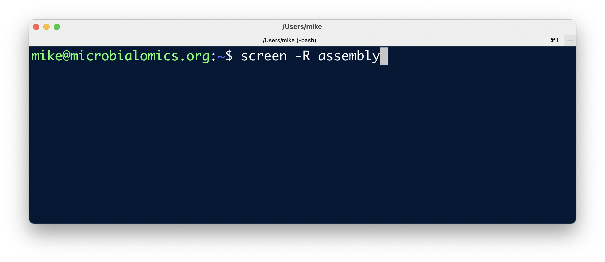</center>

When we execute that command, our terminal environment changes, maybe giving us some information about the `screen` we are using, or maybe just saying "New Screen" on the bottom, but either after a few seconds or after we press `return`, it will again look like our normal command line: 

<center>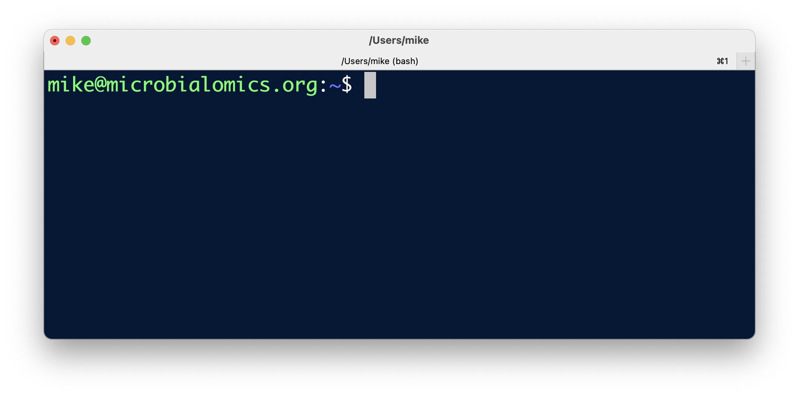</center>

To double-check that we are actually in a `screen`, we can use `screen -ls` to **list** the current `screen`'s that are running and if any of them are currently "attached", e.g.:

```bash
screen -ls
```

<center>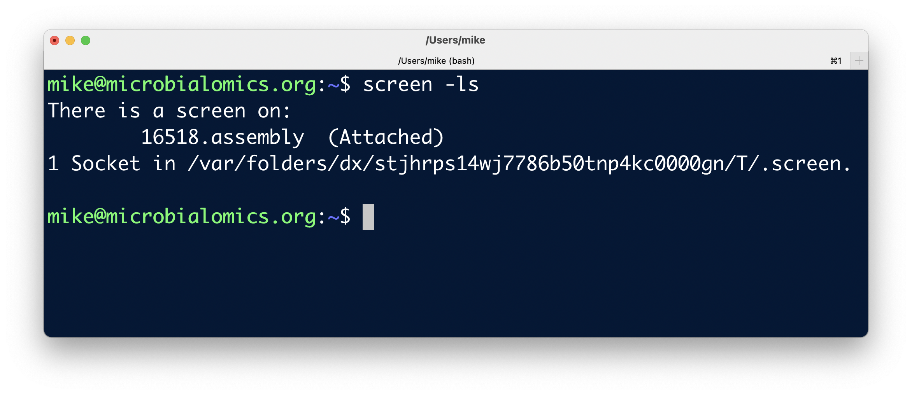</center>

That tells us one screen is on that has a unique ID (here "16518"), followed by the name we gave it (here "assembly"), and that we are "Attached" to it. 

**Now we can do things as usual in this `screen` terminal session, and if we get disconnected, or we just want to disconnect, any process we have running here won't care and will continue on its merry way!**

To show an example of this, I'm going to just start a slow counting process on the server I'm connected too that will print out a number every 10 seconds (if you are new to Unix for-loops and want to learn more, see [here](https://astrobiomike.github.io/unix/for-loops)):

```bash
for number in $(seq 1 1000)
do

    sleep 10
    echo "$number"

done
```

<center>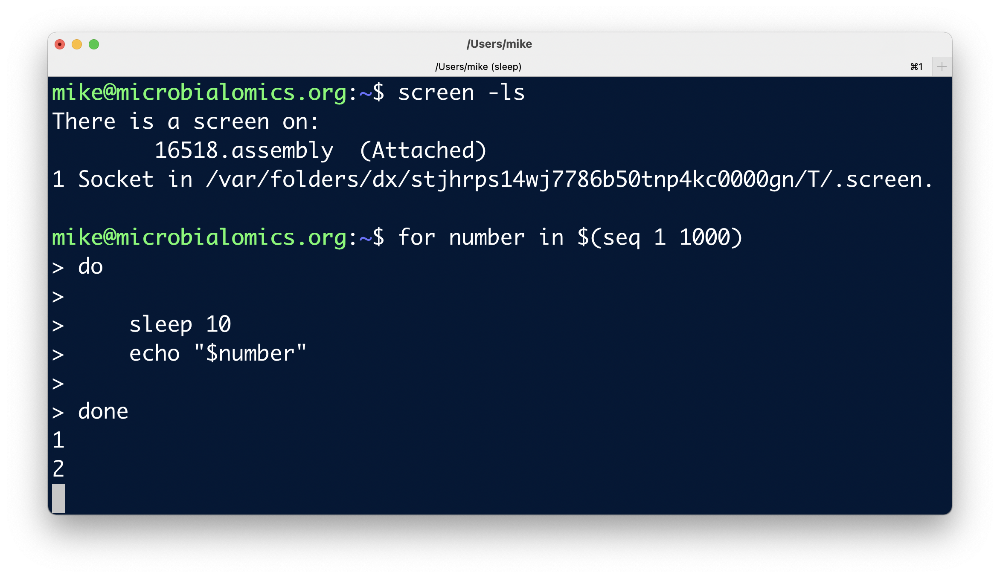</center>

Now that that's running, let's look at how to detach from that `screen` while it's doing work.

<hr style="height:10px; visibility:hidden;" />

---
<br>

# Detaching from an active 'screen'
To detach from a `screen` and leave it running, we need to use some keyboard action. In the screen, we want to press `ctrl + a` then release both of those (this puts us in a sort of alternate keyboard mode), then we want to press the `d` key. That will return us to our original terminal session, and tell us we have detached from that `screen`, e.g.:

<center>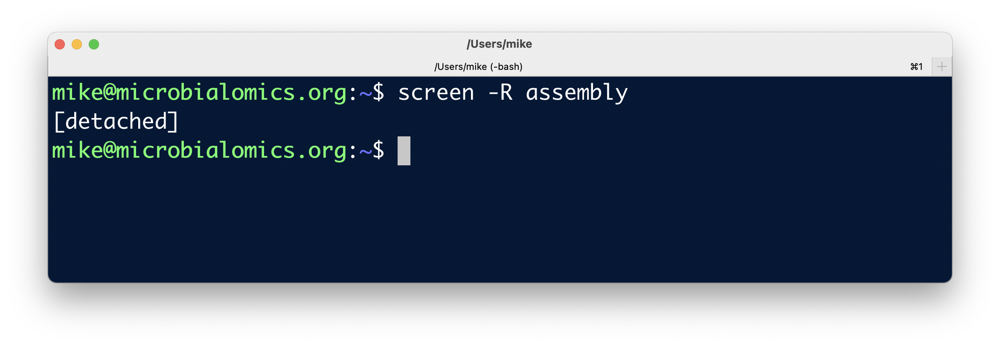</center>

And now if we run `screen -ls`, we will see that screen is still running, but now it says detached instead of attached:

```bash
screen -ls
```

<center>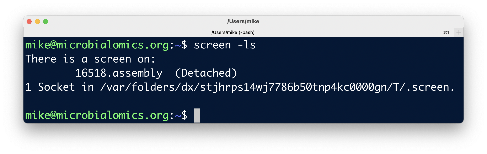</center>

Great! Now we can disconnect from our remote computer (if that's where we're doing this), then connect again. 

**After I reconnect** and get my usual prompt, when I run `screen -ls` I can see the same information: that my `screen` session is still running, and I'm not currently attached to it:

<center></center>

Now let's look at how to re-attach to that currently running `screen`.

<hr style="height:10px; visibility:hidden;" />

---
<br>

# Re-attaching to a running 'screen'
To re-attach, we just need to provide the `-R` flag and name of the `screen` we want to re-attach to. We can see the name of the screen in the output from `screen -ls` and copy it, or can just type the simple name we gave it. For the example above, I would re-attach to that `screen` like so:

```bash
screen -R assembly
```

Which switches my terminal to being in that `screen` session that is listing out numbers every 10 seconds:

<center>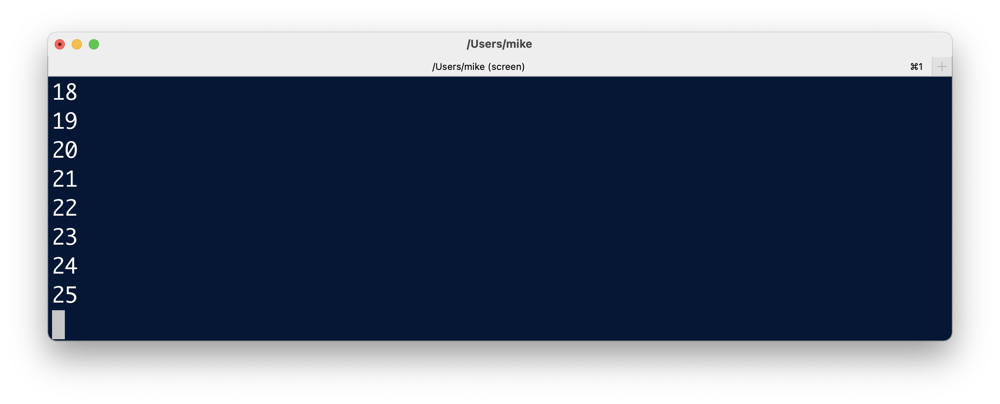</center>

We can cancel that process now, by pressing `ctrl + c`, to get our normal prompt back:

<center>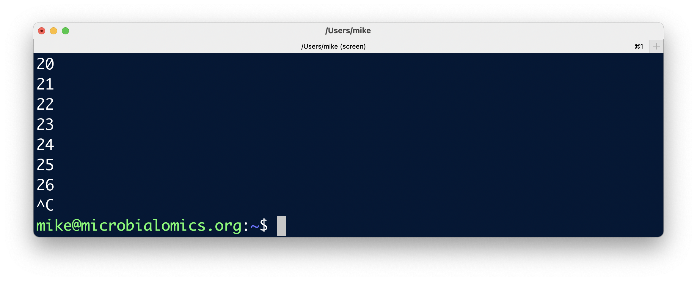</center>

And we can check we are still within the `screen` with:

```bash
screen -ls
```
<center>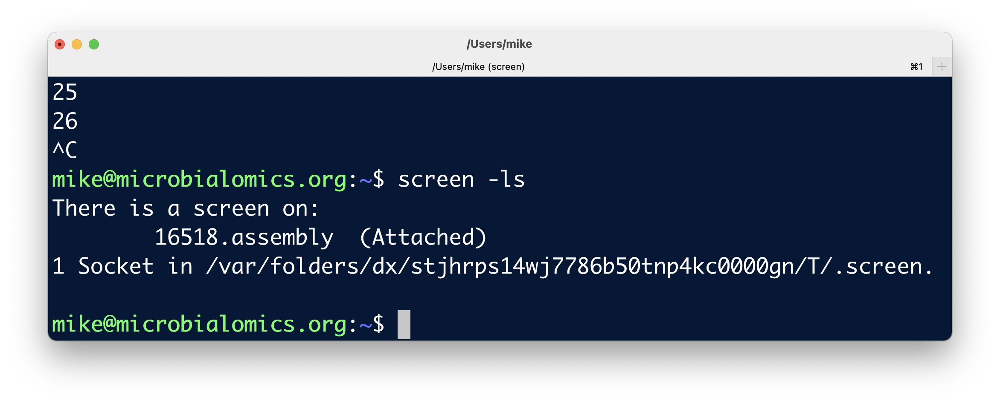</center>

Now let's look at how to exit a screen and close it for good (rather than detaching like discussed above).

<hr style="height:10px; visibility:hidden;" />

---
<br>


# Exiting and closing a 'screen'
Exiting a screen will shutdown that screen and it will be gone forever, so we only want to do this when we are done with it. But to close a `screen` for good, we just need to type the command `exit`:

<center>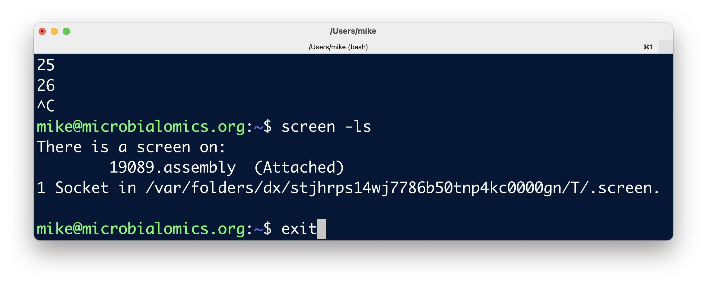</center>

And when we hit `enter`, it will bring us back to our regular terminal, and tell us the `screen` in terminating:

<center>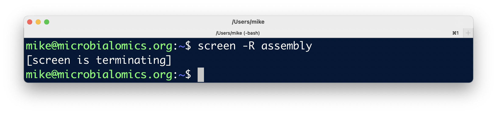</center>

And if we run `screen -ls` now, we will see there are no active ones anymore:

```bash
screen -ls
```

<center>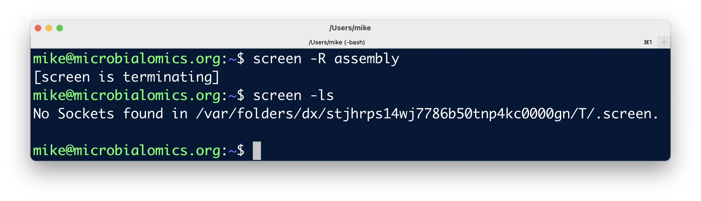</center>

<hr style="height:10px; visibility:hidden;" />

---
<br>


# BONUS tips 

<hr style="height:10px; visibility:hidden;" />

## Re-attaching to a 'screen' that says it is currently attached
Sometimes if we get kicked offline or something else weird happens, we may find ourselves in a situation where the `screen` is still attached to something, and it won't let us re-attach to it. To get around this, we just need to add one more flag (`-d`) to the command we are using to try to attach, which will tell the `screen` to first detach from anything, and then let us attach. 

We don't have this situation setup for us, but it would look like this if it happened with the "assembly" `screen` we made above:

```bash
screen -dR assembly
```

Which right now just starts a new `screen`, so we can exit with `exit` again if you ran that. 

<hr style="height:10px; visibility:hidden;" />

## Scrolling in a 'screen'
You might notice we can't scroll inside a `screen` session the same way we do in our normal terminal. To scroll in a `screen`, we need to use some keyboard tricks like like when we detach as noted above. We first need to press `ctrl + a` then release both of those (this puts us in a sort of alternate keyboard mode), then we want to press the `[` key. After that we can scroll up and down as usual, and to exit that mode we can press the `q` key. 

<hr style="height:10px; visibility:hidden;" />

---
---
<br>

And that's all we really need to know to start using `screen` to our advantage. It is extremely useful when working on remote computers, and it will likely be available in most or all of the environments we work in. 

<hr style="height:10px; visibility:hidden;" />

---
---
<br>
