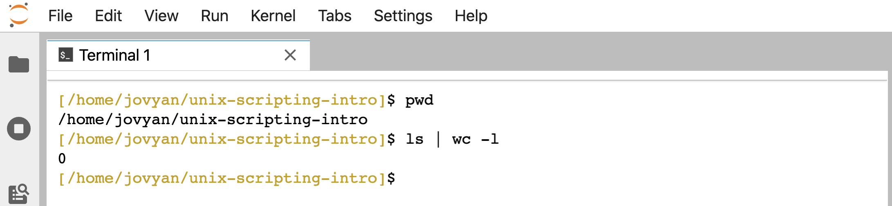
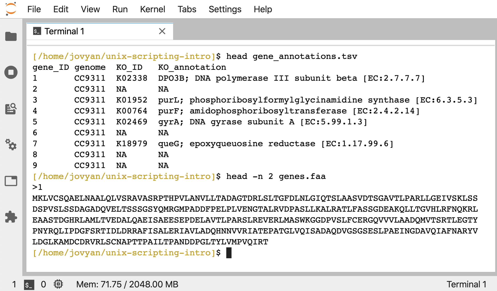
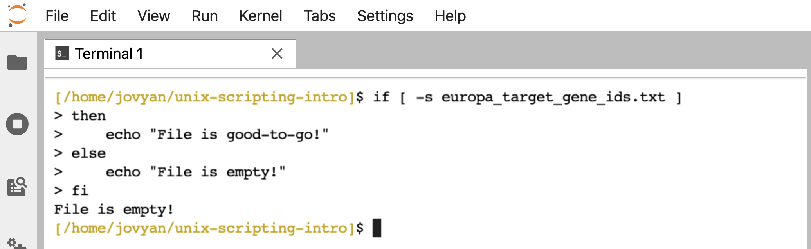
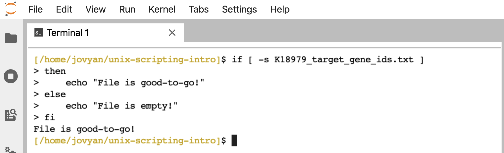
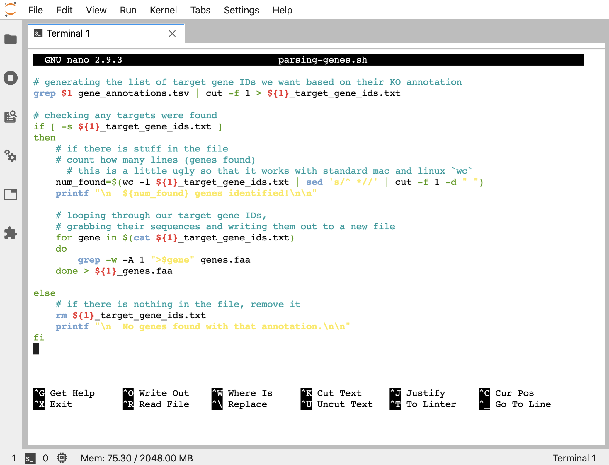





Instead of running the lines 1-by-1 like we do when we are interactively coding at the command-line, we can put the same commands into a plain-text file and then run the file. That's the basis of scripting, and it's great both for reproducibility and for saving time 🙂

This intro page covers just the fundamentals of scripting at the command line. Like with other things, this can get much more complicated as we need it to, but the basics covered here are enough to get us up and running! This page is not meant to be a detailed dive into shell scripting or all that that can encompass. If looking for a more technical and in-depth tutorial for that, [linuxconfig.org](https://linuxconfig.org){:target="_blank"} has one [here](https://linuxconfig.org/bash-scripting-tutorial){:target="_blank"} that would be a great place to start.

We'll start here with examples of running code interactively, then putting it into a file and running the file as a shell script. Then we'll move a little into making them more flexible with examples of how we can provide positional arguments when we call the script, rather than having them hard-coded inside of it.

>**NOTE**  
>This page assumes already having some familiarity with working at at a Unix-like command-line. If that's not the case yet, then consider running through the [Unix crash course](/unix/unix-intro){:target="_blank"} first 🙂

<hr style="height:10px; visibility:hidden;" />

---
---
<br>
# Binder available
If wanting to follow along, we can work in our own Unix-like environment, or if we don't have one or just want a temporary system setup to run through this tutorial, we can open a [Binder](https://mybinder.org/){:target="_blank"} by clicking this launch binder badge – [](https://mybinder.org/v2/gh/AstrobioMike/binder-conda-intro/master?urlpath=lab){:target="_blank"}. After the screen loads, we can click the "Terminal" icon under "Other" to launch our command-line environment:

<center></center>
<br>

<hr style="height:10px; visibility:hidden;" />

---
<br>


# Our first script
First we'll demonstrate that a script is just a bunch of lines we could otherwise run interactively, but put in a file instead. Let's make a new directory to play in:

```bash
mkdir unix-scripting-intro
cd unix-scripting-intro
```

Remember that if we run `date` at the command line, it will print back some temporal information as it is in the computer we are using:

```bash
date
```

<center></center>

<br>
And remember that `pwd` will print the current working directory, and and piping ( `|` ) `ls` into `wc -l` will count how many directories and files are in the current working directory (which will currently be 0 for us at the moment):

```bash
pwd
ls | wc -l
```

<center></center>

<br>

We were introduced tothe command-line text editor `nano` in part 2 of the [Unix Crash Course](/unix/unix-intro){:target="_blank"}, so we're going to use that here to make our first script, adding the 3 commands we just ran to it. It is convention to name a command-line script like this with the extension `.sh` for "shell":

```bash
nano first-script.sh
```

<center></center>

<br>

Add those 3 lines to the file in `nano` like above, and then remember to save the file in `nano` we can press `ctrl + o`, then hit enter to tell it we want to use the filename we gave it when opening it. And then to exit `nano` we do `ctrl + x`.

Now we have that file here holding this contents:

```bash
ls
cat first-script.sh
```

<center></center>

<br>

Just putting those 3 lines into a file, we can now run it as a script. One way we can run this script, is by giving `bash` as the command, and then the file holding the script as the first positional argument:

```bash
bash first-script.sh
```

<center></center>

<br>
And that's it! Notice it prints out to the terminal exactly the same way as if we ran those commands one at a time interactively like above 🙂 

<hr style="height:10px; visibility:hidden;" />

# Scripting with positional arguments
Variables and loops are common components of scripts. These were introduced in part 5 of the [Unix Crash Course](/unix/unix-intro){:target="_blank"}, so we are going to build off of the examples used there. 

First, let's grab a couple of example files:

```bash
curl -L -o genes.faa https://ndownloader.figshare.com/files/28419393
curl -L -o gene_annotations.tsv https://ndownloader.figshare.com/files/28419390
```

The `gene_annotations.tsv` file holds some information about 100 genes, and `genes.faa` holds their amino-acid sequences in fasta format:

```bash
head gene_annotations.tsv
head -n 2 genes.faa
```

<center></center>

<br>


Before, we were pretending to be interested in genes annotated as "K18979" from the [KEGG Orthology](https://www.genome.jp/kegg/ko.html){:target="_blank"} database (which is how our example data are annotated). And we made a list of the gene_IDs annotated as this by using `grep` and `cut` like so:

```bash
grep "K18979" gene_annotations.tsv | cut -f 1 > target_gene_ids.txt
head target_gene_ids.txt
```

<center></center>

<br>

Then we wrote a for loop to pull create a subset fasta file that just held these sequences of interest:

```bash
for gene in $(cat target_gene_ids.txt)
do
    grep -w -A 1 ">$gene" genes.faa
done > target_genes.faa

head target_genes.faa
```

<center></center>

<br>

As we've seen, we can just copy and paste the above code block into a file, and then run it as a script, and it will work the same as when we entered it interactively. But we can also make the script more flexible and more re-usable if we make it work with positional arguments, rather than needing the target genes list to be "hard-coded" into the script. Meaning right now we have "target_gene_ids.txt" in there explicitly, and if we want to change our target genes, we need to open the script and change that file name (or we need to change what gene IDs are in the "target_gene_ids.txt" file). 

Inside a script, we can access positional arguments given to the script when it's called, but referencing them as variables with their appropriate position. If not familiar with this, it can sound way more confusing in words than actually just seeing it. So let's just start doing it 🙂

Instead of the above, let's put this into a script called "parsing-genes.sh", where instead of specifying the "target_gene_ids.txt" filename explicitly like before, we are putting a `$1`:

```bash
for gene in $(cat $1)
do
    grep -w -A 1 ">$gene" genes.faa
done > target_genes.faa
```

<center></center>

<br>

```bash
cat parsing-genes.sh
```

<center></center>

<br>

That `$1` in the script will reference the first positional argument we give it when we call it. To see it in practice, first let's remove the `target_genes.faa` output we are expecting:

```bash
rm target_genes.faa
```

And here's how we can run it giving our target_gene_ids.txt file as the positional argument:

```bash
bash parsing-genes.sh target_gene_ids.txt
```

Nothing prints to the screen, but if we check, the "target_genes.faa" file holding our two genes of interest has been produced just like before:

<center></center>

<br>

> **NOTE**  
> There is not much inherently built-in to shell scripting like this that prevents problems. For instance, if we try to run this without providing a positional argument, it will just hang there (same as if we ran `cat` by itself with no positional argument telling it what file to act on – because that's exactly what's happening inside the script if we don't give it a positional argument). We can cancel that with `ctrl + c`, but just keep in mind that if something will fail interactively, it will probably fail in the script too. We'll mention some more things we can do to help a little below in the [Bash "strict mode"](/unix/scripting#bash-strict-mode) section. 

Say we also wanted to be able to name the output file, we could make that a positional argument too. Let's change our "parsing-genes.sh" script again to this this now, where a `$2` replaces where we are redirecting the output from the loop:

```bash
for gene in $(cat $1)
do
    grep -w -A 1 ">$gene" genes.faa
done > $2
```

<center></center>

<br>

```bash
cat parsing-genes.sh
```

<center></center>

<br>

And now if we run it like so, we can specify the gene IDs we want to search for, and the new output fasta file that is created, when we run the script:

```bash
bash parsing-genes.sh target_gene_ids.txt wanted
_genes.faa
head wanted_genes.faa
```

<center></center>

<br>

**Let's modify this a bit further, and make it so we can just specify which KO we want to search for, and the script will do the rest!**

To do this, we are going to need to do two things: 1) add in our line that gets the target_gene_IDs based on searching for the wanted KO annotation in the "gene_annotations.tsv" first; and 2) name some files with variables inside the script. So here's what we want in our "parsing-genes.sh" script now (lines that start with "#" are comment lines that are ignored by the computer):

```bash
# generating the list of target gene IDs we want based on their KO annotation 
grep $1 gene_annotations.tsv | cut -f 1 > ${1}_target_gene_ids.txt

# looping through our target gene IDs, 
# grabbing their sequences and writing them out to a new file
for gene in $(cat ${1}_target_gene_ids.txt)
do
    grep -w -A 1 ">$gene" genes.faa
done > ${1}_genes.faa
```

<center></center>

<br>

```bash
cat parsing-genes.sh
```

<center></center>

<br>

And now, we can just provide the KO ID we want to look for as a positional argument:

```bash
ls
bash parsing-genes.sh K18979
ls
head K18979_genes.faa
```

And we see it created 2 new files, "K18979_target_gene_ids.txt" and "K18979_genes.faa", based on the positional argument we gave it:

<center></center>

<br>

And now we can use it to search for other KO terms too, e.g., running:

```bash
bash parsing-genes.sh K07336
```

Creates 2 new files based on that KO ID:

<center></center>

<br>

<hr style="height:10px; visibility:hidden;" />

# Adding some conveniences 
We have very few guard-rails on here to prevent weird things from happening. How much we care about that sort of thing entirely depends on how robust we want or need our little script to be. Unless we are developers (in which case you probably shouldn't be learning anything from here 😬), we are usually writing something to do a very specific task to help with processing or analysis that we are going to be using directly ourselves. That's really what this intro page is about. In that case we might not care to or need to spend any time on making things more robust, so long as it gets our job done properly. Even for scripts like that that I write, I'll usually put in some print statements or a check here and there that might help me when I'm using it.

Right now, if we search for something that doesn't exist, the script will still finish and create two blank files, e.g.:

```bash
bash parsing-genes.sh europa
ls -l europa*
```

<center></center>

<br>

First, let's add a check that the target KO ID we are looking for was actually found. There are many ways we could go about this, here, we'll just check that the file we create from the first searching line has stuff in it. We haven't covered if/then statements yet on this site, and that deserves its own page for sure, but for now

<hr style="height:10px; visibility:hidden;" />

## If/then conditional
If/then statements at a Unix-like command-line at a basic level look something like this:

```
if [ # something-to-be-evaluated # ];
then
    # do something if true #
else
    # do something else if false #
fi
```

The `fi` at the end is needed to close the if statement overall, similar to how we need to put `done` at the end of a for loop. We can check if there is anything inside a file with `[ -s filename ]`. Let's look at this altogether interactively on the command-line first. Remember we just generated empty files by searching for something that wouldn't be found in the file, let's run it again just to be sure we have the empty files in case we deleted them already:

```bash
bash parsing-genes.sh europa
```

Here's an example of how our if/then statement checking for file contents works (re-type, or copy and paste this code block into the command line):

```bash
if [ -s europa_target_gene_ids.txt ];
then
    echo "File is good-to-go!"
else
    echo "File is empty!"
fi
```

When we run that, the terminal prints back "File is empty!":

<center></center>

<br>

If we run it on a file that holds something, like "K18979_target_gene_ids.txt" that we generated earlier, it prints back "File is good-to-go!":

```bash
if [ -s K18979_target_gene_ids.txt ];
then
    echo "File is good-to-go!"
else
    echo "File is empty!"
fi
```

<center></center>

<br>

So we'll add that into our script, such that if the target_gene_ids file holds targets, we do the part where we pull out the gene sequences into a new file, but if it doesn't, we'll remove the empty file and exit the script. Here's what this looks like:

```bash
# generating the list of target gene IDs we want based on their KO annotation
grep $1 gene_annotations.tsv | cut -f 1 > ${1}_target_gene_ids.txt

# checking any targets were found
if [ -s ${1}_target_gene_ids.txt ];
then
    # if there is stuff in the file
    # looping through our target gene IDs,
    # grabbing their sequences and writing them out to a new file
    for gene in $(cat ${1}_target_gene_ids.txt)
    do
        grep -w -A 1 ">$gene" genes.faa
    done > ${1}_genes.faa

else
    # if there is nothing in the file, remove it
    rm ${1}_target_gene_ids.txt
fi
```

<center></center>

<br>

```bash
cat parsing-genes.sh
```

<center></center>

<br>

Now, if we try it on something that isn't found, we don't generate any empty files:

```bash
rm europa_*
bash parsing-genes.sh europa
ls europa_*
```

<center></center>

<br>


## Some print statements
Sometimes it's convenient to have a script print out some information for us too. Right now, this script just returns the prompt whether it found what we looked for or not. We can check afterwards, but if we wanted we can also make the program report some basic information. If we modify the script to this:

```bash
# generating the list of target gene IDs we want based on their KO annotation
grep $1 gene_annotations.tsv | cut -f 1 > ${1}_target_gene_ids.txt

# checking any targets were found
if [ -s ${1}_target_gene_ids.txt ];
then
    # if there is stuff in the file
    # count how many lines (genes found)
      # this is a little ugly so that it works with standard mac and linux `wc`
    num_found=$(wc -l ${1}_target_gene_ids.txt | sed 's/^ *//' | cut -f 1 -d " ")
    printf "\n  ${num_found} genes identified!\n\n"

    # looping through our target gene IDs,
    # grabbing their sequences and writing them out to a new file
    for gene in $(cat ${1}_target_gene_ids.txt)
    do
        grep -w -A 1 ">$gene" genes.faa
    done > ${1}_genes.faa

else
    # if there is nothing in the file, remove it
    rm ${1}_target_gene_ids.txt
    printf "\n  No genes found with that annotation.\n\n"
fi
```

<center></center>

<br>

Now we get a message printed out when we run the script letting us know if it found any and if so, how many:

```bash
bash parsing-genes.sh europa
bash parsing-genes.sh K18979
```

<center></center>

<br>


# A few additional notes

<hr style="height:10px; visibility:hidden;" />

## What's a 'shebang'?
A [shebang](https://en.wikipedia.org/wiki/Shebang_(Unix)){:target="_blank"} is something that we can put as the first line of the script, starting with `#!`, that tells the computer what to use to try to run that file as a script. The way we were running things above, specifying `bash` as the command before giving it the script as a positional argument, we didn't need a shebang because we were explicitly telling the computer what to use. If we want to be able to run the program without doing that (or we want to call it from somewhere else in our [PATH](/unix/modifying_your_path){:target="_blank"}), we should add a shebang (we'll also need to change permissions, but we'll discuss that next).

There are different ways to specify what to use, but a good, portable shebang for bash is `#! /usr/bin/env bash`, so let's add that to the top of our script:

```bash
#!/usr/bin/env bash

# generating the list of target gene IDs we want based on their KO annotation
grep $1 gene_annotations.tsv | cut -f 1 > ${1}_target_gene_ids.txt

# checking any targets were found
if [ -s ${1}_target_gene_ids.txt ];
then
    # if there is stuff in the file
    # count how many lines (genes found)
      # this is a little ugly so that it works with standard mac and linux `wc`
    num_found=$(wc -l ${1}_target_gene_ids.txt | sed 's/^ *//' | cut -f 1 -d " ")
    printf "\n  ${num_found} genes identified!\n\n"

    # looping through our target gene IDs,
    # grabbing their sequences and writing them out to a new file
    for gene in $(cat ${1}_target_gene_ids.txt)
    do
        grep -w -A 1 ">$gene" genes.faa
    done > ${1}_genes.faa

else
    # if there is nothing in the file, remove it
    rm ${1}_target_gene_ids.txt
    printf "\n  No genes found with that annotation.\n\n"
fi
```

<hr style="height:10px; visibility:hidden;" />

## What about permissions?
Whether or not we need to worry about permissions also depends on how we want to be able to call the script. If we are going to call it like we initially did above, giving `bash` as a positional argument before it, then we don't need to change permissions on the file because it's being "read" by the `bash` interpreter we are passing it to. But if we wanted to be able to call it without specifying the command `bash` first (or we want to call it from somewhere else in our [PATH](/unix/modifying_your_path){:target="_blank"}, as just mentioned above), then we need to change the permissions on the file to make it executable. 

We can do this with the `chmod` change mode command like so:

```bash
ls -l parsing-genes.sh
chmod +x parsing-genes.sh
ls -l parsing-genes.sh
```

<center></center>

<br>

Getting into permissions in general is beyond this page, but note that there are 3 x's where there used to be dashes, and the color of the file changed here (which may or may not happen depending on how our environment is set up).

Now we can use the script like so:

```bash
./parsing-genes.sh K03110
```

<center></center>

<br>

Whereas if we tried that before the `chmod` command we ran, we would have gotten a permission denied error. 

<hr style="height:10px; visibility:hidden;" />

## Bash "strict mode"
As noted above, there are not a whole lot of guard-rails while writing scripts in a Unix-like shell. It's generally not a big deal when creating ad-hoc scripts to do small things for our own analyses, but if getting into writing larger scripts, Bash strict mode might be something worth looking into. Bash strict mode is sort of an unofficial shorthand for adding things to the top of the script like `set -u` which will cause the script to exit if an undefined variable is used, and `set -e` which exits if any command doesn't finish with its standard exit code. If you are interested in looking into this more, Aaron Maxwell has a page up on his site [here](http://redsymbol.net/articles/unofficial-bash-strict-mode/){:target="_blank"} that nicely walks through examples where his prefered configuration can help avoid potential problems.
 
---
---

<hr style="height:10px; visibility:hidden;" />

> And that's the general gist of scripting at the command-line! Again, what's here is only a brief introduction, hopefully helpful to get any newcomers up-and-running! If creating a script that we want to have available anywhere (as in, not just callable from the same directory or explicitly pointing to it), check out the page on [what our PATH is](/unix/modifying_your_path){:target="_blank"}. And if wanting to dive deeper into a more technical, fuller treatment, one place to start would be over at [linuxconfig.org](https://linuxconfig.org){:target="_blank"} with their [scripting tutorials here](https://linuxconfig.org/bash-scripting-tutorial){:target="_blank"} 🙂
